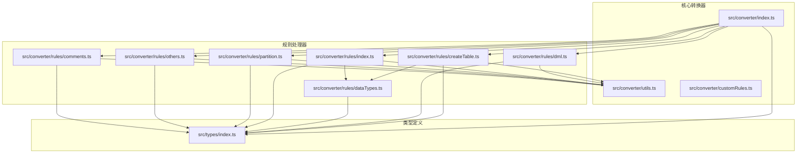
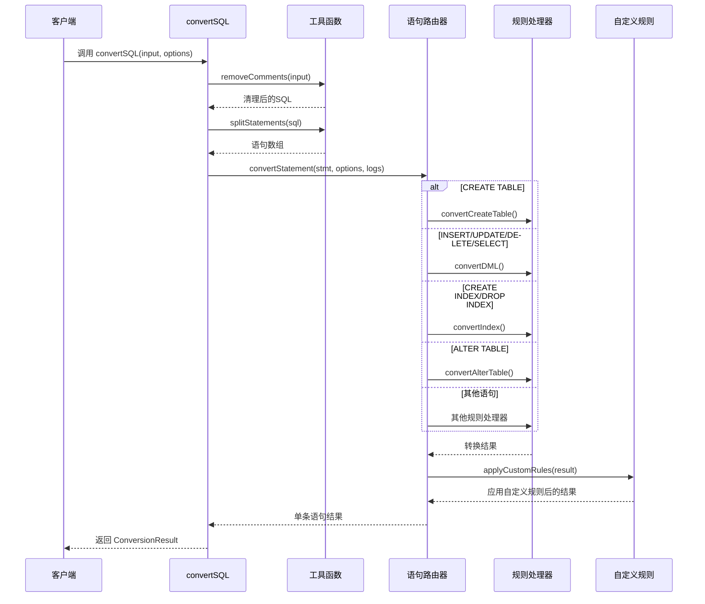
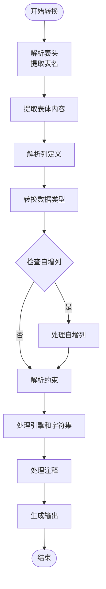
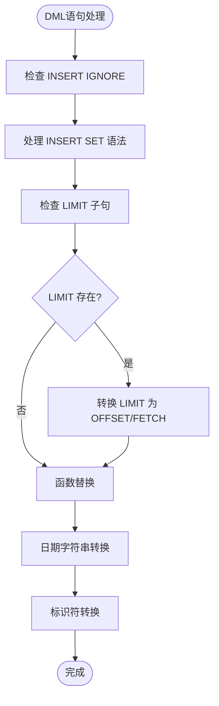
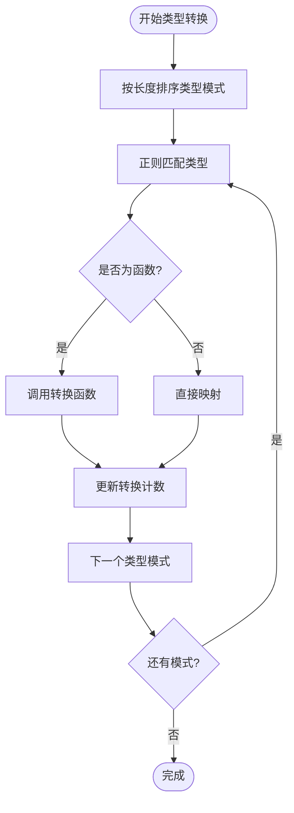
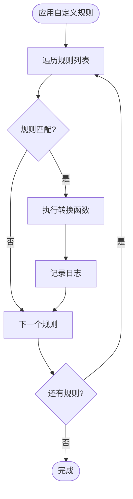
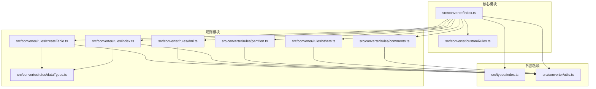

# API参考文档

<cite>
**本文档引用的文件**
- [src/converter/index.ts](file://src/converter/index.ts)
- [src/types/index.ts](file://src/types/index.ts)
- [src/converter/utils.ts](file://src/converter/utils.ts)
- [src/converter/customRules.ts](file://src/converter/customRules.ts)
- [src/converter/rules/createTable.ts](file://src/converter/rules/createTable.ts)
- [src/converter/rules/dml.ts](file://src/converter/rules/dml.ts)
- [src/converter/rules/dataTypes.ts](file://src/converter/rules/dataTypes.ts)
- [src/converter/rules/index.ts](file://src/converter/rules/index.ts)
- [src/converter/rules/partition.ts](file://src/converter/rules/partition.ts)
- [src/converter/rules/others.ts](file://src/converter/rules/others.ts)
- [src/converter/rules/comments.ts](file://src/converter/rules/comments.ts)
</cite>

## 目录
1. [简介](#简介)
2. [项目结构](#项目结构)
3. [核心组件](#核心组件)
4. [架构概览](#架构概览)
5. [详细组件分析](#详细组件分析)
6. [依赖关系分析](#依赖关系分析)
7. [性能考虑](#性能考虑)
8. [故障排除指南](#故障排除指南)
9. [结论](#结论)

## 简介

SQL转换器是一个用于将MySQL SQL语句转换为Oracle兼容SQL的工具库。该库提供了完整的SQL转换功能，支持DDL、DML语句以及各种数据库对象的转换。本文档详细记录了转换器的核心API接口，包括主转换函数、各类语句转换函数以及工具函数。

## 项目结构

该项目采用模块化的架构设计，主要分为以下几个核心模块：



**图表来源**
- [src/converter/index.ts:1-129](file://src/converter/index.ts#L1-L129)
- [src/converter/utils.ts:1-115](file://src/converter/utils.ts#L1-L115)
- [src/converter/customRules.ts:1-186](file://src/converter/customRules.ts#L1-L186)

**章节来源**
- [src/converter/index.ts:1-129](file://src/converter/index.ts#L1-L129)
- [src/converter/utils.ts:1-115](file://src/converter/utils.ts#L1-L115)
- [src/converter/customRules.ts:1-186](file://src/converter/customRules.ts#L1-L186)

## 核心组件

### 主转换函数 convertSQL()

`convertSQL()` 是整个转换器的核心入口函数，负责处理完整的SQL转换流程。

**函数签名**
```typescript
export function convertSQL(input: string, options?: ConverterOptions): ConversionResult
```

**参数说明**
- `input`: 输入的SQL字符串
- `options`: 转换选项对象（可选）

**返回值结构**
`ConversionResult` 接口包含以下属性：
- `success`: 布尔值，表示转换是否成功
- `output`: 转换后的SQL字符串
- `logs`: 日志数组，包含转换过程中的信息
- `stats`: 统计信息对象

**使用示例**
```typescript
const result = convertSQL("CREATE TABLE users (id INT AUTO_INCREMENT)", {
  useIdentity: true,
  preserveCase: true
});
```

**错误处理机制**
- 捕获转换过程中的异常并记录详细错误信息
- 对于无法识别的语句，仅进行基本标识符转换
- 统计错误数量并标记整体转换状态

**章节来源**
- [src/converter/index.ts:59-125](file://src/converter/index.ts#L59-L125)

### 转换器选项 ConverterOptions

转换器选项定义了各种转换行为的配置参数：

| 选项名称 | 类型 | 默认值 | 描述 |
|---------|------|--------|------|
| `useIdentity` | boolean | false | 使用 IDENTITY 替代 SEQUENCE |
| `useSequenceTrigger` | boolean | true | 使用 SEQUENCE + TRIGGER 方式 |
| `preserveCase` | boolean | false | 保留原始大小写 |
| `addComments` | boolean | true | 添加注释转换 |
| `convertEngineCharset` | boolean | true | 移除 ENGINE/CHARSET |
| `generateSequence` | boolean | true | 生成序列 |
| `generateTrigger` | boolean | true | 生成更新触发器 |

**默认选项**
```typescript
export const DEFAULT_OPTIONS: ConverterOptions = {
  useIdentity: false,
  useSequenceTrigger: true,
  preserveCase: false,
  addComments: true,
  convertEngineCharset: true,
  generateSequence: true,
  generateTrigger: true,
};
```

**章节来源**
- [src/types/index.ts:25-43](file://src/types/index.ts#L25-L43)

### 类型定义系统

#### ConversionResult 接口
表示完整的转换结果，包含成功状态、输出内容、日志和统计信息。

#### ConversionLog 接口
定义日志记录的结构，支持四种日志级别：
- `info`: 信息性消息
- `warning`: 警告消息  
- `error`: 错误消息
- `success`: 成功消息

#### ConversionStats 接口
提供详细的转换统计信息，包括语句总数、转换成功的语句数、警告和错误数量等。

**章节来源**
- [src/types/index.ts:1-23](file://src/types/index.ts#L1-L23)

## 架构概览

转换器采用分层架构设计，通过语句类型路由到相应的转换器：



**图表来源**
- [src/converter/index.ts:15-54](file://src/converter/index.ts#L15-L54)
- [src/converter/index.ts:59-125](file://src/converter/index.ts#L59-L125)

**章节来源**
- [src/converter/index.ts:12-54](file://src/converter/index.ts#L12-L54)

## 详细组件分析

### 表结构转换 convertCreateTable()

`convertCreateTable()` 函数专门处理 CREATE TABLE 语句的转换，支持完整的表结构定义。

**核心功能**
- 解析表头和列定义
- 转换数据类型映射
- 处理自增列转换
- 转换约束定义
- 生成序列和触发器

**数据流图**


**图表来源**
- [src/converter/rules/createTable.ts:116-379](file://src/converter/rules/createTable.ts#L116-L379)

**章节来源**
- [src/converter/rules/createTable.ts:116-379](file://src/converter/rules/createTable.ts#L116-L379)

### DML语句转换 convertDML()

`convertDML()` 函数处理 INSERT、UPDATE、DELETE 和 SELECT 语句的转换。

**支持的转换**
- INSERT IGNORE -> INSERT（移除不支持的关键字）
- INSERT SET 语法转换为标准 VALUES 语法
- LIMIT 子句转换（支持 OFFSET FETCH）
- 函数替换（IFNULL->NVL, UUID->SYS_GUID等）
- 日期时间字符串常量转换

**转换流程**


**图表来源**
- [src/converter/rules/dml.ts:7-162](file://src/converter/rules/dml.ts#L7-L162)

**章节来源**
- [src/converter/rules/dml.ts:7-162](file://src/converter/rules/dml.ts#L7-L162)

### 数据类型转换 convertDataType()

`convertDataType()` 函数提供MySQL到Oracle的数据类型映射功能。

**类型映射表**
- 整数类型：TINYINT(3)、SMALLINT(5)、MEDIUMINT(7)、INT(10)、BIGINT(19)
- 浮点类型：FLOAT、DOUBLE、REAL
- 字符串类型：CHAR、VARCHAR、TEXT、BLOB
- 日期时间类型：DATE、DATETIME、TIMESTAMP、TIME、YEAR
- 其他类型：BOOLEAN、JSON、ENUM、SET

**转换算法**


**图表来源**
- [src/converter/rules/dataTypes.ts:61-86](file://src/converter/rules/dataTypes.ts#L61-L86)

**章节来源**
- [src/converter/rules/dataTypes.ts:6-106](file://src/converter/rules/dataTypes.ts#L6-L106)

### 标识符转换工具 convertIdentifier()

`convertIdentifier()` 函数处理SQL标识符的转换，确保Oracle兼容性。

**转换规则**
- 移除MySQL反引号，转换为Oracle双引号或大写
- 支持大小写保留模式
- 处理已存在的双引号标识符

**使用示例**
```typescript
// 基本转换
convertIdentifier('table_name') // 输出: "TABLE_NAME"

// 保留大小写
convertIdentifier('columnName', true) // 输出: "columnName"

// 已有引号
convertIdentifier('"TableName"') // 输出: '"TableName"'
```

**章节来源**
- [src/converter/utils.ts:8-21](file://src/converter/utils.ts#L8-L21)

### 自定义规则系统

转换器提供了强大的自定义规则扩展机制：

**CustomRule 接口**
```typescript
interface CustomRule {
  name: string;           // 规则名称
  description: string;    // 规则描述
  match: (sql: string) => boolean;     // 匹配函数
  transform: (sql: string) => string;  // 转换函数
}
```

**内置规则示例**
- `nullReplacementRule()`: 将指定表列的NULL值替换为指定值
- 批量配置规则：针对特定业务表的特殊需求

**应用流程**


**图表来源**
- [src/converter/customRules.ts:170-185](file://src/converter/customRules.ts#L170-L185)

**章节来源**
- [src/converter/customRules.ts:7-186](file://src/converter/customRules.ts#L7-L186)

## 依赖关系分析

转换器的模块间依赖关系如下：



**图表来源**
- [src/converter/index.ts:1-10](file://src/converter/index.ts#L1-L10)
- [src/converter/rules/createTable.ts:1-3](file://src/converter/rules/createTable.ts#L1-L3)

**章节来源**
- [src/converter/index.ts:1-10](file://src/converter/index.ts#L1-L10)
- [src/converter/rules/createTable.ts:1-3](file://src/converter/rules/createTable.ts#L1-L3)

## 性能考虑

### 内存优化策略
- 使用流式处理避免一次性加载大量SQL文本
- 字符串常量保护机制防止正则替换错误
- 按语句粒度处理，减少内存占用

### 正则表达式优化
- 类型匹配按长度排序，优先匹配长类型模式
- 使用预编译正则表达式提高匹配效率
- 避免回溯陷阱，使用非贪婪匹配

### 缓存机制
- 类型映射表使用对象缓存
- 规则匹配结果可缓存（可扩展）

## 故障排除指南

### 常见问题及解决方案

**问题1：转换结果不符合预期**
- 检查 `ConverterOptions` 配置是否正确
- 查看 `logs` 数组中的警告信息
- 确认输入SQL语法是否符合预期

**问题2：自增列转换失败**
- 检查 `useIdentity` 和 `useSequenceTrigger` 选项设置
- 确认 `generateSequence` 和 `generateTrigger` 是否启用
- 验证表结构中是否存在自增列定义

**问题3：数据类型转换不准确**
- 检查自定义数据类型映射
- 确认数据类型参数是否正确传递
- 查看转换日志中的类型转换统计

**问题4：标识符大小写问题**
- 设置 `preserveCase` 选项为 `true`
- 检查输入SQL中标识符的引号使用

**章节来源**
- [src/converter/index.ts:97-107](file://src/converter/index.ts#L97-L107)
- [src/converter/rules/createTable.ts:208-238](file://src/converter/rules/createTable.ts#L208-L238)

## 结论

SQL转换器提供了完整的MySQL到Oracle的SQL转换解决方案。其核心优势包括：

1. **模块化设计**：清晰的分层架构便于维护和扩展
2. **全面的功能覆盖**：支持DDL、DML、索引、分区等多种SQL对象
3. **灵活的配置选项**：丰富的转换选项满足不同需求
4. **强大的扩展能力**：自定义规则系统支持业务定制
5. **完善的错误处理**：详细的日志记录和错误恢复机制

该转换器适合用于数据库迁移项目、多数据库兼容性开发以及SQL标准化处理等场景。通过合理配置和使用，可以有效提升SQL转换的准确性和效率。