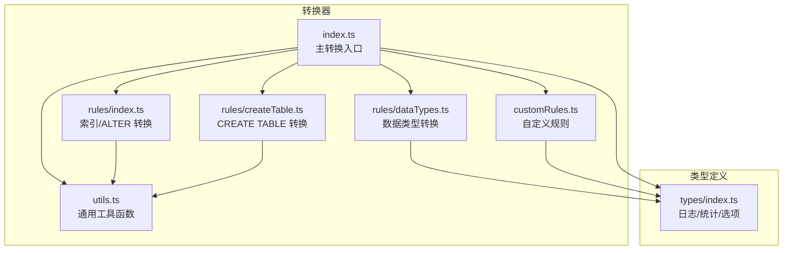
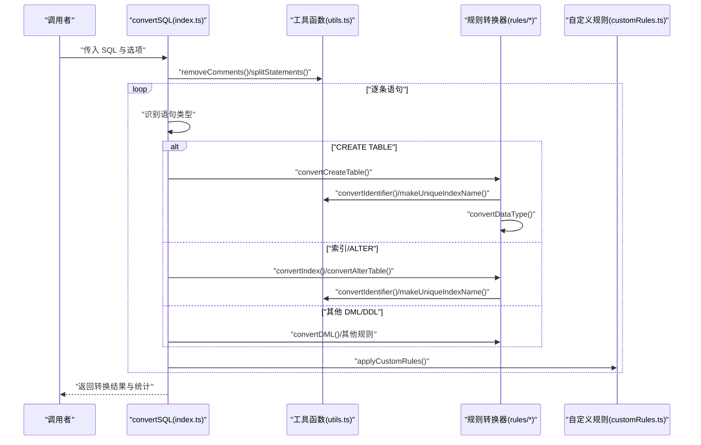
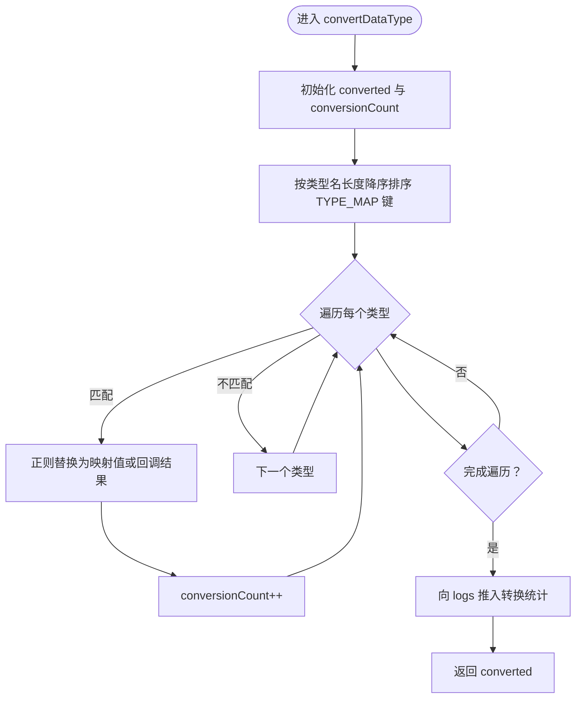
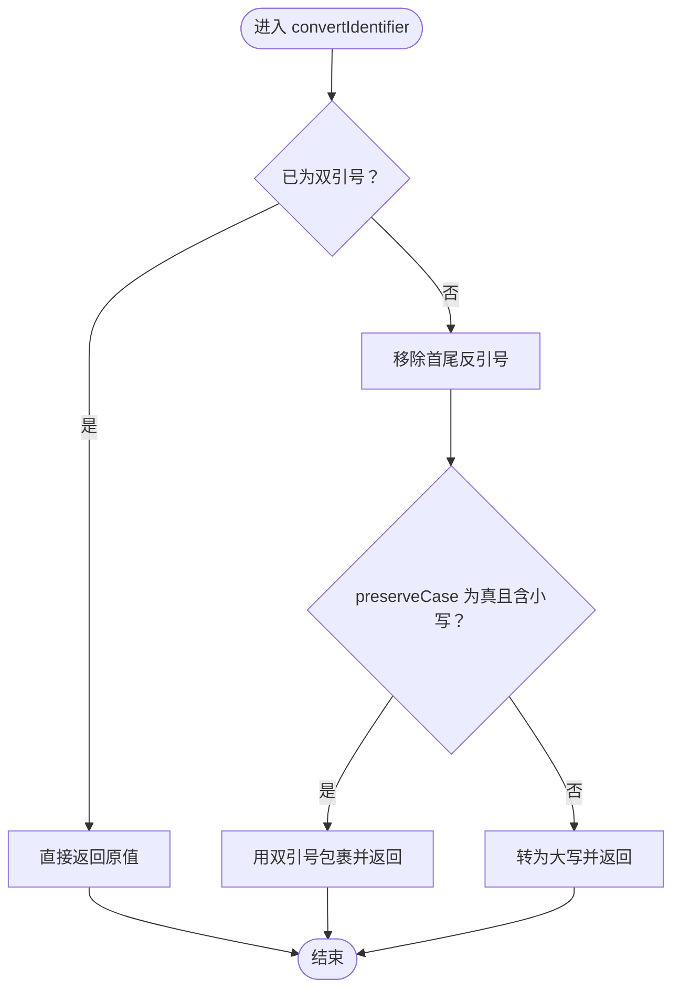
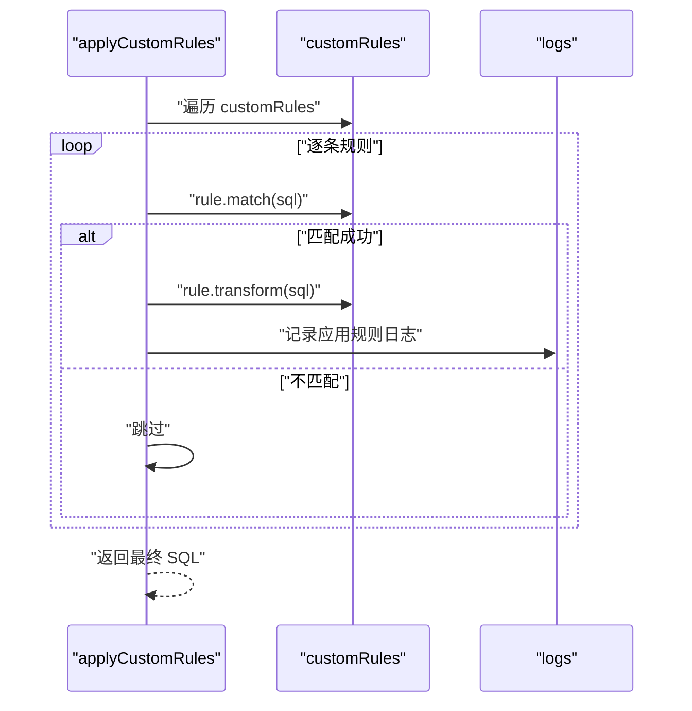
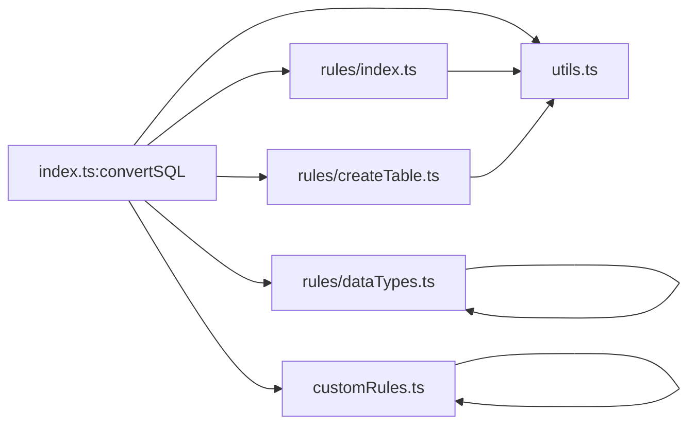

# 工具函数

<cite>
**本文引用的文件**
- [src/converter/utils.ts](file://src/converter/utils.ts)
- [src/converter/customRules.ts](file://src/converter/customRules.ts)
- [src/converter/rules/dataTypes.ts](file://src/converter/rules/dataTypes.ts)
- [src/converter/index.ts](file://src/converter/index.ts)
- [src/converter/rules/index.ts](file://src/converter/rules/index.ts)
- [src/converter/rules/createTable.ts](file://src/converter/rules/createTable.ts)
- [src/types/index.ts](file://src/types/index.ts)
</cite>

## 目录
1. [简介](#简介)
2. [项目结构](#项目结构)
3. [核心组件](#核心组件)
4. [架构总览](#架构总览)
5. [详细组件分析](#详细组件分析)
6. [依赖关系分析](#依赖关系分析)
7. [性能考量](#性能考量)
8. [故障排查指南](#故障排查指南)
9. [结论](#结论)

## 简介
本章节聚焦于 SQL 转换器中的工具函数与规则系统，重点覆盖以下核心能力：
- convertDataType(): 数据类型转换函数，负责将 MySQL 等方言的数据类型映射到 Oracle 方言。
- convertIdentifier(): 标识符转换函数，负责将反引号包裹的标识符转换为 Oracle 双引号或大写形式，并支持大小写保留策略。
- applyCustomRules(): 自定义规则应用函数，允许用户通过规则接口对 SQL 进行二次转换，包括匹配条件与转换逻辑。

此外，文档还将深入解析字符串处理函数（如提取/还原字符串字面量、去注释、按语句拆分）、正则表达式匹配规则、标识符规范化算法以及自定义转换规则的实现机制，并提供函数签名、参数类型、返回值格式、使用示例、性能优化建议与错误处理策略。

## 项目结构
工具函数与规则模块位于 src/converter 下，主要文件如下：
- utils.ts：通用字符串与标识符处理工具
- customRules.ts：自定义规则接口与应用逻辑
- rules/dataTypes.ts：数据类型映射与转换
- rules/index.ts：索引与 ALTER TABLE 转换（复用工具函数）
- rules/createTable.ts：CREATE TABLE 转换（复用工具函数）
- index.ts：主转换入口，调度各规则与工具函数
- types/index.ts：类型定义（日志、统计、选项）

图表来源
- [src/converter/index.ts:1-129](file://src/converter/index.ts#L1-L129)
- [src/converter/utils.ts:1-115](file://src/converter/utils.ts#L1-L115)
- [src/converter/customRules.ts:1-186](file://src/converter/customRules.ts#L1-L186)
- [src/converter/rules/dataTypes.ts:1-106](file://src/converter/rules/dataTypes.ts#L1-L106)
- [src/converter/rules/index.ts:1-135](file://src/converter/rules/index.ts#L1-L135)
- [src/converter/rules/createTable.ts:1-380](file://src/converter/rules/createTable.ts#L1-L380)
- [src/types/index.ts:1-44](file://src/types/index.ts#L1-L44)

章节来源
- [src/converter/index.ts:1-129](file://src/converter/index.ts#L1-L129)
- [src/converter/utils.ts:1-115](file://src/converter/utils.ts#L1-L115)
- [src/converter/customRules.ts:1-186](file://src/converter/customRules.ts#L1-L186)
- [src/converter/rules/dataTypes.ts:1-106](file://src/converter/rules/dataTypes.ts#L1-L106)
- [src/converter/rules/index.ts:1-135](file://src/converter/rules/index.ts#L1-L135)
- [src/converter/rules/createTable.ts:1-380](file://src/converter/rules/createTable.ts#L1-L380)
- [src/types/index.ts:1-44](file://src/types/index.ts#L1-L44)

## 核心组件
本节对三大核心工具函数进行深入剖析：convertDataType()、convertIdentifier()、applyCustomRules()，并补充相关字符串处理与标识符规范化函数。

- convertDataType(line, logs)
  - 功能：将单行 SQL 中的 MySQL 数据类型转换为 Oracle 对应类型；支持带参数类型（如 DECIMAL(M,D)、VARCHAR(N)、TIMESTAMP(precision) 等）与无参类型映射。
  - 参数
    - line: string，待转换的 SQL 单行文本
    - logs: ConversionLog[]，用于记录转换统计与信息
  - 返回：string，转换后的 SQL 单行文本
  - 关键实现要点
    - 使用映射表 TYPE_MAP，键为类型名，值可为固定字符串或回调函数（用于动态生成带参数的类型）
    - 匹配顺序按类型名长度降序，避免短类型误匹配长类型（如 INT 与 INTEGER）
    - 正则模式为单词边界匹配，且支持可选括号参数组
    - 转换后向 logs 推入统计信息
  - 性能与复杂度
    - 时间复杂度近似 O(k)，k 为类型映射数量；空间复杂度 O(n)（n 为输入长度）
  - 错误处理
    - 若未命中任何类型，直接返回原行
  - 使用示例
    - 输入包含 INT 或 DECIMAL(M,D) 等类型时，输出对应 NUMBER 或 VARCHAR2/RAW/CLOB 等 Oracle 类型

- convertIdentifier(id, preserveCase)
  - 功能：规范化标识符，将 MySQL 反引号包裹的标识符转换为 Oracle 双引号或大写形式，并在需要时保留大小写。
  - 参数
    - id: string，待处理的标识符
    - preserveCase: boolean，是否保留大小写（true 时用双引号包裹）
  - 返回：string，规范化后的标识符
  - 关键实现要点
    - 若已为双引号包裹，直接返回
    - 移除首尾反引号
    - 当 preserveCase 为 true 且清理后包含小写字母时，用双引号包裹以保留大小写
    - 否则统一转为大写
  - 性能与复杂度
    - 时间复杂度 O(n)，空间复杂度 O(n)
  - 错误处理
    - 输入为空或仅空白时行为由调用方决定，建议在调用前做 trim/非空检查
  - 使用示例
    - 输入 `myTable`，preserveCase=false → 输出 MYTABLE
    - 输入 `MyTable`，preserveCase=true → 输出 "MyTable"

- applyCustomRules(sql, logs)
  - 功能：遍历用户自定义规则列表，对 SQL 应用匹配成功的规则，并记录日志。
  - 参数
    - sql: string，待处理的 SQL 文本
    - logs: ConversionLog[]，用于记录应用的规则信息
  - 返回：string，应用规则后的 SQL 文本
  - 关键实现要点
    - 遍历 customRules，逐条执行 match 判断
    - 若匹配成功，执行 transform 并记录日志（仅当结果发生变化时）
    - 规则接口包含 name、description、match(sql)、transform(sql)
  - 性能与复杂度
    - 时间复杂度 O(r·m)，r 为规则数量，m 为每条规则的匹配/替换成本
  - 错误处理
    - 规则内部异常不会影响整体流程，但建议在规则实现中做好健壮性
  - 使用示例
    - 通过 nullReplacementRule 生成特定表/列的 NULL 替换规则，批量应用于 SQL

- 相关字符串处理函数
  - stripQuotes(str)
    - 功能：移除字符串最外层的单引号、双引号或反引号
    - 返回：string
  - extractStringLiterals(sql) / restoreStringLiterals(sql, literals)
    - 功能：在处理 SQL 时保护字符串字面量，避免正则误伤；先提取再还原
    - 返回：extract 返回 { sql, literals[] }，restore 将占位符还原为原字面量
  - removeComments(sql)
    - 功能：去除行注释 -- ... 与块注释 /* ... */，同时保护字符串
    - 返回：string
  - splitStatements(sql)
    - 功能：按分号拆分 SQL 语句，忽略字符串内部的分号
    - 返回：string[]
  - toSnakeCase(str)
    - 功能：驼峰转下划线命名
    - 返回：string

- 标识符规范化辅助函数
  - generateSequenceName(tableName, columnName)
    - 功能：生成 Oracle 序列名（SEQ_<TBL>_<COL>）
    - 返回：string
  - generateTriggerName(tableName, columnName)
    - 功能：生成 Oracle 触发器名（TRG_<TBL>_<COL>）
    - 返回：string
  - makeUniqueIndexName(idxName, tblName, logs)
    - 功能：确保索引名在 schema 内唯一，必要时添加表名前缀，并记录日志
    - 返回：string

章节来源
- [src/converter/rules/dataTypes.ts:1-106](file://src/converter/rules/dataTypes.ts#L1-L106)
- [src/converter/utils.ts:1-115](file://src/converter/utils.ts#L1-L115)
- [src/converter/customRules.ts:1-186](file://src/converter/customRules.ts#L1-L186)

## 架构总览
主转换流程从 convertSQL() 入口开始，先清理注释与拆分语句，然后根据语句类型路由到具体规则转换器，最后应用自定义规则。工具函数在多处被复用，形成清晰的职责分离。

图表来源
- [src/converter/index.ts:59-125](file://src/converter/index.ts#L59-L125)
- [src/converter/utils.ts:52-72](file://src/converter/utils.ts#L52-L72)
- [src/converter/customRules.ts:170-185](file://src/converter/customRules.ts#L170-L185)
- [src/converter/rules/index.ts:8-41](file://src/converter/rules/index.ts#L8-L41)
- [src/converter/rules/createTable.ts:116-379](file://src/converter/rules/createTable.ts#L116-L379)

章节来源
- [src/converter/index.ts:1-129](file://src/converter/index.ts#L1-L129)
- [src/converter/utils.ts:1-115](file://src/converter/utils.ts#L1-L115)
- [src/converter/customRules.ts:1-186](file://src/converter/customRules.ts#L1-L186)
- [src/converter/rules/index.ts:1-135](file://src/converter/rules/index.ts#L1-L135)
- [src/converter/rules/createTable.ts:1-380](file://src/converter/rules/createTable.ts#L1-L380)

## 详细组件分析

### convertDataType() 详细分析
- 设计模式与数据结构
  - 映射表 TYPE_MAP：键为类型名，值为固定字符串或回调函数，支持带参数类型动态生成
  - 匹配策略：按类型名长度降序排序，避免短类型误匹配长类型
- 正则表达式与匹配规则
  - 使用单词边界匹配，避免子串误匹配
  - 支持可选括号参数组，用于 DECIMAL/MEDIUMINT/VARCHAR2/TIMESTAMP 等
- 处理逻辑与复杂度
  - 时间复杂度近似 O(k·n)，k 为类型数量，n 为输入长度
  - 空间复杂度 O(n)
- 错误处理
  - 未命中类型时返回原行
- 性能优化建议
  - 保持 TYPE_MAP 键的有序性，减少不必要的回溯
  - 对常见类型优先匹配，降低平均匹配成本
- 使用示例
  - 输入包含 INT、DECIMAL(M,D)、VARCHAR(N)、TIMESTAMP(precision) 等时，输出对应 NUMBER、VARCHAR2、TIMESTAMP 等 Oracle 类型

图表来源
- [src/converter/rules/dataTypes.ts:61-86](file://src/converter/rules/dataTypes.ts#L61-L86)

章节来源
- [src/converter/rules/dataTypes.ts:1-106](file://src/converter/rules/dataTypes.ts#L1-L106)

### convertIdentifier() 详细分析
- 规范化策略
  - 若已为双引号包裹，直接返回
  - 移除首尾反引号
  - 当 preserveCase 为 true 且清理后包含小写字母时，用双引号包裹以保留大小写
  - 否则统一转为大写
- 正则表达式与匹配规则
  - 使用首尾字符判断与简单替换，避免复杂正则
- 复杂度与性能
  - 时间复杂度 O(n)，空间复杂度 O(n)
- 错误处理
  - 建议在调用前做 trim/非空检查
- 使用示例
  - 输入 `myTable`，preserveCase=false → 输出 MYTABLE
  - 输入 `MyTable`，preserveCase=true → 输出 "MyTable"

图表来源
- [src/converter/utils.ts:8-21](file://src/converter/utils.ts#L8-L21)

章节来源
- [src/converter/utils.ts:1-115](file://src/converter/utils.ts#L1-L115)

### applyCustomRules() 详细分析
- 规则接口与实现
  - CustomRule 接口：name、description、match(sql)、transform(sql)
  - 内置规则 nullReplacementRule：为指定表/列的 INSERT 语句中 NULL 值替换为指定值
- 匹配与转换流程
  - 遍历 customRules，逐条执行 match 判断
  - 若匹配成功，执行 transform 并记录日志（仅当结果发生变化时）
- 正则表达式与匹配规则
  - 使用 escapeRegExp 转义表名/列名中的正则特殊字符
  - 手动解析 INSERT 语句的列列表与 VALUES 列表，考虑字符串内逗号与嵌套括号
- 复杂度与性能
  - 时间复杂度 O(r·m)，r 为规则数量，m 为每条规则的匹配/替换成本
- 错误处理
  - 规则内部异常不会影响整体流程，建议在规则实现中做好健壮性
- 使用示例
  - 通过 nullReplacementRule('SYS_INDEXS', 'F_CHDATE', 'SYSDATE') 生成规则并应用

图表来源
- [src/converter/customRules.ts:170-185](file://src/converter/customRules.ts#L170-L185)

章节来源
- [src/converter/customRules.ts:1-186](file://src/converter/customRules.ts#L1-L186)

### 字符串处理与正则匹配机制
- 提取/还原字符串字面量
  - extractStringLiterals：使用正则匹配字符串字面量，替换为占位符并保存原值
  - restoreStringLiterals：将占位符还原为原字面量
- 注释处理
  - removeComments：先保护字符串，再去除行注释与块注释
- 语句拆分
  - splitStatements：在保护字符串的前提下按分号拆分，忽略字符串内部分号
- 正则匹配要点
  - 使用全局标志与多行标志，确保完整匹配
  - 对用户输入进行转义，防止注入问题
- 复杂度
  - 时间复杂度 O(n)，空间复杂度 O(n)

章节来源
- [src/converter/utils.ts:33-72](file://src/converter/utils.ts#L33-L72)

### 标识符规范化与命名生成
- 名称生成
  - generateSequenceName：SEQ_<TBL>_<COL>
  - generateTriggerName：TRG_<TBL>_<COL>
- 唯一性保障
  - makeUniqueIndexName：若索引名不以表名前缀开头，则添加前缀并记录日志
- 复杂度
  - 时间复杂度 O(n)，空间复杂度 O(n)

章节来源
- [src/converter/utils.ts:84-114](file://src/converter/utils.ts#L84-L114)

## 依赖关系分析
工具函数与规则之间的依赖关系如下：
- convertSQL() 依赖 utils.ts 的 removeComments 与 splitStatements
- convertCreateTable() 与 convertIndex()/convertAlterTable() 依赖 utils.ts 的 convertIdentifier、makeUniqueIndexName、generateSequenceName、generateTriggerName
- convertDataType() 依赖 rules/dataTypes.ts 的 TYPE_MAP 与匹配逻辑
- applyCustomRules() 依赖 customRules.ts 的规则接口与内置规则

图表来源
- [src/converter/index.ts:1-129](file://src/converter/index.ts#L1-L129)
- [src/converter/utils.ts:1-115](file://src/converter/utils.ts#L1-L115)
- [src/converter/customRules.ts:1-186](file://src/converter/customRules.ts#L1-L186)
- [src/converter/rules/dataTypes.ts:1-106](file://src/converter/rules/dataTypes.ts#L1-L106)
- [src/converter/rules/index.ts:1-135](file://src/converter/rules/index.ts#L1-L135)
- [src/converter/rules/createTable.ts:1-380](file://src/converter/rules/createTable.ts#L1-L380)

章节来源
- [src/converter/index.ts:1-129](file://src/converter/index.ts#L1-L129)
- [src/converter/utils.ts:1-115](file://src/converter/utils.ts#L1-L115)
- [src/converter/customRules.ts:1-186](file://src/converter/customRules.ts#L1-L186)
- [src/converter/rules/dataTypes.ts:1-106](file://src/converter/rules/dataTypes.ts#L1-L106)
- [src/converter/rules/index.ts:1-135](file://src/converter/rules/index.ts#L1-L135)
- [src/converter/rules/createTable.ts:1-380](file://src/converter/rules/createTable.ts#L1-L380)

## 性能考量
- 正则匹配优化
  - 将 TYPE_MAP 键按长度降序排序，优先匹配长类型，减少误匹配与回溯
  - 使用单词边界匹配，避免子串误匹配
- 字符串保护
  - 在进行正则替换前先提取/保护字符串字面量，避免误伤
- 规则应用
  - applyCustomRules 遍历规则时仅在结果变化时记录日志，减少冗余输出
- 复杂度控制
  - 工具函数普遍为 O(n) 时间复杂度，适合大规模 SQL 处理
- 建议
  - 对超大 SQL 文件，建议分批处理或流式处理
  - 自定义规则尽量避免复杂的嵌套正则，优先使用明确的解析逻辑

[本节为通用性能指导，无需特定文件来源]

## 故障排查指南
- 常见问题与定位
  - 数据类型未转换：检查 TYPE_MAP 中是否存在对应类型，确认匹配顺序与大小写
  - 标识符大小写异常：确认 preserveCase 选项与 convertIdentifier 的处理逻辑
  - 自定义规则未生效：检查 match 条件是否正确，transform 是否返回新值
  - 注释/字符串误删：确认 removeComments 与 extractStringLiterals 的使用顺序
- 日志与统计
  - convertSQL 会统计 warnings、errors、dataTypeConversions、autoIncrementConversions、commentConversions 等指标，便于定位问题
- 错误处理策略
  - convertSQL 对单条语句异常捕获并记录，不影响整体流程
  - 建议在规则实现中增加 try/catch 与边界检查

章节来源
- [src/converter/index.ts:97-107](file://src/converter/index.ts#L97-L107)
- [src/converter/customRules.ts:170-185](file://src/converter/customRules.ts#L170-L185)
- [src/converter/utils.ts:52-72](file://src/converter/utils.ts#L52-L72)

## 结论
本文档系统梳理了 SQL 转换器中的工具函数与规则体系，重点阐述了 convertDataType()、convertIdentifier()、applyCustomRules() 的设计思想、实现细节、性能特征与最佳实践。通过合理的正则匹配、字符串保护与规则扩展机制，这些工具能够稳定地支撑从 MySQL 到 Oracle 的数据类型与语法转换需求。建议在实际使用中结合业务场景定制规则，并关注日志与统计信息以持续优化转换质量。