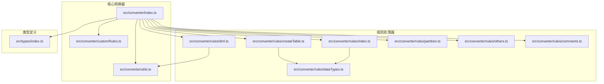
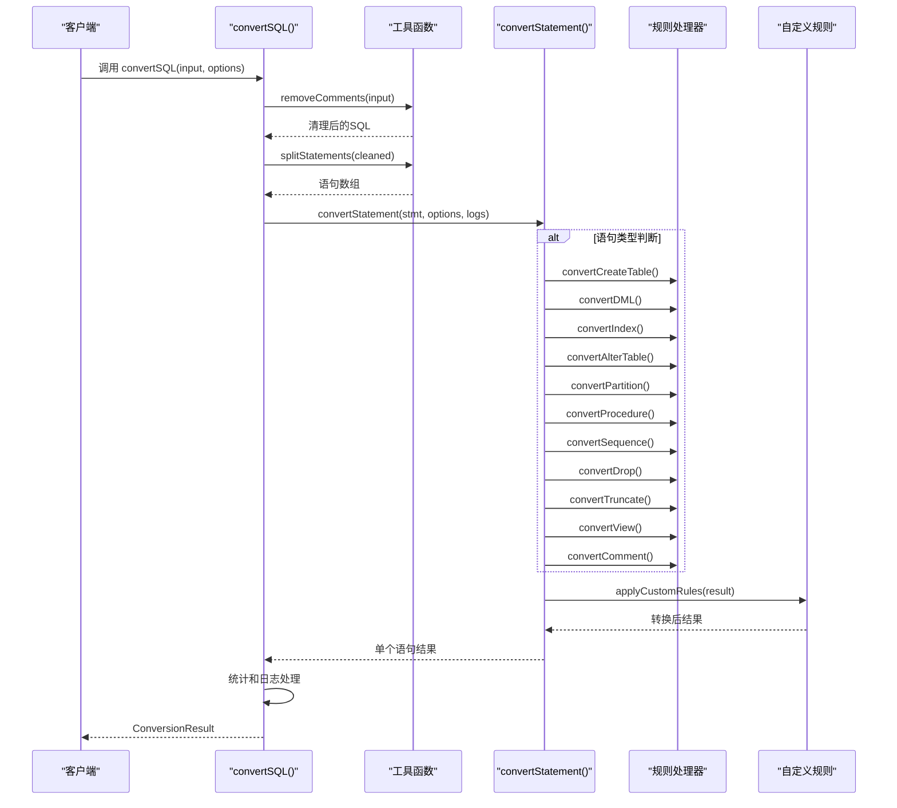
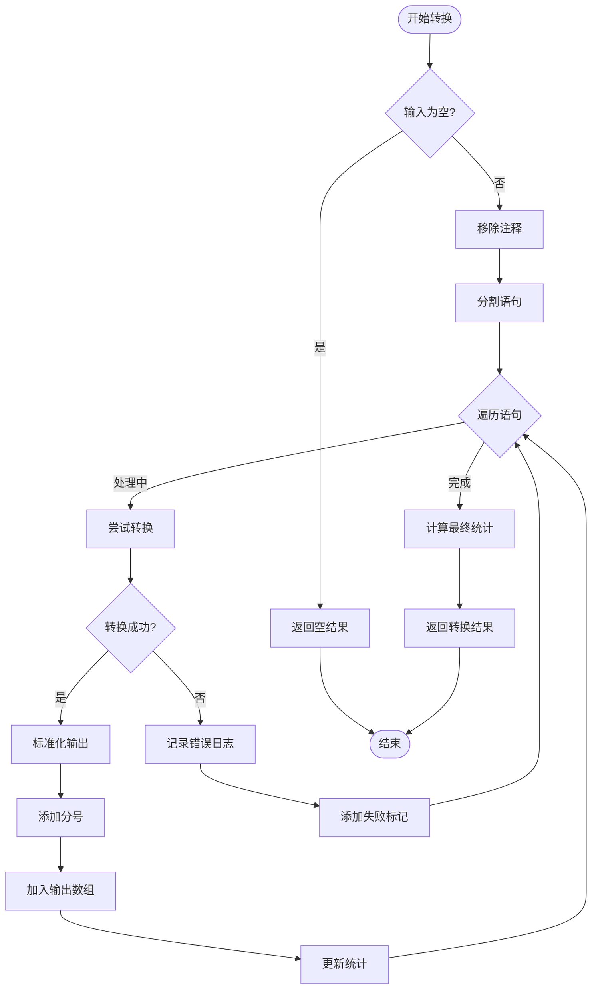
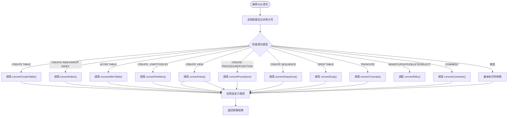
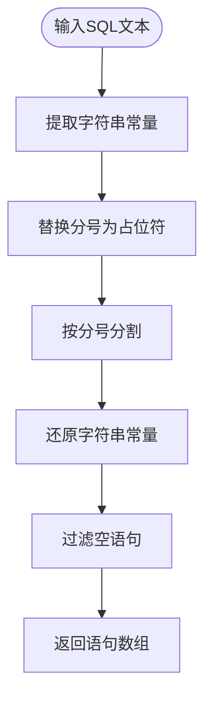
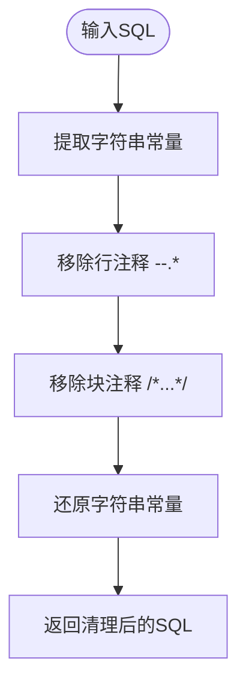
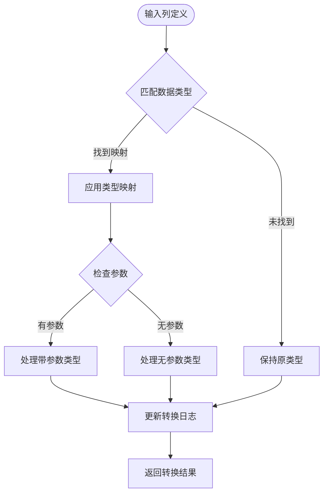
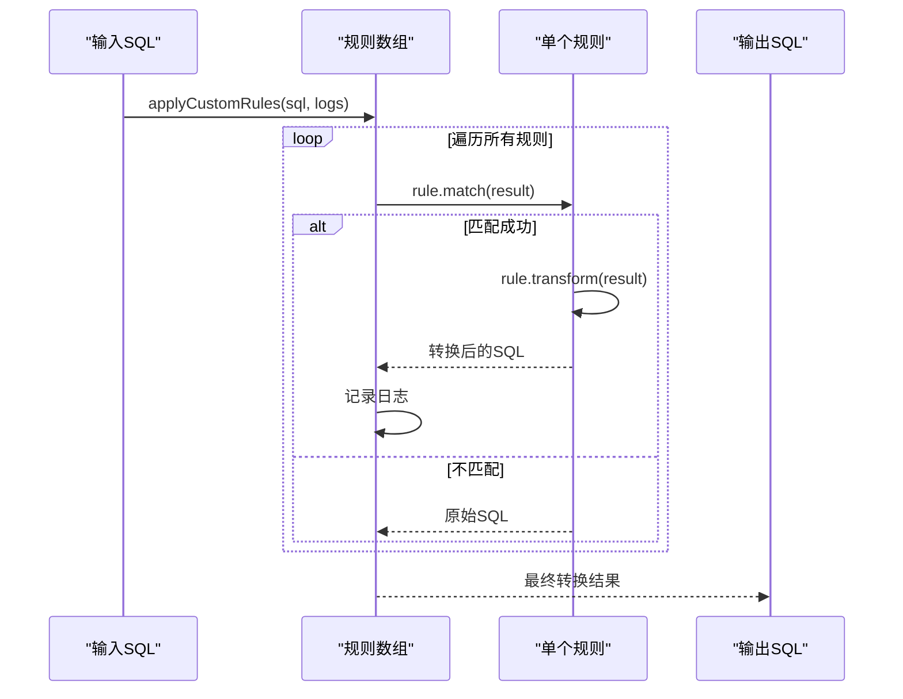
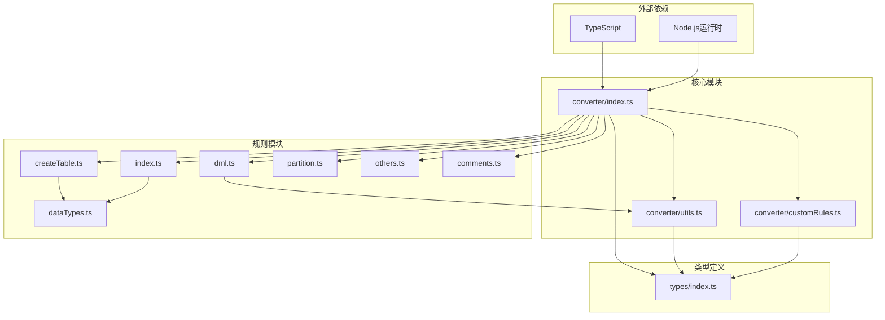

# 核心API函数

<cite>
**本文档引用的文件**
- [src/converter/index.ts](file://src/converter/index.ts)
- [src/types/index.ts](file://src/types/index.ts)
- [src/converter/utils.ts](file://src/converter/utils.ts)
- [src/converter/customRules.ts](file://src/converter/customRules.ts)
- [src/converter/rules/createTable.ts](file://src/converter/rules/createTable.ts)
- [src/converter/rules/dml.ts](file://src/converter/rules/dml.ts)
- [src/converter/rules/dataTypes.ts](file://src/converter/rules/dataTypes.ts)
- [src/converter/rules/index.ts](file://src/converter/rules/index.ts)
- [src/converter/rules/partition.ts](file://src/converter/rules/partition.ts)
- [src/converter/rules/others.ts](file://src/converter/rules/others.ts)
- [src/converter/rules/comments.ts](file://src/converter/rules/comments.ts)
</cite>

## 目录
1. [简介](#简介)
2. [项目结构](#项目结构)
3. [核心组件](#核心组件)
4. [架构概览](#架构概览)
5. [详细组件分析](#详细组件分析)
6. [依赖关系分析](#依赖关系分析)
7. [性能考虑](#性能考虑)
8. [故障排除指南](#故障排除指南)
9. [结论](#结论)

## 简介

本文档详细介绍了SQL转换器的核心API函数，重点涵盖以下关键函数：

- `convertSQL()` - 主转换函数，负责整个SQL转换流程
- `convertStatement()` - 语句路由函数，根据语句类型进行智能路由
- `splitStatements()` - 语句分割函数，将复合SQL文本分割为独立语句
- `removeComments()` - 注释移除函数，去除SQL中的注释内容

这些函数构成了SQL转换器的基础架构，支持从MySQL到Oracle的数据库迁移转换。

## 项目结构

SQL转换器采用模块化的架构设计，主要包含以下核心目录：



**图表来源**
- [src/converter/index.ts:1-129](file://src/converter/index.ts#L1-L129)
- [src/converter/utils.ts:1-115](file://src/converter/utils.ts#L1-L115)
- [src/types/index.ts:1-44](file://src/types/index.ts#L1-L44)

**章节来源**
- [src/converter/index.ts:1-129](file://src/converter/index.ts#L1-L129)
- [src/converter/utils.ts:1-115](file://src/converter/utils.ts#L1-L115)
- [src/types/index.ts:1-44](file://src/types/index.ts#L1-L44)

## 核心组件

### ConverterOptions 接口

`ConverterOptions` 定义了SQL转换的各种配置选项：

| 属性名 | 类型 | 默认值 | 描述 |
|--------|------|--------|------|
| useIdentity | boolean | false | 使用 IDENTITY 替代 SEQUENCE |
| useSequenceTrigger | boolean | true | 使用 SEQUENCE + TRIGGER 方式 |
| preserveCase | boolean | false | 保留原始大小写 |
| addComments | boolean | true | 添加注释转换 |
| convertEngineCharset | boolean | true | 移除 ENGINE/CHARSET |
| generateSequence | boolean | true | 生成序列 |
| generateTrigger | boolean | true | 生成更新触发器 |

**章节来源**
- [src/types/index.ts:25-43](file://src/types/index.ts#L25-L43)

### ConversionResult 接口

`ConversionResult` 返回转换结果的完整信息：

| 属性名 | 类型 | 描述 |
|--------|------|------|
| success | boolean | 转换是否成功 |
| output | string | 转换后的SQL文本 |
| logs | ConversionLog[] | 转换日志数组 |
| stats | ConversionStats | 转换统计信息 |

**章节来源**
- [src/types/index.ts:8-23](file://src/types/index.ts#L8-L23)

### ConversionStats 接口

转换统计信息包含详细的转换指标：

| 属性名 | 类型 | 描述 |
|--------|------|------|
| totalStatements | number | 总语句数 |
| convertedStatements | number | 成功转换的语句数 |
| warnings | number | 警告数量 |
| errors | number | 错误数量 |
| dataTypeConversions | number | 数据类型转换次数 |
| autoIncrementConversions | number | 自增转换次数 |
| commentConversions | number | 注释转换次数 |

**章节来源**
- [src/types/index.ts:15-23](file://src/types/index.ts#L15-L23)

## 架构概览

SQL转换器采用分层架构设计，实现了高度模块化的功能组织：



**图表来源**
- [src/converter/index.ts:59-125](file://src/converter/index.ts#L59-L125)
- [src/converter/index.ts:15-54](file://src/converter/index.ts#L15-L54)

## 详细组件分析

### convertSQL() 主转换函数

`convertSQL()` 是SQL转换器的核心入口函数，负责协调整个转换流程。

#### 函数签名
```typescript
export function convertSQL(input: string, options: ConverterOptions = DEFAULT_OPTIONS): ConversionResult
```

#### 参数验证规则

1. **输入验证**：
   - 检查输入字符串是否为空或仅包含空白字符
   - 空输入返回包含信息日志的空结果

2. **选项验证**：
   - 使用默认选项 `DEFAULT_OPTIONS` 作为回退
   - 所有选项均为可选配置，具有合理的默认值

#### 转换流程



**图表来源**
- [src/converter/index.ts:59-125](file://src/converter/index.ts#L59-L125)

#### 错误处理机制

- **异常捕获**：对每个语句转换过程进行try-catch包装
- **错误日志**：记录详细的错误信息和原始语句片段
- **降级处理**：失败的语句会被标记为注释形式输出
- **统计追踪**：错误数量自动累加到统计信息中

#### 性能考虑

- **内存优化**：使用流式处理，避免一次性加载大量数据
- **字符串操作**：最小化字符串复制操作
- **循环优化**：单次遍历处理所有语句
- **日志管理**：按需创建日志条目，避免不必要的对象分配

**章节来源**
- [src/converter/index.ts:59-125](file://src/converter/index.ts#L59-L125)

### convertStatement() 语句路由函数

`convertStatement()` 实现了智能的语句类型判断和路由机制。

#### 语句类型判断逻辑



**图表来源**
- [src/converter/index.ts:15-54](file://src/converter/index.ts#L15-L54)

#### 语句类型识别策略

1. **精确匹配**：使用 `startsWith()` 进行前缀匹配
2. **正则表达式**：对复杂模式使用正则表达式判断
3. **关键字检测**：通过包含特定关键字识别语句类型
4. **优先级排序**：按照语句重要性和复杂度排序

#### 自定义规则集成

所有语句转换完成后，都会经过 `applyCustomRules()` 进行额外的自定义转换处理。

**章节来源**
- [src/converter/index.ts:15-54](file://src/converter/index.ts#L15-L54)

### splitStatements() 语句分割函数

`splitStatements()` 函数负责将包含多个语句的SQL文本分割为独立的语句数组。

#### 核心算法原理



**图表来源**
- [src/converter/utils.ts:65-72](file://src/converter/utils.ts#L65-L72)

#### 关键特性

1. **字符串保护**：使用 `extractStringLiterals()` 保护字符串内部的分号
2. **智能分割**：忽略字符串和注释中的分号
3. **空白处理**：自动去除每个语句的首尾空白
4. **空语句过滤**：移除空的语句片段

#### 性能优化

- **单次遍历**：使用 `extractStringLiterals()` 一次性处理所有字符串
- **延迟还原**：分割后再统一还原字符串常量
- **内存效率**：避免创建中间字符串副本

**章节来源**
- [src/converter/utils.ts:65-72](file://src/converter/utils.ts#L65-L72)

### removeComments() 注释移除函数

`removeComments()` 函数专门负责移除SQL中的各种注释类型。

#### 注释类型支持

1. **行注释**：`-- 注释内容`
2. **块注释**：`/* 注释内容 */`
3. **混合注释**：同时存在多种注释类型

#### 处理流程



**图表来源**
- [src/converter/utils.ts:52-60](file://src/converter/utils.ts#L52-L60)

#### 安全机制

- **字符串保护**：使用 `extractStringLiterals()` 避免误删字符串中的注释
- **嵌套处理**：正确处理嵌套的注释和字符串
- **上下文保持**：确保注释移除不影响SQL语义

**章节来源**
- [src/converter/utils.ts:52-60](file://src/converter/utils.ts#L52-L60)

### 数据类型转换系统

SQL转换器内置了完整的数据类型转换系统，支持MySQL到Oracle的数据类型映射。

#### 类型映射表

| MySQL类型 | Oracle类型 | 特殊处理 |
|-----------|------------|----------|
| TINYINT | NUMBER(3) | 固定精度 |
| SMALLINT | NUMBER(5) | 固定精度 |
| MEDIUMINT | NUMBER(7) | 固定精度 |
| INT | NUMBER(10) | 显示宽度转换 |
| INTEGER | NUMBER(10) | 标准整数 |
| BIGINT | NUMBER(19) | 大整数 |
| FLOAT | FLOAT | 浮点数 |
| DOUBLE | DOUBLE PRECISION | 双精度浮点 |
| DECIMAL/MEDIUMINT | NUMBER(M[,D]) | 可变精度 |
| CHAR/VARCHAR | CHAR/VARCHAR2 | 字符串长度 |
| TEXT/MEDIUMTEXT/LONGTEXT | CLOB | 大文本 |
| DATE/DATETIME/TIMESTAMP | DATE/TIMESTAMP | 时间类型 |
| ENUM/SET | VARCHAR2(255) | 枚举转换 |

#### 转换算法



**图表来源**
- [src/converter/rules/dataTypes.ts:61-86](file://src/converter/rules/dataTypes.ts#L61-L86)

**章节来源**
- [src/converter/rules/dataTypes.ts:6-56](file://src/converter/rules/dataTypes.ts#L6-L56)
- [src/converter/rules/dataTypes.ts:61-86](file://src/converter/rules/dataTypes.ts#L61-L86)

### 自定义规则系统

SQL转换器提供了强大的自定义规则扩展机制。

#### CustomRule 接口

```typescript
export interface CustomRule {
  name: string;           // 规则名称
  description: string;    // 规则描述
  match: (sql: string) => boolean;     // 匹配函数
  transform: (sql: string) => string;  // 转换函数
}
```

#### 内置规则示例

1. **NULL替换规则**：将指定表列的NULL值替换为指定值
2. **空字符串替换规则**：将空字符串替换为空格

#### 规则应用流程



**图表来源**
- [src/converter/customRules.ts:170-185](file://src/converter/customRules.ts#L170-L185)

**章节来源**
- [src/converter/customRules.ts:7-185](file://src/converter/customRules.ts#L7-L185)

## 依赖关系分析

SQL转换器的依赖关系呈现清晰的层次结构：



**图表来源**
- [src/converter/index.ts:1-10](file://src/converter/index.ts#L1-L10)
- [src/converter/utils.ts:1-3](file://src/converter/utils.ts#L1-L3)
- [src/types/index.ts:1-6](file://src/types/index.ts#L1-L6)

### 模块耦合度分析

- **低耦合设计**：各规则模块相互独立，通过接口通信
- **清晰边界**：工具函数与业务逻辑分离
- **可扩展性**：新规则可通过简单接口添加
- **测试友好**：模块化设计便于单元测试

**章节来源**
- [src/converter/index.ts:1-10](file://src/converter/index.ts#L1-L10)

## 性能考虑

### 时间复杂度分析

1. **convertSQL()**：O(n × m)，其中n为语句数量，m为平均语句长度
2. **convertStatement()**：O(k)，k为语句类型判断的复杂度
3. **splitStatements()**：O(n)，n为输入长度
4. **removeComments()**：O(n)，n为输入长度

### 内存使用优化

- **流式处理**：避免一次性加载大文件到内存
- **字符串复用**：尽量重用已处理的字符串
- **延迟计算**：按需进行复杂的正则表达式匹配

### 并发处理能力

- **单线程模型**：适合Web应用的单线程环境
- **异步扩展**：可通过Promise包装支持异步处理
- **批处理支持**：可处理包含多个语句的SQL脚本

## 故障排除指南

### 常见问题及解决方案

#### 1. 转换结果为空

**可能原因**：
- 输入SQL为空或仅包含空白字符
- 语句被错误地过滤掉

**解决方法**：
- 检查输入参数的有效性
- 查看日志中的信息提示

#### 2. 语句转换失败

**可能原因**：
- 语句语法不符合预期
- 正则表达式匹配失败

**解决方法**：
- 检查语句的完整性和语法正确性
- 查看错误日志中的详细信息

#### 3. 数据类型转换异常

**可能原因**：
- MySQL数据类型不在映射表中
- 参数格式不正确

**解决方法**：
- 手动添加自定义数据类型映射
- 检查列定义的参数格式

#### 4. 自定义规则不生效

**可能原因**：
- 规则匹配条件过于严格
- 转换函数逻辑错误

**解决方法**：
- 调试规则的match函数
- 检查transform函数的实现

**章节来源**
- [src/converter/index.ts:71-107](file://src/converter/index.ts#L71-L107)

## 结论

SQL转换器的核心API函数设计体现了以下特点：

1. **模块化架构**：清晰的功能分离和职责划分
2. **可扩展性**：支持自定义规则和数据类型映射
3. **健壮性**：完善的错误处理和日志记录机制
4. **性能优化**：高效的字符串处理和内存管理
5. **易用性**：简洁的API接口和丰富的配置选项

这些核心函数为数据库迁移和SQL转换提供了可靠的技术基础，支持从MySQL到Oracle的平滑迁移过程。通过合理使用这些API，开发者可以构建高效、稳定的SQL转换工具。