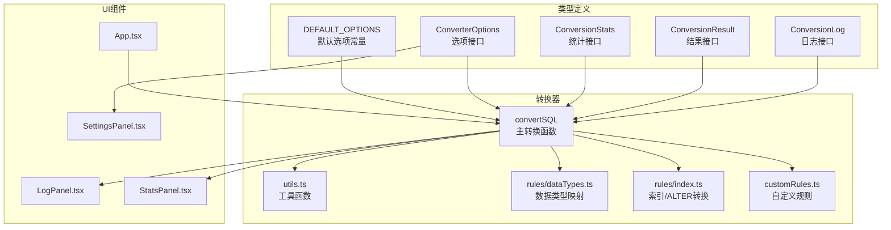
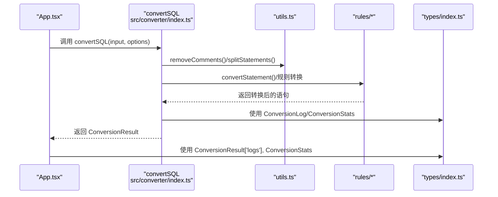
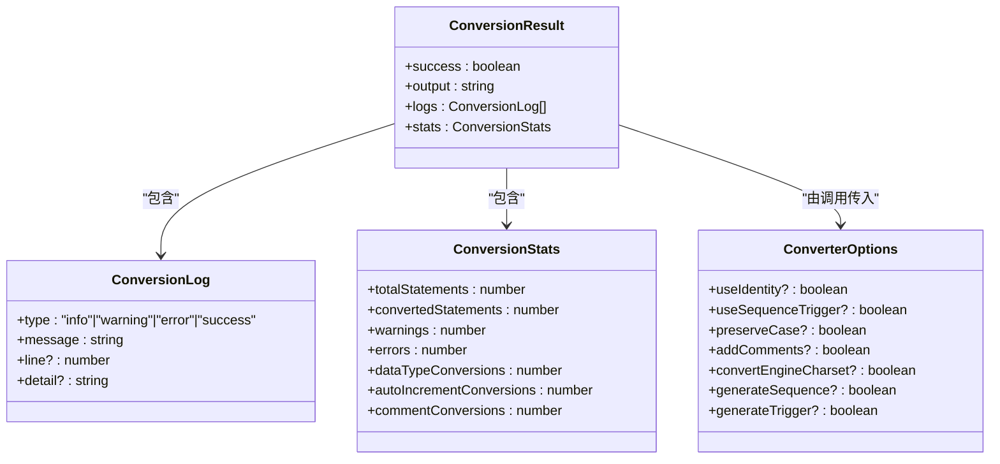
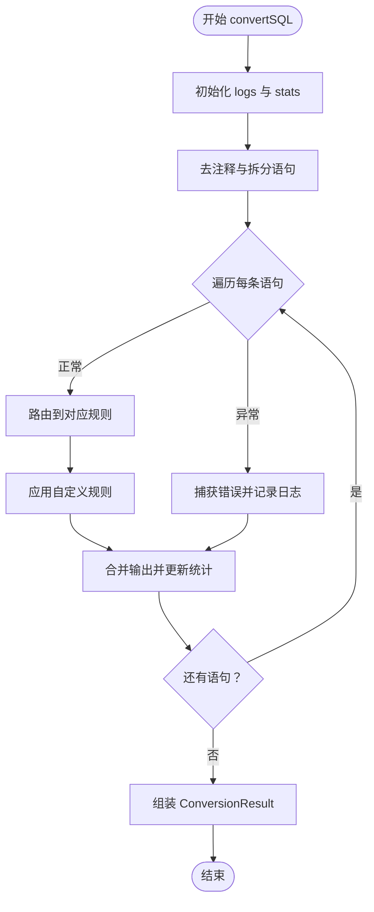
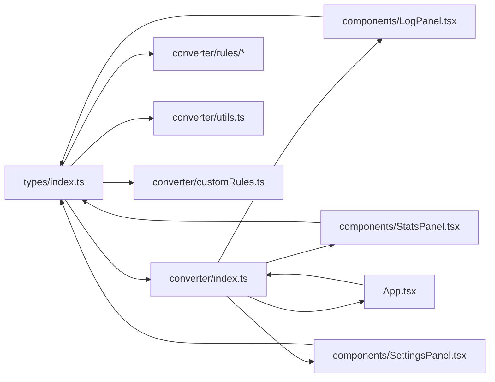

# 类型定义

<cite>
**本文引用的文件**
- [src/types/index.ts](file://src/types/index.ts)
- [src/converter/index.ts](file://src/converter/index.ts)
- [src/converter/utils.ts](file://src/converter/utils.ts)
- [src/converter/rules/dataTypes.ts](file://src/converter/rules/dataTypes.ts)
- [src/converter/rules/index.ts](file://src/converter/rules/index.ts)
- [src/converter/customRules.ts](file://src/converter/customRules.ts)
- [src/components/LogPanel.tsx](file://src/components/LogPanel.tsx)
- [src/components/StatsPanel.tsx](file://src/components/StatsPanel.tsx)
- [src/components/SettingsPanel.tsx](file://src/components/SettingsPanel.tsx)
- [src/App.tsx](file://src/App.tsx)
- [README.md](file://README.md)
- [package.json](file://package.json)
- [tsconfig.app.json](file://tsconfig.app.json)
</cite>

## 目录
1. [简介](#简介)
2. [项目结构](#项目结构)
3. [核心类型定义](#核心类型定义)
4. [架构概览](#架构概览)
5. [详细组件分析](#详细组件分析)
6. [依赖分析](#依赖分析)
7. [性能考量](#性能考量)
8. [故障排查指南](#故障排查指南)
9. [结论](#结论)
10. [附录](#附录)

## 简介
本文件面向“SQL转换器”的类型定义系统，提供完整的API文档与最佳实践说明。重点覆盖以下接口与枚举：
- ConversionResult 转换结果接口
- ConverterOptions 转换选项接口
- ConversionLog 转换日志接口
- ConversionStats 转换统计接口
- 枚举与常量：日志级别类型字面量
- 类型安全与组合使用范式
- TypeScript 泛型与类型推断要点
- 类型继承关系与接口组合示例

本项目采用 React + TypeScript + Vite 构建，类型系统贯穿转换器、规则引擎与UI组件，确保在复杂SQL转换流程中的强类型约束与可维护性。

章节来源
- [README.md:1-41](file://README.md#L1-L41)
- [package.json:1-36](file://package.json#L1-L36)
- [tsconfig.app.json:1-26](file://tsconfig.app.json#L1-L26)

## 项目结构
类型定义集中于 src/types/index.ts，其余模块通过显式 import 引入并广泛使用：
- 转换器入口：src/converter/index.ts 导出 convertSQL 并使用类型定义
- 规则引擎：src/converter/rules/*.ts 与 utils.ts 使用类型定义参与转换
- UI组件：src/components/* 接收并展示类型定义的数据结构
- 应用入口：src/App.tsx 使用类型定义管理状态与事件

图表来源
- [src/types/index.ts:1-44](file://src/types/index.ts#L1-L44)
- [src/converter/index.ts:1-129](file://src/converter/index.ts#L1-L129)
- [src/converter/utils.ts:1-115](file://src/converter/utils.ts#L1-L115)
- [src/converter/rules/dataTypes.ts:1-106](file://src/converter/rules/dataTypes.ts#L1-L106)
- [src/converter/rules/index.ts:1-135](file://src/converter/rules/index.ts#L1-L135)
- [src/converter/customRules.ts:1-186](file://src/converter/customRules.ts#L1-L186)
- [src/components/LogPanel.tsx:1-82](file://src/components/LogPanel.tsx#L1-L82)
- [src/components/StatsPanel.tsx:1-42](file://src/components/StatsPanel.tsx#L1-L42)
- [src/components/SettingsPanel.tsx:1-100](file://src/components/SettingsPanel.tsx#L1-L100)
- [src/App.tsx:1-282](file://src/App.tsx#L1-L282)

章节来源
- [src/types/index.ts:1-44](file://src/types/index.ts#L1-L44)
- [src/converter/index.ts:1-129](file://src/converter/index.ts#L1-L129)

## 核心类型定义

### ConversionLog 接口
- 描述：转换过程中的日志项，用于记录信息、警告、错误与成功提示
- 属性
  - type: 'info' | 'warning' | 'error' | 'success'（字面量联合类型）
  - message: string（日志消息文本）
  - line?: number（可选：所在行号）
  - detail?: string（可选：详细上下文，如原始语句片段）
- 默认值：无；均为可选字段，遵循“最小必要”原则
- 使用场景
  - 记录数据类型转换次数、注释转换、自增列替代策略等
  - 错误捕获时记录失败原因与原始语句片段
- 类型安全建议
  - 使用字面量联合类型限定 type，避免拼写错误
  - 对 detail 与 line 采用可选属性，避免非必要字段污染

章节来源
- [src/types/index.ts:1-6](file://src/types/index.ts#L1-L6)
- [src/converter/index.ts:99-105](file://src/converter/index.ts#L99-L105)
- [src/converter/rules/dataTypes.ts:78-83](file://src/converter/rules/dataTypes.ts#L78-L83)
- [src/converter/customRules.ts:177-181](file://src/converter/customRules.ts#L177-L181)
- [src/components/LogPanel.tsx:4-7](file://src/components/LogPanel.tsx#L4-L7)

### ConversionResult 接口
- 描述：一次转换的完整结果，包含输出SQL、日志与统计
- 属性
  - success: boolean（是否全部转换成功）
  - output: string（最终SQL输出）
  - logs: ConversionLog[]（日志数组）
  - stats: ConversionStats（统计对象）
- 默认值：无；作为返回值由 convertSQL 构造
- 使用场景
  - UI层接收并渲染输出、日志与统计
  - 业务层根据 success 决策后续流程
- 类型安全建议
  - 通过泛型约束确保 output 与 logs、stats 的一致性
  - 使用只读属性或不可变构造策略避免外部篡改

章节来源
- [src/types/index.ts:8-13](file://src/types/index.ts#L8-L13)
- [src/converter/index.ts:119-124](file://src/converter/index.ts#L119-L124)
- [src/App.tsx:59-72](file://src/App.tsx#L59-L72)

### ConversionStats 接口
- 描述：转换统计指标集合
- 属性
  - totalStatements: number（总语句数）
  - convertedStatements: number（已转换语句数）
  - warnings: number（警告数量）
  - errors: number（错误数量）
  - dataTypeConversions: number（数据类型转换次数）
  - autoIncrementConversions: number（自增/序列转换次数）
  - commentConversions: number（注释转换次数）
- 默认值：无；由 convertSQL 初始化并统计
- 使用场景
  - StatsPanel 展示关键指标
  - UI层根据指标判断转换质量
- 类型安全建议
  - 保持字段粒度清晰，避免重复统计
  - 通过辅助函数统一统计逻辑，减少分散更新

章节来源
- [src/types/index.ts:15-23](file://src/types/index.ts#L15-L23)
- [src/converter/index.ts:61-69](file://src/converter/index.ts#L61-L69)
- [src/converter/index.ts:110-117](file://src/converter/index.ts#L110-L117)
- [src/components/StatsPanel.tsx:3-16](file://src/components/StatsPanel.tsx#L3-L16)

### ConverterOptions 接口
- 描述：控制转换行为的选项集合
- 属性
  - useIdentity?: boolean（是否使用 Oracle IDENTITY 替代 SEQUENCE）
  - useSequenceTrigger?: boolean（是否生成 SEQUENCE + TRIGGER 方案）
  - preserveCase?: boolean（是否保留标识符原始大小写，用双引号包裹）
  - addComments?: boolean（是否转换注释为 COMMENT ON）
  - convertEngineCharset?: boolean（是否移除 ENGINE/CHARSET 等MySQL特有选项）
  - generateSequence?: boolean（是否生成序列）
  - generateTrigger?: boolean（是否生成更新触发器）
- 默认值：DEFAULT_OPTIONS（位于 src/types/index.ts）
- 使用场景
  - SettingsPanel 勾选项驱动 options 变更
  - 转换规则根据选项决定具体策略
- 类型安全建议
  - 使用 Partial<ConverterOptions> 仅传递变更项
  - 通过函数式合并策略避免直接修改引用

章节来源
- [src/types/index.ts:25-33](file://src/types/index.ts#L25-L33)
- [src/types/index.ts:35-43](file://src/types/index.ts#L35-L43)
- [src/converter/index.ts:59](file://src/converter/index.ts#L59)
- [src/converter/rules/index.ts:14-21](file://src/converter/rules/index.ts#L14-L21)
- [src/components/SettingsPanel.tsx:41-96](file://src/components/SettingsPanel.tsx#L41-L96)

### 枚举与常量
- 日志级别枚举（字面量联合类型）
  - 'info' | 'warning' | 'error' | 'success'
  - 定义位置：ConversionLog.type
- 默认选项常量 DEFAULT_OPTIONS
  - 定义位置：src/types/index.ts
  - 作用：convertSQL 的默认参数，SettingsPanel 的初始值来源

章节来源
- [src/types/index.ts:2](file://src/types/index.ts#L2)
- [src/types/index.ts:35-43](file://src/types/index.ts#L35-L43)
- [src/App.tsx:61](file://src/App.tsx#L61)

### TypeScript 泛型与类型推断
- 泛型使用建议
  - 对于可变配置对象（如 ConverterOptions），可使用 Partial<T> 仅传递变更字段，提升类型安全与可读性
  - 对于只读结果，可使用 Readonly<T> 防止意外修改
- 类型推断
  - convertSQL 的返回值类型由 TypeScript 自动推断为 ConversionResult
  - App.tsx 中通过类型别名 ConversionResult['logs'] 与 ConversionStats 实现精确推断
- 最佳实践
  - 明确区分“可选属性”与“必需属性”，避免滥用可选
  - 使用字面量联合类型限制枚举值，防止运行期异常

章节来源
- [src/App.tsx:59-61](file://src/App.tsx#L59-L61)
- [src/converter/index.ts:59](file://src/converter/index.ts#L59)

## 架构概览
类型定义在系统中的角色与流向如下：

图表来源
- [src/App.tsx:67-72](file://src/App.tsx#L67-L72)
- [src/converter/index.ts:59-125](file://src/converter/index.ts#L59-L125)
- [src/converter/utils.ts:52-72](file://src/converter/utils.ts#L52-L72)
- [src/converter/rules/index.ts:15-54](file://src/converter/rules/index.ts#L15-L54)
- [src/types/index.ts:1-44](file://src/types/index.ts#L1-L44)

## 详细组件分析

### 类型关系与继承
- 接口组合
  - ConversionResult 组合了 ConversionLog[] 与 ConversionStats
  - ConverterOptions 作为配置注入到各规则与工具函数
- 关系图

图表来源
- [src/types/index.ts:1-44](file://src/types/index.ts#L1-L44)

章节来源
- [src/types/index.ts:1-44](file://src/types/index.ts#L1-L44)

### 接口组合使用示例
- 在 App.tsx 中，通过类型别名精确获取日志与统计类型，避免宽泛 any
  - 使用 ConversionResult['logs'] 获取日志数组类型
  - 使用 ConversionStats 获取统计类型
- 在 SettingsPanel.tsx 中，使用 keyof ConverterOptions 动态切换选项，保证类型安全
- 在 LogPanel.tsx 与 StatsPanel.tsx 中，分别消费 ConversionLog 与 ConversionStats，确保 UI 层不关心内部实现细节

章节来源
- [src/App.tsx:59-61](file://src/App.tsx#L59-L61)
- [src/components/SettingsPanel.tsx:42-44](file://src/components/SettingsPanel.tsx#L42-L44)
- [src/components/LogPanel.tsx:4-7](file://src/components/LogPanel.tsx#L4-L7)
- [src/components/StatsPanel.tsx:3-16](file://src/components/StatsPanel.tsx#L3-L16)

### 转换流程中的类型使用
- convertSQL 初始化 ConversionStats 并在循环中累积日志与统计
- convertStatement 根据语句类型路由到不同规则，期间向 logs 注入日志
- 规则模块（如 dataTypes.ts、index.ts）在转换过程中更新统计项
- 自定义规则 applyCustomRules 在最后阶段统一应用

图表来源
- [src/converter/index.ts:59-125](file://src/converter/index.ts#L59-L125)
- [src/converter/utils.ts:52-72](file://src/converter/utils.ts#L52-L72)
- [src/converter/rules/dataTypes.ts:61-86](file://src/converter/rules/dataTypes.ts#L61-L86)
- [src/converter/customRules.ts:170-185](file://src/converter/customRules.ts#L170-L185)

章节来源
- [src/converter/index.ts:59-125](file://src/converter/index.ts#L59-L125)
- [src/converter/utils.ts:52-72](file://src/converter/utils.ts#L52-L72)
- [src/converter/rules/dataTypes.ts:61-86](file://src/converter/rules/dataTypes.ts#L61-L86)
- [src/converter/customRules.ts:170-185](file://src/converter/customRules.ts#L170-L185)

## 依赖分析
- 类型定义依赖
  - convertSQL 依赖 ConversionResult、ConversionStats、ConversionLog、ConverterOptions
  - 各规则模块依赖 ConversionLog 与 ConverterOptions
  - UI 组件依赖 ConversionLog 与 ConversionStats
- 外部依赖
  - React、Monaco Editor、Lucide React 等在 UI 层使用
  - TypeScript 编译器与 Vite 构建工具链

图表来源
- [src/types/index.ts:1-44](file://src/types/index.ts#L1-L44)
- [src/converter/index.ts:1-129](file://src/converter/index.ts#L1-L129)
- [src/converter/utils.ts:1-115](file://src/converter/utils.ts#L1-L115)
- [src/converter/rules/dataTypes.ts:1-106](file://src/converter/rules/dataTypes.ts#L1-L106)
- [src/converter/rules/index.ts:1-135](file://src/converter/rules/index.ts#L1-L135)
- [src/converter/customRules.ts:1-186](file://src/converter/customRules.ts#L1-L186)
- [src/components/LogPanel.tsx:1-82](file://src/components/LogPanel.tsx#L1-L82)
- [src/components/StatsPanel.tsx:1-42](file://src/components/StatsPanel.tsx#L1-L42)
- [src/components/SettingsPanel.tsx:1-100](file://src/components/SettingsPanel.tsx#L1-L100)
- [src/App.tsx:1-282](file://src/App.tsx#L1-L282)

章节来源
- [src/types/index.ts:1-44](file://src/types/index.ts#L1-L44)
- [src/converter/index.ts:1-129](file://src/converter/index.ts#L1-L129)

## 性能考量
- 类型层面
  - 使用只读与不可变构造策略，减少不必要的深拷贝
  - 将日志与统计聚合集中在 convertSQL，避免在规则层频繁分配
- 运行时
  - 正则匹配与字符串替换应尽量复用编译后的正则表达式
  - 对大数据量 SQL，优先拆分语句并行化（当前为顺序处理）

[本节为通用指导，无需特定文件引用]

## 故障排查指南
- 常见问题定位
  - 日志类型错误：检查 ConversionLog.type 是否使用字面量联合类型
  - 统计不准确：确认 convertSQL 中对 dataTypeConversions、autoIncrementConversions、commentConversions 的统计逻辑
  - 选项未生效：检查 SettingsPanel 是否正确使用 keyof ConverterOptions 更新选项
- 建议
  - 在规则模块中统一通过 logs 参数记录信息，便于 UI 展示
  - 对异常分支补充日志 detail 字段，保留原始语句片段以便回溯

章节来源
- [src/converter/index.ts:99-105](file://src/converter/index.ts#L99-L105)
- [src/converter/index.ts:110-117](file://src/converter/index.ts#L110-L117)
- [src/components/SettingsPanel.tsx:42-44](file://src/components/SettingsPanel.tsx#L42-L44)

## 结论
本类型定义体系以“最小必要属性 + 字面量联合类型 + 明确组合”为核心设计原则，配合 convertSQL 的集中统计与规则模块的职责划分，实现了高可维护性的SQL转换系统。通过 DEFAULT_OPTIONS 与 UI 组件的协同，既保证了易用性，又维持了类型安全与可扩展性。

[本节为总结性内容，无需特定文件引用]

## 附录

### 类型定义速查
- ConversionLog
  - 字段：type, message, line?, detail?
  - 用途：记录转换过程中的各类信息
- ConversionResult
  - 字段：success, output, logs, stats
  - 用途：一次转换的完整结果
- ConversionStats
  - 字段：totalStatements, convertedStatements, warnings, errors, dataTypeConversions, autoIncrementConversions, commentConversions
  - 用途：统计转换质量与范围
- ConverterOptions
  - 字段：useIdentity?, useSequenceTrigger?, preserveCase?, addComments?, convertEngineCharset?, generateSequence?, generateTrigger?
  - 用途：控制转换策略
- DEFAULT_OPTIONS
  - 用途：convertSQL 默认参数与 SettingsPanel 初始值

章节来源
- [src/types/index.ts:1-44](file://src/types/index.ts#L1-L44)
- [src/App.tsx:61](file://src/App.tsx#L61)