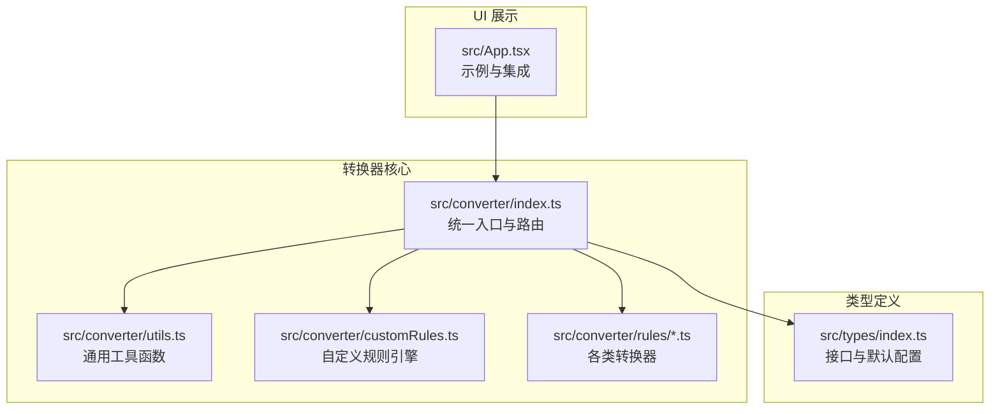
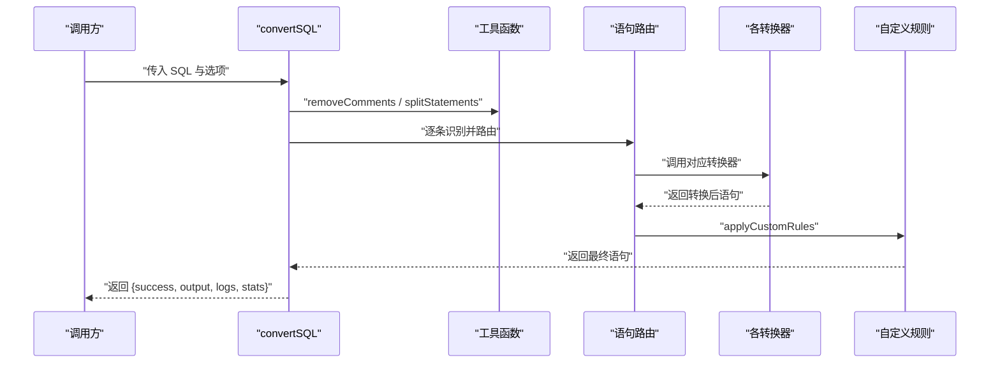
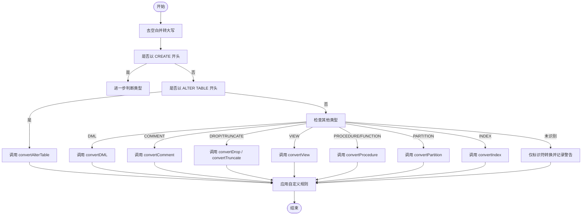
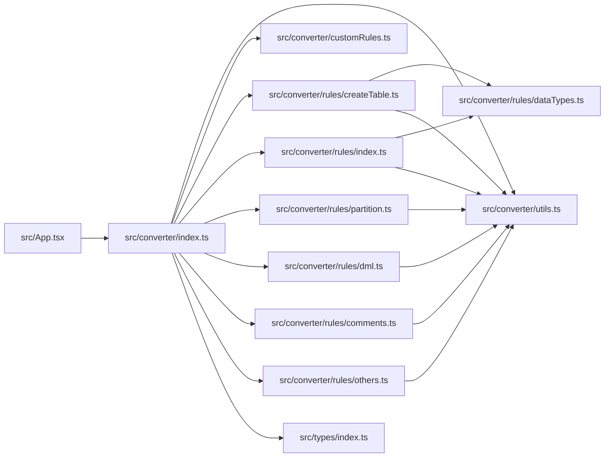

# 语句转换器

<cite>
**本文档引用的文件**
- [src/converter/index.ts](file://src/converter/index.ts)
- [src/converter/utils.ts](file://src/converter/utils.ts)
- [src/converter/customRules.ts](file://src/converter/customRules.ts)
- [src/converter/rules/createTable.ts](file://src/converter/rules/createTable.ts)
- [src/converter/rules/dml.ts](file://src/converter/rules/dml.ts)
- [src/converter/rules/index.ts](file://src/converter/rules/index.ts)
- [src/converter/rules/partition.ts](file://src/converter/rules/partition.ts)
- [src/converter/rules/comments.ts](file://src/converter/rules/comments.ts)
- [src/converter/rules/others.ts](file://src/converter/rules/others.ts)
- [src/converter/rules/dataTypes.ts](file://src/converter/rules/dataTypes.ts)
- [src/types/index.ts](file://src/types/index.ts)
- [src/App.tsx](file://src/App.tsx)
</cite>

## 目录
1. [简介](#简介)
2. [项目结构](#项目结构)
3. [核心组件](#核心组件)
4. [架构总览](#架构总览)
5. [详细组件分析](#详细组件分析)
6. [依赖关系分析](#依赖关系分析)
7. [性能考量](#性能考量)
8. [故障排查指南](#故障排查指南)
9. [结论](#结论)
10. [附录](#附录)

## 简介
本项目是一个面向 MySQL 到 Oracle 的 SQL 语句转换器，提供命令行与 Web 界面两种使用方式。其核心功能包括：
- 语句类型识别与路由
- 表结构转换（CREATE TABLE）
- DML 语句转换（INSERT/UPDATE/DELETE/SELECT）
- 索引转换（CREATE/DROP INDEX）
- 分区表转换（PARTITION BY）
- 注释与注释相关语句转换
- 存储过程与函数转换
- 自定义规则扩展

转换器通过统一入口函数对输入 SQL 进行拆分、清理注释、逐条识别并路由到对应转换器，最终输出标准化的 Oracle 兼容 SQL，并提供详细的日志与统计信息。

## 项目结构
项目采用模块化的目录组织，核心转换逻辑集中在 src/converter 下，类型定义位于 src/types，UI 展示位于 src/App.tsx。

图表来源
- [src/converter/index.ts:1-129](file://src/converter/index.ts#L1-L129)
- [src/converter/utils.ts:1-115](file://src/converter/utils.ts#L1-L115)
- [src/converter/customRules.ts:1-186](file://src/converter/customRules.ts#L1-L186)
- [src/types/index.ts:1-44](file://src/types/index.ts#L1-L44)
- [src/App.tsx:1-282](file://src/App.tsx#L1-L282)

章节来源
- [src/converter/index.ts:1-129](file://src/converter/index.ts#L1-L129)
- [src/converter/utils.ts:1-115](file://src/converter/utils.ts#L1-L115)
- [src/converter/customRules.ts:1-186](file://src/converter/customRules.ts#L1-L186)
- [src/types/index.ts:1-44](file://src/types/index.ts#L1-L44)
- [src/App.tsx:1-282](file://src/App.tsx#L1-L282)

## 核心组件
- 统一入口与路由：根据语句首关键字与模式识别，将 SQL 路由到具体转换器。
- 通用工具：标识符转换、字符串保护与还原、注释移除、语句拆分、命名规范辅助等。
- 自定义规则：可插拔的规则匹配与转换，支持针对特定表/列的定制化处理。
- 各类转换器：createTable、dml、index、partition、comments、others。
- 类型定义：转换结果、日志、统计、选项与默认值。

章节来源
- [src/converter/index.ts:12-54](file://src/converter/index.ts#L12-L54)
- [src/converter/utils.ts:5-115](file://src/converter/utils.ts#L5-L115)
- [src/converter/customRules.ts:1-186](file://src/converter/customRules.ts#L1-L186)
- [src/types/index.ts:1-44](file://src/types/index.ts#L1-L44)

## 架构总览
转换流程从 convertSQL 入口开始，执行以下步骤：
1. 输入校验与空值处理
2. 移除注释并按分号拆分语句
3. 逐条识别语句类型并调用对应转换器
4. 应用自定义规则
5. 统计与日志汇总，输出结果

图表来源
- [src/converter/index.ts:59-125](file://src/converter/index.ts#L59-L125)
- [src/converter/utils.ts:52-72](file://src/converter/utils.ts#L52-L72)
- [src/converter/customRules.ts:170-185](file://src/converter/customRules.ts#L170-L185)

## 详细组件分析

### 语句类型识别与路由机制
- 识别策略：基于语句首关键字与正则模式组合判断，覆盖 CREATE TABLE、CREATE INDEX、DROP INDEX、ALTER TABLE、CREATE PARTITION、CREATE VIEW、CREATE PROCEDURE/FUNCTION、DROP TABLE、TRUNCATE TABLE、DML（INSERT/UPDATE/DELETE/SELECT）、COMMENT 等。
- 未识别语句：仅进行标识符转换并记录警告。
- 路由优先级：按预设顺序匹配，确保精确识别（例如 CREATE INDEX 与 DROP INDEX 的区分、PARTITION BY 的识别）。

图表来源
- [src/converter/index.ts:15-54](file://src/converter/index.ts#L15-L54)

章节来源
- [src/converter/index.ts:12-54](file://src/converter/index.ts#L12-L54)

### 转换器 API 定义与行为

#### convertCreateTable(sql, options, logs)
- 输入参数
  - sql: 待转换的 CREATE TABLE 语句
  - options: 转换选项（见“转换选项”）
  - logs: 日志数组，用于记录转换过程中的信息、警告与错误
- 处理逻辑
  - 解析表名、列定义与约束
  - 数据类型转换（通过 convertDataType）
  - 自增列处理：支持 IDENTITY 或 SEQUENCE+TRIGGER
  - 默认值 CURRENT_TIMESTAMP/UUID() 转换
  - 约束转换：主键、唯一键、索引、外键、CHECK
  - 表注释与列注释生成（可选）
  - 临时表转换为 Oracle GLOBAL TEMPORARY TABLE
- 输出格式
  - 返回 Oracle 兼容的 CREATE TABLE 语句，必要时附加 COMMENT、索引、触发器、序列等
- 特殊处理规则
  - FULLTEXT 索引提示使用 Oracle Text（CTXSYS）
  - ON UPDATE CURRENT_TIMESTAMP 生成触发器
  - 移除 UNSIGNED、ZEROFILL、CHARACTER SET、COLLATE 等 MySQL 特性
  - ENGINE/CHARSET/ROW_FORMAT/AUTO_INCREMENT 等表尾部属性可选择移除
- 边界情况
  - 无法解析表头或括号不匹配时记录警告并回退
  - 临时表转换为 GLOBAL TEMPORARY
- 性能与复杂度
  - 列解析与约束处理为 O(n) 级别（按列与约束数量线性）

章节来源
- [src/converter/rules/createTable.ts:116-380](file://src/converter/rules/createTable.ts#L116-L380)
- [src/converter/rules/dataTypes.ts:61-86](file://src/converter/rules/dataTypes.ts#L61-L86)

#### convertDML(sql, options, logs)
- 输入参数
  - sql: INSERT/UPDATE/DELETE/SELECT 语句
  - options: 转换选项
  - logs: 日志数组
- 处理逻辑
  - INSERT IGNORE -> INSERT（移除 IGNORE）
  - INSERT SET -> 标准 INSERT VALUES
  - UPDATE/DELETE LIMIT -> 警告（Oracle 不支持）
  - SELECT LIMIT -> OFFSET FETCH 或 ROWNUM 子查询（视是否存在 WHERE）
  - SELECT 1 -> SELECT 1 FROM DUAL
  - 多表 UPDATE/DELETE -> 警告（需子查询）
  - 函数替换：IFNULL->NVL、UUID->SYS_GUID、NOW->SYSDATE、SUBSTRING->SUBSTR、TRUNCATE->TRUNC、DATE_FORMAT/STR_TO_DATE->TO_CHAR/TO_DATE
  - 日期/时间字符串常量自动转换为 TO_DATE/TO_TIMESTAMP
  - 标识符转换
- 输出格式
  - 返回 Oracle 兼容的 DML 语句
- 特殊处理规则
  - LIMIT 转换为 OFFSET FETCH 或 ROWNUM 子查询
  - 日期字符串保护已有的 TO_DATE/TO_TIMESTAMP 调用
- 边界情况
  - SELECT 无 FROM 时自动补全 FROM DUAL
  - 多表 UPDATE/DELETE 仅给出警告，不强制改写
- 性能与复杂度
  - 正则替换与字符串扫描近似 O(n)

章节来源
- [src/converter/rules/dml.ts:7-163](file://src/converter/rules/dml.ts#L7-L163)

#### convertIndex(sql, options, logs)
- 输入参数
  - sql: CREATE INDEX 或 DROP INDEX 语句
  - options: 转换选项
  - logs: 日志数组
- 处理逻辑
  - CREATE INDEX：移除 USING BTREE/HASH，转换列标识符，确保索引名在 schema 内唯一（自动添加表名前缀）
  - DROP INDEX：移除 ON table，转换索引名
- 输出格式
  - 返回 Oracle 兼容的索引操作语句
- 特殊处理规则
  - 索引名唯一性保障
- 边界情况
  - 无法匹配时原样返回

章节来源
- [src/converter/rules/index.ts:8-41](file://src/converter/rules/index.ts#L8-L41)

#### convertAlterTable(sql, options, logs)
- 输入参数
  - sql: ALTER TABLE 语句
  - options: 转换选项
  - logs: 日志数组
- 处理逻辑
  - ADD COLUMN：简化为 ADD，移除 COLLATE/CHARACTER SET/AFTER column
  - CHANGE：拆分为 RENAME COLUMN（MODIFY 需手动补充）
  - MODIFY：移除 COMMENT（Oracle MODIFY 不支持 COMMENT）
  - DROP PRIMARY KEY/FOREIGN KEY：生成对应约束名
  - DROP INDEX：转换为 DROP INDEX
  - 通用标识符转换
- 输出格式
  - 返回 Oracle 兼容的 ALTER TABLE 语句
- 特殊处理规则
  - COMMENT 仅在 ADD COLUMN 时保留并生成 COMMENT ON COLUMN
- 边界情况
  - 无法识别时原样返回

章节来源
- [src/converter/rules/index.ts:46-135](file://src/converter/rules/index.ts#L46-L135)

#### convertPartition(sql, options, logs)
- 输入参数
  - sql: PARTITION BY 语句
  - options: 转换选项
  - logs: 日志数组
- 处理逻辑
  - LIST 分区 VALUES IN -> VALUES
  - RANGE 中的 TO_DAYS(expr) -> expr
  - LESS THAN (TO_DAYS('xxx')) -> LESS THAN (DATE 'xxx')
  - MAXVALUE -> LESS THAN (MAXVALUE)
  - 标识符转换
- 输出格式
  - 返回 Oracle 兼容的分区定义
- 特殊处理规则
  - 保持基本分区语法一致，适配 Oracle 语义
- 边界情况
  - 无法匹配时原样返回

章节来源
- [src/converter/rules/partition.ts:7-38](file://src/converter/rules/partition.ts#L7-L38)

#### convertComment(sql, options, logs)
- 输入参数
  - sql: COMMENT 相关语句
  - options: 转换选项
  - logs: 日志数组
- 处理逻辑
  - 当前版本不做额外转换，保留原样
- 输出格式
  - 返回原语句或空字符串（DROP IF EXISTS 场景）
- 特殊处理规则
  - 过滤 DROP TABLE IF EXISTS（Oracle 模式不建议使用）
- 边界情况
  - 无特殊处理

章节来源
- [src/converter/rules/comments.ts:7-53](file://src/converter/rules/comments.ts#L7-L53)

#### convertView(sql, options, logs)
- 输入参数
  - sql: CREATE VIEW / DROP VIEW 语句
  - options: 转换选项
  - logs: 日志数组
- 处理逻辑
  - 标识符转换
- 输出格式
  - 返回 Oracle 兼容的视图操作语句

章节来源
- [src/converter/rules/comments.ts:48-52](file://src/converter/rules/comments.ts#L48-L52)

#### convertProcedure(sql, options, logs)
- 输入参数
  - sql: CREATE PROCEDURE / CREATE FUNCTION 语句
  - options: 转换选项
  - logs: 日志数组
- 处理逻辑
  - 添加 OR REPLACE（若不存在）
  - RETURNS -> RETURN
  - 标识符转换
- 输出格式
  - 返回 Oracle 兼容的存储过程/函数声明（部分替换）
- 特殊处理规则
  - 语法树重写复杂，仅做简单标识符与关键字替换，并给出警告
- 边界情况
  - 无法识别时原样返回

章节来源
- [src/converter/rules/others.ts:7-39](file://src/converter/rules/others.ts#L7-L39)

#### convertSequence(sql, options, logs)
- 输入参数
  - sql: CREATE/ALTER/DROP SEQUENCE 语句
  - options: 转换选项
  - logs: 日志数组
- 处理逻辑
  - 标识符转换
- 输出格式
  - 返回 Oracle 兼容的序列操作语句

章节来源
- [src/converter/rules/others.ts:44-48](file://src/converter/rules/others.ts#L44-L48)

### 数据类型转换规则映射表
- 映射表按类型名优先匹配，支持带参数类型（如 VARCHAR2、NUMBER、TIMESTAMP 等）
- 特殊处理：
  - ENUM 类型生成 CHECK 约束
  - DECIMAL/NUMERIC 保留精度参数
  - DATE/DATETIME/TIMESTAMP/YEAR 等类型转换为 Oracle 对应类型
- 复杂度：按类型数量线性匹配，整体 O(k·n)

章节来源
- [src/converter/rules/dataTypes.ts:6-106](file://src/converter/rules/dataTypes.ts#L6-L106)

### 转换选项与默认值
- useIdentity: 是否使用 IDENTITY 替代 SEQUENCE
- useSequenceTrigger: 是否使用 SEQUENCE + TRIGGER 方式处理自增
- preserveCase: 是否保留标识符大小写（否则转为大写）
- addComments: 是否生成 COMMENT ON TABLE/COLUMN 注释
- convertEngineCharset: 是否移除 ENGINE/CHARSET 等 MySQL 特性
- generateSequence: 是否生成 SEQUENCE
- generateTrigger: 是否生成触发器

章节来源
- [src/types/index.ts:25-44](file://src/types/index.ts#L25-L44)
- [src/converter/index.ts:35-43](file://src/converter/index.ts#L35-L43)

### 自定义规则引擎
- 规则接口：name、description、match(sql)、transform(sql)
- 内置规则示例：
  - INSERT NULL 替换规则：针对指定表/列，将 NULL 值替换为指定值
  - 空字符串替换规则：将空字符串替换为空格（示例）
- 应用流程：遍历规则，匹配则执行 transform 并记录日志

章节来源
- [src/converter/customRules.ts:7-186](file://src/converter/customRules.ts#L7-L186)

### 工具函数
- 标识符转换：convertIdentifier，支持保留大小写与去引号
- 字符串保护：extractStringLiterals/restoreStringLiterals，保护字符串常量避免误替换
- 注释移除：removeComments，支持行注释与块注释
- 语句拆分：splitStatements，按分号拆分并保护字符串
- 命名辅助：驼峰/下划线互转、序列/触发器名称生成、索引名唯一化

章节来源
- [src/converter/utils.ts:8-115](file://src/converter/utils.ts#L8-L115)

## 依赖关系分析

图表来源
- [src/converter/index.ts:1-10](file://src/converter/index.ts#L1-L10)
- [src/converter/rules/createTable.ts:1-4](file://src/converter/rules/createTable.ts#L1-L4)
- [src/converter/rules/index.ts:1-4](file://src/converter/rules/index.ts#L1-L4)
- [src/converter/rules/dataTypes.ts:1](file://src/converter/rules/dataTypes.ts#L1)
- [src/types/index.ts:1](file://src/types/index.ts#L1)
- [src/App.tsx:7](file://src/App.tsx#L7)

章节来源
- [src/converter/index.ts:1-10](file://src/converter/index.ts#L1-L10)
- [src/converter/rules/createTable.ts:1-4](file://src/converter/rules/createTable.ts#L1-L4)
- [src/converter/rules/index.ts:1-4](file://src/converter/rules/index.ts#L1-L4)
- [src/converter/rules/dataTypes.ts:1](file://src/converter/rules/dataTypes.ts#L1)
- [src/types/index.ts:1](file://src/types/index.ts#L1)
- [src/App.tsx:7](file://src/App.tsx#L7)

## 性能考量
- 正则匹配与字符串扫描为主，整体复杂度近似 O(n)（n 为语句长度）
- 数据类型映射按类型名排序匹配，类型数量有限，开销可忽略
- 自定义规则按顺序遍历，建议控制规则数量与匹配复杂度
- 大量语句时，建议分批处理并复用 options 与 logs

## 故障排查指南
- 未识别语句：检查首关键字与模式是否符合预期；查看日志 warning
- 注释问题：确认注释已被正确移除；注意字符串保护机制
- 标识符大小写：设置 preserveCase 控制是否保留大小写
- 自增列问题：根据 useIdentity/useSequenceTrigger 选项决定生成 IDENTITY 或 SEQUENCE+TRIGGER
- 存储过程/函数：仅做简单替换，复杂语法需手动调整
- LIMIT/多表 UPDATE/DELETE：Oracle 不支持，转换器给出警告，需手动改写

章节来源
- [src/converter/index.ts:97-107](file://src/converter/index.ts#L97-L107)
- [src/converter/index.ts:43-48](file://src/converter/index.ts#L43-L48)
- [src/converter/rules/others.ts:17-20](file://src/converter/rules/others.ts#L17-L20)

## 结论
本转换器提供了从 MySQL 到 Oracle 的全面 SQL 转换能力，具备清晰的模块化设计、完善的日志与统计、灵活的自定义规则扩展。对于复杂语法（如存储过程/函数、多表 DML），建议结合转换器的警告信息进行手工调整，以获得最佳兼容性。

## 附录

### 转换优先级说明
- 语句识别优先级：CREATE TABLE > CREATE INDEX/DROP INDEX > ALTER TABLE > CREATE PARTITION > CREATE VIEW > CREATE PROCEDURE/FUNCTION > DROP TABLE > TRUNCATE TABLE > DML > COMMENT
- 若同时满足多个条件，按上述顺序优先匹配

章节来源
- [src/converter/index.ts:19-41](file://src/converter/index.ts#L19-L41)

### 转换示例（路径）
- 示例 SQL（包含表结构与 DML）：[src/App.tsx:11-44](file://src/App.tsx#L11-L44)
- CREATE TABLE 转换示例（路径）：[src/converter/rules/createTable.ts:116-380](file://src/converter/rules/createTable.ts#L116-L380)
- DML 转换示例（路径）：[src/converter/rules/dml.ts:7-163](file://src/converter/rules/dml.ts#L7-L163)
- 索引转换示例（路径）：[src/converter/rules/index.ts:8-41](file://src/converter/rules/index.ts#L8-L41)
- 分区转换示例（路径）：[src/converter/rules/partition.ts:7-38](file://src/converter/rules/partition.ts#L7-L38)
- 注释与注释相关语句转换示例（路径）：[src/converter/rules/comments.ts:7-53](file://src/converter/rules/comments.ts#L7-L53)
- 存储过程/函数转换示例（路径）：[src/converter/rules/others.ts:7-39](file://src/converter/rules/others.ts#L7-L39)