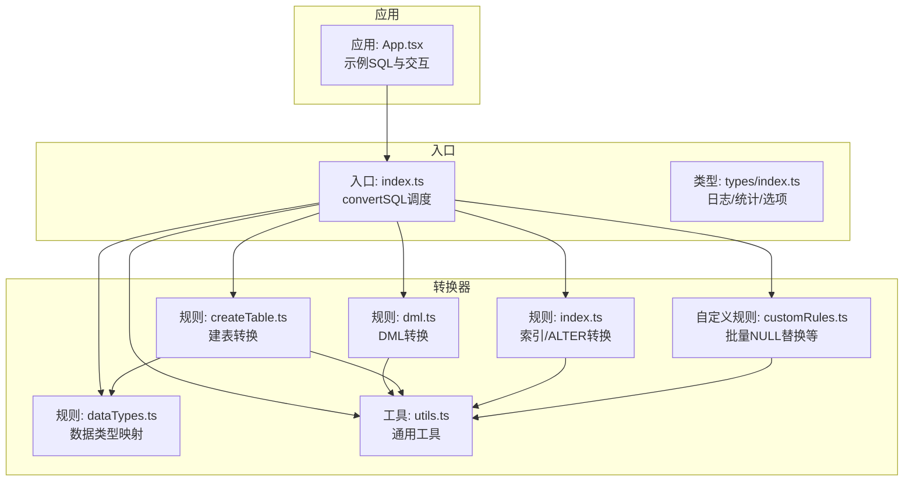
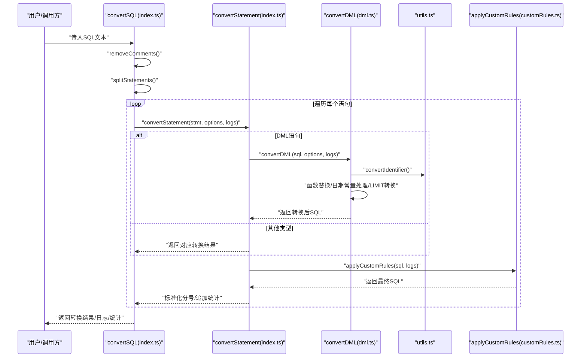
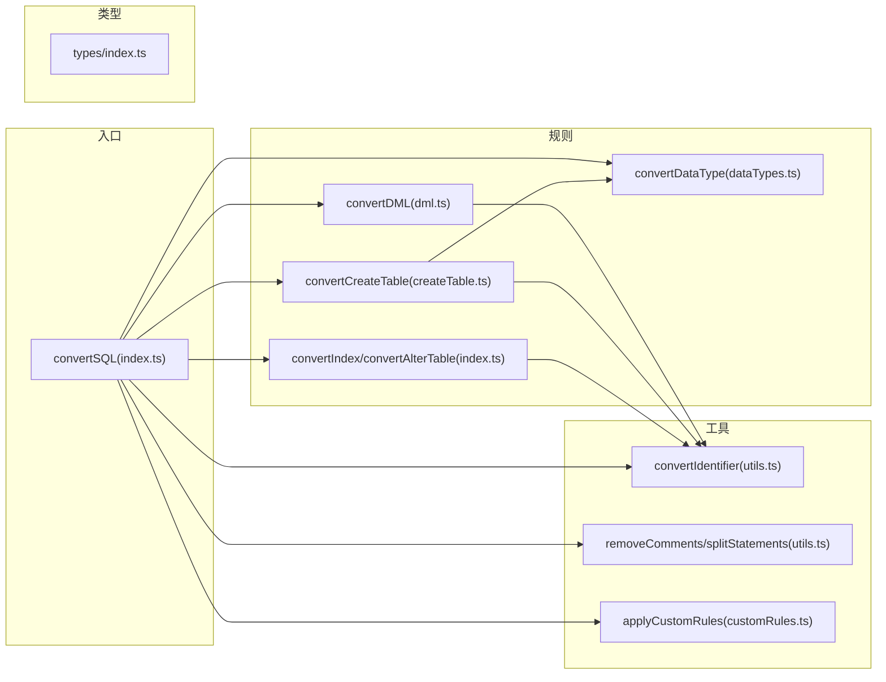
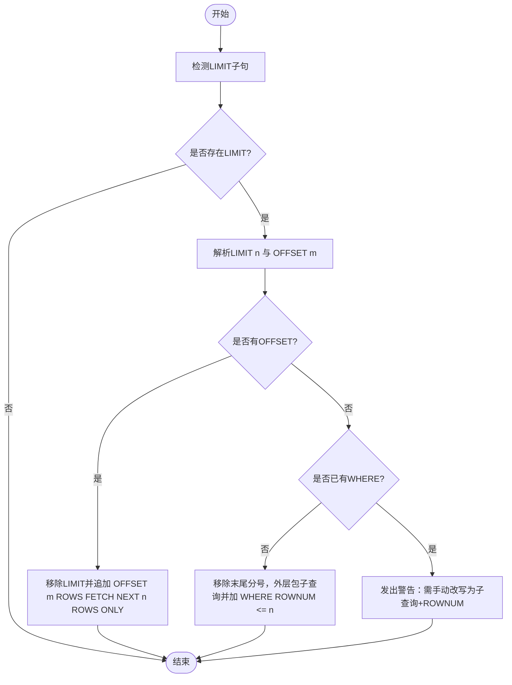
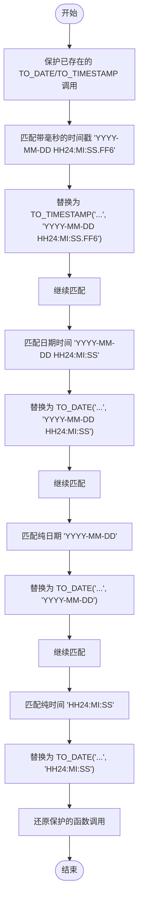

# DML语句转换

<cite>
**本文引用的文件**
- [dml.ts](file://src/converter/rules/dml.ts)
- [index.ts](file://src/converter/index.ts)
- [utils.ts](file://src/converter/utils.ts)
- [customRules.ts](file://src/converter/customRules.ts)
- [index.ts](file://src/types/index.ts)
- [App.tsx](file://src/App.tsx)
- [createTable.ts](file://src/converter/rules/createTable.ts)
- [dataTypes.ts](file://src/converter/rules/dataTypes.ts)
</cite>

## 目录
1. [简介](#简介)
2. [项目结构](#项目结构)
3. [核心组件](#核心组件)
4. [架构总览](#架构总览)
5. [详细组件分析](#详细组件分析)
6. [依赖关系分析](#依赖关系分析)
7. [性能考量](#性能考量)
8. [故障排查指南](#故障排查指南)
9. [结论](#结论)
10. [附录](#附录)

## 简介
本文件面向需要将MySQL DML（INSERT、UPDATE、DELETE、SELECT）语句转换为Oracle兼容语法的开发者与运维人员。文档基于仓库中的转换器实现，系统性阐述转换规则、算法流程、语法差异处理、关键字替换、函数调用转换、日期时间常量处理、批量操作与条件表达式注意事项，并给出性能优化建议与常见问题解决方案。为便于非技术读者理解，文档采用由浅入深的方式组织，并辅以可视化图示。

## 项目结构
该项目采用模块化的转换器设计，核心位于src/converter目录，按“规则”和“工具”分层组织：
- 规则层：按SQL类型划分，如DML、DDL、数据类型、索引等
- 工具层：通用工具函数（注释清理、语句拆分、标识符转换等）
- 类型层：统一的转换日志、统计、选项类型定义
- 应用层：前端界面与示例SQL，演示转换效果

图表来源
- [index.ts:15-54](file://src/converter/index.ts#L15-L54)
- [dml.ts:1-163](file://src/converter/rules/dml.ts#L1-L163)
- [createTable.ts:1-380](file://src/converter/rules/createTable.ts#L1-L380)
- [dataTypes.ts:1-106](file://src/converter/rules/dataTypes.ts#L1-L106)
- [utils.ts:1-115](file://src/converter/utils.ts#L1-L115)
- [customRules.ts:1-186](file://src/converter/customRules.ts#L1-L186)
- [index.ts:1-44](file://src/types/index.ts#L1-L44)
- [App.tsx:11-44](file://src/App.tsx#L11-L44)

章节来源
- [index.ts:15-54](file://src/converter/index.ts#L15-L54)
- [dml.ts:1-163](file://src/converter/rules/dml.ts#L1-L163)
- [utils.ts:1-115](file://src/converter/utils.ts#L1-L115)
- [customRules.ts:1-186](file://src/converter/customRules.ts#L1-L186)
- [index.ts:1-44](file://src/types/index.ts#L1-L44)
- [App.tsx:11-44](file://src/App.tsx#L11-L44)

## 核心组件
- DML转换器：负责INSERT、UPDATE、DELETE、SELECT的语法差异处理与函数替换
- 语句路由器：根据首词判断语句类型，分发到对应转换器
- 通用工具：注释清理、语句拆分、标识符转换、字符串保护/还原
- 自定义规则：支持批量插入时的NULL替换等业务定制
- 类型定义：统一的日志、统计、选项结构

章节来源
- [dml.ts:7-162](file://src/converter/rules/dml.ts#L7-L162)
- [index.ts:15-54](file://src/converter/index.ts#L15-L54)
- [utils.ts:52-72](file://src/converter/utils.ts#L52-L72)
- [customRules.ts:170-185](file://src/converter/customRules.ts#L170-L185)
- [index.ts:1-44](file://src/types/index.ts#L1-L44)

## 架构总览
DML转换在整体转换流程中的位置如下：

图表来源
- [index.ts:59-125](file://src/converter/index.ts#L59-L125)
- [index.ts:15-54](file://src/converter/index.ts#L15-L54)
- [dml.ts:7-162](file://src/converter/rules/dml.ts#L7-L162)
- [utils.ts:8-21](file://src/converter/utils.ts#L8-L21)
- [customRules.ts:170-185](file://src/converter/customRules.ts#L170-L185)

## 详细组件分析

### DML转换器（convertDML）
职责与范围
- 处理INSERT、UPDATE、DELETE、SELECT四类语句
- 语法差异与关键字替换
- 函数调用替换
- 日期/时间字符串常量转换
- LIMIT/OFFSET转换策略
- 标识符大小写与引号处理

关键转换规则与算法
- INSERT IGNORE移除：Oracle不支持IGNORE，直接替换为INSERT
- INSERT SET语法转换：将SET子句拆分为标准INSERT VALUES
- UPDATE/DELETE LIMIT警告：Oracle不支持LIMIT，提示改用ROWNUM或OFFSET/FETCH
- SELECT LIMIT转换：
  - OFFSET存在：使用Oracle 12c+的OFFSET ... FETCH NEXT ...
  - 无OFFSET：简单场景在外层包子查询并加ROWNUM<=n；若已有WHERE则发出警告
- SELECT 1无FROM：自动补全FROM DUAL
- 多表UPDATE/DELETE：提示需用子查询实现
- 函数替换：IFNULL→NVL、UUID()→SYS_GUID()、NOW()→SYSDATE、SUBSTRING→SUBSTR、TRUNCATE→TRUNC、DATE_FORMAT/STR_TO_DATE→TO_CHAR/TO_DATE
- 日期/时间字符串常量：
  - 先保护已存在的TO_DATE/TO_TIMESTAMP调用，避免二次替换
  - 依次匹配带毫秒、日期时间、纯日期、纯时间的字符串常量，分别转换为TO_TIMESTAMP/TO_DATE
- 标识符转换：移除反引号，按选项决定是否保留大小写（双引号包裹）

复杂度与性能
- 正则匹配与替换为主，整体为线性复杂度O(n)，其中n为SQL长度
- 日期常量保护与还原通过占位符实现，避免重复扫描

错误处理与日志
- 对不支持的特性（LIMIT、多表UPDATE/DELETE）发出warning
- 对可自动修复的模式（INSERT SET、LIMIT、无FROM SELECT）发出info
- 对函数替换、日期常量转换记录info

章节来源
- [dml.ts:7-162](file://src/converter/rules/dml.ts#L7-L162)
- [utils.ts:8-21](file://src/converter/utils.ts#L8-L21)

### 语句路由与主转换流程（convertSQL）
- 输入清理：先移除注释，再按分号拆分语句
- 逐条转换：根据首词判断类型，分派至对应规则模块
- 自定义规则：在每条语句转换后应用用户自定义规则
- 结果标准化：确保每条语句以分号结尾，汇总统计与日志

章节来源
- [index.ts:59-125](file://src/converter/index.ts#L59-L125)

### 通用工具（utils）
- 标识符转换：convertIdentifier
  - 已双引号包裹的标识符保持不变
  - 移除反引号后，按选项决定是否用双引号包裹保留大小写，否则转为大写
- 注释清理：removeComments
  - 先保护字符串常量，再移除行注释与块注释，最后还原
- 语句拆分：splitStatements
  - 保护字符串常量后再按分号拆分，过滤空语句
- 其他：驼峰/下划线互转、序列/触发器命名辅助、索引名唯一化

章节来源
- [utils.ts:8-21](file://src/converter/utils.ts#L8-L21)
- [utils.ts:52-72](file://src/converter/utils.ts#L52-L72)
- [utils.ts:77-97](file://src/converter/utils.ts#L77-L97)
- [utils.ts:102-114](file://src/converter/utils.ts#L102-L114)

### 自定义规则（customRules）
- 接口：CustomRule（name、description、match、transform）
- 功能：批量插入时将指定表/列的NULL替换为指定值（默认SYSDATE）
- 实现要点：
  - match阶段定位目标表/列
  - transform阶段解析INSERT列与VALUES，定位目标列索引，替换对应值
  - 应用applyCustomRules时记录日志

章节来源
- [customRules.ts:7-14](file://src/converter/customRules.ts#L7-L14)
- [customRules.ts:27-107](file://src/converter/customRules.ts#L27-L107)
- [customRules.ts:170-185](file://src/converter/customRules.ts#L170-L185)

### 类型定义（types）
- ConversionLog/ConversionResult/ConversionStats/ConverterOptions
- 默认选项DEFAULT_OPTIONS控制是否使用IDENTITY、是否生成序列/触发器、是否保留大小写等

章节来源
- [index.ts:1-44](file://src/types/index.ts#L1-L44)

### 示例与集成（App.tsx）
- 内置示例SQL包含MySQL风格的DML（INSERT SET、SELECT LIMIT、UPDATE）
- 展示了转换前后对比（MySQL输入、Oracle输出）

章节来源
- [App.tsx:11-44](file://src/App.tsx#L11-L44)

## 依赖关系分析

图表来源
- [index.ts:59-125](file://src/converter/index.ts#L59-L125)
- [dml.ts:1-163](file://src/converter/rules/dml.ts#L1-L163)
- [createTable.ts:1-380](file://src/converter/rules/createTable.ts#L1-L380)
- [index.ts:1-135](file://src/converter/rules/index.ts#L1-L135)
- [dataTypes.ts:1-106](file://src/converter/rules/dataTypes.ts#L1-L106)
- [utils.ts:1-115](file://src/converter/utils.ts#L1-L115)
- [customRules.ts:1-186](file://src/converter/customRules.ts#L1-L186)
- [index.ts:1-44](file://src/types/index.ts#L1-L44)

## 性能考量
- 正则匹配成本：DML转换主要依赖正则，建议在大规模批量转换时：
  - 合理拆分SQL文件，避免单次超长SQL导致匹配耗时
  - 避免在循环中重复构造正则对象，可复用预编译正则
- 保护与还原：日期常量转换采用占位符保护，避免二次替换，减少重复扫描
- 字符串保护：注释清理与语句拆分均先保护字符串常量，避免误判，提升稳定性
- 自定义规则：仅在match为true时执行transform，避免不必要的解析开销

## 故障排查指南
- UPDATE/DELETE LIMIT不生效
  - 现象：转换器发出warning，提示Oracle不支持LIMIT
  - 处理：改用ROWNUM或OFFSET/FETCH（当有OFFSET时自动转换）
  - 参考路径：[dml.ts:39-53](file://src/converter/rules/dml.ts#L39-L53)
- SELECT LIMIT转换异常
  - 现象：无OFFSET时简单转换为ROWNUM子查询；若有WHERE则发出warning
  - 处理：手动将WHERE子句改写为子查询+ROWNUM
  - 参考路径：[dml.ts:55-90](file://src/converter/rules/dml.ts#L55-L90)
- 多表UPDATE/DELETE
  - 现象：发出warning，提示需用子查询实现
  - 处理：按Oracle语法改写为子查询形式
  - 参考路径：[dml.ts:99-113](file://src/converter/rules/dml.ts#L99-L113)
- 函数替换不完全
  - 现象：某些函数未被替换
  - 处理：确认函数名大小写与括号空格是否符合正则；必要时扩展自定义规则
  - 参考路径：[dml.ts:115-122](file://src/converter/rules/dml.ts#L115-L122)
- 日期/时间字符串常量未转换
  - 现象：未识别为日期/时间格式
  - 处理：检查格式是否符合YYYY-MM-DD、YYYY-MM-DD HH24:MI:SS等；注意毫秒精度
  - 参考路径：[dml.ts:124-152](file://src/converter/rules/dml.ts#L124-L152)
- 标识符大小写问题
  - 现象：Oracle默认大写，大小写不一致
  - 处理：开启preserveCase选项，使用双引号包裹保留大小写
  - 参考路径：[utils.ts:8-21](file://src/converter/utils.ts#L8-L21)
- 批量插入NULL值
  - 现象：导入时NULL值不符合业务要求
  - 处理：配置自定义规则，将指定表/列的NULL替换为指定值
  - 参考路径：[customRules.ts:120-129](file://src/converter/customRules.ts#L120-L129)

## 结论
本转换器针对MySQL DML到Oracle的关键差异提供了系统性的自动化处理，包括语法差异、函数替换、日期常量转换、LIMIT/OFFSET适配以及批量插入的NULL替换等。对于Oracle不支持的特性（如UPDATE/DELETE LIMIT、多表UPDATE/DELETE），转换器通过日志警告引导用户手动改写。结合默认选项与自定义规则，可在保证正确性的前提下提升迁移效率与一致性。

## 附录

### DML转换算法流程（SELECT LIMIT）

图表来源
- [dml.ts:55-90](file://src/converter/rules/dml.ts#L55-L90)

### 函数替换对照表（节选）
- IFNULL(...) → NVL(...)
- UUID() → SYS_GUID()
- NOW() → SYSDATE
- SUBSTRING(...) → SUBSTR(...)
- TRUNCATE(...) → TRUNC(...)
- DATE_FORMAT(col, 'fmt') → TO_CHAR(col, 'fmt')
- STR_TO_DATE(col, 'fmt') → TO_DATE(col, 'fmt')

章节来源
- [dml.ts:115-122](file://src/converter/rules/dml.ts#L115-L122)

### 日期/时间字符串常量转换流程

图表来源
- [dml.ts:124-152](file://src/converter/rules/dml.ts#L124-L152)

### 自定义规则：批量NULL替换
- 目标：将指定表/列的NULL值替换为指定默认值（如SYSDATE）
- 触发：当SQL匹配到目标表且包含目标列时
- 实现：解析INSERT列与VALUES，定位列索引并替换对应值
- 应用：在convertSQL后统一执行applyCustomRules

章节来源
- [customRules.ts:120-129](file://src/converter/customRules.ts#L120-L129)
- [customRules.ts:170-185](file://src/converter/customRules.ts#L170-L185)