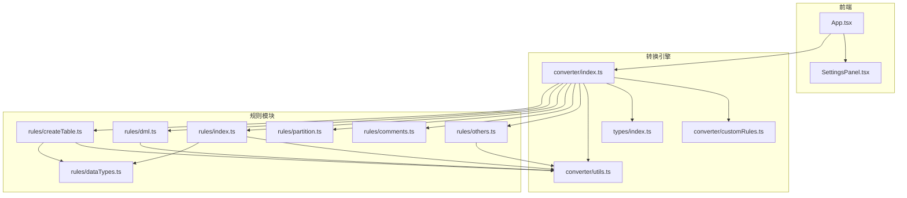
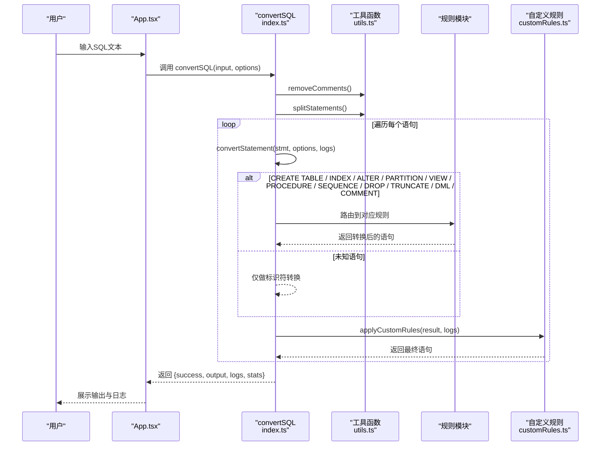
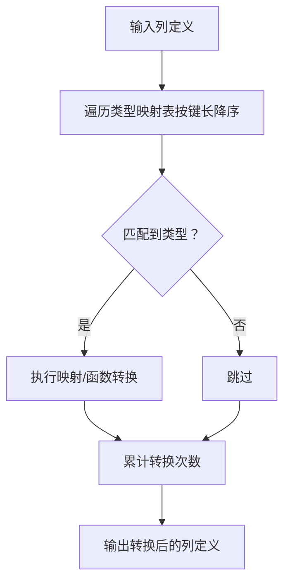
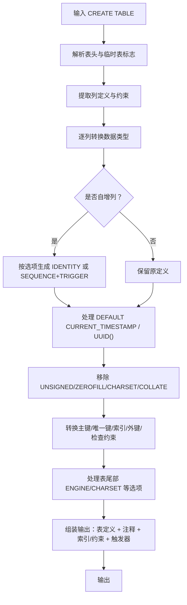
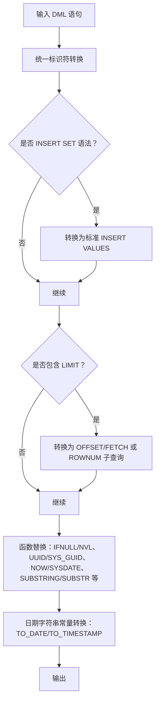
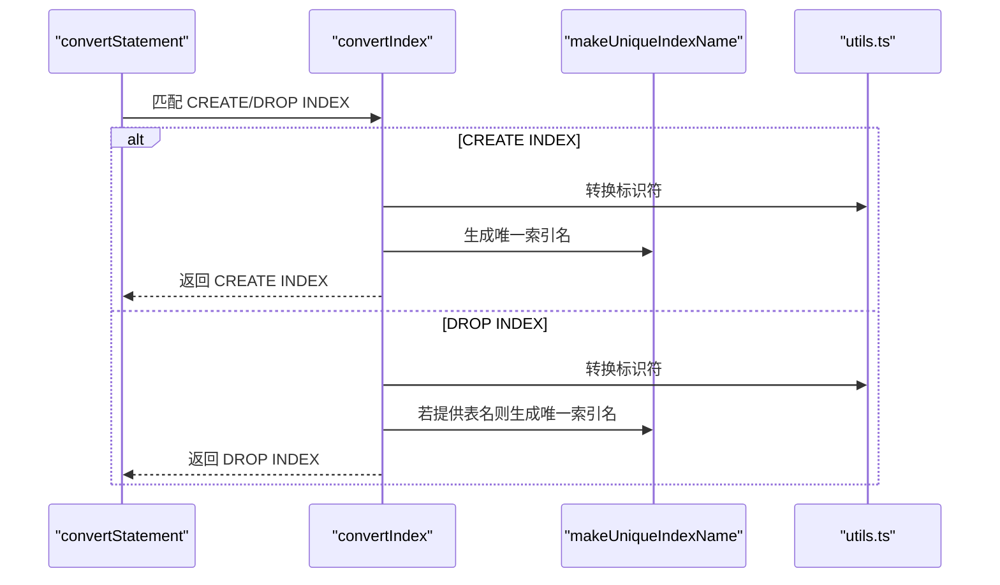
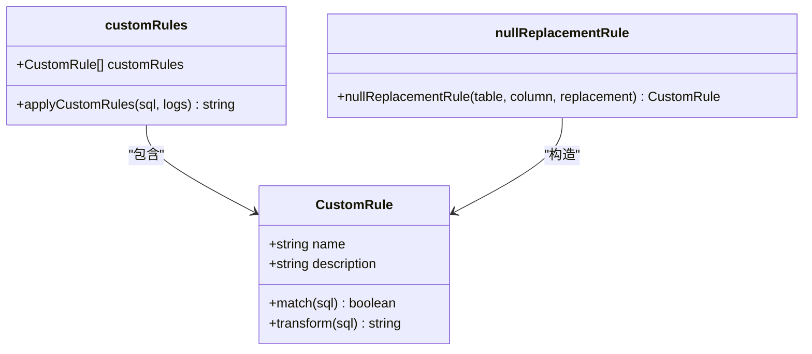
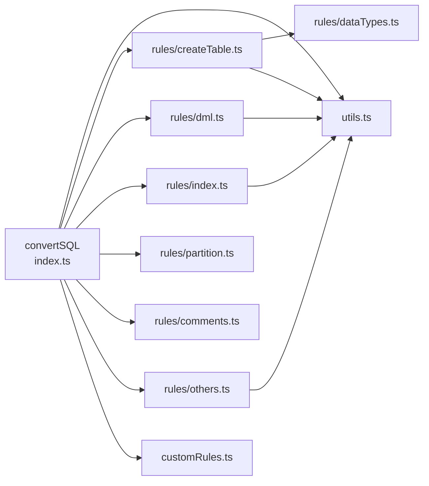

# SQL转换规则

<cite>
**本文引用的文件**
- [src/converter/index.ts](file://src/converter/index.ts)
- [src/converter/rules/createTable.ts](file://src/converter/rules/createTable.ts)
- [src/converter/rules/dataTypes.ts](file://src/converter/rules/dataTypes.ts)
- [src/converter/rules/dml.ts](file://src/converter/rules/dml.ts)
- [src/converter/rules/index.ts](file://src/converter/rules/index.ts)
- [src/converter/rules/partition.ts](file://src/converter/rules/partition.ts)
- [src/converter/rules/comments.ts](file://src/converter/rules/comments.ts)
- [src/converter/rules/others.ts](file://src/converter/rules/others.ts)
- [src/converter/utils.ts](file://src/converter/utils.ts)
- [src/types/index.ts](file://src/types/index.ts)
- [src/converter/customRules.ts](file://src/converter/customRules.ts)
- [src/App.tsx](file://src/App.tsx)
- [src/components/SettingsPanel.tsx](file://src/components/SettingsPanel.tsx)
- [package.json](file://package.json)
</cite>

## 目录
1. [简介](#简介)
2. [项目结构](#项目结构)
3. [核心组件](#核心组件)
4. [架构总览](#架构总览)
5. [详细组件分析](#详细组件分析)
6. [依赖关系分析](#依赖关系分析)
7. [性能考量](#性能考量)
8. [故障排查指南](#故障排查指南)
9. [结论](#结论)
10. [附录](#附录)

## 简介
本文件系统性梳理了该项目的SQL转换规则与实现机制，覆盖数据类型映射、CREATE TABLE语句处理、DML语句转换、索引与约束、分区表、注释及其他特殊语句的转换策略。文档解释每类规则的设计原理、适用场景与限制条件，并提供转换前后对照思路与可视化流程图，帮助读者快速掌握转换效果与注意事项。

## 项目结构
项目采用“规则模块化 + 工具函数 + 类型定义”的组织方式，前端通过编辑器展示输入输出，后端转换逻辑集中在规则文件中，便于扩展与维护。

图表来源
- [src/App.tsx:1-282](file://src/App.tsx#L1-L282)
- [src/converter/index.ts:1-129](file://src/converter/index.ts#L1-L129)
- [src/converter/rules/createTable.ts:1-380](file://src/converter/rules/createTable.ts#L1-L380)
- [src/converter/rules/dataTypes.ts:1-106](file://src/converter/rules/dataTypes.ts#L1-L106)
- [src/converter/rules/dml.ts:1-163](file://src/converter/rules/dml.ts#L1-L163)
- [src/converter/rules/index.ts:1-135](file://src/converter/rules/index.ts#L1-L135)
- [src/converter/rules/partition.ts:1-38](file://src/converter/rules/partition.ts#L1-L38)
- [src/converter/rules/comments.ts:1-53](file://src/converter/rules/comments.ts#L1-L53)
- [src/converter/rules/others.ts:1-49](file://src/converter/rules/others.ts#L1-L49)
- [src/converter/utils.ts:1-115](file://src/converter/utils.ts#L1-L115)
- [src/types/index.ts:1-44](file://src/types/index.ts#L1-L44)
- [src/converter/customRules.ts:1-186](file://src/converter/customRules.ts#L1-L186)

章节来源
- [src/App.tsx:1-282](file://src/App.tsx#L1-L282)
- [src/converter/index.ts:1-129](file://src/converter/index.ts#L1-L129)

## 核心组件
- 转换入口与路由：根据语句首关键字与模式匹配，将不同SQL类型路由到对应规则模块。
- 规则模块：分别处理CREATE TABLE、索引/约束、分区、DML、注释/删除/截断、视图、存储过程/函数、序列等。
- 数据类型映射：集中定义MySQL到Oracle的数据类型映射与参数处理。
- 工具函数：统一标识符转换、注释清理、语句拆分、序列/触发器命名、唯一索引名生成等。
- 自定义规则：提供可插拔的用户规则接口，支持按表/列的特殊转换（如NULL替换）。

章节来源
- [src/converter/index.ts:12-54](file://src/converter/index.ts#L12-L54)
- [src/converter/rules/createTable.ts:116-379](file://src/converter/rules/createTable.ts#L116-L379)
- [src/converter/rules/dataTypes.ts:6-86](file://src/converter/rules/dataTypes.ts#L6-L86)
- [src/converter/utils.ts:8-115](file://src/converter/utils.ts#L8-L115)
- [src/converter/customRules.ts:7-186](file://src/converter/customRules.ts#L7-L186)

## 架构总览
转换流程从输入SQL开始，先清理注释与拆分语句，再逐条判断类型并路由到对应规则，最后应用自定义规则与统计日志。

图表来源
- [src/converter/index.ts:59-125](file://src/converter/index.ts#L59-L125)
- [src/converter/utils.ts:52-72](file://src/converter/utils.ts#L52-L72)
- [src/converter/customRules.ts:170-185](file://src/converter/customRules.ts#L170-L185)

## 详细组件分析

### 数据类型转换映射表
- 设计原理：以“类型名 + 参数”为键，提供静态映射或动态函数转换；优先匹配带参数的类型，确保精确替换。
- 适用场景：CREATE TABLE列定义、ALTER COLUMN类型修改、DML中函数返回类型推断。
- 限制条件：部分类型（如ENUM）需配合CHECK约束；时间戳默认转换为SYSDATE，需结合业务确认精度。
- 性能：按类型名长度降序匹配，避免短类型误匹配长类型；转换次数计入统计。

图表来源
- [src/converter/rules/dataTypes.ts:61-86](file://src/converter/rules/dataTypes.ts#L61-L86)

章节来源
- [src/converter/rules/dataTypes.ts:6-106](file://src/converter/rules/dataTypes.ts#L6-L106)

### CREATE TABLE 语句处理
- 设计原理：解析表头、列定义与约束，分别转换；对自增列按选项生成IDENTITY或SEQUENCE+TRIGGER；对DEFAULT CURRENT_TIMESTAMP等进行兼容替换；对外键约束移除不支持的ON UPDATE并转换标识符。
- 适用场景：MySQL到Oracle的表结构迁移，尤其是包含自增列、时间戳默认值、注释与索引的表。
- 限制条件：FULLTEXT索引提示使用Oracle Text；ON UPDATE CURRENT_TIMESTAMP在Oracle中需触发器支持；UNSIGNED/ZEROFILL等MySQL特性被移除。
- 性能：列解析使用括号与字符串感知的拆分，避免误拆；约束转换后延后生成索引/约束，减少DDL冲突。
- 错误处理：无法解析表头或括号不匹配时记录警告并回退原语句。

图表来源
- [src/converter/rules/createTable.ts:116-379](file://src/converter/rules/createTable.ts#L116-L379)

章节来源
- [src/converter/rules/createTable.ts:17-111](file://src/converter/rules/createTable.ts#L17-L111)
- [src/converter/rules/createTable.ts:116-379](file://src/converter/rules/createTable.ts#L116-L379)

### DML语句转换
- 设计原理：统一标识符转换；INSERT SET语法标准化；LIMIT转换为ROWNUM或OFFSET/FETCH；函数替换（IFNULL→NVL、UUID→SYS_GUID、NOW→SYSDATE等）；日期字符串常量转换为TO_DATE/TO_TIMESTAMP。
- 适用场景：SELECT/LIMIT分页、INSERT批量导入、UPDATE/DELETE条件筛选。
- 限制条件：UPDATE/DELETE LIMIT在Oracle中需手动改写为ROWNUM或子查询；多表UPDATE/DELETE需手动子查询实现；无FROM的SELECT需补DUAL。
- 性能：字符串保护与还原避免重复替换；按需生成ROWNUM子查询，复杂WHERE场景建议手工优化。

图表来源
- [src/converter/rules/dml.ts:7-162](file://src/converter/rules/dml.ts#L7-L162)

章节来源
- [src/converter/rules/dml.ts:7-163](file://src/converter/rules/dml.ts#L7-L163)

### 索引与约束处理
- 设计原理：CREATE/DROP INDEX统一转换；ALTER TABLE ADD/DROP/CHANGE/MODIFY列定义；唯一/普通索引与外键约束转换；自动为索引名添加表名前缀保证schema唯一。
- 适用场景：从MySQL索引/约束迁移到Oracle。
- 限制条件：DROP INDEX不支持ON table；CHANGE拆分为RENAME COLUMN + MODIFY；DROP PRIMARY KEY生成约束名；外键ON UPDATE移除。
- 性能：索引名去重与唯一化减少冲突；约束转换后延后生成，避免DDL顺序问题。

图表来源
- [src/converter/rules/index.ts:8-41](file://src/converter/rules/index.ts#L8-L41)
- [src/converter/utils.ts:102-114](file://src/converter/utils.ts#L102-L114)

章节来源
- [src/converter/rules/index.ts:8-135](file://src/converter/rules/index.ts#L8-L135)
- [src/converter/utils.ts:102-114](file://src/converter/utils.ts#L102-L114)

### 分区表转换
- 设计原理：LIST分区的VALUES IN→VALUES；RANGE分区中TO_DAYS表达式简化；LESS THAN MAXVALUE括号化；统一标识符转换。
- 适用场景：MySQL分区表迁移到Oracle。
- 限制条件：需关注MAXVALUE与函数表达式的兼容性；TO_DAYS简化可能影响边界值。

章节来源
- [src/converter/rules/partition.ts:7-37](file://src/converter/rules/partition.ts#L7-L37)

### 注释与其他特殊语句
- 注释：保留独立的COMMENT语句（若存在），其余注释通过工具函数提前清理。
- 删除/截断：DROP TABLE IF EXISTS过滤；TRUNCATE补全TABLE关键字；临时表DROP移除TEMPORARY。
- 视图：CREATE/DROP VIEW标识符转换。
- 存储过程/函数：添加OR REPLACE，转换RETURNS→RETURN，进行基础标识符替换并给出警告。
- 序列：CREATE/ALTER/DROP SEQUENCE仅做标识符转换。

章节来源
- [src/converter/rules/comments.ts:7-53](file://src/converter/rules/comments.ts#L7-L53)
- [src/converter/rules/others.ts:7-49](file://src/converter/rules/others.ts#L7-L49)

### 自定义规则与扩展机制
- 设计原理：定义规则接口，支持match与transform；内置示例包括INSERT NULL替换与批量配置。
- 适用场景：针对特定表/列的业务规则（如空字符串转空格、特定列NULL替换为SYSDATE等）。
- 性能：按顺序匹配并应用，仅在匹配时才进行transform，避免全量扫描。
- 错误处理：应用后记录日志，便于审计与调试。

图表来源
- [src/converter/customRules.ts:7-186](file://src/converter/customRules.ts#L7-L186)

章节来源
- [src/converter/customRules.ts:7-186](file://src/converter/customRules.ts#L7-L186)

## 依赖关系分析
- 模块耦合：convertSQL作为中枢，依赖各规则模块与工具函数；规则模块之间尽量低耦合，仅在必要处共享工具函数。
- 外部依赖：前端使用Monaco编辑器与React生态，构建工具链基于Vite与TypeScript。
- 循环依赖：未发现循环依赖迹象，规则模块职责清晰。

图表来源
- [src/converter/index.ts:1-129](file://src/converter/index.ts#L1-L129)
- [src/converter/rules/createTable.ts:1-380](file://src/converter/rules/createTable.ts#L1-L380)
- [src/converter/rules/dataTypes.ts:1-106](file://src/converter/rules/dataTypes.ts#L1-L106)
- [src/converter/rules/dml.ts:1-163](file://src/converter/rules/dml.ts#L1-L163)
- [src/converter/rules/index.ts:1-135](file://src/converter/rules/index.ts#L1-L135)
- [src/converter/rules/partition.ts:1-38](file://src/converter/rules/partition.ts#L1-L38)
- [src/converter/rules/comments.ts:1-53](file://src/converter/rules/comments.ts#L1-L53)
- [src/converter/rules/others.ts:1-49](file://src/converter/rules/others.ts#L1-L49)
- [src/converter/utils.ts:1-115](file://src/converter/utils.ts#L1-L115)
- [src/converter/customRules.ts:1-186](file://src/converter/customRules.ts#L1-L186)

章节来源
- [src/converter/index.ts:1-129](file://src/converter/index.ts#L1-L129)
- [package.json:12-34](file://package.json#L12-L34)

## 性能考量
- 正则匹配顺序：类型映射按键长降序，减少误匹配与重复替换。
- 字符串保护：在函数替换与日期转换前保护字符串字面量，避免二次替换。
- 语句拆分：按分号拆分时保护字符串，确保DDL完整性。
- 自增列策略：IDENTITY较SEQUENCE+TRIGGER更轻量，建议在Oracle 12c+优先使用。
- 触发器生成：仅在明确开启时生成，避免不必要的DDL开销。

## 故障排查指南
- 语句无法识别：路由到“仅标识符转换”，记录warning；检查首关键字与模式是否符合预期。
- 语法错误：convertSQL捕获异常，记录错误日志与原始语句片段，输出带注释的失败语句以便定位。
- 数据类型转换异常：检查TYPE_MAP映射与参数处理；ENUM需配合CHECK约束。
- LIMIT转换问题：UPDATE/DELETE LIMIT与复杂SELECT WHERE场景需手工调整为ROWNUM或子查询。
- 注释丢失：确认options.addComments与createTable注释收集逻辑。

章节来源
- [src/converter/index.ts:97-107](file://src/converter/index.ts#L97-L107)
- [src/converter/rules/createTable.ts:252-254](file://src/converter/rules/createTable.ts#L252-L254)
- [src/converter/rules/dml.ts:40-53](file://src/converter/rules/dml.ts#L40-L53)

## 结论
该项目通过模块化的规则设计与完善的工具函数，实现了从MySQL到Oracle的SQL转换闭环。其核心优势在于：
- 明确的路由与扩展机制，便于新增规则；
- 针对性处理MySQL特有语法（自增、时间戳默认值、注释、分区等）；
- 提供自定义规则能力，满足复杂业务场景；
- 完善的日志与统计，便于问题定位与性能评估。

建议在生产迁移中：
- 先用示例SQL验证转换效果；
- 针对复杂语句（多表UPDATE/DELETE、复杂LIMIT）进行手工校验；
- 合理选择自增方案（IDENTITY vs SEQUENCE+TRIGGER）；
- 使用自定义规则处理业务特殊字段。

## 附录

### 转换前后对比思路（示例说明）
- CREATE TABLE
  - 输入：包含AUTO_INCREMENT、UNSIGNED、DEFAULT CURRENT_TIMESTAMP、COMMENT、ENGINE/CHARSET等。
  - 输出：生成IDENTITY或SEQUENCE+TRIGGER，移除UNSIGNED/ZEROFILL/CHARSET/COLLATE，转换时间戳默认值，生成COMMENT ON语句，必要时追加索引/约束与触发器。
- DML
  - 输入：INSERT SET、LIMIT、IFNULL、UUID、NOW、日期字符串常量。
  - 输出：INSERT SET→标准INSERT VALUES；LIMIT→OFFSET/FETCH或ROWNUM子查询；函数替换；日期常量→TO_DATE/TO_TIMESTAMP；无FROM的SELECT→添加FROM DUAL。
- 索引/约束
  - 输入：CREATE/DROP INDEX、ALTER TABLE ADD/DROP/CHANGE/MODIFY、外键ON UPDATE。
  - 输出：统一标识符；索引名添加表名前缀；DROP PRIMARY KEY生成约束名；外键ON UPDATE移除。
- 分区
  - 输入：PARTITION BY RANGE/LIST，TO_DAYS表达式，LESS THAN MAXVALUE。
  - 输出：LIST VALUES IN→VALUES；RANGE TO_DAYS简化；LESS THAN MAXVALUE括号化。
- 注释/删除/截断/视图/存储过程/函数/序列
  - 输入：各类特殊语句。
  - 输出：注释保留；DROP IF EXISTS过滤；TRUNCATE补TABLE；视图/存储过程/函数/序列仅做标识符转换或基础替换。

### 设置项与行为说明
- 使用 IDENTITY 替代 SEQUENCE：启用后自增列使用IDENTITY。
- 生成 SEQUENCE + NEXTVAL：为AUTO_INCREMENT列生成序列并设置默认值。
- 生成更新触发器：为ON UPDATE CURRENT_TIMESTAMP生成触发器。
- 转换表注释：将COMMENT转换为COMMENT ON TABLE/COLUMN。
- 移除 ENGINE/CHARSET：移除MySQL特有的表选项。
- 保留原始大小写：使用双引号保留标识符大小写。

章节来源
- [src/components/SettingsPanel.tsx:41-99](file://src/components/SettingsPanel.tsx#L41-L99)
- [src/types/index.ts:25-43](file://src/types/index.ts#L25-L43)