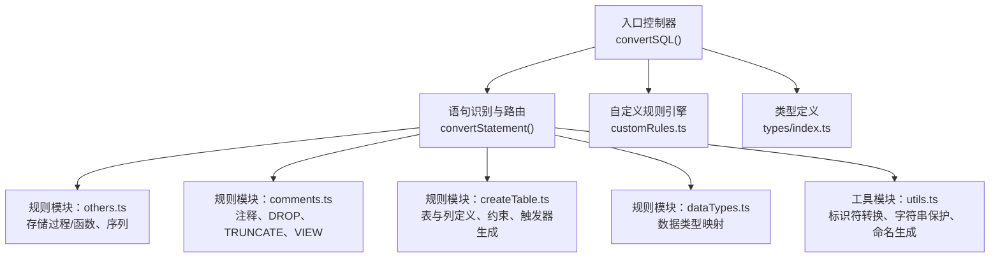
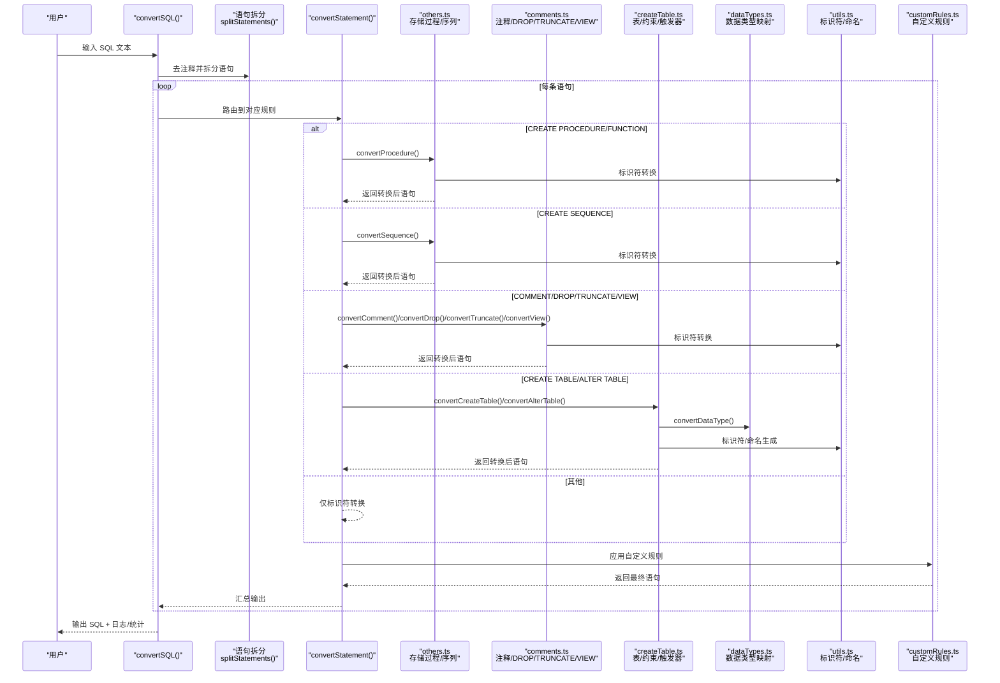
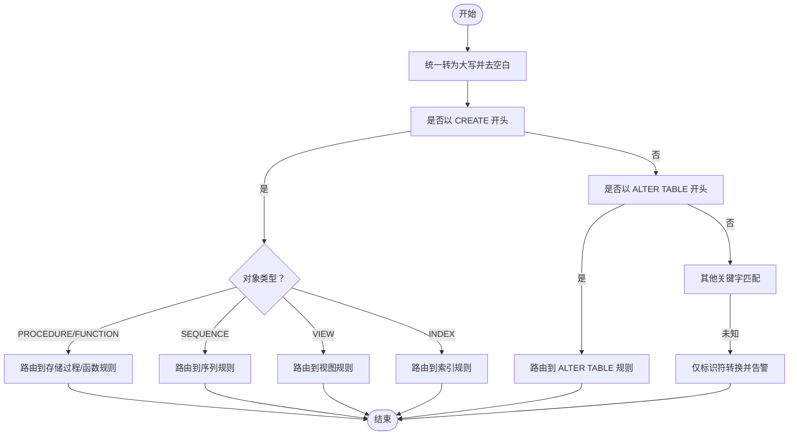
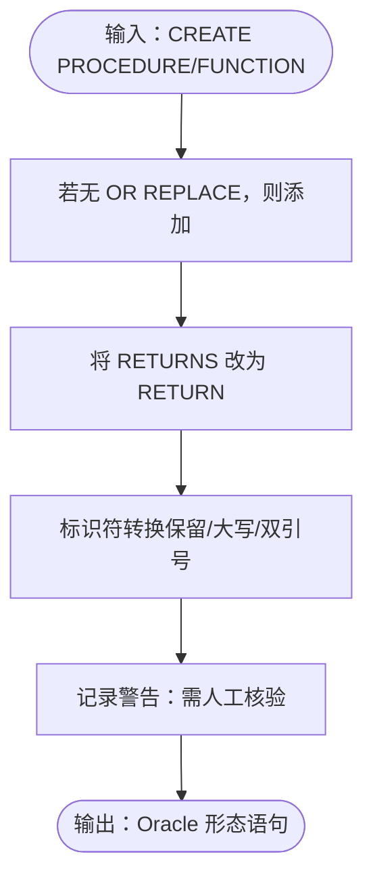
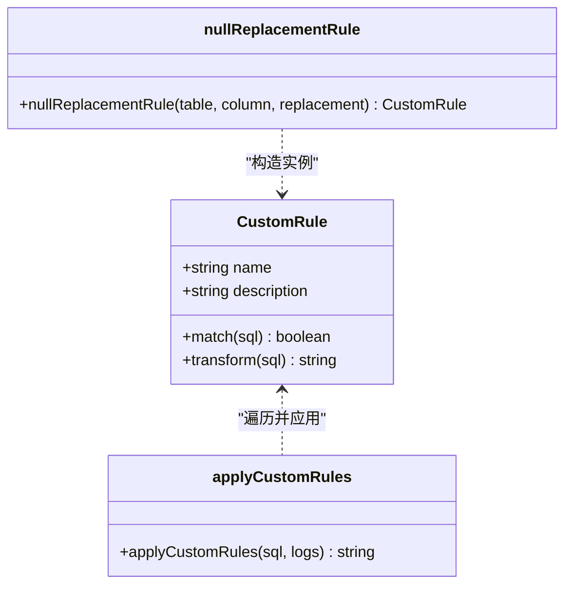
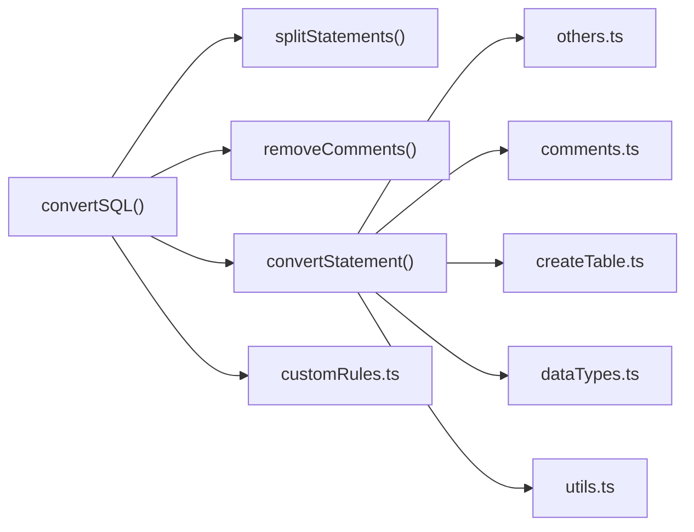

# 其他语句转换

<cite>
**本文引用的文件**
- [others.ts](file://src/converter/rules/others.ts)
- [index.ts](file://src/converter/index.ts)
- [customRules.ts](file://src/converter/customRules.ts)
- [utils.ts](file://src/converter/utils.ts)
- [comments.ts](file://src/converter/rules/comments.ts)
- [createTable.ts](file://src/converter/rules/createTable.ts)
- [dataTypes.ts](file://src/converter/rules/dataTypes.ts)
- [index.ts](file://src/types/index.ts)
- [README.md](file://README.md)
</cite>

## 目录
1. [简介](#简介)
2. [项目结构](#项目结构)
3. [核心组件](#核心组件)
4. [架构总览](#架构总览)
5. [详细组件分析](#详细组件分析)
6. [依赖关系分析](#依赖关系分析)
7. [性能考量](#性能考量)
8. [故障排查指南](#故障排查指南)
9. [结论](#结论)
10. [附录](#附录)

## 简介
本文件聚焦“其他语句转换”，系统性阐述除主要 DDL/DML 之外的 SQL 语句转换机制，涵盖存储过程/函数、触发器、视图、序列、注释、分区、索引、表级操作（DROP/TRUNCATE）等对象与语句的转换策略。文档同时说明语句类型识别算法、对象依赖处理、权限转换能力边界、限制条件与替代方案，并给出扩展新语句类型的支持机制与最佳实践。

## 项目结构
该项目采用模块化设计，核心转换逻辑集中在 src/converter 下，按功能拆分为规则模块与工具模块；类型定义位于 src/types；入口控制器负责语句分发与结果汇总。

图表来源
- [index.ts:15-54](file://src/converter/index.ts#L15-L54)
- [others.ts:1-49](file://src/converter/rules/others.ts#L1-L49)
- [comments.ts:1-53](file://src/converter/rules/comments.ts#L1-L53)
- [createTable.ts:1-380](file://src/converter/rules/createTable.ts#L1-L380)
- [dataTypes.ts:1-106](file://src/converter/rules/dataTypes.ts#L1-L106)
- [utils.ts:1-115](file://src/converter/utils.ts#L1-L115)
- [customRules.ts:1-186](file://src/converter/customRules.ts#L1-L186)
- [index.ts:1-44](file://src/types/index.ts#L1-L44)

章节来源
- [README.md:1-41](file://README.md#L1-L41)
- [index.ts:1-129](file://src/converter/index.ts#L1-L129)

## 核心组件
- 语句识别与路由：根据语句首关键字与模式匹配，将不同类型的 SQL 分派至对应规则模块。
- 规则模块：针对具体对象类型（存储过程/函数、序列、视图、注释、DROP/TRUNCATE）提供转换实现。
- 工具模块：提供标识符转换、字符串保护、命名生成（序列/触发器/索引）、注释与语句拆分等基础能力。
- 自定义规则引擎：允许用户通过 match/transform 接口扩展转换逻辑，覆盖复杂业务场景。
- 类型定义：统一日志、统计、选项与默认值，确保转换流程的一致性与可观测性。

章节来源
- [index.ts:15-54](file://src/converter/index.ts#L15-L54)
- [others.ts:1-49](file://src/converter/rules/others.ts#L1-L49)
- [comments.ts:1-53](file://src/converter/rules/comments.ts#L1-L53)
- [utils.ts:1-115](file://src/converter/utils.ts#L1-L115)
- [customRules.ts:1-186](file://src/converter/customRules.ts#L1-L186)
- [index.ts:1-44](file://src/types/index.ts#L1-L44)

## 架构总览
下图展示了从输入 SQL 到最终输出的端到端流程，包括语句拆分、类型识别、规则转换、自定义规则应用与结果汇总。

图表来源
- [index.ts:59-125](file://src/converter/index.ts#L59-L125)
- [others.ts:7-48](file://src/converter/rules/others.ts#L7-L48)
- [comments.ts:7-52](file://src/converter/rules/comments.ts#L7-L52)
- [createTable.ts:116-379](file://src/converter/rules/createTable.ts#L116-L379)
- [dataTypes.ts:61-86](file://src/converter/rules/dataTypes.ts#L61-L86)
- [utils.ts:65-115](file://src/converter/utils.ts#L65-L115)
- [customRules.ts:170-185](file://src/converter/customRules.ts#L170-L185)

## 详细组件分析

### 语句类型识别算法
- 识别策略：先统一裁剪为大写，再依据首关键字与关键词组合判断（如 CREATE INDEX、DROP INDEX、ALTER TABLE、CREATE VIEW、CREATE PROCEDURE/FUNCTION、CREATE SEQUENCE 等）。
- 未识别语句：默认仅执行标识符转换并记录警告，避免直接丢弃。
- 优点：简单稳定，易于扩展；缺点：对复杂嵌套或非标准语法支持有限。

图表来源
- [index.ts:15-54](file://src/converter/index.ts#L15-L54)

章节来源
- [index.ts:15-54](file://src/converter/index.ts#L15-L54)

### 存储过程与函数转换
- 转换范围：将 MySQL 的 CREATE PROCEDURE/FUNCTION 语句转换为 Oracle 的 CREATE OR REPLACE PROCEDURE/FUNCTION 形态；将 RETURNS 改为 RETURN；并对标识符进行大小写与引号处理。
- 限制与替代：
  - 完整语法树重写复杂度高，当前仅做简单替换并发出警告。
  - 若包含复杂参数类型、游标、异常处理等，建议人工对照 Oracle PL/SQL 语法进行二次修正。
  - 替代方案：提供模板化脚本生成器，结合注释标记进行半自动转换。

图表来源
- [others.ts:7-39](file://src/converter/rules/others.ts#L7-L39)

章节来源
- [others.ts:1-49](file://src/converter/rules/others.ts#L1-L49)

### 视图转换
- 转换范围：CREATE VIEW 与 CREATE OR REPLACE VIEW 基本一致，仅进行标识符转换。
- 适用场景：快速迁移视图定义，后续可结合物化视图或物化视图日志进行增量刷新策略调整。

章节来源
- [comments.ts:46-52](file://src/converter/rules/comments.ts#L46-L52)

### 序列转换
- 背景：MySQL 使用 AUTO_INCREMENT，Oracle 使用 SEQUENCE 或 IDENTITY。
- 转换范围：对 CREATE/ALTER/DROP SEQUENCE 语句进行标识符转换；对于 AUTO_INCREMENT 的迁移，createTable 规则会生成 SEQUENCE 与触发器或使用 IDENTITY（取决于选项）。
- 限制与替代：
  - 仅标识符转换，不生成序列/触发器（除非配合 createTable 的自动生成功能）。
  - 替代方案：在迁移脚本中补充序列与触发器生成语句。

章节来源
- [others.ts:41-48](file://src/converter/rules/others.ts#L41-L48)
- [createTable.ts:214-238](file://src/converter/rules/createTable.ts#L214-L238)

### 触发器转换
- 背景：MySQL 的 ON UPDATE CURRENT_TIMESTAMP 等行为在 Oracle 中需要触发器实现。
- 转换范围：createTable 规则在检测到相关列定义时，可自动生成 BEFORE UPDATE 触发器；若选项关闭，则记录警告并移除相关子句。
- 限制与替代：
  - 仅针对特定列的 CURRENT_TIMESTAMP 场景；复杂触发器逻辑需人工编写。
  - 替代方案：提供触发器模板与参数化生成器。

章节来源
- [createTable.ts:172-196](file://src/converter/rules/createTable.ts#L172-L196)

### 注释、DROP 与 TRUNCATE 转换
- 注释：MySQL 的 COMMENT 语法在 Oracle 中不直接支持，当前规则不做转换，保留原样。
- DROP TABLE：过滤 IF EXISTS 形式并记录提示；DROP TEMPORARY TABLE 移除 TEMPORARY 关键字。
- TRUNCATE：补全 TABLE 关键字并进行标识符转换。

章节来源
- [comments.ts:7-52](file://src/converter/rules/comments.ts#L7-L52)

### 权限转换与对象依赖处理
- 权限转换：当前规则集中未包含 GRANT/REVOKE 等 DCL 语句的转换逻辑，属于“未识别语句”范畴，仅进行标识符转换并告警。
- 对象依赖：存储过程/函数/触发器/视图等对象间依赖关系不在本规则集中处理，建议在迁移后使用数据库元数据工具进行依赖梳理与验证。

章节来源
- [index.ts:41-48](file://src/converter/index.ts#L41-L48)

### 自定义规则扩展机制
- 接口：CustomRule 包含 name、description、match、transform 四要素。
- 应用：applyCustomRules 遍历规则列表，对匹配的 SQL 执行 transform 并记录日志。
- 实战示例：
  - 插入语句中将指定表/列的 NULL 替换为指定值（如 SYSDATE）。
  - 批量配置多个表/列的 NULL 替换规则。
- 扩展建议：遵循 match 精准匹配、transform 不破坏语法、transform 结果与原 SQL 等价或更优的原则。

图表来源
- [customRules.ts:7-186](file://src/converter/customRules.ts#L7-L186)

章节来源
- [customRules.ts:1-186](file://src/converter/customRules.ts#L1-L186)

### 工具函数与命名规范
- 标识符转换：convertIdentifier 支持保留大小写（双引号包裹）与统一大写两种策略。
- 命名生成：generateSequenceName、generateTriggerName、makeUniqueIndexName 提供序列/触发器/索引的命名规范，避免冲突。
- 字符串保护：extractStringLiterals/restoreStringLiterals 用于保护 SQL 中的字符串常量，避免误改。

章节来源
- [utils.ts:8-115](file://src/converter/utils.ts#L8-L115)

## 依赖关系分析
- 控制流依赖：convertSQL 依赖 splitStatements/removeComments 进行预处理；convertStatement 作为分发器，依赖各规则模块。
- 规则模块耦合：others.ts 与 comments.ts 仅依赖 utils.ts 的标识符转换；createTable.ts 依赖 dataTypes.ts 与 utils.ts；customRules.ts 与规则模块解耦，通过 match/transform 接口集成。
- 外部依赖：无第三方 SQL 解析器，基于正则与字符串处理实现，简洁但对复杂语法支持有限。

图表来源
- [index.ts:3-10](file://src/converter/index.ts#L3-L10)
- [utils.ts:65-115](file://src/converter/utils.ts#L65-L115)
- [others.ts:1-3](file://src/converter/rules/others.ts#L1-L3)
- [comments.ts:1-2](file://src/converter/rules/comments.ts#L1-L2)
- [createTable.ts:1-3](file://src/converter/rules/createTable.ts#L1-L3)
- [dataTypes.ts:1-2](file://src/converter/rules/dataTypes.ts#L1-L2)
- [customRules.ts:1-1](file://src/converter/customRules.ts#L1-L1)

章节来源
- [index.ts:1-129](file://src/converter/index.ts#L1-L129)
- [utils.ts:1-115](file://src/converter/utils.ts#L1-L115)

## 性能考量
- 正则匹配与字符串替换：整体复杂度与语句长度成正比；对超长 SQL 文本建议分批处理或在 UI 层面限制输入长度。
- 自定义规则：每条规则都会对 SQL 进行一次扫描，规则数量过多可能影响性能；建议合并相似规则或使用更高效的匹配策略。
- 建议：对高频规则采用缓存策略（如类型映射表），减少重复计算。

## 故障排查指南
- 未识别语句：检查首关键字与关键词组合是否符合现有识别规则；必要时扩展路由分支。
- 标识符大小写问题：确认 preserveCase 选项与目标数据库要求；Oracle 默认不加引号时标识符大写。
- 触发器缺失：当 ON UPDATE CURRENT_TIMESTAMP 出现在列定义中且未生成触发器时，检查 generateTrigger 选项。
- 序列缺失：AUTO_INCREMENT 的迁移依赖 createTable 的序列/触发器生成逻辑；若未启用，需手动补充。
- 自定义规则未生效：确认 match 函数是否能正确匹配目标 SQL；transform 是否返回了新的 SQL。

章节来源
- [index.ts:41-48](file://src/converter/index.ts#L41-L48)
- [createTable.ts:172-196](file://src/converter/rules/createTable.ts#L172-L196)
- [customRules.ts:170-185](file://src/converter/customRules.ts#L170-L185)

## 结论
本项目对“其他语句转换”的覆盖以实用为主，重点解决存储过程/函数、序列、视图、注释、DROP/TRUNCATE 等常见对象与语句的迁移需求。通过语句识别算法与规则模块化设计，实现了稳定的转换流程；借助自定义规则引擎，满足了复杂业务场景的扩展需求。对于权限与复杂对象依赖等高级主题，建议结合数据库元数据工具与人工复核完成。

## 附录

### 扩展新语句类型的支持机制
- 新增规则模块：在 src/converter/rules 下创建新文件，导出转换函数。
- 扩展路由：在 convertStatement 中增加识别分支，调用新规则函数。
- 可选：在 types/index.ts 中扩展 ConverterOptions 以支持新规则的开关或参数。
- 最佳实践：保持规则函数纯函数式，输入 SQL → 输出 SQL；错误与变更通过 logs 记录；尽量复用 utils.ts 的通用能力。

章节来源
- [index.ts:15-54](file://src/converter/index.ts#L15-L54)
- [index.ts:25-43](file://src/types/index.ts#L25-L43)