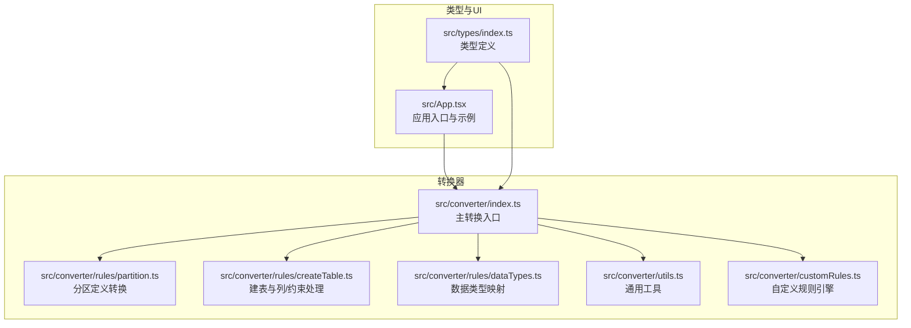
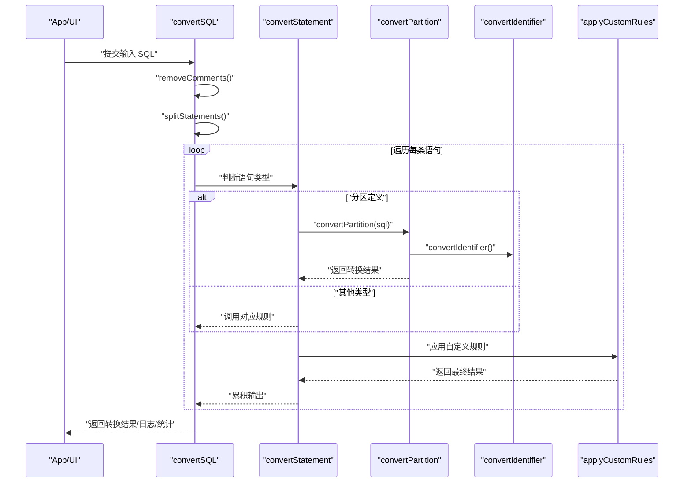
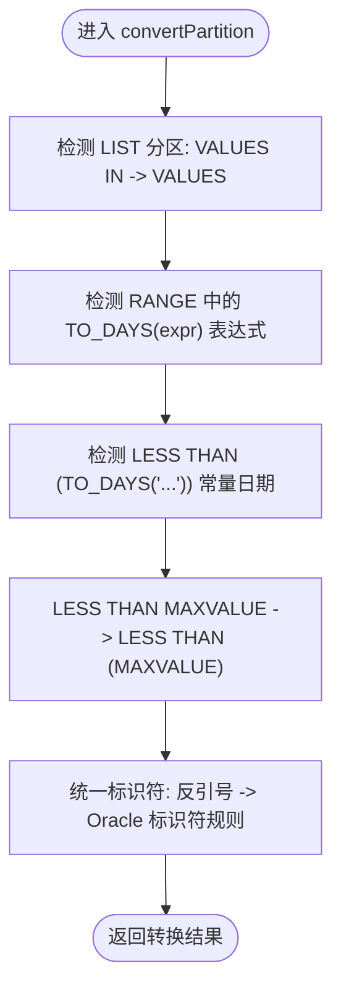
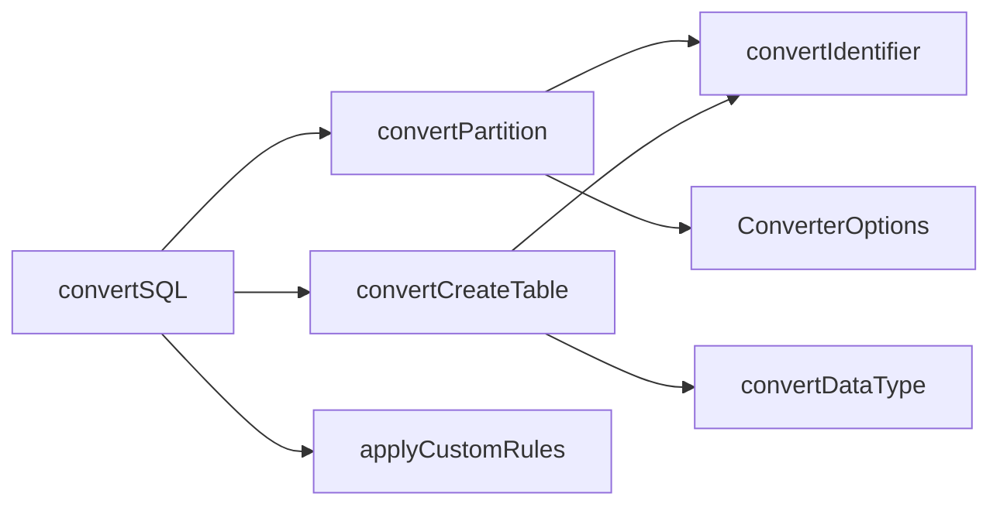

# 分区表转换

<cite>
**本文引用的文件**
- [src/converter/index.ts](file://src/converter/index.ts)
- [src/converter/rules/partition.ts](file://src/converter/rules/partition.ts)
- [src/converter/utils.ts](file://src/converter/utils.ts)
- [src/converter/rules/createTable.ts](file://src/converter/rules/createTable.ts)
- [src/converter/rules/dataTypes.ts](file://src/converter/rules/dataTypes.ts)
- [src/converter/customRules.ts](file://src/converter/customRules.ts)
- [src/types/index.ts](file://src/types/index.ts)
- [src/App.tsx](file://src/App.tsx)
- [README.md](file://README.md)
- [package.json](file://package.json)
</cite>

## 目录
1. [简介](#简介)
2. [项目结构](#项目结构)
3. [核心组件](#核心组件)
4. [架构总览](#架构总览)
5. [详细组件分析](#详细组件分析)
6. [依赖关系分析](#依赖关系分析)
7. [性能考量](#性能考量)
8. [故障排查指南](#故障排查指南)
9. [结论](#结论)
10. [附录](#附录)

## 简介
本文件面向将 MySQL 分区表迁移到 Oracle（含 OceanBase Oracle 模式）的工程实践，系统阐述分区表转换的规则、实现机制与注意事项。当前代码库对分区表的支持集中在“分区定义转换”层面，覆盖范围分区、列表分区、以及与日期函数相关的边界值处理；对于复合分区、子分区、分区维护与监控等高级特性尚未在现有实现中体现，需要通过自定义规则或后续扩展补齐。

项目定位为一个基于前端的 SQL 转换工具，提供直观的编辑器界面、可配置的转换选项、详细的转换日志与统计信息，帮助用户高效完成数据库迁移任务。

章节来源
- [README.md:1-41](file://README.md#L1-L41)

## 项目结构
- 转换器核心位于 src/converter，按职责拆分为：
  - 规则模块：createTable、partition、dataTypes、index、dml、comments、others 等
  - 工具模块：utils（标识符处理、字符串保护/还原、语句拆分、命名生成等）
  - 自定义规则：customRules（可扩展的用户规则引擎）
  - 类型定义：types（转换选项、结果、统计、日志）
- UI 层位于 src/components 与 src/App.tsx，负责输入输出、设置面板、日志与统计展示
- 包管理与脚手架：package.json

图表来源
- [src/converter/index.ts:1-129](file://src/converter/index.ts#L1-L129)
- [src/converter/rules/partition.ts:1-38](file://src/converter/rules/partition.ts#L1-L38)
- [src/converter/rules/createTable.ts:1-380](file://src/converter/rules/createTable.ts#L1-L380)
- [src/converter/rules/dataTypes.ts:1-106](file://src/converter/rules/dataTypes.ts#L1-L106)
- [src/converter/utils.ts:1-115](file://src/converter/utils.ts#L1-L115)
- [src/converter/customRules.ts:1-186](file://src/converter/customRules.ts#L1-L186)
- [src/types/index.ts:1-44](file://src/types/index.ts#L1-L44)
- [src/App.tsx:1-282](file://src/App.tsx#L1-L282)

章节来源
- [src/converter/index.ts:1-129](file://src/converter/index.ts#L1-L129)
- [src/App.tsx:1-282](file://src/App.tsx#L1-L282)

## 核心组件
- 主转换入口 convertSQL：负责语句拆分、按类型路由、错误捕获与统计汇总
- 分区转换 convertPartition：针对 MySQL 分区定义进行 Oracle 兼容化处理
- 标识符转换 convertIdentifier：统一处理反引号、大小写与保留策略
- 数据类型映射 convertDataType：为分区键表达式中的数据类型提供 Oracle 对应类型
- 自定义规则引擎 applyCustomRules：提供扩展点，满足业务定制需求

章节来源
- [src/converter/index.ts:15-54](file://src/converter/index.ts#L15-L54)
- [src/converter/rules/partition.ts:7-37](file://src/converter/rules/partition.ts#L7-L37)
- [src/converter/utils.ts:8-21](file://src/converter/utils.ts#L8-L21)
- [src/converter/rules/dataTypes.ts:61-86](file://src/converter/rules/dataTypes.ts#L61-L86)
- [src/converter/customRules.ts:170-185](file://src/converter/customRules.ts#L170-L185)

## 架构总览
转换流程从 UI 接收 SQL 文本，经注释清理与语句拆分后，按首词路由到具体规则模块；分区表转换由独立的 convertPartition 执行，随后统一应用自定义规则与标识符规范化。

图表来源
- [src/converter/index.ts:59-125](file://src/converter/index.ts#L59-L125)
- [src/converter/index.ts:15-54](file://src/converter/index.ts#L15-L54)
- [src/converter/rules/partition.ts:7-37](file://src/converter/rules/partition.ts#L7-L37)
- [src/converter/utils.ts:8-21](file://src/converter/utils.ts#L8-L21)
- [src/converter/customRules.ts:170-185](file://src/converter/customRules.ts#L170-L185)

## 详细组件分析

### 分区转换规则与实现
- 范围分区（RANGE）
  - MySQL: PARTITION BY RANGE(expr) (PARTITION p0 VALUES LESS THAN (value), ...)
  - Oracle: 基本一致，但需注意 MAXVALUE 的括号化与函数表达式兼容性
  - 实现要点：
    - 将 LESS THAN MAXVALUE 转换为 LESS THAN (MAXVALUE)
    - 将 TO_DAYS(expr) 形式的分区键表达式还原为直接日期表达式
    - 将 LESS THAN (TO_DAYS('xxx')) 转换为 LESS THAN (DATE 'xxx')

- 列表分区（LIST）
  - MySQL: VALUES IN (...)
  - Oracle: VALUES (...) 并支持 DEFAULT 子句（当前实现仅做 VALUES IN -> VALUES 的简单替换）

- 标识符处理
  - 统一将反引号包裹的标识符转换为 Oracle 标准（保留大小写或大写）
  - 通过 convertIdentifier 控制大小写与引号策略

- 日期函数兼容
  - 针对 TO_DAYS 的分区键表达式进行去函数化处理
  - 对常量日期进行 DATE 字面量转换

图表来源
- [src/converter/rules/partition.ts:18-34](file://src/converter/rules/partition.ts#L18-L34)

章节来源
- [src/converter/rules/partition.ts:7-37](file://src/converter/rules/partition.ts#L7-L37)

### 分区键处理与数据类型映射
- 分区键表达式中的数据类型由数据类型映射模块统一转换，确保 Oracle 端可接受
- 当分区键涉及数值、日期/时间、字符串等类型时，映射规则会将其转换为 Oracle 对应类型，从而保证分区定义的合法性

章节来源
- [src/converter/rules/dataTypes.ts:61-86](file://src/converter/rules/dataTypes.ts#L61-L86)

### 标识符转换与大小写策略
- convertIdentifier 负责：
  - 移除 MySQL 反引号
  - 处理大小写：默认大写；若 preserveCase 为真且包含小写字母，则用双引号包裹保留大小写
- 该策略同样应用于分区键与分区名

章节来源
- [src/converter/utils.ts:8-21](file://src/converter/utils.ts#L8-L21)

### 自定义规则与扩展点
- 自定义规则接口 CustomRule 定义了 match 与 transform 两个关键方法
- 提供 nullReplacementRule 等实用工厂函数，演示如何为特定表/列注入转换逻辑
- applyCustomRules 会在每条语句转换完成后遍历规则列表，按需执行 transform

章节来源
- [src/converter/customRules.ts:7-185](file://src/converter/customRules.ts#L7-L185)

### 路由与控制流
- convertStatement 根据首词与关键字判断语句类型，将分区定义路由至 convertPartition
- 对于未知语句，仅进行标识符转换并记录警告

章节来源
- [src/converter/index.ts:15-54](file://src/converter/index.ts#L15-L54)

### 与建表流程的关系
- 分区定义通常出现在 CREATE TABLE 语句的表尾部选项中
- createTable 负责解析列定义、约束与表尾选项，同时进行数据类型映射与标识符处理
- 分区转换在 convertPartition 中完成，二者配合确保分区键与分区边界合法

章节来源
- [src/converter/rules/createTable.ts:116-380](file://src/converter/rules/createTable.ts#L116-L380)

## 依赖关系分析
- convertPartition 依赖：
  - convertIdentifier（utils.ts）：用于标识符规范化
  - ConverterOptions（types/index.ts）：读取 preserveCase 等选项
- convertSQL 作为中枢，依赖各规则模块与工具模块
- 自定义规则引擎与转换器解耦，通过 applyCustomRules 插入

图表来源
- [src/converter/index.ts:59-125](file://src/converter/index.ts#L59-L125)
- [src/converter/rules/partition.ts:1-38](file://src/converter/rules/partition.ts#L1-L38)
- [src/converter/utils.ts:1-115](file://src/converter/utils.ts#L1-L115)
- [src/converter/rules/createTable.ts:1-380](file://src/converter/rules/createTable.ts#L1-L380)
- [src/converter/rules/dataTypes.ts:1-106](file://src/converter/rules/dataTypes.ts#L1-L106)
- [src/converter/customRules.ts:1-186](file://src/converter/customRules.ts#L1-L186)
- [src/types/index.ts:25-44](file://src/types/index.ts#L25-L44)

章节来源
- [src/converter/index.ts:1-129](file://src/converter/index.ts#L1-L129)

## 性能考量
- 正则替换与字符串扫描为主，复杂度近似 O(n)（n 为 SQL 文本长度）
- 语句拆分与注释清理采用受保护的字符串处理策略，避免误判
- 自定义规则按序遍历，建议合理组织规则顺序以减少重复扫描
- 对于超长 SQL 文本，建议分批处理或在 UI 层限制输入长度

## 故障排查指南
- 未识别语句类型
  - 现象：仅进行基本标识符转换并记录警告
  - 排查：确认 SQL 是否以 CREATE TABLE、ALTER TABLE、CREATE INDEX 等关键字开头
- 分区定义转换异常
  - 现象：LESS THAN MAXVALUE 未正确加括号、TO_DAYS 未去除、VALUES IN 未替换
  - 排查：检查分区定义语法是否符合预期模式；必要时通过自定义规则补充
- 标识符大小写问题
  - 现象：分区名或列名大小写不符合预期
  - 排查：调整 preserveCase 选项；确认是否需要双引号保留大小写
- 自定义规则未生效
  - 现象：期望的转换未发生
  - 排查：确认规则的 match 条件是否匹配；检查 transform 是否返回新文本

章节来源
- [src/converter/index.ts:43-48](file://src/converter/index.ts#L43-L48)
- [src/converter/rules/partition.ts:18-34](file://src/converter/rules/partition.ts#L18-L34)
- [src/converter/customRules.ts:170-185](file://src/converter/customRules.ts#L170-L185)

## 结论
当前实现提供了 MySQL 到 Oracle 分区表的基础转换能力，重点覆盖：
- LIST 分区 VALUES IN -> VALUES 的简单替换
- RANGE 分区中 TO_DAYS 表达式与常量日期的兼容处理
- MAXVALUE 的括号化与标识符规范化

对于复合分区、子分区、分区维护（ADD/PARTITION、COALESCE PARTITION、REORGANIZE PARTITION）、分区监控与管理等功能，代码库尚未提供内置支持，建议通过自定义规则或后续扩展补齐。

## 附录

### 分区类型与转换要点对照
- 范围分区（RANGE）
  - MySQL: PARTITION BY RANGE(expr) (PARTITION p0 VALUES LESS THAN (value), ...)
  - Oracle: 基本一致；注意 MAXVALUE 与函数表达式兼容
  - 当前实现：LESS THAN MAXVALUE -> LESS THAN (MAXVALUE)；TO_DAYS(expr) 去函数化；常量日期 DATE 化

- 列表分区（LIST）
  - MySQL: VALUES IN (...)
  - Oracle: VALUES (...) + 支持 DEFAULT
  - 当前实现：VALUES IN -> VALUES

- 哈希分区（HASH）
  - 当前未提供专门转换逻辑，需通过自定义规则扩展

- 复合分区（COMPOSITE）
  - 当前未提供专门转换逻辑，需通过自定义规则扩展

章节来源
- [src/converter/rules/partition.ts:8-34](file://src/converter/rules/partition.ts#L8-L34)

### 高级特性与替代方案
- 复合分区与子分区
  - 现状：未内置支持
  - 建议：通过自定义规则对复合分区语法进行拆解与重写
- 分区维护操作（ADD/PARTITION、REORGANIZE、COALESCE）
  - 现状：未内置支持
  - 建议：通过自定义规则映射为 Oracle 等价 DDL 或提示人工处理
- 分区监控与管理
  - 现状：未内置支持
  - 建议：结合自定义规则输出注释或辅助脚本，提示后续手工验证

章节来源
- [src/converter/customRules.ts:137-165](file://src/converter/customRules.ts#L137-L165)

### 最佳实践与性能优化建议
- 在 UI 设置中开启“保留原始大小写”，确保分区名与列名符合团队规范
- 对于大量分区的表，建议分批导入与转换，避免一次性处理超长 SQL 导致内存压力
- 使用自定义规则集中处理业务特例，减少重复工作
- 对于复杂分区键表达式，建议先在 Oracle 环境验证表达式合法性后再进行转换

章节来源
- [src/App.tsx:41-99](file://src/App.tsx#L41-L99)
- [src/converter/customRules.ts:170-185](file://src/converter/customRules.ts#L170-L185)