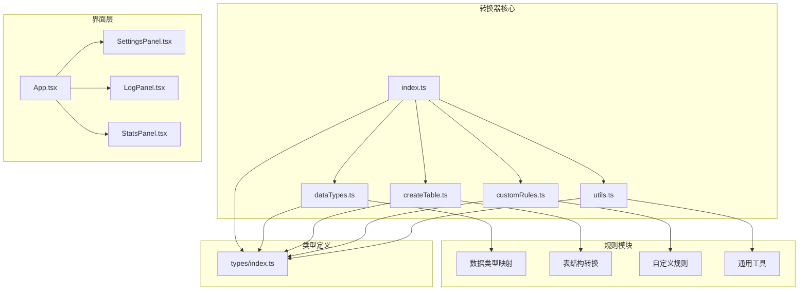
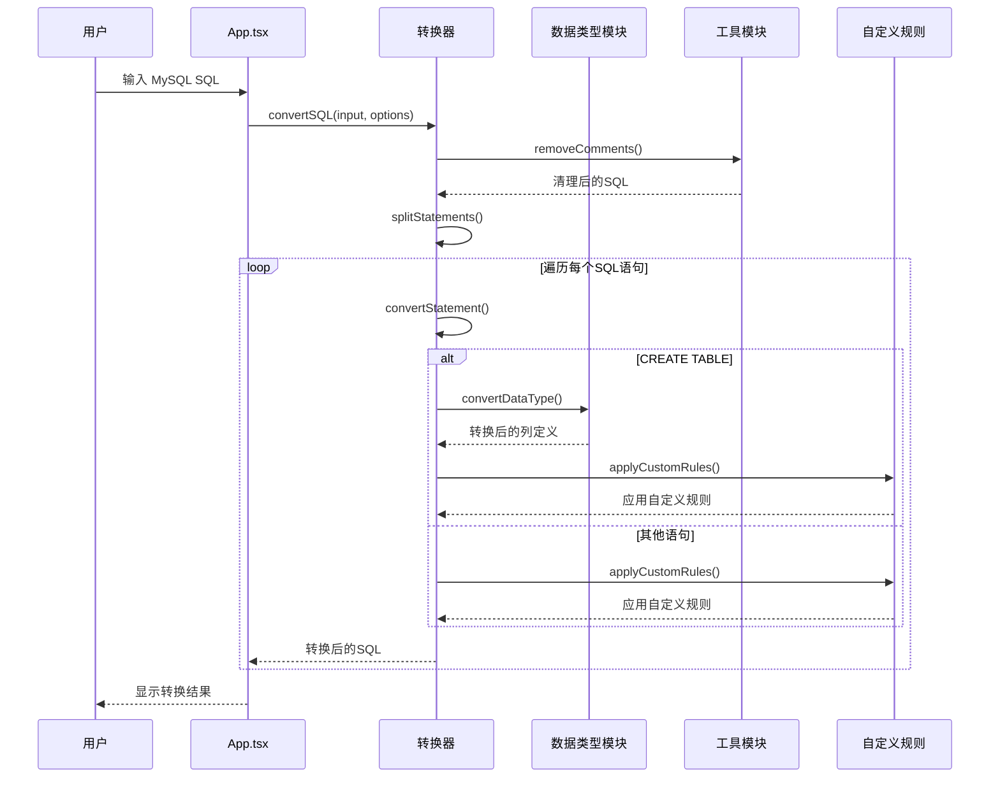
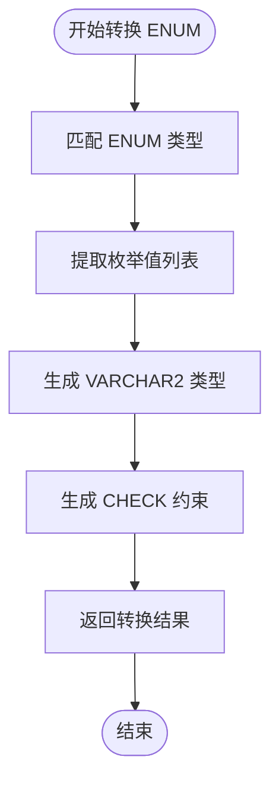
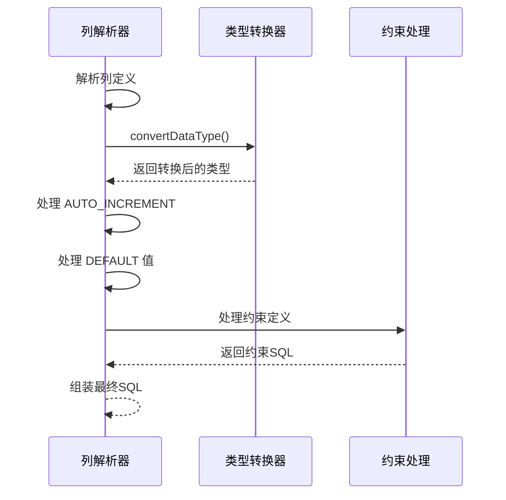
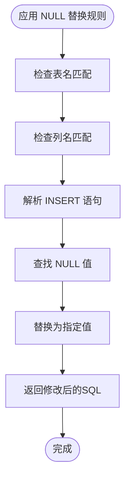
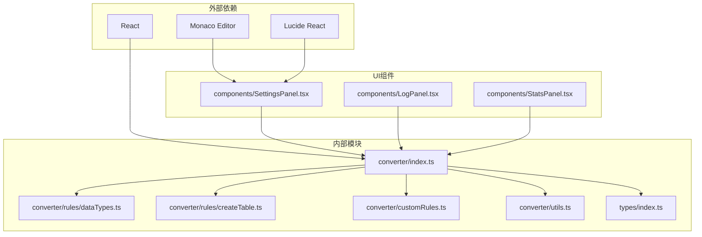

# 数据类型转换

<cite>
**本文档引用的文件**
- [dataTypes.ts](file://src/converter/rules/dataTypes.ts)
- [createTable.ts](file://src/converter/rules/createTable.ts)
- [index.ts](file://src/converter/index.ts)
- [customRules.ts](file://src/converter/customRules.ts)
- [utils.ts](file://src/converter/utils.ts)
- [others.ts](file://src/converter/rules/others.ts)
- [types/index.ts](file://src/types/index.ts)
- [App.tsx](file://src/App.tsx)
- [SettingsPanel.tsx](file://src/components/SettingsPanel.tsx)
</cite>

## 目录
1. [简介](#简介)
2. [项目结构](#项目结构)
3. [核心组件](#核心组件)
4. [架构概览](#架构概览)
5. [详细组件分析](#详细组件分析)
6. [依赖关系分析](#依赖关系分析)
7. [性能考虑](#性能考虑)
8. [故障排除指南](#故障排除指南)
9. [结论](#结论)

## 简介

本项目是一个专门用于将 MySQL SQL 语句转换为 Oracle 兼容 SQL 的工具。本文档重点关注数据类型转换功能，详细说明了 MySQL 到 Oracle 的数据类型映射规则、转换算法实现、性能优化策略以及 Oracle 兼容性注意事项。

该项目采用现代化的前端技术栈，基于 React + TypeScript + Vite 构建，提供了直观的图形界面和强大的 SQL 转换能力。

## 项目结构

项目采用模块化设计，主要分为以下几个核心模块：



**图表来源**
- [index.ts:1-129](file://src/converter/index.ts#L1-L129)
- [dataTypes.ts:1-106](file://src/converter/rules/dataTypes.ts#L1-L106)
- [createTable.ts:1-380](file://src/converter/rules/createTable.ts#L1-L380)

**章节来源**
- [index.ts:1-129](file://src/converter/index.ts#L1-L129)
- [dataTypes.ts:1-106](file://src/converter/rules/dataTypes.ts#L1-L106)
- [createTable.ts:1-380](file://src/converter/rules/createTable.ts#L1-L380)

## 核心组件

### 数据类型映射表

数据类型转换的核心是 TYPE_MAP 映射表，它定义了 MySQL 数据类型到 Oracle 数据类型的精确映射关系。该映射表采用键值对形式，其中键为 MySQL 数据类型名称，值可以是字符串（直接映射）或函数（动态映射）。

### 转换算法

转换算法采用正则表达式匹配的方式，按照类型名称长度降序排列进行匹配，确保更精确的类型识别。对于带参数的类型（如 DECIMAL(M,D)），通过回调函数处理参数传递。

### 参数处理机制

系统支持两种参数处理方式：
1. **静态映射**：直接返回预定义的 Oracle 类型
2. **动态映射**：通过回调函数接收 MySQL 参数并生成相应的 Oracle 类型

**章节来源**
- [dataTypes.ts:6-56](file://src/converter/rules/dataTypes.ts#L6-L56)
- [dataTypes.ts:61-86](file://src/converter/rules/dataTypes.ts#L61-L86)

## 架构概览



**图表来源**
- [index.ts:59-125](file://src/converter/index.ts#L59-L125)
- [dataTypes.ts:61-86](file://src/converter/rules/dataTypes.ts#L61-L86)
- [customRules.ts:170-185](file://src/converter/customRules.ts#L170-L185)

## 详细组件分析

### 数据类型映射表设计原理

#### 整数类型映射

MySQL 的整数类型在 Oracle 中统一映射为 NUMBER 类型，但根据精度范围设置了不同的精度值：

| MySQL 类型 | Oracle 类型 | 精度范围 | 设计考虑 |
|------------|-------------|----------|----------|
| TINYINT | NUMBER(3) | -128 到 127 | 最小整数范围 |
| SMALLINT | NUMBER(5) | -32,768 到 32,767 | 小整数范围 |
| MEDIUMINT | NUMBER(7) | -8,388,608 到 8,388,607 | 中等整数范围 |
| INT | NUMBER(10) | -2,147,483,648 到 2,147,483,647 | 标准整数范围 |
| INTEGER | NUMBER(10) | 同上 | 同义词 |
| BIGINT | NUMBER(19) | -9,223,372,036,854,775,808 到 9,223,372,036,854,775,807 | 大整数范围 |

设计原理：Oracle 的 NUMBER 类型具有可变精度特性，通过设置合适的精度值来确保数据完整性。

#### 浮点类型映射

| MySQL 类型 | Oracle 类型 | 精度说明 |
|------------|-------------|----------|
| FLOAT | FLOAT | 单精度浮点数 |
| DOUBLE | DOUBLE PRECISION | 双精度浮点数 |
| REAL | FLOAT | 实数类型 |

注意：MySQL 的 FLOAT 和 REAL 在 Oracle 中都映射为 FLOAT 类型，因为 Oracle 的 FLOAT 实际上是 DOUBLE PRECISION 的别名。

#### 定点数类型映射

| MySQL 类型 | Oracle 类型 | 参数处理 |
|------------|-------------|----------|
| DECIMAL(M,D) | NUMBER(M,D) | 保持精度和标度 |
| NUMERIC(M,D) | NUMBER(M,D) | 与 DECIMAL 相同 |

DECIMAL 和 NUMERIC 在 Oracle 中都映射为 NUMBER 类型，参数 M（总位数）和 D（小数位数）保持不变。

#### 字符串类型映射

| MySQL 类型 | Oracle 类型 | 处理策略 |
|------------|-------------|----------|
| CHAR(M) | CHAR(M) | 保持固定长度 |
| VARCHAR(M) | VARCHAR2(M) | 使用 VARCHAR2 替代 VARCHAR |
| TINYTEXT | CLOB | 文本过长时使用 CLOB |
| TEXT | CLOB | 同上 |
| MEDIUMTEXT | CLOB | 同上 |
| LONGTEXT | CLOB | 同上 |

Oracle 区分 CHAR 和 VARCHAR2，VARCHAR2 是推荐的可变长度字符串类型。

#### 二进制类型映射

| MySQL 类型 | Oracle 类型 | 处理策略 |
|------------|-------------|----------|
| BINARY(M) | RAW(M) | 使用 RAW 替代 BINARY |
| VARBINARY(M) | RAW(M) | 使用 RAW 替代 VARBINARY |
| TINYBLOB | BLOB | 二进制大对象 |
| BLOB | BLOB | 同上 |
| MEDIUMBLOB | BLOB | 同上 |
| LONGBLOB | BLOB | 同上 |

Oracle 使用 RAW 类型表示二进制数据，BLOB 用于大对象存储。

#### 日期时间类型映射

| MySQL 类型 | Oracle 类型 | 参数处理 |
|------------|-------------|----------|
| DATE | DATE | 固定日期格式 |
| DATETIME(M) | TIMESTAMP(M) 或 DATE | 有精度参数时使用 TIMESTAMP |
| TIMESTAMP(M) | TIMESTAMP(M) 或 TIMESTAMP | 有精度参数时使用 TIMESTAMP |
| TIME | INTERVAL DAY TO SECOND | 时间间隔类型 |
| YEAR | NUMBER(4) | 年份数值 |

Oracle 的 TIMESTAMP 类型支持纳秒精度，而 MySQL 的 DATETIME 和 TIMESTAMP 在没有精度参数时映射为 DATE。

#### 其他类型映射

| MySQL 类型 | Oracle 类型 | 特殊处理 |
|------------|-------------|----------|
| BOOLEAN | NUMBER(1) | 0/1 布尔值 |
| BOOL | NUMBER(1) | 同上 |
| JSON | CLOB | JSON 数据存储 |
| ENUM | VARCHAR2(255) | 需要额外的 CHECK 约束 |
| SET | VARCHAR2(255) | 集合类型 |

ENUM 和 SET 类型在 Oracle 中需要额外的 CHECK 约束来限制有效值。

### 转换算法实现细节

#### 正则表达式匹配策略

转换算法使用正则表达式进行精确匹配，采用以下策略：

1. **优先级排序**：按类型名称长度降序排列，确保精确匹配
2. **边界检测**：使用单词边界 `\b` 确保完整类型匹配
3. **参数捕获**：使用括号捕获类型参数部分

#### 参数处理机制

对于带参数的类型，系统通过回调函数处理参数传递：

```typescript
// DECIMAL/MUMERIC 的处理
'DECIMAL': (_m: string, args?: string) => args ? `NUMBER${args}` : 'NUMBER',
'NUMERIC': (_m: string, args?: string) => args ? `NUMBER${args}` : 'NUMBER',
```

#### ENUM 类型特殊处理

ENUM 类型转换包含两个步骤：
1. **类型转换**：将 ENUM 映射为 VARCHAR2(255)
2. **约束生成**：自动生成对应的 CHECK 约束



**图表来源**
- [dataTypes.ts:91-105](file://src/converter/rules/dataTypes.ts#L91-L105)

**章节来源**
- [dataTypes.ts:61-86](file://src/converter/rules/dataTypes.ts#L61-L86)
- [dataTypes.ts:91-105](file://src/converter/rules/dataTypes.ts#L91-L105)

### CREATE TABLE 语句中的数据类型转换

在 CREATE TABLE 语句中，数据类型转换集成到列定义解析过程中：



**图表来源**
- [createTable.ts:168-255](file://src/converter/rules/createTable.ts#L168-L255)

**章节来源**
- [createTable.ts:168-255](file://src/converter/rules/createTable.ts#L168-L255)

### 自定义规则扩展

系统提供了灵活的自定义规则机制，允许用户扩展特定的转换需求：

#### NULL 值替换规则



**图表来源**
- [customRules.ts:170-185](file://src/converter/customRules.ts#L170-L185)

**章节来源**
- [customRules.ts:170-185](file://src/converter/customRules.ts#L170-L185)

## 依赖关系分析



**图表来源**
- [index.ts:1-129](file://src/converter/index.ts#L1-L129)
- [dataTypes.ts:1-106](file://src/converter/rules/dataTypes.ts#L1-L106)
- [createTable.ts:1-380](file://src/converter/rules/createTable.ts#L1-L380)

**章节来源**
- [index.ts:1-129](file://src/converter/index.ts#L1-L129)
- [types/index.ts:1-44](file://src/types/index.ts#L1-L44)

## 性能考虑

### 算法复杂度分析

1. **时间复杂度**：O(n*m*k)，其中 n 是类型数量，m 是 SQL 语句长度，k 是匹配次数
2. **空间复杂度**：O(m) 用于存储中间结果

### 优化策略

1. **类型匹配优化**：按类型名称长度降序排列，提高匹配效率
2. **正则表达式缓存**：避免重复编译相同的正则表达式
3. **增量转换**：只转换必要的部分，避免全量扫描

### 内存管理

- 使用流式处理避免大文件内存溢出
- 及时清理临时变量和中间结果
- 合理使用字符串拼接操作

## 故障排除指南

### 常见问题及解决方案

#### 类型转换不准确

**问题**：某些 MySQL 特定类型无法正确转换
**解决方案**：
1. 检查 TYPE_MAP 中是否存在对应的映射
2. 考虑添加自定义规则
3. 验证输入 SQL 的语法正确性

#### ENUM 转换后约束缺失

**问题**：ENUM 类型转换后缺少 CHECK 约束
**解决方案**：
1. 确认列定义中包含 ENUM 值列表
2. 检查 extractEnumConstraint 函数的执行
3. 手动添加相应的约束定义

#### 自定义规则冲突

**问题**：多个自定义规则同时作用导致转换异常
**解决方案**：
1. 检查规则的匹配条件
2. 调整规则的应用顺序
3. 简化复杂的规则逻辑

**章节来源**
- [dataTypes.ts:88-105](file://src/converter/rules/dataTypes.ts#L88-L105)
- [customRules.ts:170-185](file://src/converter/customRules.ts#L170-L185)

## 结论

本项目提供了完整的 MySQL 到 Oracle 数据类型转换解决方案，具有以下特点：

### 技术优势

1. **精确映射**：针对每种数据类型提供精确的 Oracle 对应类型
2. **参数保持**：正确处理带参数的数据类型，保持精度和范围
3. **扩展性强**：支持自定义规则，满足特殊业务需求
4. **用户友好**：提供直观的图形界面和详细的转换日志

### Oracle 兼容性

- 完整支持 Oracle 12c 及以上版本特性
- 自动处理 Oracle 不支持的 MySQL 特性
- 提供必要的约束和触发器生成
- 支持多种 Oracle 数据类型选择

### 使用建议

1. **测试验证**：转换后务必进行数据库测试验证
2. **备份数据**：转换前做好数据备份
3. **逐步迁移**：建议分阶段进行数据迁移
4. **性能调优**：根据实际数据量调整转换参数

该工具为 MySQL 到 Oracle 的数据迁移提供了可靠的自动化解决方案，大大简化了数据库迁移过程中的数据类型转换工作。