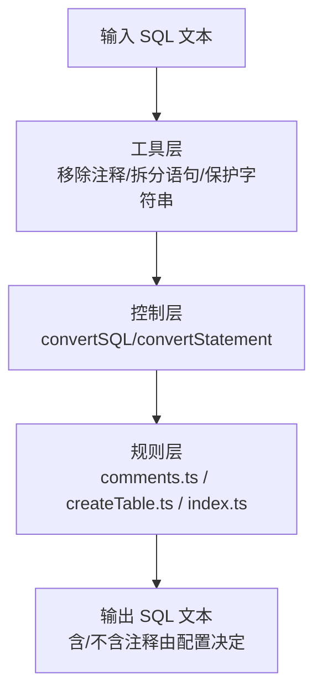
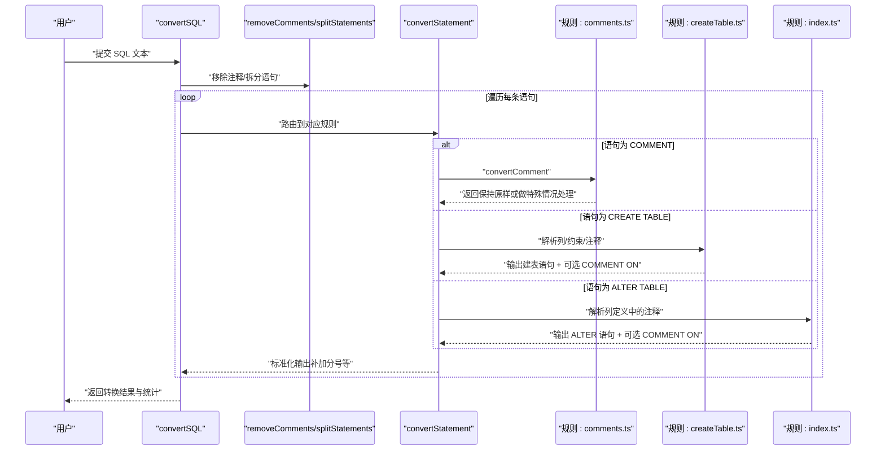
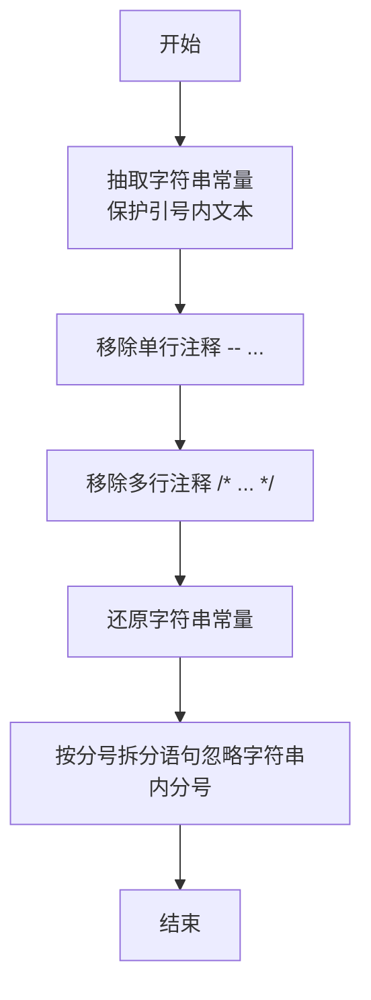
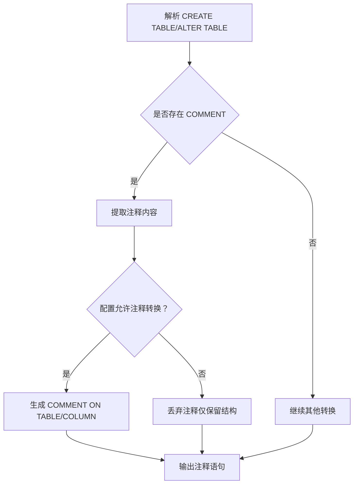
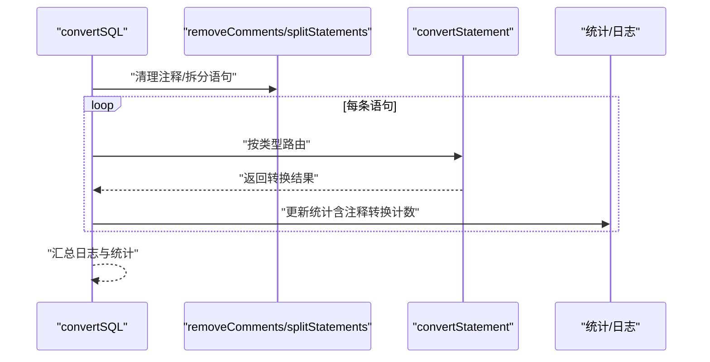
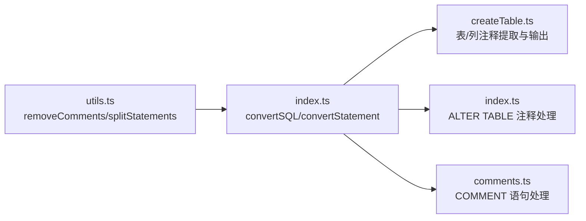

# 注释处理

<cite>
**本文引用的文件**
- [src/converter/utils.ts](file://src/converter/utils.ts)
- [src/converter/index.ts](file://src/converter/index.ts)
- [src/converter/rules/comments.ts](file://src/converter/rules/comments.ts)
- [src/converter/rules/createTable.ts](file://src/converter/rules/createTable.ts)
- [src/converter/rules/index.ts](file://src/converter/rules/index.ts)
- [src/types/index.ts](file://src/types/index.ts)
- [src/components/SettingsPanel.tsx](file://src/components/SettingsPanel.tsx)
- [README.md](file://README.md)
</cite>

## 目录
1. [简介](#简介)
2. [项目结构](#项目结构)
3. [核心组件](#核心组件)
4. [架构总览](#架构总览)
5. [详细组件分析](#详细组件分析)
6. [依赖关系分析](#依赖关系分析)
7. [性能考量](#性能考量)
8. [故障排查指南](#故障排查指南)
9. [结论](#结论)
10. [附录](#附录)

## 简介
本文件系统化阐述 SQL 语句中注释的识别、提取与转换机制，覆盖以下范围：
- 单行注释（-- 注释）
- 多行注释（/* 注释 */）
- 表级注释（CREATE TABLE ... COMMENT '...'）
- 列级注释（CREATE TABLE / ALTER TABLE ... COMMENT '...'）
- 注释位置处理、注释内容保留、注释格式转换
- 注释处理对 SQL 结构的影响与注意事项
- 注释转换的性能考虑与优化策略

本工具面向 MySQL → Oracle 的迁移场景，提供可配置的注释转换开关，确保在目标数据库（如 OceanBase Oracle 模式）中具备等价的注释表达。

## 项目结构
围绕注释处理的关键模块如下：
- 工具层：通用注释移除、语句拆分、字符串保护与还原
- 规则层：针对 COMMENT 语句、CREATE TABLE、ALTER TABLE 的注释提取与转换
- 控制层：主转换流程，按语句类型路由到对应规则
- 配置与 UI：注释转换开关与统计指标

图表来源
- [src/converter/utils.ts:50-72](file://src/converter/utils.ts#L50-L72)
- [src/converter/index.ts:59-125](file://src/converter/index.ts#L59-L125)
- [src/converter/rules/comments.ts:7-11](file://src/converter/rules/comments.ts#L7-L11)
- [src/converter/rules/createTable.ts:334-356](file://src/converter/rules/createTable.ts#L334-L356)
- [src/converter/rules/index.ts:63-69](file://src/converter/rules/index.ts#L63-L69)

章节来源
- [README.md:15-31](file://README.md#L15-L31)
- [src/converter/utils.ts:50-72](file://src/converter/utils.ts#L50-L72)
- [src/converter/index.ts:59-125](file://src/converter/index.ts#L59-L125)

## 核心组件
- 注释移除与保护
  - 在处理任何语句前，先通过字符串保护机制将 SQL 中的字符串常量抽取出来，再执行注释移除，最后还原字符串，从而避免误删注释中的引号或字符。
  - 采用正则分别匹配单行注释与多行注释，并在保护阶段避免误伤。
- 语句拆分
  - 在保护字符串后按分号拆分语句，确保每个语句独立转换。
- 注释转换开关
  - 通过配置项控制是否生成 Oracle 风格的 COMMENT ON TABLE/COLUMN 语句。
- 注释收集与输出
  - 在解析列定义与表尾部时提取注释，按配置决定是否输出 COMMENT ON 语句；表级注释优先输出，列级注释随后输出。

章节来源
- [src/converter/utils.ts:33-47](file://src/converter/utils.ts#L33-L47)
- [src/converter/utils.ts:52-60](file://src/converter/utils.ts#L52-L60)
- [src/converter/utils.ts:65-72](file://src/converter/utils.ts#L65-L72)
- [src/converter/index.ts:79-81](file://src/converter/index.ts#L79-L81)
- [src/converter/index.ts:115-117](file://src/converter/index.ts#L115-L117)
- [src/types/index.ts:25-43](file://src/types/index.ts#L25-L43)
- [src/components/SettingsPanel.tsx:78-83](file://src/components/SettingsPanel.tsx#L78-L83)

## 架构总览
下图展示注释处理在整体转换流程中的位置与作用：

图表来源
- [src/converter/index.ts:59-125](file://src/converter/index.ts#L59-L125)
- [src/converter/utils.ts:52-72](file://src/converter/utils.ts#L52-L72)
- [src/converter/rules/comments.ts:7-11](file://src/converter/rules/comments.ts#L7-L11)
- [src/converter/rules/createTable.ts:116-379](file://src/converter/rules/createTable.ts#L116-L379)
- [src/converter/rules/index.ts:46-69](file://src/converter/rules/index.ts#L46-L69)

## 详细组件分析

### 注释识别与提取（工具层）
- 字符串保护与还原
  - 在执行注释移除前，先抽取 SQL 中的字符串常量，用占位符替换，避免注释误判为字符串内容。
  - 注释移除后再将占位符还原为原始字符串，确保注释处理不影响 SQL 语义。
- 注释移除
  - 单行注释：匹配 -- 开头至行尾的内容并删除。
  - 多行注释：匹配 /* ... */ 并删除。
- 语句拆分
  - 在保护字符串后按分号拆分，忽略字符串内部的分号，确保每条语句独立转换。

图表来源
- [src/converter/utils.ts:33-47](file://src/converter/utils.ts#L33-L47)
- [src/converter/utils.ts:52-60](file://src/converter/utils.ts#L52-L60)
- [src/converter/utils.ts:65-72](file://src/converter/utils.ts#L65-L72)

章节来源
- [src/converter/utils.ts:33-47](file://src/converter/utils.ts#L33-L47)
- [src/converter/utils.ts:52-60](file://src/converter/utils.ts#L52-L60)
- [src/converter/utils.ts:65-72](file://src/converter/utils.ts#L65-L72)

### 注释转换规则（规则层）
- COMMENT 语句
  - 当输入为独立的 COMMENT 语句时，当前实现保持原样，不做额外转换。若未来需要支持 COMMENT ON 语法，可在该函数中扩展。
- 表级注释
  - 在解析 CREATE TABLE 时，从表尾部提取 COMMENT '...'，并在配置允许的情况下生成 COMMENT ON TABLE 语句；表级注释优先输出。
- 列级注释
  - 在解析列定义时，从列定义中提取 COMMENT '...'，并在配置允许的情况下生成 COMMENT ON COLUMN 语句；列级注释随后输出。
- ALTER TABLE 列注释
  - 在 ALTER TABLE 的 ADD COLUMN 或修改列定义时，同样提取列注释并生成 COMMENT ON COLUMN 语句。

图表来源
- [src/converter/rules/createTable.ts:85-107](file://src/converter/rules/createTable.ts#L85-L107)
- [src/converter/rules/createTable.ts:251-254](file://src/converter/rules/createTable.ts#L251-L254)
- [src/converter/rules/createTable.ts:334-339](file://src/converter/rules/createTable.ts#L334-L339)
- [src/converter/rules/index.ts:63-69](file://src/converter/rules/index.ts#L63-L69)

章节来源
- [src/converter/rules/comments.ts:7-11](file://src/converter/rules/comments.ts#L7-L11)
- [src/converter/rules/createTable.ts:85-107](file://src/converter/rules/createTable.ts#L85-L107)
- [src/converter/rules/createTable.ts:251-254](file://src/converter/rules/createTable.ts#L251-L254)
- [src/converter/rules/createTable.ts:334-339](file://src/converter/rules/createTable.ts#L334-L339)
- [src/converter/rules/index.ts:63-69](file://src/converter/rules/index.ts#L63-L69)

### 控制流与统计（控制层）
- 主转换入口
  - 先移除注释并拆分语句，再逐条路由到对应规则函数。
- 统计与日志
  - 在转换过程中统计注释转换次数（commentConversions），用于评估注释覆盖率与影响。

图表来源
- [src/converter/index.ts:59-125](file://src/converter/index.ts#L59-L125)

章节来源
- [src/converter/index.ts:59-125](file://src/converter/index.ts#L59-L125)

### 配置与 UI（设置面板）
- 注释转换开关
  - 设置面板提供“转换表注释”选项，勾选后启用 COMMENT ON TABLE/COLUMN 的生成。
- 默认行为
  - 默认开启注释转换，确保迁移后保留元数据注释。

章节来源
- [src/components/SettingsPanel.tsx:78-83](file://src/components/SettingsPanel.tsx#L78-L83)
- [src/types/index.ts:35-43](file://src/types/index.ts#L35-L43)

## 依赖关系分析
- 工具层依赖
  - 注释移除依赖字符串保护与还原，确保注释处理的正确性。
- 规则层依赖
  - CREATE TABLE/ALTER TABLE 依赖注释提取逻辑，生成 COMMENT ON 语句。
  - COMMENTS 规则当前不改变 COMMENT 语句，作为占位以便后续扩展。
- 控制层依赖
  - convertSQL 依赖工具层与各规则层，负责统一调度与统计。

图表来源
- [src/converter/utils.ts:52-72](file://src/converter/utils.ts#L52-L72)
- [src/converter/index.ts:59-125](file://src/converter/index.ts#L59-L125)
- [src/converter/rules/createTable.ts:116-379](file://src/converter/rules/createTable.ts#L116-L379)
- [src/converter/rules/index.ts:46-69](file://src/converter/rules/index.ts#L46-L69)
- [src/converter/rules/comments.ts:7-11](file://src/converter/rules/comments.ts#L7-L11)

章节来源
- [src/converter/utils.ts:52-72](file://src/converter/utils.ts#L52-L72)
- [src/converter/index.ts:59-125](file://src/converter/index.ts#L59-L125)
- [src/converter/rules/createTable.ts:116-379](file://src/converter/rules/createTable.ts#L116-L379)
- [src/converter/rules/index.ts:46-69](file://src/converter/rules/index.ts#L46-L69)
- [src/converter/rules/comments.ts:7-11](file://src/converter/rules/comments.ts#L7-L11)

## 性能考量
- 正则复杂度
  - 注释移除与字符串保护均使用全局正则，时间复杂度近似 O(n)（n 为 SQL 字符数），空间复杂度受字符串数量与长度影响。
- 字符串保护策略
  - 通过占位符机制避免重复扫描，减少回溯成本；注意占位符冲突风险（当前实现使用唯一占位模式，冲突概率低）。
- 语句拆分
  - 拆分时同样保护字符串，避免误拆；对超长 SQL，建议分批处理以降低内存峰值。
- 规则执行
  - COMMENT 语句直接返回，开销极小；CREATE TABLE/ALTER TABLE 的注释提取在解析阶段完成，避免重复扫描。
- 优化建议
  - 对超大脚本，可考虑分段处理与流式输出，减少一次性内存占用。
  - 若注释密度较高，可预先进行注释统计与采样，辅助判断是否启用注释转换以平衡性能与收益。

## 故障排查指南
- 注释未生效
  - 检查设置面板的“转换表注释”是否开启。
  - 确认输入是否为 Oracle 支持的 COMMENT ON 语法（表级/列级）。
- 注释丢失
  - 若未开启注释转换，工具将仅移除注释而不生成 COMMENT ON。
  - 检查是否为独立的 COMMENT 语句（当前实现保持原样，不会生成 COMMENT ON）。
- 注释格式异常
  - 确保注释内容中未包含未转义的引号；工具已通过字符串保护规避大多数情况。
- 统计与日志
  - 查看转换统计中的 commentConversions 计数，确认注释转换是否被计入。

章节来源
- [src/components/SettingsPanel.tsx:78-83](file://src/components/SettingsPanel.tsx#L78-L83)
- [src/converter/index.ts:115-117](file://src/converter/index.ts#L115-L117)
- [src/converter/rules/comments.ts:7-11](file://src/converter/rules/comments.ts#L7-L11)

## 结论
本工具通过“字符串保护 + 注释移除 + 语句拆分”的组合策略，确保注释处理的准确性与稳定性。对于 MySQL 的 COMMENT 语法，当前实现以保留为主；对于表级与列级注释，工具在解析阶段提取并按配置生成 Oracle 的 COMMENT ON 语句，满足迁移后的元数据一致性需求。结合可配置的开关与统计指标，用户可灵活控制注释转换行为并评估其影响。

## 附录

### 注释语法差异与转换示例（说明性）
- MySQL 表级注释
  - 输入：CREATE TABLE ... COMMENT '表注释'
  - 输出（开启注释转换）：COMMENT ON TABLE ... IS '表注释'
- MySQL 列级注释
  - 输入：CREATE TABLE (...) COMMENT '列注释'
  - 输出（开启注释转换）：COMMENT ON COLUMN ... IS '列注释'
- 独立 COMMENT 语句
  - 输入：COMMENT '说明'
  - 当前行为：保持原样（不生成 COMMENT ON）

章节来源
- [src/converter/rules/createTable.ts:251-254](file://src/converter/rules/createTable.ts#L251-L254)
- [src/converter/rules/createTable.ts:334-339](file://src/converter/rules/createTable.ts#L334-L339)
- [src/converter/rules/comments.ts:7-11](file://src/converter/rules/comments.ts#L7-L11)