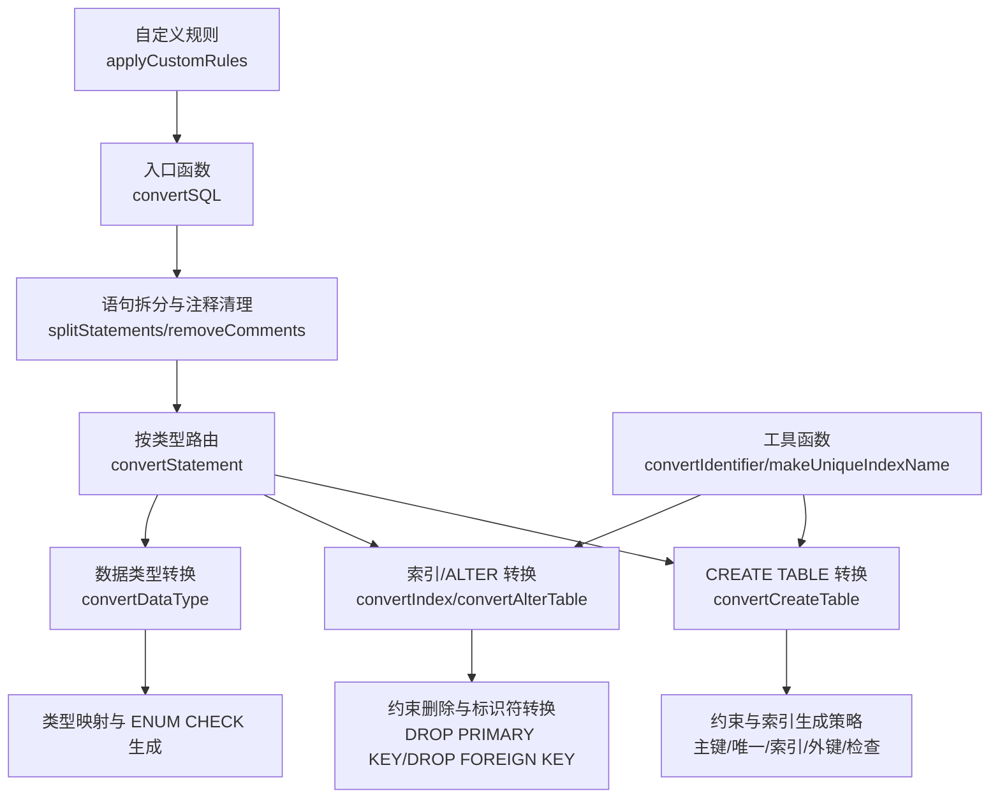
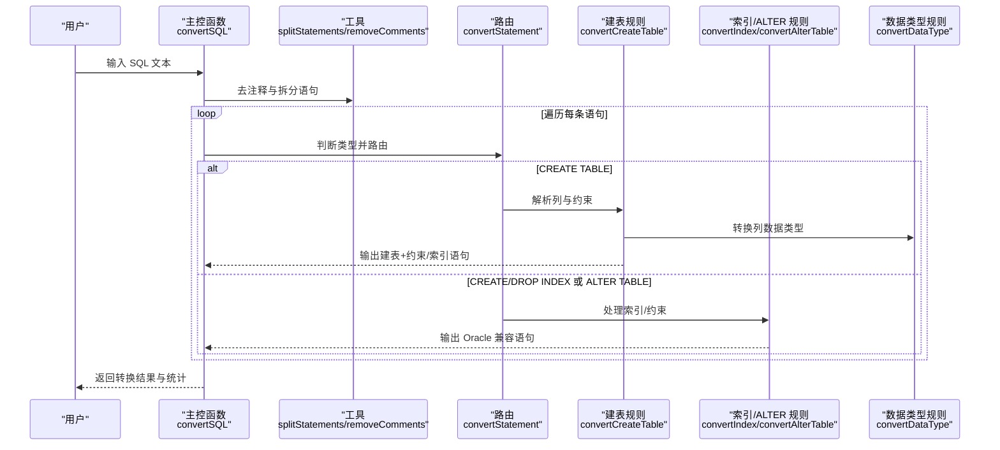
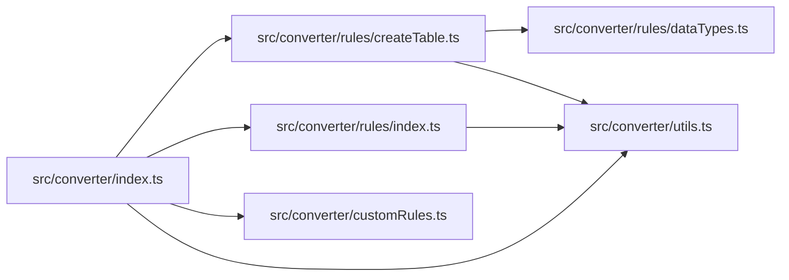

# 索引和约束转换

<cite>
**本文引用的文件**
- [README.md](file://README.md)
- [src/converter/index.ts](file://src/converter/index.ts)
- [src/converter/rules/index.ts](file://src/converter/rules/index.ts)
- [src/converter/rules/createTable.ts](file://src/converter/rules/createTable.ts)
- [src/converter/rules/dataTypes.ts](file://src/converter/rules/dataTypes.ts)
- [src/converter/utils.ts](file://src/converter/utils.ts)
- [src/types/index.ts](file://src/types/index.ts)
- [src/converter/customRules.ts](file://src/converter/customRules.ts)
- [src/converter/rules/comments.ts](file://src/converter/rules/comments.ts)
- [src/converter/rules/others.ts](file://src/converter/rules/others.ts)
</cite>

## 目录
1. [简介](#简介)
2. [项目结构](#项目结构)
3. [核心组件](#核心组件)
4. [架构总览](#架构总览)
5. [详细组件分析](#详细组件分析)
6. [依赖关系分析](#依赖关系分析)
7. [性能考量](#性能考量)
8. [故障排查指南](#故障排查指南)
9. [结论](#结论)
10. [附录](#附录)

## 简介
本文件聚焦“索引和约束转换”，系统性阐述 MySQL 到 Oracle（含 OceanBase Oracle 模式）的约束与索引转换规则与实现要点。内容覆盖主键约束（PK）、外键约束（FK）、唯一约束（UK）、检查约束（CHECK）、非空约束（NOT NULL）以及索引定义转换、约束名称处理、约束条件重写等关键技术细节，并提供完整的转换示例路径与最佳实践。

## 项目结构
该项目采用“规则驱动 + 工具函数”的模块化设计，核心转换流程由入口函数根据语句类型路由至相应规则模块；工具模块提供标识符转换、去注释、语句拆分、序列/触发器命名、索引名唯一化等通用能力。

图表来源
- [src/converter/index.ts:15-54](file://src/converter/index.ts#L15-L54)
- [src/converter/rules/createTable.ts:116-379](file://src/converter/rules/createTable.ts#L116-L379)
- [src/converter/rules/index.ts:8-134](file://src/converter/rules/index.ts#L8-L134)
- [src/converter/rules/dataTypes.ts:61-86](file://src/converter/rules/dataTypes.ts#L61-L86)
- [src/converter/utils.ts:8-114](file://src/converter/utils.ts#L8-L114)
- [src/converter/customRules.ts:170-185](file://src/converter/customRules.ts#L170-L185)

章节来源
- [README.md:1-12](file://README.md#L1-L12)
- [src/converter/index.ts:59-125](file://src/converter/index.ts#L59-L125)

## 核心组件
- 语句路由与转换主控：根据语句前缀与关键词判断类型，调用对应规则模块。
- 约束与索引转换：在建表阶段解析约束与索引定义，生成 Oracle 兼容的约束声明与索引创建语句；在 ALTER TABLE 中处理约束删除与标识符转换。
- 数据类型与枚举约束：提供类型映射表与 ENUM 转 CHECK 的辅助逻辑。
- 工具函数：统一标识符大小写与引号处理、索引名唯一化、序列/触发器命名等。
- 自定义规则：允许用户注入额外转换逻辑，如特定表列的 NULL 替换。

章节来源
- [src/converter/index.ts:15-54](file://src/converter/index.ts#L15-L54)
- [src/converter/rules/createTable.ts:17-111](file://src/converter/rules/createTable.ts#L17-L111)
- [src/converter/rules/index.ts:8-134](file://src/converter/rules/index.ts#L8-L134)
- [src/converter/rules/dataTypes.ts:61-105](file://src/converter/rules/dataTypes.ts#L61-L105)
- [src/converter/utils.ts:8-114](file://src/converter/utils.ts#L8-L114)
- [src/converter/customRules.ts:170-185](file://src/converter/customRules.ts#L170-L185)

## 架构总览
下图展示从输入 SQL 到输出 Oracle 兼容 SQL 的整体流程，重点标注约束与索引转换的关键节点。

图表来源
- [src/converter/index.ts:59-125](file://src/converter/index.ts#L59-L125)
- [src/converter/index.ts:15-54](file://src/converter/index.ts#L15-L54)
- [src/converter/rules/createTable.ts:116-379](file://src/converter/rules/createTable.ts#L116-L379)
- [src/converter/rules/index.ts:8-134](file://src/converter/rules/index.ts#L8-L134)
- [src/converter/rules/dataTypes.ts:61-86](file://src/converter/rules/dataTypes.ts#L61-L86)

## 详细组件分析

### 约束与索引转换总览
- 主键约束（PK）：在建表时直接生成带有约束名的主键定义，确保唯一性。
- 外键约束（FK）：保留外键定义，移除外键不支持的 ON UPDATE 子句并记录告警。
- 唯一约束（UK）：在建表时解析唯一约束，若未显式命名则生成默认 UK 约束名；随后通过 ALTER TABLE 添加约束。
- 检查约束（CHECK）：保留 CHECK 定义，不做改写。
- 非空约束（NOT NULL）：在数据类型转换后仍保留在列定义中。
- 索引定义：支持普通索引与唯一索引创建；DROP INDEX 语句在 Oracle 中无需指定表名；索引名通过工具函数保证 schema 唯一。

章节来源
- [src/converter/rules/createTable.ts:257-319](file://src/converter/rules/createTable.ts#L257-L319)
- [src/converter/rules/index.ts:8-41](file://src/converter/rules/index.ts#L8-L41)
- [src/converter/utils.ts:102-114](file://src/converter/utils.ts#L102-L114)

### 主键约束（PK）转换
- 实现要点
  - 在解析列定义时识别 PRIMARY KEY，并在建表体中生成带约束名的主键定义。
  - 约束名采用固定前缀与表名组合，确保唯一性。
- 关键路径
  - 约束解析与生成：[src/converter/rules/createTable.ts:261-266](file://src/converter/rules/createTable.ts#L261-L266)
  - 标识符转换与列名映射：[src/converter/rules/createTable.ts:264](file://src/converter/rules/createTable.ts#L264)

章节来源
- [src/converter/rules/createTable.ts:261-266](file://src/converter/rules/createTable.ts#L261-L266)

### 外键约束（FK）转换
- 实现要点
  - 保留外键定义，移除外键不支持的 ON UPDATE 子句并记录告警。
  - 标识符转换应用于外键相关对象名。
- 关键路径
  - 外键约束处理与告警：[src/converter/rules/createTable.ts:305-315](file://src/converter/rules/createTable.ts#L305-L315)
  - ALTER TABLE 删除外键约束：[src/converter/rules/index.ts:118-122](file://src/converter/rules/index.ts#L118-L122)

章节来源
- [src/converter/rules/createTable.ts:305-315](file://src/converter/rules/createTable.ts#L305-L315)
- [src/converter/rules/index.ts:118-122](file://src/converter/rules/index.ts#L118-L122)

### 唯一约束（UK）转换
- 实现要点
  - 解析 UNIQUE 约束，若显式命名则使用；否则生成默认 UK 约束名。
  - 通过 ALTER TABLE ADD CONSTRAINT 形式添加唯一约束。
  - 索引名唯一化：若未以表名前缀开头，则自动添加表名前缀。
- 关键路径
  - UNIQUE 约束解析与生成：[src/converter/rules/createTable.ts:267-278](file://src/converter/rules/createTable.ts#L267-L278)
  - 索引名唯一化工具：[src/converter/utils.ts:102-114](file://src/converter/utils.ts#L102-L114)

章节来源
- [src/converter/rules/createTable.ts:267-278](file://src/converter/rules/createTable.ts#L267-L278)
- [src/converter/utils.ts:102-114](file://src/converter/utils.ts#L102-L114)

### 检查约束（CHECK）转换
- 实现要点
  - 保留 CHECK 定义，不做改写。
  - ENUM 类型通过提取枚举值生成对应的 CHECK 表达式。
- 关键路径
  - CHECK 约束保留：[src/converter/rules/createTable.ts:316-318](file://src/converter/rules/createTable.ts#L316-L318)
  - ENUM 转 CHECK 辅助：[src/converter/rules/dataTypes.ts:91-105](file://src/converter/rules/dataTypes.ts#L91-L105)

章节来源
- [src/converter/rules/createTable.ts:316-318](file://src/converter/rules/createTable.ts#L316-L318)
- [src/converter/rules/dataTypes.ts:91-105](file://src/converter/rules/dataTypes.ts#L91-L105)

### 非空约束（NOT NULL）转换
- 实现要点
  - 非空约束在数据类型转换后仍保留在列定义中。
  - 未显式声明 NOT NULL 的列在 Oracle 中默认允许空值。
- 关键路径
  - 列定义解析与约束识别：[src/converter/rules/createTable.ts:85-107](file://src/converter/rules/createTable.ts#L85-L107)

章节来源
- [src/converter/rules/createTable.ts:85-107](file://src/converter/rules/createTable.ts#L85-L107)

### 索引定义转换
- 实现要点
  - 支持 CREATE INDEX 与 DROP INDEX 语句转换。
  - 移除 MySQL 特有的 USING BTREE/HASH 关键字。
  - Oracle 中 DROP INDEX 不需要指定表名。
  - 索引名唯一化：若未以表名前缀开头，则自动添加表名前缀。
- 关键路径
  - CREATE/DROP INDEX 转换：[src/converter/rules/index.ts:8-41](file://src/converter/rules/index.ts#L8-L41)
  - 索引名唯一化工具：[src/converter/utils.ts:102-114](file://src/converter/utils.ts#L102-L114)

章节来源
- [src/converter/rules/index.ts:8-41](file://src/converter/rules/index.ts#L8-L41)
- [src/converter/utils.ts:102-114](file://src/converter/utils.ts#L102-L114)

### 约束名称处理与重写
- 名称唯一化
  - 若索引/约束名未以表名前缀开头，工具函数会自动添加表名前缀，确保 schema 唯一。
- 约束条件重写
  - 外键 ON UPDATE 子句被移除并记录告警。
  - ENUM 类型通过提取枚举值生成 CHECK 表达式。
- 关键路径
  - 索引名唯一化：[src/converter/utils.ts:102-114](file://src/converter/utils.ts#L102-L114)
  - 外键 ON UPDATE 移除：[src/converter/rules/createTable.ts:309-311](file://src/converter/rules/createTable.ts#L309-L311)
  - ENUM CHECK 生成：[src/converter/rules/dataTypes.ts:91-105](file://src/converter/rules/dataTypes.ts#L91-L105)

章节来源
- [src/converter/utils.ts:102-114](file://src/converter/utils.ts#L102-L114)
- [src/converter/rules/createTable.ts:309-311](file://src/converter/rules/createTable.ts#L309-L311)
- [src/converter/rules/dataTypes.ts:91-105](file://src/converter/rules/dataTypes.ts#L91-L105)

### 复合索引与部分索引
- 复合索引
  - 索引定义支持多个列，列名经统一标识符转换后拼接。
- 部分索引
  - 当前规则未对“部分索引”（WHERE 条件过滤）进行专门转换；如需支持，可在自定义规则中扩展。
- 关键路径
  - 索引列解析与转换：[src/converter/rules/index.ts:17-21](file://src/converter/rules/index.ts#L17-L21)
  - 索引创建语句组装：[src/converter/rules/index.ts:25](file://src/converter/rules/index.ts#L25)

章节来源
- [src/converter/rules/index.ts:17-21](file://src/converter/rules/index.ts#L17-L21)
- [src/converter/rules/index.ts:25](file://src/converter/rules/index.ts#L25)

### 约束启用/禁用状态
- 当前实现
  - 未对约束的 ENABLE/DISABLE 状态进行转换处理。
  - 如需控制约束启用状态，可在自定义规则中追加相应逻辑。
- 关键路径
  - 约束保留与生成：[src/converter/rules/createTable.ts:257-319](file://src/converter/rules/createTable.ts#L257-L319)

章节来源
- [src/converter/rules/createTable.ts:257-319](file://src/converter/rules/createTable.ts#L257-L319)

### 转换流程与错误处理
- 语句路由
  - 根据语句类型选择对应规则模块，未知类型仅进行标识符转换并记录告警。
- 错误处理
  - 转换异常被捕获并记录错误日志，同时输出带注释的失败提示。
- 关键路径
  - 语句路由与错误处理：[src/converter/index.ts:15-54](file://src/converter/index.ts#L15-L54)
  - 转换异常捕获与输出：[src/converter/index.ts:97-106](file://src/converter/index.ts#L97-L106)

章节来源
- [src/converter/index.ts:15-54](file://src/converter/index.ts#L15-L54)
- [src/converter/index.ts:97-106](file://src/converter/index.ts#L97-L106)

## 依赖关系分析
- 模块耦合
  - 主控函数依赖规则模块与工具模块；规则模块之间低耦合，职责清晰。
  - 工具模块被多处复用，提升一致性与可维护性。
- 外部依赖
  - 无外部运行时依赖，纯前端转换逻辑。
- 关键依赖链
  - convertSQL → convertStatement → convertCreateTable/convertIndex/convertAlterTable → convertDataType → utils

图表来源
- [src/converter/index.ts:15-54](file://src/converter/index.ts#L15-L54)
- [src/converter/rules/createTable.ts:116-379](file://src/converter/rules/createTable.ts#L116-L379)
- [src/converter/rules/index.ts:8-134](file://src/converter/rules/index.ts#L8-L134)
- [src/converter/rules/dataTypes.ts:61-86](file://src/converter/rules/dataTypes.ts#L61-L86)
- [src/converter/utils.ts:8-114](file://src/converter/utils.ts#L8-L114)
- [src/converter/customRules.ts:170-185](file://src/converter/customRules.ts#L170-L185)

章节来源
- [src/converter/index.ts:15-54](file://src/converter/index.ts#L15-L54)
- [src/converter/rules/createTable.ts:116-379](file://src/converter/rules/createTable.ts#L116-L379)
- [src/converter/rules/index.ts:8-134](file://src/converter/rules/index.ts#L8-L134)
- [src/converter/rules/dataTypes.ts:61-86](file://src/converter/rules/dataTypes.ts#L61-L86)
- [src/converter/utils.ts:8-114](file://src/converter/utils.ts#L8-L114)
- [src/converter/customRules.ts:170-185](file://src/converter/customRules.ts#L170-L185)

## 性能考量
- 正则匹配与字符串替换
  - 多处使用正则进行模式匹配与替换，建议在大规模 SQL 文本上注意性能开销。
- 语句拆分与注释清理
  - 先保护字符串字面量再进行注释清理，避免误删，但增加了两次扫描。
- 建议
  - 对超长 SQL 文本可考虑分批处理或异步执行。
  - 合理使用自定义规则，避免重复转换。

## 故障排查指南
- 无法识别的语句类型
  - 现象：仅进行基本标识符转换并记录警告。
  - 排查：确认语句是否符合已支持的前缀与关键词。
  - 参考：[src/converter/index.ts:41-48](file://src/converter/index.ts#L41-L48)
- 注释与字符串干扰
  - 现象：注释或字符串中的分号导致语句拆分异常。
  - 排查：确认注释清理与字符串字面量保护逻辑是否生效。
  - 参考：[src/converter/utils.ts:52-72](file://src/converter/utils.ts#L52-L72)
- 外键 ON UPDATE 不支持
  - 现象：转换后移除外键 ON UPDATE 子句并记录警告。
  - 参考：[src/converter/rules/createTable.ts:309-311](file://src/converter/rules/createTable.ts#L309-L311)
- FULLTEXT 索引降级
  - 现象：FULLTEXT 索引在 Oracle 中降级为普通索引并记录警告。
  - 参考：[src/converter/rules/createTable.ts:296-298](file://src/converter/rules/createTable.ts#L296-L298)
- 索引名冲突
  - 现象：索引名未以表名前缀开头导致冲突。
  - 处理：使用工具函数自动添加表名前缀。
  - 参考：[src/converter/utils.ts:102-114](file://src/converter/utils.ts#L102-L114)

章节来源
- [src/converter/index.ts:41-48](file://src/converter/index.ts#L41-L48)
- [src/converter/utils.ts:52-72](file://src/converter/utils.ts#L52-L72)
- [src/converter/rules/createTable.ts:309-311](file://src/converter/rules/createTable.ts#L309-L311)
- [src/converter/rules/createTable.ts:296-298](file://src/converter/rules/createTable.ts#L296-L298)
- [src/converter/utils.ts:102-114](file://src/converter/utils.ts#L102-L114)

## 结论
本项目提供了从 MySQL 到 Oracle（OceanBase Oracle 模式）的索引与约束转换能力，覆盖主键、外键、唯一、检查与索引等核心对象。通过规则模块化与工具函数复用，实现了高内聚、低耦合的转换架构。对于部分索引、约束启用/禁用状态与 ENUM CHECK 等细节，建议结合自定义规则与后续扩展逐步完善。

## 附录

### 转换示例（示例路径）
以下示例均以“代码片段路径”形式给出，便于定位具体实现与验证转换结果。

- 主键约束（PK）
  - 示例路径：[src/converter/rules/createTable.ts:261-266](file://src/converter/rules/createTable.ts#L261-L266)
- 唯一约束（UK）
  - 示例路径：[src/converter/rules/createTable.ts:267-278](file://src/converter/rules/createTable.ts#L267-L278)
- 外键约束（FK）
  - 示例路径：[src/converter/rules/createTable.ts:305-315](file://src/converter/rules/createTable.ts#L305-L315)
  - 删除外键：[src/converter/rules/index.ts:118-122](file://src/converter/rules/index.ts#L118-L122)
- 检查约束（CHECK）
  - 示例路径：[src/converter/rules/createTable.ts:316-318](file://src/converter/rules/createTable.ts#L316-L318)
  - ENUM 转 CHECK：[src/converter/rules/dataTypes.ts:91-105](file://src/converter/rules/dataTypes.ts#L91-L105)
- 索引定义
  - 创建索引：[src/converter/rules/index.ts:8-26](file://src/converter/rules/index.ts#L8-L26)
  - 删除索引：[src/converter/rules/index.ts:28-38](file://src/converter/rules/index.ts#L28-L38)
- 约束名称处理
  - 索引名唯一化：[src/converter/utils.ts:102-114](file://src/converter/utils.ts#L102-L114)
- 非空约束（NOT NULL）
  - 示例路径：[src/converter/rules/createTable.ts:85-107](file://src/converter/rules/createTable.ts#L85-L107)

### 最佳实践与注意事项
- 使用自定义规则扩展功能
  - 可通过自定义规则实现部分索引、约束启用/禁用状态、特定列的 NULL 替换等需求。
  - 参考：[src/converter/customRules.ts:137-185](file://src/converter/customRules.ts#L137-L185)
- 保留与移除的差异
  - 外键 ON UPDATE 被移除并记录告警；FULLTEXT 索引降级为普通索引。
  - 参考：[src/converter/rules/createTable.ts:309-311](file://src/converter/rules/createTable.ts#L309-L311), [src/converter/rules/createTable.ts:296-298](file://src/converter/rules/createTable.ts#L296-L298)
- 标识符与大小写
  - 默认将标识符转为大写；可通过选项保留大小写并用双引号包裹。
  - 参考：[src/converter/utils.ts:8-21](file://src/converter/utils.ts#L8-L21), [src/types/index.ts:25-33](file://src/types/index.ts#L25-L33)
- 临时表与注释
  - 临时表转换为 Oracle GLOBAL TEMPORARY TABLE；注释转换受选项控制。
  - 参考：[src/converter/rules/createTable.ts:157-164](file://src/converter/rules/createTable.ts#L157-L164), [src/converter/rules/comments.ts:16-31](file://src/converter/rules/comments.ts#L16-L31), [src/types/index.ts:25-33](file://src/types/index.ts#L25-L33)