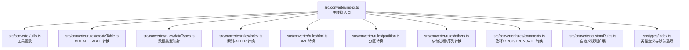
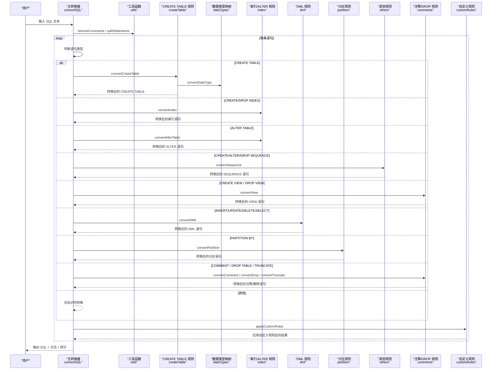
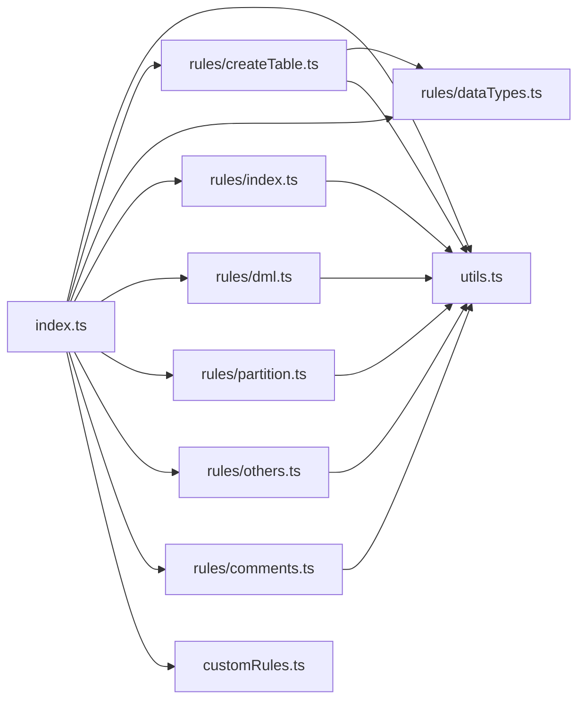

# 表结构转换

<cite>
**本文引用的文件**
- [README.md](file://README.md)
- [package.json](file://package.json)
- [src/converter/index.ts](file://src/converter/index.ts)
- [src/converter/utils.ts](file://src/converter/utils.ts)
- [src/converter/rules/createTable.ts](file://src/converter/rules/createTable.ts)
- [src/converter/rules/dataTypes.ts](file://src/converter/rules/dataTypes.ts)
- [src/converter/rules/index.ts](file://src/converter/rules/index.ts)
- [src/converter/rules/dml.ts](file://src/converter/rules/dml.ts)
- [src/converter/rules/partition.ts](file://src/converter/rules/partition.ts)
- [src/converter/rules/others.ts](file://src/converter/rules/others.ts)
- [src/converter/rules/comments.ts](file://src/converter/rules/comments.ts)
- [src/converter/customRules.ts](file://src/converter/customRules.ts)
- [src/types/index.ts](file://src/types/index.ts)
</cite>

## 目录
1. [简介](#简介)
2. [项目结构](#项目结构)
3. [核心组件](#核心组件)
4. [架构总览](#架构总览)
5. [详细组件分析](#详细组件分析)
6. [依赖关系分析](#依赖关系分析)
7. [性能考量](#性能考量)
8. [故障排查指南](#故障排查指南)
9. [结论](#结论)
10. [附录](#附录)

## 简介
本文件聚焦于“CREATE TABLE 语句转换”的完整流程与实现细节，覆盖列定义解析、数据类型映射、约束处理、自增列转换、表属性转换、索引定义处理、表注释转换机制，以及特殊场景（如自增列、默认值、NULL 约束）与错误处理机制。文档同时说明转换过程中的日志记录与调试信息，帮助读者快速理解从 MySQL 到 Oracle 的表结构迁移要点。

## 项目结构
该项目采用前端 React + TypeScript + Vite 技术栈，核心转换逻辑集中在 src/converter 目录下，按功能模块划分规则文件，统一由入口函数进行语句级路由与统计。

图表来源
- [src/converter/index.ts:1-129](file://src/converter/index.ts#L1-L129)
- [src/converter/utils.ts:1-115](file://src/converter/utils.ts#L1-L115)
- [src/converter/rules/createTable.ts:1-380](file://src/converter/rules/createTable.ts#L1-L380)
- [src/converter/rules/dataTypes.ts:1-106](file://src/converter/rules/dataTypes.ts#L1-L106)
- [src/converter/rules/index.ts:1-135](file://src/converter/rules/index.ts#L1-L135)
- [src/converter/rules/dml.ts:1-163](file://src/converter/rules/dml.ts#L1-L163)
- [src/converter/rules/partition.ts:1-38](file://src/converter/rules/partition.ts#L1-L38)
- [src/converter/rules/others.ts:1-49](file://src/converter/rules/others.ts#L1-L49)
- [src/converter/rules/comments.ts:1-53](file://src/converter/rules/comments.ts#L1-L53)
- [src/converter/customRules.ts:1-186](file://src/converter/customRules.ts#L1-L186)
- [src/types/index.ts:1-44](file://src/types/index.ts#L1-L44)

章节来源
- [src/converter/index.ts:1-129](file://src/converter/index.ts#L1-L129)
- [src/converter/utils.ts:1-115](file://src/converter/utils.ts#L1-L115)
- [src/types/index.ts:1-44](file://src/types/index.ts#L1-L44)

## 核心组件
- 主转换器：负责语句拆分、路由到具体规则、统计与日志记录。
- 工具函数：通用标识符转换、字符串保护/还原、注释清理、语句拆分等。
- 规则模块：
  - CREATE TABLE：列定义解析、约束提取与转换、自增列/默认值/时间戳处理、表注释与索引生成。
  - 数据类型映射：MySQL 到 Oracle 的类型映射与 ENUM 检查约束生成。
  - 索引/ALTER：索引创建/删除、ALTER TABLE 列操作与约束管理。
  - DML：INSERT/UPDATE/DELETE/SELECT 的兼容性转换。
  - 分区：RANGE/LIST 分区语法适配。
  - 注释/DROP/TRUNCATE：注释与表/视图/序列等对象的转换。
  - 自定义规则：可扩展的用户规则链路。
- 类型系统：统一的日志、结果、统计与默认选项。

章节来源
- [src/converter/index.ts:1-129](file://src/converter/index.ts#L1-L129)
- [src/converter/utils.ts:1-115](file://src/converter/utils.ts#L1-L115)
- [src/converter/rules/createTable.ts:1-380](file://src/converter/rules/createTable.ts#L1-L380)
- [src/converter/rules/dataTypes.ts:1-106](file://src/converter/rules/dataTypes.ts#L1-L106)
- [src/converter/rules/index.ts:1-135](file://src/converter/rules/index.ts#L1-L135)
- [src/converter/rules/dml.ts:1-163](file://src/converter/rules/dml.ts#L1-L163)
- [src/converter/rules/partition.ts:1-38](file://src/converter/rules/partition.ts#L1-L38)
- [src/converter/rules/comments.ts:1-53](file://src/converter/rules/comments.ts#L1-L53)
- [src/converter/customRules.ts:1-186](file://src/converter/customRules.ts#L1-L186)
- [src/types/index.ts:1-44](file://src/types/index.ts#L1-L44)

## 架构总览
整体转换流程如下：输入 SQL 经过注释清理与语句拆分后，逐条判断语句类型并路由到对应规则模块；规则模块完成转换后，统一通过自定义规则扩展与最终组装输出。

图表来源
- [src/converter/index.ts:15-54](file://src/converter/index.ts#L15-L54)
- [src/converter/rules/createTable.ts:116-380](file://src/converter/rules/createTable.ts#L116-L380)
- [src/converter/rules/dataTypes.ts:61-86](file://src/converter/rules/dataTypes.ts#L61-L86)
- [src/converter/rules/index.ts:8-135](file://src/converter/rules/index.ts#L8-L135)
- [src/converter/rules/dml.ts:7-163](file://src/converter/rules/dml.ts#L7-L163)
- [src/converter/rules/partition.ts:7-38](file://src/converter/rules/partition.ts#L7-L38)
- [src/converter/rules/others.ts:7-49](file://src/converter/rules/others.ts#L7-L49)
- [src/converter/rules/comments.ts:7-53](file://src/converter/rules/comments.ts#L7-L53)
- [src/converter/customRules.ts:170-186](file://src/converter/customRules.ts#L170-L186)

## 详细组件分析

### CREATE TABLE 转换器（核心）
- 功能职责
  - 解析 CREATE TABLE 头部与主体，提取表名、临时表标记、列定义与约束。
  - 列定义解析：按逗号拆分（忽略括号与字符串内逗号），识别约束与列定义。
  - 数据类型转换：委托数据类型映射模块，处理 ENUM 检查约束生成。
  - 自增列转换：支持 IDENTITY 或 SEQUENCE+TRIGGER 两种策略。
  - 默认值与时序函数：DEFAULT CURRENT_TIMESTAMP/NOW/LOCALTIME/LOCALTIMESTAMP 转换为 SYSDATE；UUID() 转换为 SYS_GUID()。
  - 时间戳更新：ON UPDATE CURRENT_TIMESTAMP 转换为触发器（可选）。
  - 约束转换：主键、唯一键、普通索引、全文索引（提示使用 Oracle Text）、外键（移除 ON UPDATE）、CHECK 约束。
  - 表注释与列注释：根据选项生成 COMMENT ON TABLE/COLUMN。
  - 表尾属性：移除 ENGINE/CHARSET/COLLATE/ROW_FORMAT/AUTO_INCREMENT 等 MySQL 特性。
  - 临时表：转换为 Oracle GLOBAL TEMPORARY TABLE。
  - 输出组织：序列、表定义、注释、索引/约束、触发器等按顺序输出。

- 列定义解析算法
  - 使用括号深度与字符串状态机，确保在嵌套括号与字符串内逗号时不误拆分。
  - 识别约束关键字（PRIMARY KEY、UNIQUE、KEY、INDEX、FULLTEXT、SPATIAL、CONSTRAINT、FOREIGN KEY、CHECK）并单独处理。
  - 识别列名与定义，提取 AUTO_INCREMENT、COMMENT、PRIMARY KEY 标记，用于后续转换。

- 约束提取与转换规则
  - 主键：转换为表级 CONSTRAINT pk_{table}。
  - 唯一键：生成唯一约束并保证索引名在 schema 内唯一（自动添加表名前缀）。
  - 普通索引：生成 CREATE INDEX 并保证索引名唯一。
  - 全文索引：提示使用 Oracle Text（CTXSYS），降级为普通索引。
  - 外键：移除 Oracle 不支持的 ON UPDATE，转换标识符。
  - CHECK：保留原定义。

- 自增列转换
  - IDENTITY 策略：启用 useIdentity 时，生成 GENERATED BY DEFAULT AS IDENTITY。
  - SEQUENCE+TRIGGER 策略：启用 useSequenceTrigger 且 generateSequence 时，生成序列与默认值 NEXTVAL，并可选生成触发器更新时间戳。

- 表注释与索引注释
  - 表注释：从表尾 COMMENT 提取并生成 COMMENT ON TABLE。
  - 列注释：从列定义 COMMENT 提取并生成 COMMENT ON COLUMN（受 addComments 控制）。

- 特殊场景处理
  - ON UPDATE CURRENT_TIMESTAMP：若 generateTrigger=true，则生成触发器；否则移除该子句并记录警告。
  - DEFAULT CURRENT_TIMESTAMP/NOW/LOCALTIME/LOCALTIMESTAMP：转换为 SYSDATE。
  - DEFAULT UUID()：转换为 SYS_GUID()。
  - UNSIGNED/ZEROFILL/CHARACTER SET/COLLATE：移除不支持的修饰词。
  - FULLTEXT：提示使用 Oracle Text 并生成普通索引。
  - ENGINE/CHARSET/COLLATE/ROW_FORMAT/AUTO_INCREMENT：在 convertEngineCharset=true 时移除。

- 错误处理与日志
  - 无法解析 CREATE TABLE 头部或找不到右括号时记录 warning。
  - 未识别语句类型时仅进行标识符转换并记录 warning。
  - 各类转换（数据类型、自增、注释）均记录 info/warning。
  - 异常捕获后记录 error，并输出失败注释与原始语句片段。

章节来源
- [src/converter/rules/createTable.ts:17-111](file://src/converter/rules/createTable.ts#L17-L111)
- [src/converter/rules/createTable.ts:116-380](file://src/converter/rules/createTable.ts#L116-L380)

### 数据类型映射
- 映射策略
  - 整数类型：TINYINT/SMALLINT/MEDIUMINT/INT/INTEGER/BIGINT 映射为 NUMBER(n)。
  - 浮点类型：FLOAT/DOUBLE/REAL 映射为 FLOAT/DOUBLE PRECISION。
  - DECIMAL/NUMERIC：保留精度参数或默认 NUMBER。
  - 字符串类型：CHAR/VARCHAR/TINYTEXT/TEXT/MEDIUMTEXT/LONGTEXT 映射为 CHAR/VARCHAR2/CLOB。
  - 二进制类型：BINARY/VARBINARY/TINYBLOB/BLOB/MEDIUMBLOB/LONGBLOB 映射为 RAW/BLOB。
  - 日期时间类型：DATE/DATETIME/TIMESTAMP/TIME/YEAR 映射为 DATE/TIMESTAMP/INTERVAL DAY TO SECOND/NUMBER(4)。
  - 其他类型：BOOLEAN/BOOL 映射为 NUMBER(1)，JSON 映射为 CLOB，ENUM/SET 映射为 VARCHAR2(255)。
  - ENUM：额外生成 CHECK 约束，确保枚举值合法性。

- 性能与复杂度
  - 类型匹配按键长度降序排序，避免短键误匹配长键。
  - 单次扫描完成类型替换，时间复杂度 O(N_types)。

章节来源
- [src/converter/rules/dataTypes.ts:6-56](file://src/converter/rules/dataTypes.ts#L6-L56)
- [src/converter/rules/dataTypes.ts:61-86](file://src/converter/rules/dataTypes.ts#L61-L86)
- [src/converter/rules/dataTypes.ts:91-105](file://src/converter/rules/dataTypes.ts#L91-L105)

### 索引与 ALTER TABLE 转换
- 索引
  - CREATE INDEX：移除 USING BTREE/HASH，统一生成 Oracle 索引；索引名自动添加表名前缀保证唯一。
  - DROP INDEX：移除 ON table 子句。
- ALTER TABLE
  - ADD COLUMN：移除 COLUMN 关键字，转换数据类型，支持 COMMENT（仅注释生成）。
  - DROP COLUMN：移除 COLUMN 关键字。
  - CHANGE：拆分为 RENAME COLUMN 与 MODIFY（简化为仅 RENAME）。
  - MODIFY：移除 COMMENT（Oracle 不支持），转换数据类型。
  - DROP PRIMARY KEY/FOREIGN KEY：生成对应 DROP CONSTRAINT。
  - DROP INDEX：生成 DROP INDEX。
  - 通用：转换标识符。

章节来源
- [src/converter/rules/index.ts:8-135](file://src/converter/rules/index.ts#L8-L135)

### DML 转换
- INSERT
  - INSERT IGNORE：移除 IGNORE。
  - INSERT SET：转换为标准 INSERT VALUES。
- UPDATE/DELETE LIMIT：记录警告，建议使用 ROWNUM 或 OFFSET/FETCH。
- SELECT LIMIT：简单场景转换为 ROWNUM 子查询；复杂场景记录警告。
- SELECT 1：自动补全 FROM DUAL。
- 函数替换：IFNULL->NVL、UUID()->SYS_GUID()、NOW()->SYSDATE、SUBSTRING->SUBSTR、TRUNCATE->TRUNC、DATE_FORMAT/STR_TO_DATE->TO_CHAR/TO_DATE。
- 日期字符串：自动识别并转换为 TO_DATE/TO_TIMESTAMP，保护已有的函数调用避免重复替换。

章节来源
- [src/converter/rules/dml.ts:7-163](file://src/converter/rules/dml.ts#L7-L163)

### 分区转换
- RANGE/LIST 分区语法适配：
  - LIST 分区 VALUES IN -> VALUES。
  - RANGE 中 TO_DAYS(expr) -> expr。
  - LESS THAN (TO_DAYS('xxx')) -> LESS THAN (DATE 'xxx')。
  - LESS THAN MAXVALUE -> LESS THAN (MAXVALUE)。
- 标识符转换。

章节来源
- [src/converter/rules/partition.ts:7-38](file://src/converter/rules/partition.ts#L7-L38)

### 注释/DROP/TRUNCATE/VIEW 转换
- COMMENT：保持原样（MySQL 无独立 COMMENT ON 语法）。
- DROP TABLE：过滤 IF EXISTS；临时表 DROP 移除 TEMPORARY。
- TRUNCATE：补全 TABLE 关键字。
- VIEW：转换标识符。

章节来源
- [src/converter/rules/comments.ts:7-53](file://src/converter/rules/comments.ts#L7-L53)

### 自定义规则扩展
- 接口：name/description/match/transform。
- 示例：插入语句中特定列的 NULL 替换规则，批量配置多个表/列的替换。
- 应用：遍历规则，匹配成功后执行 transform 并记录日志。

章节来源
- [src/converter/customRules.ts:7-186](file://src/converter/customRules.ts#L7-L186)

### 主转换器与工具函数
- 主转换器
  - 语句拆分与注释清理。
  - 语句类型路由：CREATE TABLE、索引、ALTER TABLE、分区、视图、存储过程/函数、序列、DROP/TRUNCATE、DML、COMMENT。
  - 统计与日志：累计转换数量、警告、错误、数据类型转换次数、自增转换次数、注释转换次数。
  - 异常捕获：记录错误详情与原始语句片段。
- 工具函数
  - 标识符转换：移除反引号，保留大小写或转大写。
  - 字符串保护/还原：保护字符串常量，避免误替换。
  - 注释清理：移除行注释与块注释。
  - 语句拆分：按分号拆分，忽略字符串内分号。
  - 命名辅助：生成序列/触发器/索引名，保证唯一性。

章节来源
- [src/converter/index.ts:15-129](file://src/converter/index.ts#L15-L129)
- [src/converter/utils.ts:8-115](file://src/converter/utils.ts#L8-L115)

## 依赖关系分析
- 模块耦合
  - 主转换器依赖工具函数与各规则模块，规则模块之间低耦合，便于扩展。
  - CREATE TABLE 规则依赖数据类型映射与工具函数（生成序列/触发器名、唯一索引名）。
  - 自定义规则作为插件式扩展，不影响核心流程。
- 外部依赖
  - 项目基于 React + Vite + TypeScript，前端渲染与打包构建。
- 循环依赖
  - 当前结构未发现循环依赖，规则模块相互独立。

图表来源
- [src/converter/index.ts:1-129](file://src/converter/index.ts#L1-L129)
- [src/converter/utils.ts:1-115](file://src/converter/utils.ts#L1-L115)
- [src/converter/rules/createTable.ts:1-380](file://src/converter/rules/createTable.ts#L1-L380)
- [src/converter/rules/dataTypes.ts:1-106](file://src/converter/rules/dataTypes.ts#L1-L106)
- [src/converter/rules/index.ts:1-135](file://src/converter/rules/index.ts#L1-L135)
- [src/converter/rules/dml.ts:1-163](file://src/converter/rules/dml.ts#L1-L163)
- [src/converter/rules/partition.ts:1-38](file://src/converter/rules/partition.ts#L1-L38)
- [src/converter/rules/others.ts:1-49](file://src/converter/rules/others.ts#L1-L49)
- [src/converter/rules/comments.ts:1-53](file://src/converter/rules/comments.ts#L1-L53)
- [src/converter/customRules.ts:1-186](file://src/converter/customRules.ts#L1-L186)

## 性能考量
- 正则匹配与替换：类型映射按键长度排序，减少误匹配；字符串保护/还原避免重复扫描。
- 语句拆分：使用字符串保护技术，避免误拆分。
- 日志与统计：仅在必要时记录，避免冗余输出。
- 建议
  - 大量语句时建议分批处理，避免一次性内存压力。
  - 自定义规则应尽量精准匹配，减少不必要的 transform 调用。

## 故障排查指南
- 无法解析 CREATE TABLE
  - 检查是否缺少右括号或头部格式异常。
  - 查看日志 warning。
- 临时表转换
  - 确认是否启用 GLOBAL TEMPORARY TABLE 的预期行为。
- 自增列未生效
  - 检查 useIdentity/useSequenceTrigger/generateSequence/generateTrigger 选项组合。
  - 若使用 SEQUENCE+TRIGGER，确认序列与触发器已生成。
- 默认值与时序函数
  - 确认 DEFAULT CURRENT_TIMESTAMP/NOW/LOCALTIME/LOCALTIMESTAMP/UUID() 是否被正确替换。
- ON UPDATE CURRENT_TIMESTAMP
  - 若未生成触发器，检查 generateTrigger 选项与日志 warning。
- 注释未生成
  - 确认 addComments 选项开启。
- 引擎/字符集/排序规则
  - 确认 convertEngineCharset 选项开启。
- 未识别语句类型
  - 仅进行标识符转换，建议补充规则或调整输入格式。

章节来源
- [src/converter/index.ts:97-107](file://src/converter/index.ts#L97-L107)
- [src/converter/rules/createTable.ts:118-143](file://src/converter/rules/createTable.ts#L118-L143)
- [src/converter/rules/createTable.ts:173-196](file://src/converter/rules/createTable.ts#L173-L196)
- [src/converter/rules/createTable.ts:208-238](file://src/converter/rules/createTable.ts#L208-L238)
- [src/converter/rules/createTable.ts:296-304](file://src/converter/rules/createTable.ts#L296-L304)
- [src/converter/rules/createTable.ts:336-339](file://src/converter/rules/createTable.ts#L336-L339)

## 结论
本项目提供了从 MySQL 到 Oracle 的 CREATE TABLE 语句转换能力，涵盖列定义解析、数据类型映射、约束与索引处理、自增列与默认值转换、表注释与索引注释、临时表转换、以及完善的日志与统计。通过灵活的选项与自定义规则扩展，能够满足大多数迁移场景的需求。对于复杂特性（如分区、存储过程/函数、全文索引），项目提供了适配与提示，建议结合业务需求进行手工调整。

## 附录

### 转换示例（概念性说明）
- MySQL 表结构
  - 包含 TINYINT/SMALLINT/MEDIUMINT/INT/BIGINT、FLOAT/DOUBLE/REAL、DECIMAL/NUMERIC、CHAR/VARCHAR/TINYTEXT/TEXT、BINARY/VARBINARY、DATETIME/TIMESTAMP、ENUM/SET、自增列、默认值、时间戳更新、注释、引擎/字符集等。
- Oracle 对应结构
  - NUMBER(n)、FLOAT/DOUBLE PRECISION、NUMBER(M,D)、VARCHAR2(n)/CHAR(n)/CLOB、RAW(n)/BLOB、DATE/TIMESTAMP、VARCHAR2(255)/CLOB、IDENTITY 或 SEQUENCE+TRIGGER、SYSDATE/SYS_GUID()、COMMENT ON TABLE/COLUMN、GLOBAL TEMPORARY TABLE、索引/约束名规范化。

### 选项与默认值
- useIdentity：是否使用 IDENTITY 替代 SEQUENCE。
- useSequenceTrigger：是否使用 SEQUENCE+TRIGGER 方式。
- preserveCase：是否保留标识符大小写。
- addComments：是否生成注释。
- convertEngineCharset：是否移除 ENGINE/CHARSET/COLLATE/ROW_FORMAT/AUTO_INCREMENT。
- generateSequence/generateTrigger：是否生成序列与触发器。

章节来源
- [src/types/index.ts:25-44](file://src/types/index.ts#L25-L44)