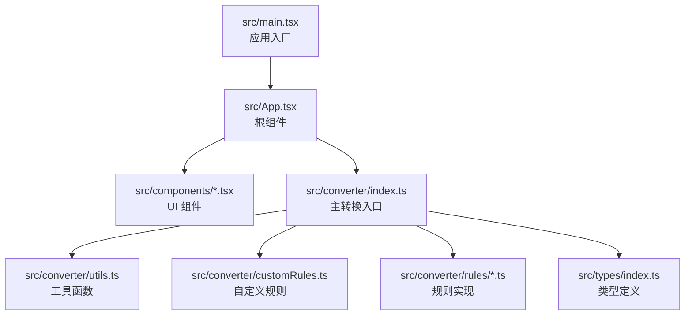
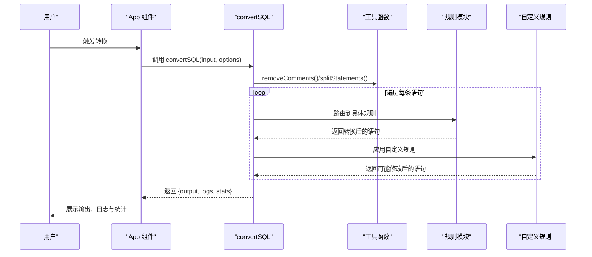
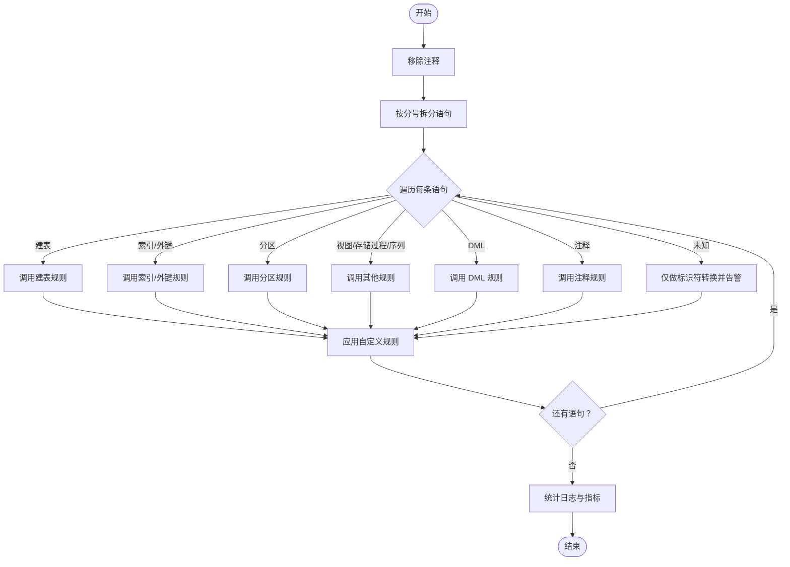
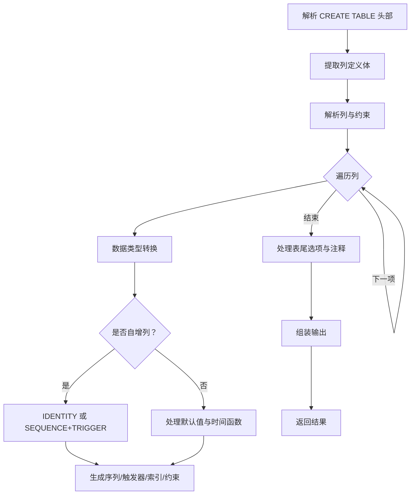
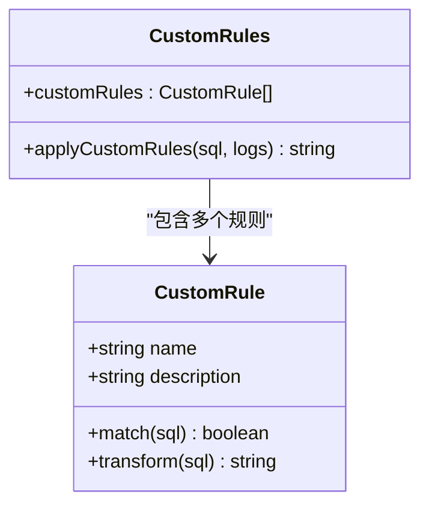
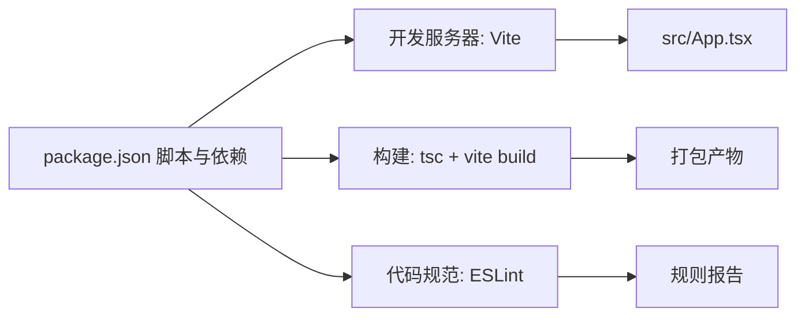

# 开发指南

<cite>
**本文引用的文件**
- [package.json](file://package.json)
- [vite.config.ts](file://vite.config.ts)
- [eslint.config.js](file://eslint.config.js)
- [tsconfig.json](file://tsconfig.json)
- [tsconfig.app.json](file://tsconfig.app.json)
- [tsconfig.node.json](file://tsconfig.node.json)
- [README.md](file://README.md)
- [src/main.tsx](file://src/main.tsx)
- [src/App.tsx](file://src/App.tsx)
- [src/converter/index.ts](file://src/converter/index.ts)
- [src/converter/utils.ts](file://src/converter/utils.ts)
- [src/converter/customRules.ts](file://src/converter/customRules.ts)
- [src/converter/rules/createTable.ts](file://src/converter/rules/createTable.ts)
- [src/types/index.ts](file://src/types/index.ts)
- [src/components/SettingsPanel.tsx](file://src/components/SettingsPanel.tsx)
</cite>

## 目录
1. [简介](#简介)
2. [项目结构](#项目结构)
3. [核心组件](#核心组件)
4. [架构总览](#架构总览)
5. [详细组件分析](#详细组件分析)
6. [依赖分析](#依赖分析)
7. [性能考量](#性能考量)
8. [故障排查指南](#故障排查指南)
9. [结论](#结论)
10. [附录](#附录)

## 简介
本指南面向希望参与 SQL 转换器项目的开发者，覆盖开发环境搭建、构建与调试、代码规范、贡献流程、目录组织与模块划分、扩展与插件开发等主题。项目采用 React + TypeScript + Vite 技术栈，核心功能是将 MySQL 语法转换为 Oracle 语法，内置可扩展的自定义规则机制。

## 项目结构
项目采用“按功能域”组织方式，核心目录如下：
- public：静态资源
- src/assets：静态资源（如图标、样式）
- src/components：UI 组件（头部、设置面板、日志面板、统计面板）
- src/converter：转换引擎与规则
  - rules：各类 SQL 语句的转换规则（如建表、索引、分区、DML、注释、存储过程等）
  - utils：通用工具函数（标识符处理、字符串字面量保护、注释移除、语句拆分、命名生成等）
  - customRules：自定义规则接口与内置规则示例
  - index.ts：主转换入口
- src/types：类型定义（转换结果、日志、统计、选项）
- src/main.tsx：应用入口
- src/App.tsx：应用根组件（编辑器、面板、操作按钮、快捷键）

图表来源
- [src/main.tsx:1-11](file://src/main.tsx#L1-L11)
- [src/App.tsx:1-282](file://src/App.tsx#L1-L282)
- [src/converter/index.ts:1-129](file://src/converter/index.ts#L1-L129)
- [src/converter/utils.ts:1-115](file://src/converter/utils.ts#L1-L115)
- [src/converter/customRules.ts:1-186](file://src/converter/customRules.ts#L1-L186)
- [src/converter/rules/createTable.ts:1-380](file://src/converter/rules/createTable.ts#L1-L380)
- [src/types/index.ts:1-44](file://src/types/index.ts#L1-L44)

章节来源
- [src/main.tsx:1-11](file://src/main.tsx#L1-L11)
- [src/App.tsx:1-282](file://src/App.tsx#L1-L282)
- [src/converter/index.ts:1-129](file://src/converter/index.ts#L1-L129)

## 核心组件
- 转换器主入口：负责接收输入 SQL、清理注释、按分号拆分语句、按类型路由到具体规则、收集日志与统计、应用自定义规则、汇总输出。
- 规则模块：按语句类型拆分（建表、索引、分区、DML、注释、存储过程等），在规则内部完成语法与数据类型的映射、标识符转换、序列/触发器生成等。
- 工具模块：提供字符串字面量保护与还原、注释移除、语句拆分、命名唯一化、驼峰/下划线互转、序列/触发器命名生成等。
- 自定义规则：通过统一接口注册规则，按匹配条件执行转换，便于业务定制。
- 类型系统：统一定义转换结果、日志、统计与选项，确保调用方与转换器之间的契约清晰。

章节来源
- [src/converter/index.ts:1-129](file://src/converter/index.ts#L1-L129)
- [src/converter/utils.ts:1-115](file://src/converter/utils.ts#L1-L115)
- [src/converter/customRules.ts:1-186](file://src/converter/customRules.ts#L1-L186)
- [src/types/index.ts:1-44](file://src/types/index.ts#L1-L44)

## 架构总览
应用启动后，根组件负责渲染编辑器与面板；用户操作触发转换流程，转换器对输入进行预处理与拆分，逐条路由到对应规则，最终合并输出并展示日志与统计信息。

图表来源
- [src/App.tsx:67-72](file://src/App.tsx#L67-L72)
- [src/converter/index.ts:59-125](file://src/converter/index.ts#L59-L125)
- [src/converter/utils.ts:52-72](file://src/converter/utils.ts#L52-L72)
- [src/converter/customRules.ts:170-185](file://src/converter/customRules.ts#L170-L185)

## 详细组件分析

### 转换主流程与路由
- 输入预处理：移除注释、按分号拆分语句，统计总数。
- 语句路由：根据首词与模式判断语句类型，调用对应规则函数。
- 错误处理：捕获异常并记录错误日志，保留原始语句片段以便回溯。
- 自定义规则：在每条语句转换后统一应用，支持多条规则链式执行。
- 结果汇总：统计警告/错误数量、数据类型转换次数、自增/序列转换次数、注释转换次数。

图表来源
- [src/converter/index.ts:15-54](file://src/converter/index.ts#L15-L54)
- [src/converter/index.ts:86-107](file://src/converter/index.ts#L86-L107)
- [src/converter/index.ts:113-117](file://src/converter/index.ts#L113-L117)
- [src/converter/customRules.ts:170-185](file://src/converter/customRules.ts#L170-L185)

章节来源
- [src/converter/index.ts:1-129](file://src/converter/index.ts#L1-L129)

### 建表规则（CREATE TABLE）
- 解析列定义：支持嵌套括号与字符串内的逗号分割，识别主键、唯一键、索引、外键、检查约束等。
- 数据类型转换：调用数据类型规则进行映射，处理 AUTO_INCREMENT、DEFAULT CURRENT_TIMESTAMP、UUID() 等。
- 自增列策略：支持 IDENTITY 或 SEQUENCE+NEXTVAL 两种方案；可选生成序列与触发器。
- 注释与表选项：可选转换表注释与列注释；可选移除 ENGINE/CHARSET 等 MySQL 特有选项。
- 约束与索引：生成唯一约束、普通索引；对外键约束移除不支持的 ON UPDATE 并给出告警。

图表来源
- [src/converter/rules/createTable.ts:116-379](file://src/converter/rules/createTable.ts#L116-L379)
- [src/converter/utils.ts:8-21](file://src/converter/utils.ts#L8-L21)

章节来源
- [src/converter/rules/createTable.ts:1-380](file://src/converter/rules/createTable.ts#L1-L380)
- [src/converter/utils.ts:1-115](file://src/converter/utils.ts#L1-L115)

### 自定义规则机制
- 接口设计：统一的匹配与转换函数，便于扩展。
- 内置示例：提供插入语句中特定列 NULL 值替换的规则工厂与若干示例。
- 应用策略：在每条语句转换后依次尝试匹配并执行，记录生效日志。

图表来源
- [src/converter/customRules.ts:7-14](file://src/converter/customRules.ts#L7-L14)
- [src/converter/customRules.ts:137-165](file://src/converter/customRules.ts#L137-L165)
- [src/converter/customRules.ts:170-185](file://src/converter/customRules.ts#L170-L185)

章节来源
- [src/converter/customRules.ts:1-186](file://src/converter/customRules.ts#L1-L186)

### 设置面板与交互
- 设置项：控制是否使用 IDENTITY、是否生成 SEQUENCE+TRIGGER、是否生成更新触发器、是否转换注释、是否移除 ENGINE/CHARSET、是否保留大小写等。
- 交互行为：切换设置项时实时影响转换结果；根组件负责将选项传递给转换器。

章节来源
- [src/components/SettingsPanel.tsx:1-100](file://src/components/SettingsPanel.tsx#L1-L100)
- [src/App.tsx:61-72](file://src/App.tsx#L61-L72)

## 依赖分析
- 运行时依赖：React、ReactDOM、Monaco Editor、Prism、Lucide React、js-file-download 等。
- 开发依赖：Vite、@vitejs/plugin-react、TypeScript、ESLint、eslint-plugin-react-hooks、eslint-plugin-react-refresh、typescript-eslint 等。
- 构建与脚本：dev/build/preview/lint 四类脚本分别用于开发、构建、预览与代码规范检查。

图表来源
- [package.json:6-11](file://package.json#L6-L11)
- [package.json:12-34](file://package.json#L12-L34)
- [vite.config.ts:1-9](file://vite.config.ts#L1-L9)
- [eslint.config.js:1-27](file://eslint.config.js#L1-L27)

章节来源
- [package.json:1-36](file://package.json#L1-L36)
- [vite.config.ts:1-9](file://vite.config.ts#L1-L9)
- [eslint.config.js:1-27](file://eslint.config.js#L1-L27)
- [tsconfig.json:1-8](file://tsconfig.json#L1-L8)
- [tsconfig.app.json:1-26](file://tsconfig.app.json#L1-L26)
- [tsconfig.node.json:1-25](file://tsconfig.node.json#L1-L25)

## 性能考量
- 语句拆分与注释移除：通过保护字符串字面量避免误判，减少不必要的回溯与替换。
- 规则匹配：按首词与正则快速分流，降低无效匹配成本。
- 自定义规则：建议尽量局部化匹配，避免对整段 SQL 进行昂贵的全局扫描。
- 编辑器渲染：Monaco Editor 启用自动布局与行号，合理设置字体与缩进以提升可读性。
- 构建优化：使用 Vite 的按需打包与缓存，TypeScript 采用 bundler 模式与 noEmit 以加速开发。

## 故障排查指南
- 转换失败：查看日志中的错误类型与详情字段，定位到具体语句片段；必要时开启更详细的错误堆栈。
- 未知语句类型：当无法识别的语句出现时，转换器会仅做标识符转换并发出警告，确认输入是否符合预期。
- 注释与字符串干扰：确保注释与字符串字面量被正确保护与还原，避免误删或误改。
- 自定义规则未生效：检查规则的 match 条件是否覆盖目标 SQL，确认 transform 是否返回了修改后的文本。
- 设置项不生效：确认设置面板的开关状态已正确传递至转换器选项对象。

章节来源
- [src/converter/index.ts:97-106](file://src/converter/index.ts#L97-L106)
- [src/converter/index.ts:42-48](file://src/converter/index.ts#L42-L48)
- [src/converter/utils.ts:33-47](file://src/converter/utils.ts#L33-L47)
- [src/converter/customRules.ts:170-185](file://src/converter/customRules.ts#L170-L185)

## 结论
本项目提供了清晰的模块划分与可扩展的规则体系，结合完善的类型定义与日志统计，能够稳定地完成 MySQL 到 Oracle 的语法转换。建议在开发过程中遵循本文档的规范与最佳实践，持续完善规则与自定义能力，以满足更复杂的迁移需求。

## 附录

### 开发环境搭建
- 安装依赖：使用包管理器安装项目依赖。
- 启动开发服务器：运行开发脚本启动本地服务。
- 预览构建：运行预览脚本查看生产构建效果。
- 代码规范：运行 Lint 脚本检查代码风格与潜在问题。

章节来源
- [package.json:6-11](file://package.json#L6-L11)

### 构建配置
- Vite 配置：启用 React 插件，设置基础路径为相对路径。
- TypeScript 配置：采用多引用配置，分别针对应用与 Node 环境；应用配置启用 JSX 与严格未使用变量检查；Node 配置针对 Vite 配置文件。
- ESLint 配置：推荐使用类型感知的规则集，启用 React Hooks 与 React Refresh 规则，忽略 dist 目录。

章节来源
- [vite.config.ts:1-9](file://vite.config.ts#L1-L9)
- [tsconfig.json:1-8](file://tsconfig.json#L1-L8)
- [tsconfig.app.json:1-26](file://tsconfig.app.json#L1-L26)
- [tsconfig.node.json:1-25](file://tsconfig.node.json#L1-L25)
- [eslint.config.js:1-27](file://eslint.config.js#L1-L27)
- [README.md:14-73](file://README.md#L14-L73)

### 代码贡献指南
- 编码标准：遵循 ESLint 推荐规则，使用 TypeScript 严格模式，保持未使用变量与参数的命名一致性。
- 提交规范：建议采用清晰的提交信息，描述变更目的与范围。
- 测试要求：建议为新增规则与工具函数补充单元测试，覆盖边界与异常分支。

章节来源
- [eslint.config.js:22-24](file://eslint.config.js#L22-L24)
- [README.md:14-73](file://README.md#L14-L73)

### 目录结构与命名约定
- 目录组织：按功能域划分（components、converter、types、assets），便于维护与扩展。
- 命名约定：组件使用帕斯卡命名，规则文件按语句类型命名，工具函数语义明确，类型定义前缀为大写。

章节来源
- [src/components/SettingsPanel.tsx:1-100](file://src/components/SettingsPanel.tsx#L1-L100)
- [src/converter/rules/createTable.ts:1-380](file://src/converter/rules/createTable.ts#L1-L380)
- [src/converter/utils.ts:1-115](file://src/converter/utils.ts#L1-L115)
- [src/types/index.ts:1-44](file://src/types/index.ts#L1-L44)

### 调试技巧
- 使用根组件的日志面板与统计面板，观察转换过程中的警告与错误。
- 通过设置面板调整选项，验证不同策略对输出的影响。
- 在自定义规则中加入日志记录，确认规则是否被匹配与执行。

章节来源
- [src/App.tsx:256-278](file://src/App.tsx#L256-L278)
- [src/components/SettingsPanel.tsx:41-99](file://src/components/SettingsPanel.tsx#L41-L99)
- [src/converter/customRules.ts:177-181](file://src/converter/customRules.ts#L177-L181)

### 扩展与插件开发
- 新增规则：在对应规则目录下添加新文件，实现匹配与转换逻辑，并在主入口路由中注册。
- 自定义规则：在自定义规则模块中新增规则对象，遵循统一接口，注意 match 的精确性与 transform 的幂等性。
- 工具函数：在 utils 模块中扩展通用能力，确保与现有字符串字面量保护机制兼容。

章节来源
- [src/converter/index.ts:4-10](file://src/converter/index.ts#L4-L10)
- [src/converter/customRules.ts:137-165](file://src/converter/customRules.ts#L137-L165)
- [src/converter/utils.ts:33-47](file://src/converter/utils.ts#L33-L47)