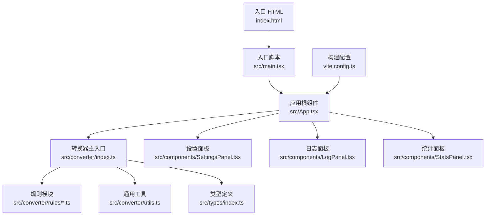
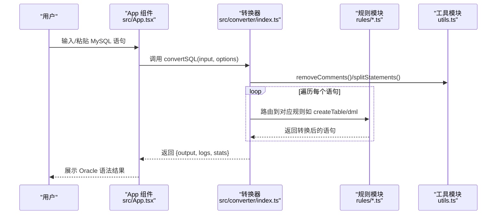
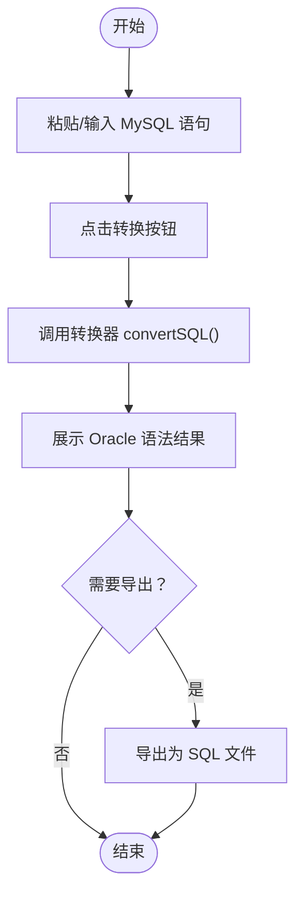
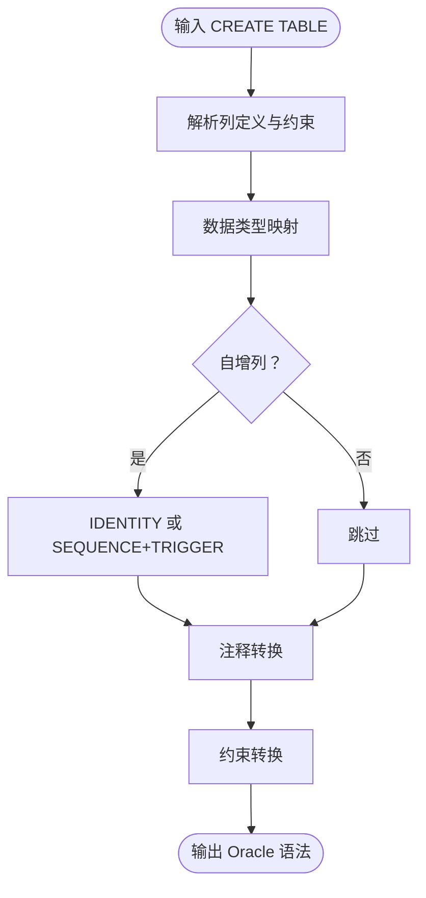
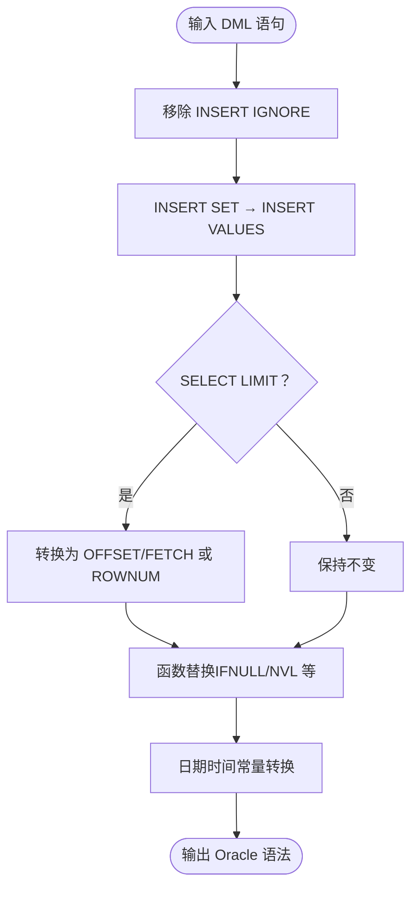
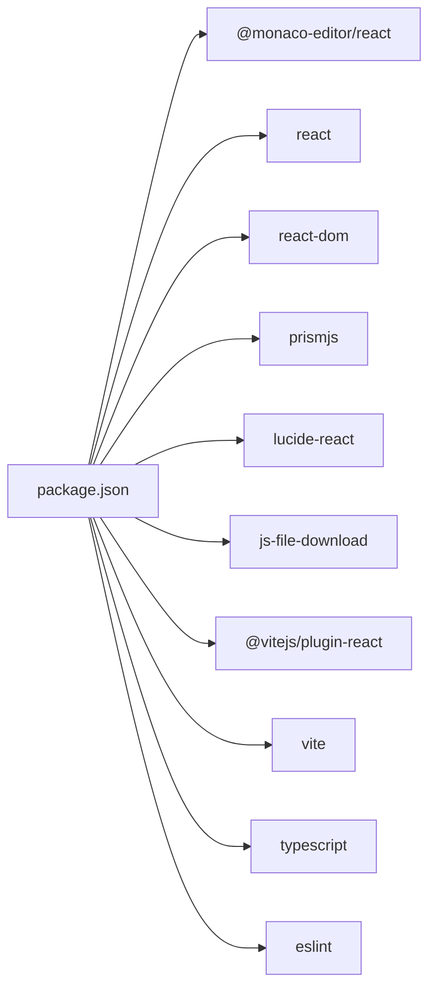
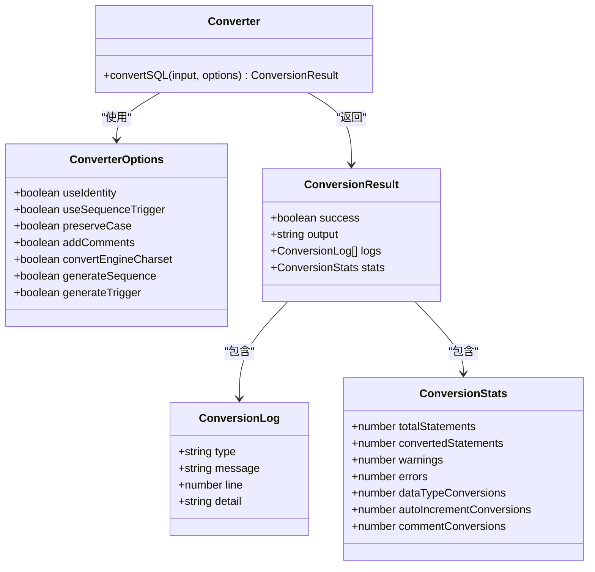

# 快速开始

<cite>
**本文引用的文件**
- [package.json](file://package.json)
- [vite.config.ts](file://vite.config.ts)
- [index.html](file://index.html)
- [src/main.tsx](file://src/main.tsx)
- [src/App.tsx](file://src/App.tsx)
- [src/converter/index.ts](file://src/converter/index.ts)
- [src/converter/utils.ts](file://src/converter/utils.ts)
- [src/converter/rules/createTable.ts](file://src/converter/rules/createTable.ts)
- [src/converter/rules/dml.ts](file://src/converter/rules/dml.ts)
- [src/converter/rules/dataTypes.ts](file://src/converter/rules/dataTypes.ts)
- [src/converter/customRules.ts](file://src/converter/customRules.ts)
- [src/types/index.ts](file://src/types/index.ts)
- [src/components/SettingsPanel.tsx](file://src/components/SettingsPanel.tsx)
- [src/components/LogPanel.tsx](file://src/components/LogPanel.tsx)
- [src/components/StatsPanel.tsx](file://src/components/StatsPanel.tsx)
</cite>

## 目录
1. [简介](#简介)
2. [项目结构](#项目结构)
3. [核心组件](#核心组件)
4. [架构概览](#架构概览)
5. [详细组件分析](#详细组件分析)
6. [依赖关系分析](#依赖关系分析)
7. [性能注意事项](#性能注意事项)
8. [故障排除指南](#故障排除指南)
9. [结论](#结论)
10. [附录](#附录)

## 简介
本指南面向首次使用 SQL 转换器的用户，帮助您在本地快速完成环境准备、安装与运行，并掌握基本的使用方法。该工具可将 MySQL 语法转换为 Oracle 兼容语法，支持交互式编辑、实时转换、日志与统计信息展示，以及多种转换规则与自定义扩展。

## 项目结构
该项目采用 React + TypeScript + Vite 技术栈，前端界面通过 Monaco Editor 提供 SQL 编辑体验，核心转换逻辑位于 converter 目录，按功能拆分为规则模块与通用工具。

**图表来源**
- [index.html:1-14](file://index.html#L1-L14)
- [src/main.tsx:1-11](file://src/main.tsx#L1-L11)
- [src/App.tsx:1-282](file://src/App.tsx#L1-L282)
- [src/converter/index.ts:1-129](file://src/converter/index.ts#L1-L129)
- [src/converter/utils.ts:1-115](file://src/converter/utils.ts#L1-L115)
- [src/types/index.ts:1-44](file://src/types/index.ts#L1-L44)
- [src/components/SettingsPanel.tsx:1-100](file://src/components/SettingsPanel.tsx#L1-L100)
- [src/components/LogPanel.tsx:1-82](file://src/components/LogPanel.tsx#L1-L82)
- [src/components/StatsPanel.tsx:1-42](file://src/components/StatsPanel.tsx#L1-L42)
- [vite.config.ts:1-9](file://vite.config.ts#L1-L9)

**章节来源**
- [package.json:1-36](file://package.json#L1-L36)
- [vite.config.ts:1-9](file://vite.config.ts#L1-L9)
- [index.html:1-14](file://index.html#L1-L14)
- [src/main.tsx:1-11](file://src/main.tsx#L1-L11)

## 核心组件
- 转换器主入口：负责接收输入 SQL、拆分语句、路由到具体规则、收集日志与统计，并输出 Oracle 兼容结果。
- 规则模块：针对不同 SQL 类型（如建表、DML、分区、索引、注释等）提供专用转换逻辑。
- 通用工具：提供标识符转换、注释移除、字符串保护与还原、语句拆分、命名生成等基础能力。
- 类型定义：统一 ConversionResult、ConversionLog、ConversionStats、ConverterOptions 等数据结构。
- UI 组件：设置面板（控制转换行为）、日志面板（展示转换过程与细节）、统计面板（汇总转换指标）。

**章节来源**
- [src/converter/index.ts:1-129](file://src/converter/index.ts#L1-L129)
- [src/converter/utils.ts:1-115](file://src/converter/utils.ts#L1-L115)
- [src/types/index.ts:1-44](file://src/types/index.ts#L1-L44)
- [src/components/SettingsPanel.tsx:1-100](file://src/components/SettingsPanel.tsx#L1-L100)
- [src/components/LogPanel.tsx:1-82](file://src/components/LogPanel.tsx#L1-L82)
- [src/components/StatsPanel.tsx:1-42](file://src/components/StatsPanel.tsx#L1-L42)

## 架构概览
下面的序列图展示了从用户输入到转换结果输出的完整流程。

**图表来源**
- [src/App.tsx:67-72](file://src/App.tsx#L67-L72)
- [src/converter/index.ts:59-125](file://src/converter/index.ts#L59-L125)
- [src/converter/utils.ts:52-72](file://src/converter/utils.ts#L52-L72)
- [src/converter/rules/createTable.ts:116-379](file://src/converter/rules/createTable.ts#L116-L379)
- [src/converter/rules/dml.ts:7-162](file://src/converter/rules/dml.ts#L7-L162)

## 详细组件分析

### 环境要求与安装
- Node.js 版本：建议使用 LTS 版本（如 18.x 或 20.x），确保包管理器与构建工具兼容。
- 包管理器：推荐使用 pnpm（本仓库使用 pnpm 锁定依赖，保证安装一致性）。
- 安装步骤：
  1) 获取项目代码后，在项目根目录执行安装命令（例如使用 pnpm）。
  2) 安装完成后，执行开发服务器启动命令，即可在浏览器中访问本地服务。
- 构建与预览：
  - 开发模式：dev
  - 生产构建：build
  - 本地预览：preview

提示：本项目基于 Vite 构建，无需复杂配置即可启动热重载开发环境。

**章节来源**
- [package.json:6-11](file://package.json#L6-L11)
- [vite.config.ts:1-9](file://vite.config.ts#L1-L9)

### 本地开发环境搭建
- 启动开发服务器：执行开发脚本后，Vite 将自动打开浏览器并启用热重载。
- 热重载配置：Vite 默认启用 HMR，修改源码后页面会自动刷新。
- 调试设置：可在浏览器开发者工具中对 React 组件与转换逻辑进行断点调试；Monaco Editor 提供 SQL 语法高亮与错误提示。

**章节来源**
- [vite.config.ts:5-8](file://vite.config.ts#L5-L8)
- [src/main.tsx:1-11](file://src/main.tsx#L1-L11)
- [src/App.tsx:190-206](file://src/App.tsx#L190-L206)

### 基本使用示例
- 输入 MySQL 语句：在左侧编辑器中粘贴或编写 MySQL 语法的 SQL。
- 执行转换：点击“转换”按钮或使用快捷键组合触发转换。
- 查看 Oracle 结果：右侧编辑器将显示转换后的 Oracle 语法结果。
- 导出与复制：支持将结果导出为 SQL 文件或复制到剪贴板。
- 加载示例：点击“加载示例”可快速体验典型建表与 DML 语句的转换效果。

**图表来源**
- [src/App.tsx:67-72](file://src/App.tsx#L67-L72)
- [src/App.tsx:98-111](file://src/App.tsx#L98-L111)
- [src/App.tsx:113-118](file://src/App.tsx#L113-L118)

**章节来源**
- [src/App.tsx:11-44](file://src/App.tsx#L11-L44)
- [src/App.tsx:67-123](file://src/App.tsx#L67-L123)

### 常见使用场景演示

#### 场景一：CREATE TABLE 语句转换
- 功能要点：
  - 识别临时表并转换为 Oracle GLOBAL TEMPORARY TABLE。
  - 数据类型映射（如 INT 映射为 NUMBER，TEXT 映射为 CLOB 等）。
  - 自增列处理：支持 IDENTITY 或 SEQUENCE+TRIGGER 两种方案。
  - 注释转换：将 COMMENT 转换为 COMMENT ON TABLE/COLUMN。
  - 约束转换：主键、唯一键、索引、外键等。
- 操作步骤：
  1) 在输入框粘贴 CREATE TABLE 语句。
  2) 根据需要在设置面板开启/关闭相关选项（如生成序列、触发器、注释转换等）。
  3) 点击转换，查看输出结果与日志。

**图表来源**
- [src/converter/rules/createTable.ts:116-379](file://src/converter/rules/createTable.ts#L116-L379)
- [src/converter/rules/dataTypes.ts:61-86](file://src/converter/rules/dataTypes.ts#L61-L86)

**章节来源**
- [src/converter/rules/createTable.ts:116-379](file://src/converter/rules/createTable.ts#L116-L379)
- [src/converter/rules/dataTypes.ts:1-106](file://src/converter/rules/dataTypes.ts#L1-L106)

#### 场景二：DML 语句处理
- 功能要点：
  - INSERT IGNORE 移除 IGNORE。
  - INSERT SET 语法转换为标准 INSERT VALUES。
  - SELECT LIMIT 转换为 OFFSET/FETCH 或 ROWNUM 子查询。
  - 函数替换：IFNULL→NVL、UUID→SYS_GUID、NOW→SYSDATE、SUBSTRING→SUBSTR 等。
  - 日期时间字符串常量转换为 TO_DATE/TO_TIMESTAMP。
- 操作步骤：
  1) 在输入框粘贴 DML 语句。
  2) 点击转换，关注日志中关于 LIMIT、多表更新/删除等不支持特性提示。

**图表来源**
- [src/converter/rules/dml.ts:7-162](file://src/converter/rules/dml.ts#L7-L162)

**章节来源**
- [src/converter/rules/dml.ts:1-163](file://src/converter/rules/dml.ts#L1-L163)

### 设置面板与转换选项
- 可选功能：
  - 使用 IDENTITY 替代 SEQUENCE：适用于 Oracle 12c+。
  - 生成 SEQUENCE + NEXTVAL：为 AUTO_INCREMENT 列创建序列并设置默认值。
  - 生成更新触发器：为 ON UPDATE CURRENT_TIMESTAMP 生成触发器。
  - 转换表注释：将 COMMENT 转为 COMMENT ON TABLE/COLUMN。
  - 移除 ENGINE/CHARSET：移除 MySQL 特有表选项。
  - 保留原始大小写：使用双引号保留标识符大小写。
- 影响范围：上述选项会影响转换结果的生成策略与附加对象（如序列、触发器、注释）。

**章节来源**
- [src/types/index.ts:25-43](file://src/types/index.ts#L25-L43)
- [src/components/SettingsPanel.tsx:41-99](file://src/components/SettingsPanel.tsx#L41-L99)

## 依赖关系分析
- 运行时依赖：React、React DOM、Monaco Editor、PrismJS、Lucide React 等。
- 开发依赖：Vite、@vitejs/plugin-react、TypeScript、ESLint 及其插件。
- 构建与脚本：dev/build/preview/lint 等命令由 package.json scripts 定义。

**图表来源**
- [package.json:12-34](file://package.json#L12-L34)

**章节来源**
- [package.json:1-36](file://package.json#L1-L36)

## 性能注意事项
- 大量语句的转换：转换器会对每条语句进行拆分与逐条处理，建议将长文本拆分为多个独立语句以提升可读性与可控性。
- 字符串与注释保护：工具模块在处理过程中会保护字符串常量与注释，避免误改，这在超长 SQL 中仍需注意内存占用。
- 规则匹配顺序：数据类型映射按长度降序匹配，确保精确替换，避免多余替换次数。
- UI 渲染：Monaco Editor 在大文本时渲染开销较大，建议分段输入或使用文件导入功能。

[本节为通用指导，无需特定文件来源]

## 故障排除指南
- 无法启动开发服务器
  - 检查 Node.js 版本是否满足要求。
  - 确认 pnpm 安装完成且网络可用。
  - 清理缓存后重试安装。
- 转换结果异常
  - 检查输入 SQL 是否包含不支持的语法（如多表 UPDATE/DELETE 的复杂场景）。
  - 查看日志面板中的警告与错误信息，按提示调整 SQL 或切换设置选项。
  - 对于 LIMIT、UUID、CURRENT_TIMESTAMP 等，确认是否符合 Oracle 语法。
- 导出失败或为空
  - 确保输出区域存在结果后再尝试导出。
  - 若为空，检查输入是否有效或是否触发了错误分支。
- 识别符大小写问题
  - 如需保留原始大小写，可在设置面板启用“保留原始大小写”，否则 Oracle 默认将标识符转为大写。

**章节来源**
- [src/App.tsx:98-111](file://src/App.tsx#L98-L111)
- [src/App.tsx:126-135](file://src/App.tsx#L126-L135)
- [src/converter/index.ts:97-107](file://src/converter/index.ts#L97-L107)
- [src/components/SettingsPanel.tsx:72-95](file://src/components/SettingsPanel.tsx#L72-L95)

## 结论
通过本快速开始指南，您已了解如何准备环境、安装依赖、启动开发服务器，并完成基本的 SQL 转换操作。建议结合设置面板的选项与日志/统计面板的信息，逐步优化转换结果，满足实际迁移需求。对于复杂场景，可进一步研究规则模块与自定义规则机制以扩展功能。

[本节为总结性内容，无需特定文件来源]

## 附录

### 常用命令速查
- 启动开发服务器：dev
- 生产构建：build
- 本地预览：preview
- 代码检查：lint

**章节来源**
- [package.json:6-11](file://package.json#L6-L11)

### 转换流程类图（代码级）

**图表来源**
- [src/types/index.ts:1-44](file://src/types/index.ts#L1-L44)
- [src/converter/index.ts:59-125](file://src/converter/index.ts#L59-L125)