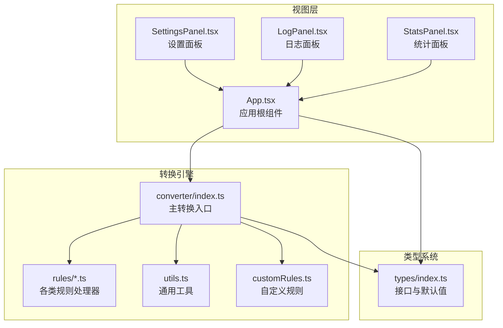
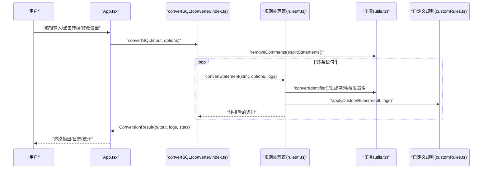
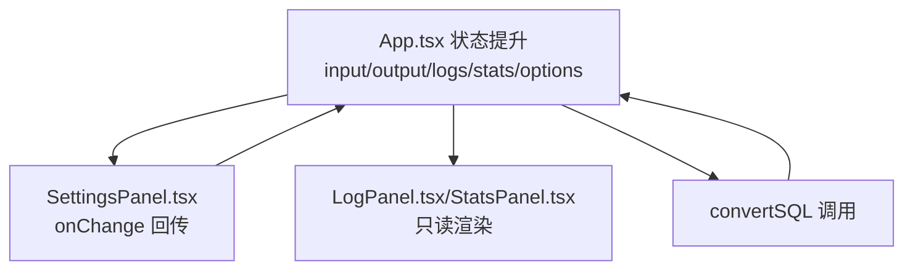
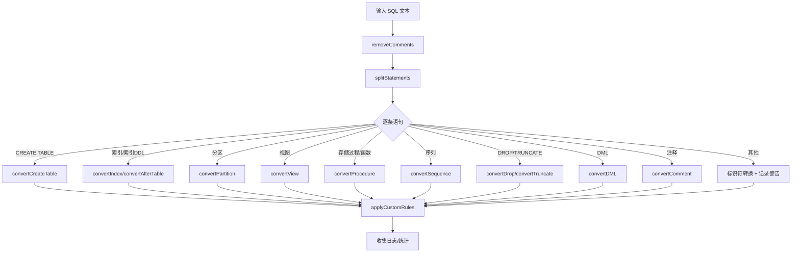
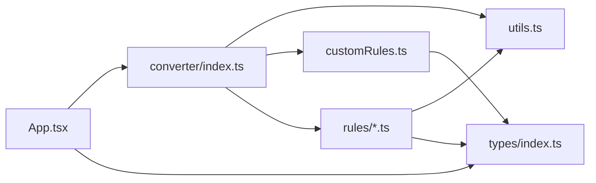

# 数据流架构

<cite>
**本文引用的文件**
- [src/App.tsx](file://src/App.tsx)
- [src/main.tsx](file://src/main.tsx)
- [src/converter/index.ts](file://src/converter/index.ts)
- [src/converter/utils.ts](file://src/converter/utils.ts)
- [src/converter/customRules.ts](file://src/converter/customRules.ts)
- [src/converter/rules/createTable.ts](file://src/converter/rules/createTable.ts)
- [src/converter/rules/dataTypes.ts](file://src/converter/rules/dataTypes.ts)
- [src/converter/rules/dml.ts](file://src/converter/rules/dml.ts)
- [src/converter/rules/index.ts](file://src/converter/rules/index.ts)
- [src/converter/rules/others.ts](file://src/converter/rules/others.ts)
- [src/converter/rules/comments.ts](file://src/converter/rules/comments.ts)
- [src/types/index.ts](file://src/types/index.ts)
- [src/components/SettingsPanel.tsx](file://src/components/SettingsPanel.tsx)
- [src/components/LogPanel.tsx](file://src/components/LogPanel.tsx)
- [src/components/StatsPanel.tsx](file://src/components/StatsPanel.tsx)
- [package.json](file://package.json)
</cite>

## 目录
1. [简介](#简介)
2. [项目结构](#项目结构)
3. [核心组件](#核心组件)
4. [架构总览](#架构总览)
5. [详细组件分析](#详细组件分析)
6. [依赖关系分析](#依赖关系分析)
7. [性能考量](#性能考量)
8. [故障排查指南](#故障排查指南)
9. [结论](#结论)
10. [附录](#附录)

## 简介
本文件面向“SQL转换器”的数据流架构，系统性阐述从用户输入到最终输出的完整处理链路，覆盖数据接收、解析、转换与渲染各阶段；说明状态管理模式（React状态提升、局部状态与全局状态策略）、数据类型系统（ConversionResult、ConverterOptions、ConversionStats等）、数据验证与类型安全、错误传播策略、异步处理模式（并发控制与进度反馈）、以及数据持久化与缓存、性能监控方案。文末提供数据流图与具体代码路径引用，便于快速定位实现。

## 项目结构
项目采用前端单页应用架构，核心由三部分组成：
- 视图层：基于 React 的组件体系，负责输入编辑、设置面板、日志与统计面板、输出展示。
- 转换引擎：位于 converter 目录，包含规则模块、工具函数与自定义规则扩展。
- 类型系统：集中于 types/index.ts，定义转换结果、日志、统计与转换选项的接口与默认值。

**图示来源**
- [src/App.tsx:1-282](file://src/App.tsx#L1-L282)
- [src/converter/index.ts:1-129](file://src/converter/index.ts#L1-L129)
- [src/converter/utils.ts:1-115](file://src/converter/utils.ts#L1-L115)
- [src/converter/customRules.ts:1-186](file://src/converter/customRules.ts#L1-L186)
- [src/converter/rules/createTable.ts:1-380](file://src/converter/rules/createTable.ts#L1-L380)
- [src/converter/rules/dataTypes.ts:1-106](file://src/converter/rules/dataTypes.ts#L1-L106)
- [src/converter/rules/dml.ts:1-163](file://src/converter/rules/dml.ts#L1-L163)
- [src/converter/rules/index.ts:1-135](file://src/converter/rules/index.ts#L1-L135)
- [src/converter/rules/others.ts:1-49](file://src/converter/rules/others.ts#L1-L49)
- [src/converter/rules/comments.ts:1-53](file://src/converter/rules/comments.ts#L1-L53)
- [src/types/index.ts:1-44](file://src/types/index.ts#L1-L44)

**章节来源**
- [src/App.tsx:1-282](file://src/App.tsx#L1-L282)
- [src/main.tsx:1-11](file://src/main.tsx#L1-L11)
- [src/converter/index.ts:1-129](file://src/converter/index.ts#L1-L129)
- [src/types/index.ts:1-44](file://src/types/index.ts#L1-L44)

## 核心组件
- 应用根组件 App.tsx：统一管理输入、输出、日志、统计、设置面板开关与快捷键；调用转换器执行转换并将结果回填至状态。
- 转换器入口 converter/index.ts：负责语句拆分、逐条路由到对应规则处理器、聚合日志与统计、错误捕获与回退。
- 规则处理器：按语句类型拆分（CREATE TABLE、索引、分区、DML、注释、存储过程/序列等），在各自模块内完成语法与类型转换。
- 工具函数 utils.ts：提供标识符转换、字符串字面量保护/还原、注释移除、语句拆分、命名规范生成等基础能力。
- 自定义规则 customRules.ts：提供可插拔的规则匹配与转换，支持针对特定表/列的批量处理。
- 类型系统 types/index.ts：定义 ConversionResult、ConversionLog、ConversionStats、ConverterOptions 及其默认值。
- 视图组件：SettingsPanel.tsx（设置面板）、LogPanel.tsx（日志面板）、StatsPanel.tsx（统计面板）。

**章节来源**
- [src/App.tsx:56-135](file://src/App.tsx#L56-L135)
- [src/converter/index.ts:59-125](file://src/converter/index.ts#L59-L125)
- [src/converter/utils.ts:52-72](file://src/converter/utils.ts#L52-L72)
- [src/converter/customRules.ts:170-185](file://src/converter/customRules.ts#L170-L185)
- [src/types/index.ts:8-44](file://src/types/index.ts#L8-L44)
- [src/components/SettingsPanel.tsx:41-99](file://src/components/SettingsPanel.tsx#L41-L99)
- [src/components/LogPanel.tsx:22-81](file://src/components/LogPanel.tsx#L22-L81)
- [src/components/StatsPanel.tsx:7-41](file://src/components/StatsPanel.tsx#L7-L41)

## 架构总览
整体数据流遵循“事件驱动 + 单向数据流”：
- 用户交互触发状态变更（输入、设置、操作按钮）。
- App 组件根据输入与选项调用 convertSQL，得到 ConversionResult。
- 结果通过状态回填到输出编辑器、日志面板与统计面板。
- 设置面板通过回调更新转换选项，影响后续转换行为。

**图示来源**
- [src/App.tsx:67-72](file://src/App.tsx#L67-L72)
- [src/converter/index.ts:59-125](file://src/converter/index.ts#L59-L125)
- [src/converter/utils.ts:52-72](file://src/converter/utils.ts#L52-L72)
- [src/converter/customRules.ts:170-185](file://src/converter/customRules.ts#L170-L185)
- [src/converter/rules/createTable.ts:116-379](file://src/converter/rules/createTable.ts#L116-L379)
- [src/converter/rules/dml.ts:7-162](file://src/converter/rules/dml.ts#L7-L162)

## 详细组件分析

### 数据类型系统与状态模型
- ConversionResult：封装一次转换的最终结果，包含布尔成功标志、输出文本、日志数组与统计对象。
- ConversionStats：记录总语句数、已转换数、警告数、错误数及三类转换次数（数据类型、自增、注释）。
- ConversionLog：记录日志类型、消息、可选行号与详情。
- ConverterOptions：控制转换行为的选项集合，包含是否使用 IDENTITY、是否生成 SEQUENCE+TRIGGER、是否保留大小写、是否转换注释、是否移除 ENGINE/CHARSET、是否生成序列/触发器等。
- 默认选项 DEFAULT_OPTIONS：提供合理的默认值，确保开箱即用。

这些类型在 App.tsx 中作为 React 状态使用，用于驱动 UI 更新与持久化策略设计。

**章节来源**
- [src/types/index.ts:1-44](file://src/types/index.ts#L1-L44)
- [src/App.tsx:46-64](file://src/App.tsx#L46-L64)

### 状态管理架构
- 状态提升：App.tsx 统一持有 input、output、logs、stats、options 等核心状态，避免跨组件重复维护。
- 局部状态：面板开关（设置面板、日志面板）与复制提示（copied）等轻量状态保留在组件内部，减少无关重渲染。
- 全局状态存储策略：当前实现未引入外部状态库，可通过 localStorage/IndexedDB 在浏览器端持久化 options 与最近一次转换结果，便于刷新后恢复。

**图示来源**
- [src/App.tsx:56-135](file://src/App.tsx#L56-L135)
- [src/components/SettingsPanel.tsx:41-99](file://src/components/SettingsPanel.tsx#L41-L99)

**章节来源**
- [src/App.tsx:56-135](file://src/App.tsx#L56-L135)
- [src/components/SettingsPanel.tsx:41-99](file://src/components/SettingsPanel.tsx#L41-L99)

### 数据接收与预处理
- 输入接收：Monaco 编辑器通过受控组件 value/onChange 同步 input 状态。
- 文件导入：FileReader 异步读取文本，成功后写入 input 并推送成功日志。
- 注释清理与语句拆分：removeComments 去除行注释与块注释，同时保护字符串字面量；splitStatements 按分号拆分，忽略字符串内部分号。
- 选项变更：SettingsPanel 通过回调更新 options，影响后续转换。

**章节来源**
- [src/App.tsx:81-96](file://src/App.tsx#L81-L96)
- [src/converter/utils.ts:52-72](file://src/converter/utils.ts#L52-L72)
- [src/components/SettingsPanel.tsx:41-99](file://src/components/SettingsPanel.tsx#L41-L99)

### 解析与路由
- 语句类型判断：convertStatement 基于首词与正则匹配路由到对应规则处理器（CREATE TABLE、索引、ALTER TABLE、分区、视图、存储过程、序列、DROP/TRUNCATE、DML、注释等）。
- 未识别语句：仅进行标识符转换并记录警告。
- 自定义规则：每条语句转换完成后统一应用 applyCustomRules，按匹配条件执行 transform 并记录日志。

**图示来源**
- [src/converter/index.ts:15-54](file://src/converter/index.ts#L15-L54)
- [src/converter/index.ts:59-125](file://src/converter/index.ts#L59-L125)
- [src/converter/customRules.ts:170-185](file://src/converter/customRules.ts#L170-L185)

**章节来源**
- [src/converter/index.ts:15-54](file://src/converter/index.ts#L15-L54)
- [src/converter/index.ts:59-125](file://src/converter/index.ts#L59-L125)
- [src/converter/customRules.ts:170-185](file://src/converter/customRules.ts#L170-L185)

### 转换与渲染
- 输出渲染：Monaco 编辑器以只读模式展示 output，支持自动布局与换行。
- 日志与统计：LogPanel/StatsPanel 分别消费 logs 与 stats，实时反映转换过程与结果质量。
- 导出与复制：导出为 SQL 文件，复制到剪贴板并短暂提示。

**章节来源**
- [src/App.tsx:190-251](file://src/App.tsx#L190-L251)
- [src/components/LogPanel.tsx:22-81](file://src/components/LogPanel.tsx#L22-L81)
- [src/components/StatsPanel.tsx:7-41](file://src/components/StatsPanel.tsx#L7-L41)
- [src/App.tsx:98-118](file://src/App.tsx#L98-L118)

### 数据验证与类型安全
- 输入校验：convertSQL 对空输入进行短路处理并返回 info 日志。
- 错误捕获：for 循环内 try/catch 捕获异常，记录 error 日志与原始语句片段，输出兜底注释。
- 日志统计：遍历 logs 计算 warnings/errors，并按消息关键词统计三类转换次数。
- 类型安全：通过 TypeScript 接口约束 ConversionResult/ConversionLog/ConversionStats/ConverterOptions，确保跨模块传递一致。

**章节来源**
- [src/converter/index.ts:71-78](file://src/converter/index.ts#L71-L78)
- [src/converter/index.ts:97-107](file://src/converter/index.ts#L97-L107)
- [src/converter/index.ts:113-117](file://src/converter/index.ts#L113-L117)
- [src/types/index.ts:1-44](file://src/types/index.ts#L1-L44)

### 异步处理与并发控制
- 当前实现为同步转换：convertSQL 顺序处理语句，无并发控制与进度反馈。
- 性能优化建议：
  - 将 convertSQL 改造为 Web Worker 或后台任务，避免阻塞 UI。
  - 引入任务队列与分片策略，对超长 SQL 进行分段转换并合并结果。
  - 在 UI 层提供进度条与取消机制，结合 AbortSignal 控制任务生命周期。

**章节来源**
- [src/converter/index.ts:59-125](file://src/converter/index.ts#L59-L125)

### 数据持久化与缓存
- 本地持久化：可将 options 与最近一次 ConversionResult 持久化到 localStorage/IndexedDB，刷新后恢复。
- 缓存策略：对热点规则（如数据类型映射）可做内存缓存；对大型 SQL 可缓存中间产物（如清理后的文本、拆分后的语句列表）。
- 性能监控：统计每次转换耗时、错误率与日志数量，辅助优化与告警。

**章节来源**
- [src/App.tsx:56-64](file://src/App.tsx#L56-L64)
- [src/converter/rules/dataTypes.ts:6-86](file://src/converter/rules/dataTypes.ts#L6-L86)

## 依赖关系分析
- App.tsx 依赖转换器入口与类型系统，间接依赖所有规则与工具。
- 转换器入口依赖工具与自定义规则，并按语句类型路由到对应规则模块。
- 规则模块之间低耦合，仅共享 utils.ts 与 types.ts。
- 视图组件依赖类型系统与 App.tsx 状态，不直接参与转换逻辑。

**图示来源**
- [src/App.tsx:1-10](file://src/App.tsx#L1-L10)
- [src/converter/index.ts:1-11](file://src/converter/index.ts#L1-L11)
- [src/converter/utils.ts:1-4](file://src/converter/utils.ts#L1-L4)
- [src/converter/customRules.ts:1-2](file://src/converter/customRules.ts#L1-L2)
- [src/converter/rules/createTable.ts:1-4](file://src/converter/rules/createTable.ts#L1-L4)
- [src/types/index.ts:1-6](file://src/types/index.ts#L1-L6)

**章节来源**
- [src/App.tsx:1-10](file://src/App.tsx#L1-L10)
- [src/converter/index.ts:1-11](file://src/converter/index.ts#L1-L11)
- [src/converter/utils.ts:1-4](file://src/converter/utils.ts#L1-L4)
- [src/converter/customRules.ts:1-2](file://src/converter/customRules.ts#L1-L2)
- [src/converter/rules/createTable.ts:1-4](file://src/converter/rules/createTable.ts#L1-L4)
- [src/types/index.ts:1-6](file://src/types/index.ts#L1-L6)

## 性能考量
- 语法解析复杂度：规则处理器对 SQL 的解析采用正则与手工游标相结合的方式，时间复杂度与语句长度线性相关；对超长语句建议分片处理。
- 字符串保护与还原：extractStringLiterals/restoreStringLiterals 保证注释与字符串内部结构不被破坏，带来额外的字符串扫描成本。
- 数据类型映射：TYPE_MAP 有序替换，建议按长度降序匹配以减少重复替换。
- UI 渲染：Monaco 编辑器在大文本时渲染成本较高，建议延迟渲染或虚拟滚动。
- 并发与进度：建议引入 Web Worker 与进度回调，避免主线程阻塞。

**章节来源**
- [src/converter/utils.ts:33-47](file://src/converter/utils.ts#L33-L47)
- [src/converter/rules/dataTypes.ts:61-86](file://src/converter/rules/dataTypes.ts#L61-L86)
- [src/App.tsx:190-251](file://src/App.tsx#L190-L251)

## 故障排查指南
- 输入为空：convertSQL 返回 info 日志并清空输出。
- 语句拆分异常：检查 splitStatements 是否正确保护字符串字面量。
- 未知语句类型：convertStatement 仅进行标识符转换并记录 warning，确认是否遗漏规则分支。
- 转换失败：for 循环内捕获异常，记录 error 日志与原始片段，检查规则处理器实现。
- 日志过多或过少：核对 logs 收集逻辑与 applyCustomRules 的匹配条件。
- 导出/复制无效：检查输出非空与浏览器剪贴板权限。

**章节来源**
- [src/converter/index.ts:71-78](file://src/converter/index.ts#L71-L78)
- [src/converter/index.ts:97-107](file://src/converter/index.ts#L97-L107)
- [src/converter/index.ts:43-48](file://src/converter/index.ts#L43-L48)
- [src/App.tsx:98-118](file://src/App.tsx#L98-L118)

## 结论
本项目以清晰的职责划分实现了从输入到输出的完整数据流：App.tsx 负责状态与 UI，converter/index.ts 负责调度与聚合，rules/*.ts 与 utils.ts 提供细粒度转换能力，customRules.ts 提供扩展性。类型系统保障了跨模块一致性，日志与统计提供了可观测性。未来可在并发与性能方面进一步优化，以支撑更大规模的 SQL 转换场景。

## 附录
- 代码示例路径（不含具体代码内容）：
  - [主转换入口:59-125](file://src/converter/index.ts#L59-L125)
  - [语句路由与自定义规则应用:15-54](file://src/converter/index.ts#L15-L54)
  - [工具函数：注释移除与语句拆分:52-72](file://src/converter/utils.ts#L52-L72)
  - [工具函数：标识符转换与命名规范:8-21](file://src/converter/utils.ts#L8-L21)
  - [自定义规则：匹配与转换:170-185](file://src/converter/customRules.ts#L170-L185)
  - [数据类型映射与枚举约束提取:6-106](file://src/converter/rules/dataTypes.ts#L6-L106)
  - [CREATE TABLE 转换：列定义、约束、触发器与序列:116-379](file://src/converter/rules/createTable.ts#L116-L379)
  - [DML 转换：LIMIT/OFFSET/FROM DUAL/函数替换:55-162](file://src/converter/rules/dml.ts#L55-L162)
  - [索引与 ALTER TABLE 转换:8-134](file://src/converter/rules/index.ts#L8-L134)
  - [注释/DROP/TRUNCATE/VIEW 转换:16-52](file://src/converter/rules/comments.ts#L16-L52)
  - [存储过程/函数与序列转换:7-48](file://src/converter/rules/others.ts#L7-L48)
  - [类型定义与默认选项:1-44](file://src/types/index.ts#L1-L44)
  - [设置面板交互:41-99](file://src/components/SettingsPanel.tsx#L41-L99)
  - [日志面板渲染:22-81](file://src/components/LogPanel.tsx#L22-81)
  - [统计面板渲染:7-41](file://src/components/StatsPanel.tsx#L7-41)
  - [应用入口与根组件:1-11](file://src/main.tsx#L1-11), [src/App.tsx:1-282](file://src/App.tsx#L1-L282)
  - [依赖声明:12-20](file://package.json#L12-L20)