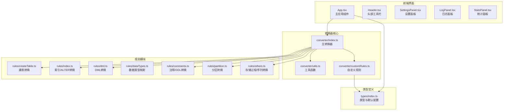
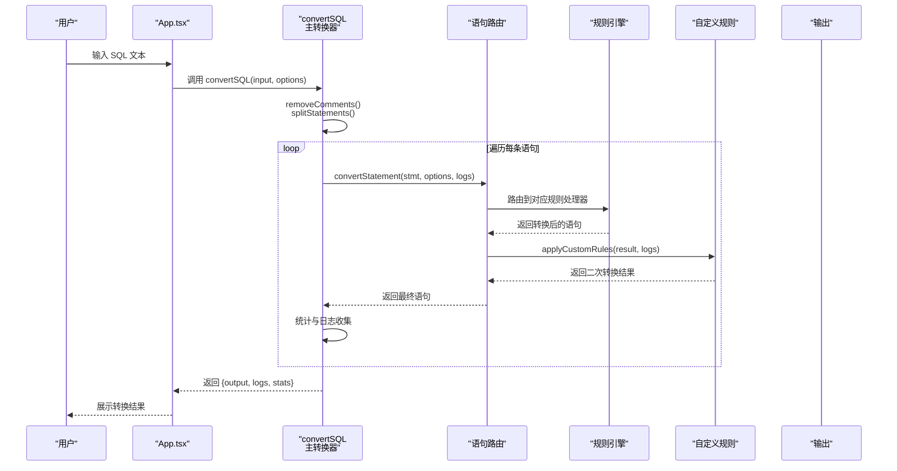
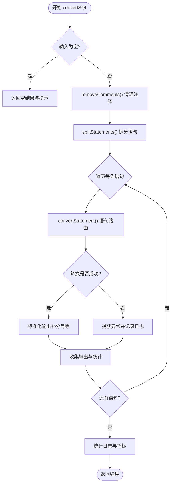
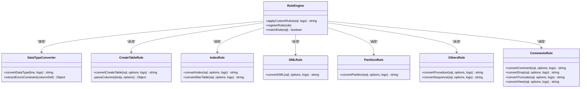
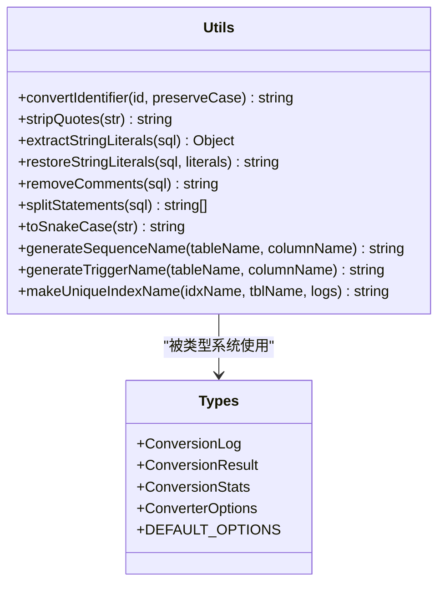
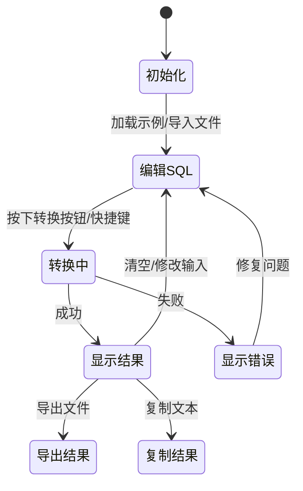
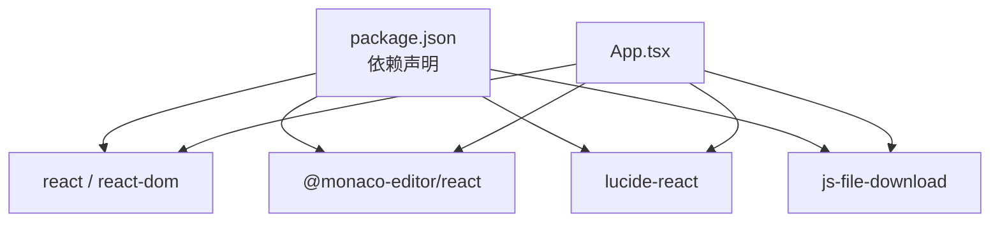

# 核心架构设计

<cite>
**本文档引用的文件**
- [src/converter/index.ts](file://src/converter/index.ts)
- [src/converter/utils.ts](file://src/converter/utils.ts)
- [src/converter/customRules.ts](file://src/converter/customRules.ts)
- [src/converter/rules/index.ts](file://src/converter/rules/index.ts)
- [src/converter/rules/createTable.ts](file://src/converter/rules/createTable.ts)
- [src/converter/rules/dml.ts](file://src/converter/rules/dml.ts)
- [src/converter/rules/dataTypes.ts](file://src/converter/rules/dataTypes.ts)
- [src/converter/rules/comments.ts](file://src/converter/rules/comments.ts)
- [src/converter/rules/partition.ts](file://src/converter/rules/partition.ts)
- [src/converter/rules/others.ts](file://src/converter/rules/others.ts)
- [src/types/index.ts](file://src/types/index.ts)
- [src/App.tsx](file://src/App.tsx)
- [src/main.tsx](file://src/main.tsx)
- [package.json](file://package.json)
</cite>

## 目录
1. [简介](#简介)
2. [项目结构](#项目结构)
3. [核心组件](#核心组件)
4. [架构总览](#架构总览)
5. [详细组件分析](#详细组件分析)
6. [依赖关系分析](#依赖关系分析)
7. [性能考虑](#性能考虑)
8. [故障排除指南](#故障排除指南)
9. [结论](#结论)

## 简介
本项目是一个基于前端的 SQL 转换器，专注于将 MySQL 语法转换为 Oracle/OceanBase 兼容语法。系统采用模块化设计，通过“语句路由 + 规则引擎”的架构实现高扩展性的转换能力。核心设计理念包括：
- 语句路由机制：根据 SQL 语句类型动态选择对应的转换器
- 规则引擎架构：内置规则与用户自定义规则相结合，支持灵活扩展
- 错误处理策略：统一的日志记录与统计，确保转换过程的可观测性
- 状态管理模式：清晰的输入/输出/日志/统计状态流转
- 事件处理机制：基于 React 的事件驱动交互

## 项目结构
项目采用“功能模块 + 规则引擎”的组织方式，前端入口负责用户交互，转换器模块负责核心逻辑，规则模块提供可插拔的转换规则。

**图表来源**
- [src/App.tsx:1-282](file://src/App.tsx#L1-L282)
- [src/converter/index.ts:1-129](file://src/converter/index.ts#L1-L129)
- [src/converter/utils.ts:1-115](file://src/converter/utils.ts#L1-L115)
- [src/converter/customRules.ts:1-186](file://src/converter/customRules.ts#L1-L186)
- [src/converter/rules/index.ts:1-135](file://src/converter/rules/index.ts#L1-L135)
- [src/converter/rules/createTable.ts:1-380](file://src/converter/rules/createTable.ts#L1-L380)
- [src/converter/rules/dml.ts:1-163](file://src/converter/rules/dml.ts#L1-L163)
- [src/converter/rules/dataTypes.ts:1-106](file://src/converter/rules/dataTypes.ts#L1-L106)
- [src/converter/rules/comments.ts:1-53](file://src/converter/rules/comments.ts#L1-L53)
- [src/converter/rules/partition.ts:1-38](file://src/converter/rules/partition.ts#L1-L38)
- [src/converter/rules/others.ts:1-49](file://src/converter/rules/others.ts#L1-L49)
- [src/types/index.ts:1-44](file://src/types/index.ts#L1-L44)

**章节来源**
- [src/App.tsx:1-282](file://src/App.tsx#L1-L282)
- [src/main.tsx:1-11](file://src/main.tsx#L1-L11)

## 核心组件
- 主转换器：负责语句拆分、注释清理、语句路由、逐条转换与结果汇总
- 规则引擎：内置规则（建表、索引、DML、分区等）与用户自定义规则
- 工具函数：标识符转换、字符串保护/还原、注释移除、语句拆分等
- 类型系统：统一的输入输出、日志、统计与配置类型定义
- 前端界面：基于 Monaco Editor 的编辑器、设置面板、日志与统计展示

**章节来源**
- [src/converter/index.ts:1-129](file://src/converter/index.ts#L1-L129)
- [src/converter/utils.ts:1-115](file://src/converter/utils.ts#L1-L115)
- [src/converter/customRules.ts:1-186](file://src/converter/customRules.ts#L1-L186)
- [src/types/index.ts:1-44](file://src/types/index.ts#L1-L44)

## 架构总览
系统采用“前端渲染 + 后端转换器”的双层架构。前端负责用户交互与可视化，后端转换器负责 SQL 语法解析与转换。核心流程如下：
- 用户输入 SQL 文本
- 注释清理与语句拆分
- 语句类型识别与路由
- 规则引擎执行转换
- 自定义规则二次转换
- 结果拼接与统计

**图表来源**
- [src/converter/index.ts:59-125](file://src/converter/index.ts#L59-L125)
- [src/converter/index.ts:15-54](file://src/converter/index.ts#L15-L54)
- [src/converter/customRules.ts:170-185](file://src/converter/customRules.ts#L170-L185)

## 详细组件分析

### 主转换器与语句路由
主转换器负责整体控制流，包括输入校验、注释清理、语句拆分、逐条转换与结果汇总。语句路由根据首关键字与正则匹配决定转换器，覆盖建表、索引、ALTER、分区、视图、存储过程、序列、DROP、TRUNCATE、DML、注释等场景。

**图表来源**
- [src/converter/index.ts:59-125](file://src/converter/index.ts#L59-L125)

**章节来源**
- [src/converter/index.ts:15-54](file://src/converter/index.ts#L15-L54)
- [src/converter/index.ts:59-125](file://src/converter/index.ts#L59-L125)

### 规则引擎架构
规则引擎采用“规则注册 + 匹配 + 转换”的模式，每个规则模块负责特定类型的 SQL 转换。数据类型映射采用集中式映射表，支持带参与无参类型转换；DML 转换涵盖 INSERT/UPDATE/DELETE/SELECT 的常见差异；索引/ALTER 转换处理列定义、约束与注释；分区转换处理 RANGE/LIST 分区语法差异；其他模块处理存储过程/函数与序列。

**图表来源**
- [src/converter/customRules.ts:170-185](file://src/converter/customRules.ts#L170-L185)
- [src/converter/rules/dataTypes.ts:61-86](file://src/converter/rules/dataTypes.ts#L61-L86)
- [src/converter/rules/createTable.ts:116-379](file://src/converter/rules/createTable.ts#L116-L379)
- [src/converter/rules/index.ts:8-134](file://src/converter/rules/index.ts#L8-L134)
- [src/converter/rules/dml.ts:7-162](file://src/converter/rules/dml.ts#L7-L162)
- [src/converter/rules/partition.ts:7-37](file://src/converter/rules/partition.ts#L7-L37)
- [src/converter/rules/others.ts:7-48](file://src/converter/rules/others.ts#L7-L48)
- [src/converter/rules/comments.ts:7-52](file://src/converter/rules/comments.ts#L7-L52)

**章节来源**
- [src/converter/customRules.ts:1-186](file://src/converter/customRules.ts#L1-L186)
- [src/converter/rules/dataTypes.ts:1-106](file://src/converter/rules/dataTypes.ts#L1-L106)
- [src/converter/rules/createTable.ts:1-380](file://src/converter/rules/createTable.ts#L1-L380)
- [src/converter/rules/index.ts:1-135](file://src/converter/rules/index.ts#L1-L135)
- [src/converter/rules/dml.ts:1-163](file://src/converter/rules/dml.ts#L1-L163)
- [src/converter/rules/partition.ts:1-38](file://src/converter/rules/partition.ts#L1-L38)
- [src/converter/rules/others.ts:1-49](file://src/converter/rules/others.ts#L1-L49)
- [src/converter/rules/comments.ts:1-53](file://src/converter/rules/comments.ts#L1-L53)

### 工具函数与数据结构
工具函数提供标识符转换、字符串保护/还原、注释移除、语句拆分、命名规范转换等基础能力。类型系统定义了转换结果、日志、统计与配置的结构，确保前后端一致的数据契约。

**图表来源**
- [src/converter/utils.ts:8-115](file://src/converter/utils.ts#L8-L115)
- [src/types/index.ts:1-44](file://src/types/index.ts#L1-L44)

**章节来源**
- [src/converter/utils.ts:1-115](file://src/converter/utils.ts#L1-L115)
- [src/types/index.ts:1-44](file://src/types/index.ts#L1-L44)

### 前端交互与状态管理
前端基于 React 管理输入/输出/日志/统计状态，提供快捷键、文件导入导出、复制等功能。主应用组件协调转换器与 UI 组件，确保状态一致性与用户体验。

**图表来源**
- [src/App.tsx:56-136](file://src/App.tsx#L56-L136)

**章节来源**
- [src/App.tsx:1-282](file://src/App.tsx#L1-L282)

## 依赖关系分析
系统依赖 React 生态与 Monaco Editor 提供编辑体验，类型系统与转换器模块相互解耦，规则模块通过统一接口接入主转换器。

**图表来源**
- [package.json:12-20](file://package.json#L12-L20)
- [src/App.tsx:1-10](file://src/App.tsx#L1-L10)

**章节来源**
- [package.json:1-36](file://package.json#L1-L36)

## 性能考虑
- 正则匹配优化：规则引擎按类型优先级匹配，减少不必要的替换次数
- 字符串保护机制：在注释与字符串保护后再进行转换，避免误伤
- 语句级处理：逐条语句转换，便于错误定位与统计
- 可配置开关：通过选项控制序列/触发器生成，平衡功能完整性与性能
- 前端渲染优化：Monaco Editor 按需渲染，避免全量重绘

## 故障排除指南
- 语句无法识别：检查首关键字与正则匹配条件，必要时添加自定义规则
- 注释导致语法错误：确认注释清理逻辑是否正确执行
- 数据类型转换异常：核对映射表与参数解析逻辑
- 自定义规则冲突：检查规则匹配顺序与转换函数实现
- 性能问题：减少一次性处理的语句数量，启用必要的配置项

**章节来源**
- [src/converter/index.ts:97-107](file://src/converter/index.ts#L97-L107)
- [src/converter/customRules.ts:170-185](file://src/converter/customRules.ts#L170-L185)

## 结论
本项目通过模块化设计与规则引擎实现了高扩展性的 SQL 转换能力。语句路由机制确保了不同 SQL 类型的精准处理，自定义规则提供了灵活的扩展点。前端与后端的清晰分工提升了开发效率与维护性。未来可在以下方面持续优化：
- 引入 AST 解析以提升转换准确性
- 增强规则引擎的并发执行能力
- 完善错误恢复与回滚机制
- 扩展更多数据库方言的支持