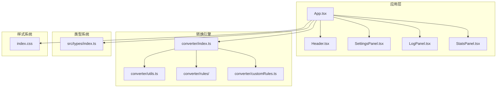
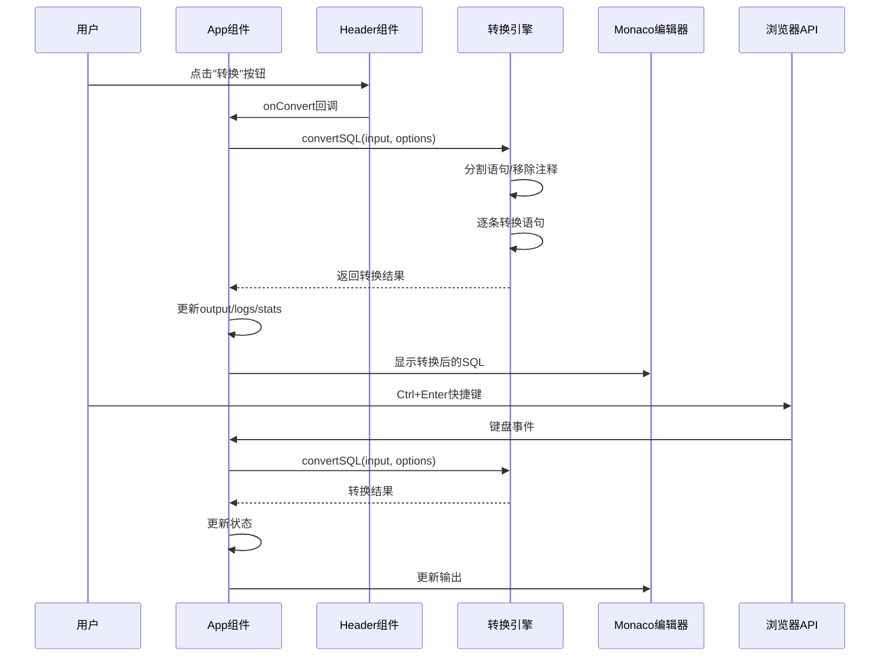
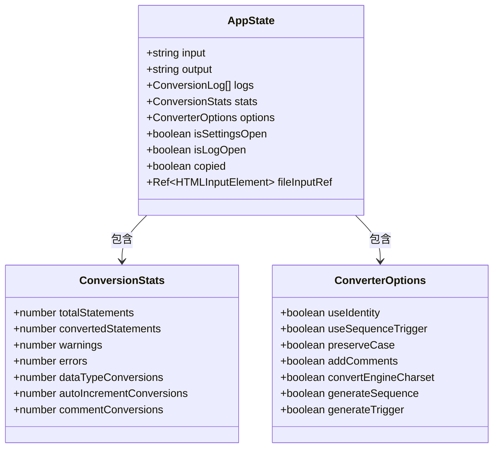
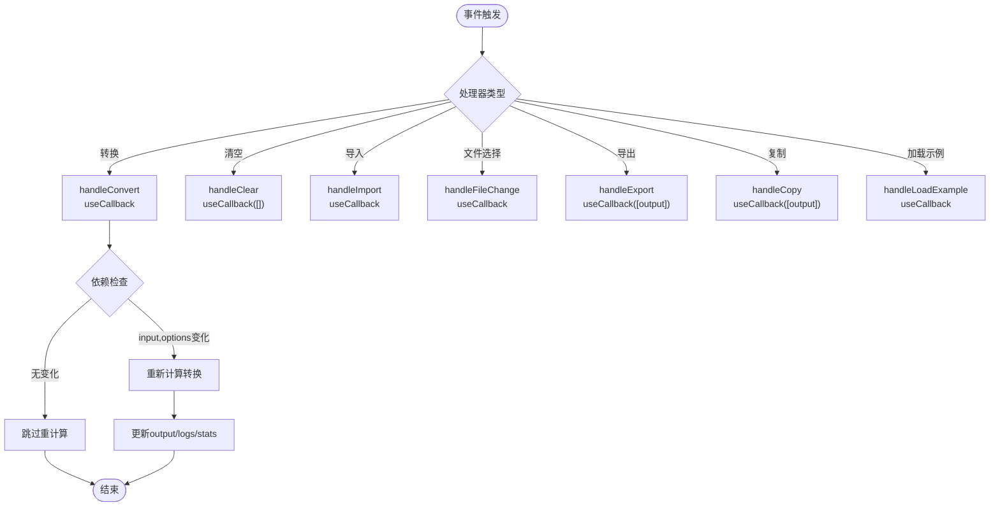
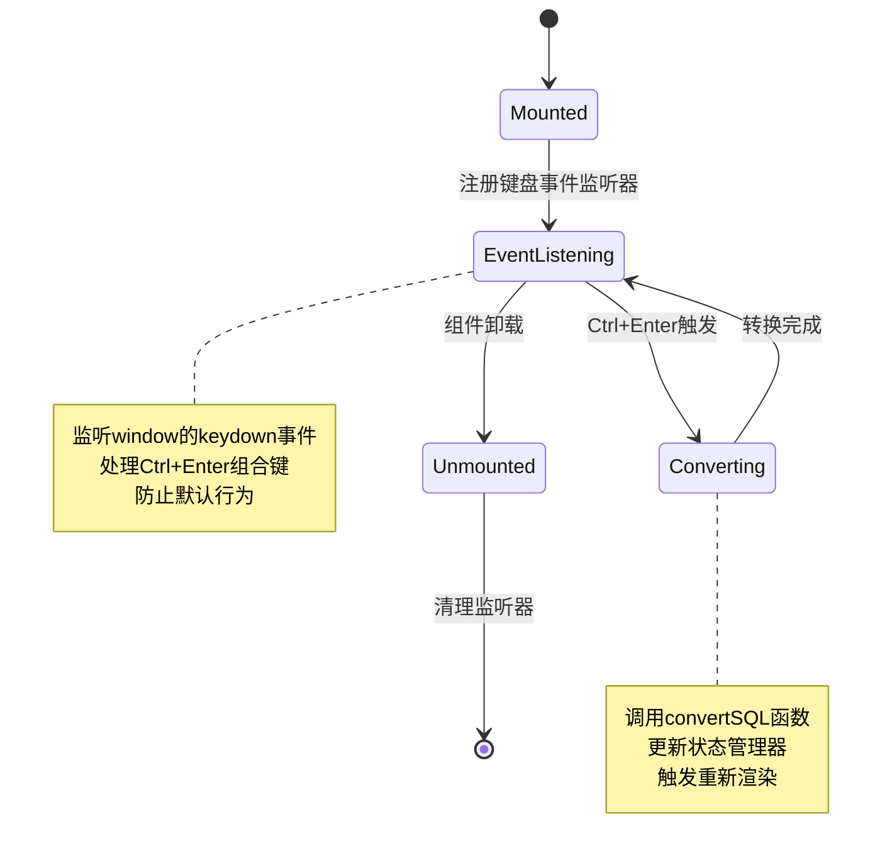
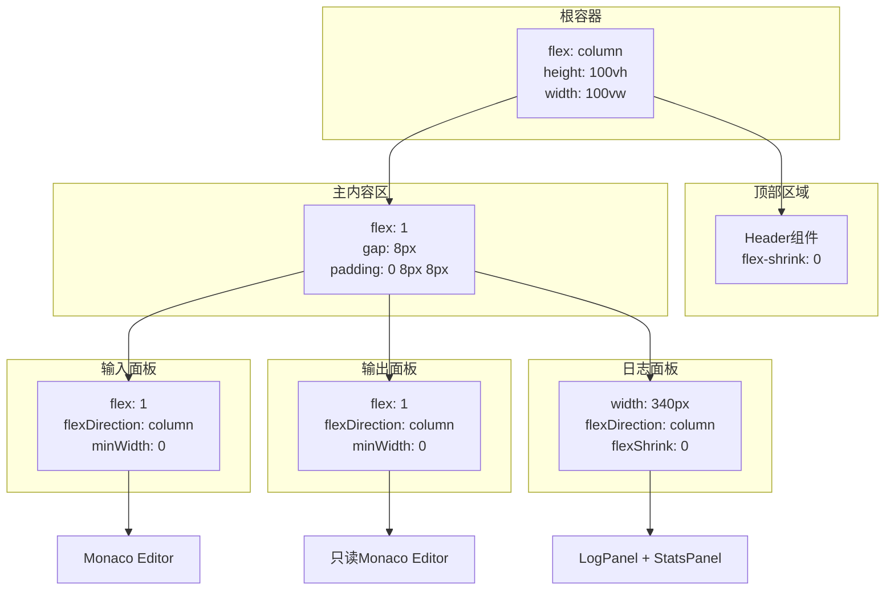
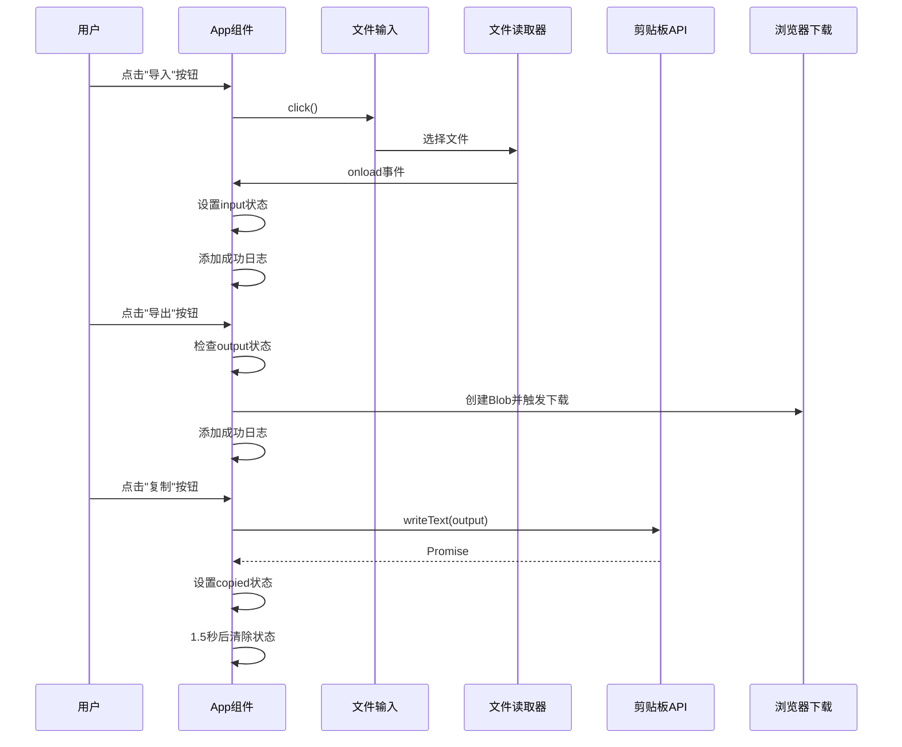
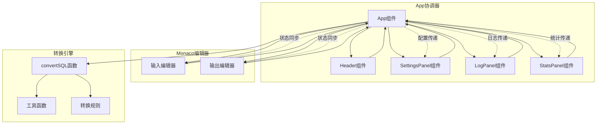

# 主应用组件架构

<cite>
**本文档引用的文件**
- [src/App.tsx](file://src/App.tsx)
- [src/main.tsx](file://src/main.tsx)
- [src/index.css](file://src/index.css)
- [src/components/Header.tsx](file://src/components/Header.tsx)
- [src/components/SettingsPanel.tsx](file://src/components/SettingsPanel.tsx)
- [src/components/LogPanel.tsx](file://src/components/LogPanel.tsx)
- [src/components/StatsPanel.tsx](file://src/components/StatsPanel.tsx)
- [src/converter/index.ts](file://src/converter/index.ts)
- [src/converter/utils.ts](file://src/converter/utils.ts)
- [src/converter/rules/createTable.ts](file://src/converter/rules/createTable.ts)
- [src/converter/customRules.ts](file://src/converter/customRules.ts)
- [src/types/index.ts](file://src/types/index.ts)
- [README.md](file://README.md)
</cite>

## 目录
1. [简介](#简介)
2. [项目结构](#项目结构)
3. [核心组件](#核心组件)
4. [架构概览](#架构概览)
5. [详细组件分析](#详细组件分析)
6. [依赖关系分析](#依赖关系分析)
7. [性能考量](#性能考量)
8. [故障排除指南](#故障排除指南)
9. [结论](#结论)
10. [附录](#附录)

## 简介
本文档深入解析SQL转换器主应用组件App的架构设计，涵盖状态管理策略、事件处理机制、组件协调模式、响应式布局实现以及文件操作功能。App组件作为整个应用的核心，负责协调编辑器、设置面板、日志面板和统计面板之间的交互，同时封装转换逻辑与用户界面。

## 项目结构
该项目采用模块化的前端架构，主要目录结构如下：
- `src/`: 源代码目录
  - `components/`: 可复用UI组件
  - `converter/`: SQL转换引擎
  - `types/`: TypeScript类型定义
  - `assets/`: 静态资源
  - `App.tsx`: 主应用组件
  - `main.tsx`: 应用入口
  - `index.css`: 全局样式



**图表来源**
- [src/App.tsx:56-282](file://src/App.tsx#L56-L282)
- [src/main.tsx:1-11](file://src/main.tsx#L1-L11)
- [src/index.css:1-165](file://src/index.css#L1-L165)

**章节来源**
- [src/App.tsx:56-282](file://src/App.tsx#L56-L282)
- [src/main.tsx:1-11](file://src/main.tsx#L1-L11)
- [src/index.css:1-165](file://src/index.css#L1-L165)

## 核心组件
App组件是整个应用的核心，承担以下职责：
- 状态管理：统一管理输入输出文本、日志、统计信息和面板状态
- 事件处理：提供转换、清空、导入、导出等操作的事件处理器
- 组件协调：协调Header、SettingsPanel、LogPanel、StatsPanel的显示与交互
- 生命周期管理：处理键盘事件监听器的注册与清理
- 文件操作：实现文件导入、导出和剪贴板集成

**章节来源**
- [src/App.tsx:56-282](file://src/App.tsx#L56-L282)

## 架构概览
App组件采用分层架构设计，实现了UI与业务逻辑的清晰分离：



**图表来源**
- [src/App.tsx:67-135](file://src/App.tsx#L67-L135)
- [src/converter/index.ts:59-125](file://src/converter/index.ts#L59-L125)

## 详细组件分析

### 状态管理策略
App组件使用React Hooks进行状态管理，采用细粒度的状态拆分：



**图表来源**
- [src/App.tsx:57-65](file://src/App.tsx#L57-L65)
- [src/types/index.ts:15-43](file://src/types/index.ts#L15-L43)

状态管理特点：
- **输入输出分离**：分别管理MySQL输入和Oracle输出
- **日志独立**：独立的日志状态，支持不同类型日志的分类展示
- **统计聚合**：集中管理转换统计信息
- **面板状态**：控制设置面板和日志面板的显示隐藏
- **配置状态**：管理转换选项的全局状态

**章节来源**
- [src/App.tsx:57-65](file://src/App.tsx#L57-L65)
- [src/types/index.ts:15-43](file://src/types/index.ts#L15-L43)

### 事件处理机制与useCallback优化
App组件大量使用useCallback进行事件处理器的memoization优化：



**图表来源**
- [src/App.tsx:67-123](file://src/App.tsx#L67-L123)

优化策略分析：
- **handleConvert**: 依赖input和options，避免不必要的重渲染
- **handleClear**: 空依赖数组，确保处理器稳定不变
- **handleFileChange**: 依赖output，防止文件读取时的闭包陷阱
- **handleExport**: 依赖output，避免导出空内容
- **handleCopy**: 依赖output，确保复制操作的正确性

**章节来源**
- [src/App.tsx:67-123](file://src/App.tsx#L67-L123)

### 生命周期管理
App组件实现了完整的生命周期管理，特别是键盘事件监听器的注册和清理：



**图表来源**
- [src/App.tsx:125-135](file://src/App.tsx#L125-L135)

生命周期管理特点：
- **事件注册时机**：在组件挂载时注册键盘监听器
- **依赖跟踪**：监听handleConvert函数的变化
- **清理机制**：在组件卸载时自动清理监听器
- **防抖处理**：阻止Ctrl+Enter的默认行为

**章节来源**
- [src/App.tsx:125-135](file://src/App.tsx#L125-L135)

### 响应式布局实现
App组件采用Flexbox布局和CSS变量实现响应式设计：



**图表来源**
- [src/App.tsx:137-280](file://src/App.tsx#L137-L280)

布局特点：
- **全屏容器**：根容器使用100vh和100vw实现全屏覆盖
- **Flexbox主布局**：column方向的主容器，1级flex实现主内容区
- **等比分割**：输入输出面板使用flex: 1实现等宽分割
- **间距控制**：gap: 8px统一控制面板间距
- **最小宽度**：minWidth: 0确保面板可以收缩到合适尺寸
- **日志面板固定宽度**：340px固定宽度，避免布局抖动

**章节来源**
- [src/App.tsx:137-280](file://src/App.tsx#L137-L280)

### CSS变量主题系统
项目采用CSS自定义属性实现主题系统，所有颜色和字体都通过变量控制：

```mermaid
graph LR
subgraph "CSS变量定义"
RootVars[:root变量]
Colors[颜色变量<br/>--bg-primary<br/>--accent<br/>--success<br/>--error]
Layout[布局变量<br/>--radius<br/>--font-mono<br/>--font-sans]
end
subgraph "组件样式"
Panel[面板样式<br/>background: var(--bg-secondary)]
Button[按钮样式<br/>color: var(--text-primary)]
Tag[标签样式<br/>color: var(--info)]
Scrollbar[滚动条样式<br/>background: var(--bg-tertiary)]
end
RootVars --> Colors
RootVars --> Layout
Colors --> Panel
Colors --> Button
Colors --> Tag
Colors --> Scrollbar
Layout --> Panel
Layout --> Button
```

**图表来源**
- [src/index.css:1-19](file://src/index.css#L1-L19)
- [src/index.css:103-165](file://src/index.css#L103-L165)

主题系统优势：
- **统一色彩管理**：所有组件共享同一套颜色体系
- **易于主题切换**：通过修改:root变量即可实现主题切换
- **一致性保证**：确保UI元素的颜色和样式一致性
- **可维护性**：集中管理样式变量，便于维护和扩展

**章节来源**
- [src/index.css:1-165](file://src/index.css#L1-L165)

### 文件操作功能
App组件实现了完整的文件操作功能，包括文件导入、导出和剪贴板集成：



**图表来源**
- [src/App.tsx:81-118](file://src/App.tsx#L81-L118)

文件操作特性：
- **文件导入**：隐藏的文件输入框，支持.sql和.txt格式
- **文件导出**：动态创建Blob对象，自动下载SQL文件
- **剪贴板集成**：使用navigator.clipboard API进行文本复制
- **错误处理**：对空输出进行导出前检查
- **用户体验**：提供相应的日志反馈和视觉提示

**章节来源**
- [src/App.tsx:81-118](file://src/App.tsx#L81-L118)

### 组件协调模式
App组件作为协调者，管理多个子组件的交互：



**图表来源**
- [src/App.tsx:155-277](file://src/App.tsx#L155-L277)
- [src/components/Header.tsx:13-92](file://src/components/Header.tsx#L13-L92)

协调模式特点：
- **单向数据流**：App作为状态中心，向下传递props
- **事件回调**：子组件通过回调向上通知App
- **条件渲染**：根据状态控制面板的显示隐藏
- **配置传递**：SettingsPanel的配置变更通过回调传递给App

**章节来源**
- [src/App.tsx:155-277](file://src/App.tsx#L155-L277)

## 依赖关系分析

```mermaid
graph TB
subgraph "外部依赖"
React[React 19]
Monaco[Monaco Editor]
Lucide[Lucide React图标库]
end
subgraph "内部模块"
App[App组件]
Header[Header组件]
Settings[SettingsPanel]
Log[LogPanel]
Stats[StatsPanel]
Converter[转换引擎]
Utils[工具函数]
Rules[转换规则]
Types[类型定义]
end
subgraph "样式系统"
CSS[全局样式]
Theme[CSS变量主题]
end
React --> App
Monaco --> App
Lucide --> Header
Lucide --> Log
App --> Header
App --> Settings
App --> Log
App --> Stats
App --> Converter
Converter --> Utils
Converter --> Rules
Converter --> Types
App --> CSS
CSS --> Theme
note right of Converter
convertSQL函数
语句分割和转换
统计信息收集
end note
note right of Utils
通用工具函数
字符串处理
标识符转换
end note
note right of Rules
语句类型转换
DDL/DML规则
数据类型映射
end note
```

**图表来源**
- [src/App.tsx:1-10](file://src/App.tsx#L1-L10)
- [src/converter/index.ts:1-129](file://src/converter/index.ts#L1-L129)

依赖关系特点：
- **核心依赖**：React、Monaco Editor、Lucide图标库
- **内部耦合**：App组件与所有子组件紧密耦合
- **转换引擎**：独立的转换逻辑，便于测试和维护
- **类型安全**：完整的TypeScript类型定义

**章节来源**
- [src/App.tsx:1-10](file://src/App.tsx#L1-L10)
- [src/converter/index.ts:1-129](file://src/converter/index.ts#L1-L129)

## 性能考量
App组件在性能方面采用了多项优化策略：

1. **状态分离优化**：将不同类型的UI状态分离，避免不必要的重渲染
2. **useCallback缓存**：对事件处理器进行memoization，减少函数重建
3. **条件渲染**：日志面板和设置面板采用条件渲染，减少DOM节点数量
4. **CSS变量优化**：使用CSS变量而非内联样式，提高样式计算效率
5. **Monaco编辑器优化**：配置automaticLayout和合适的编辑器选项

最佳实践建议：
- 保持useCallback的依赖数组完整性
- 避免在render中创建新的对象或函数
- 合理使用条件渲染减少DOM树深度
- 监控组件重渲染频率，必要时使用React.memo

## 故障排除指南

### 常见问题及解决方案

**问题1：转换结果不正确**
- 检查输入SQL语法是否符合预期
- 查看日志面板中的警告和错误信息
- 调整设置面板中的转换选项

**问题2：文件导入失败**
- 确认文件格式为.sql或.txt
- 检查文件编码是否为UTF-8
- 查看浏览器控制台是否有错误信息

**问题3：键盘快捷键无效**
- 确认使用Ctrl+Enter组合键
- 检查浏览器是否阻止了快捷键
- 尝试刷新页面重新绑定事件

**问题4：样式显示异常**
- 检查CSS变量是否正确加载
- 确认浏览器支持CSS自定义属性
- 清除浏览器缓存后重试

**章节来源**
- [src/App.tsx:67-135](file://src/App.tsx#L67-L135)
- [src/components/LogPanel.tsx:22-81](file://src/components/LogPanel.tsx#L22-L81)

## 结论
App组件展现了现代React应用的最佳实践，通过合理的状态管理、事件处理优化和组件协调模式，实现了功能完整且性能优异的SQL转换工具。其架构设计具有良好的可扩展性和可维护性，为后续的功能增强奠定了坚实基础。

## 附录

### 组件使用示例
- 基本使用：直接渲染<App/>组件即可
- 自定义配置：通过设置面板调整转换选项
- 扩展功能：添加自定义转换规则到customRules数组

### 最佳实践指南
- 使用useCallback优化事件处理器
- 合理拆分状态，避免过度合并
- 实现适当的错误边界和降级处理
- 保持组件职责单一，便于测试和维护
- 充分利用TypeScript类型系统保证类型安全

**章节来源**
- [README.md:1-79](file://README.md#L1-L79)