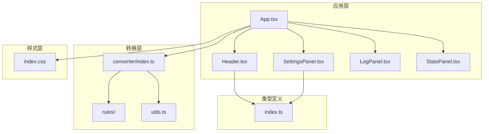
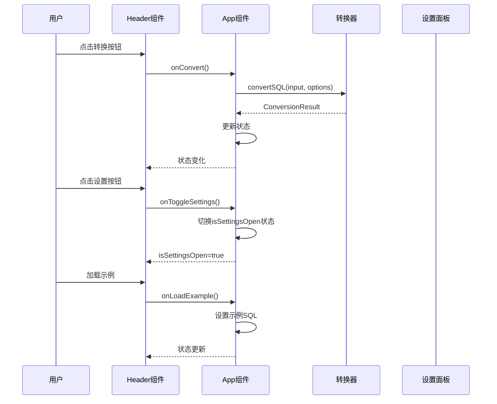
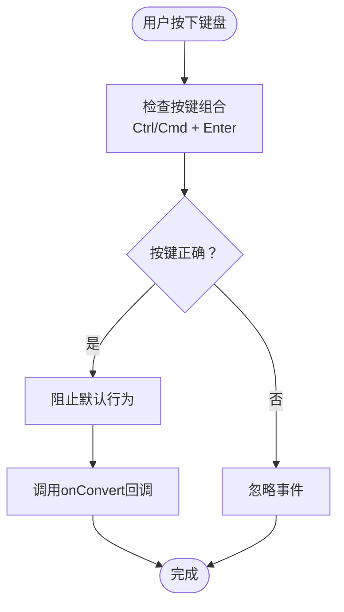
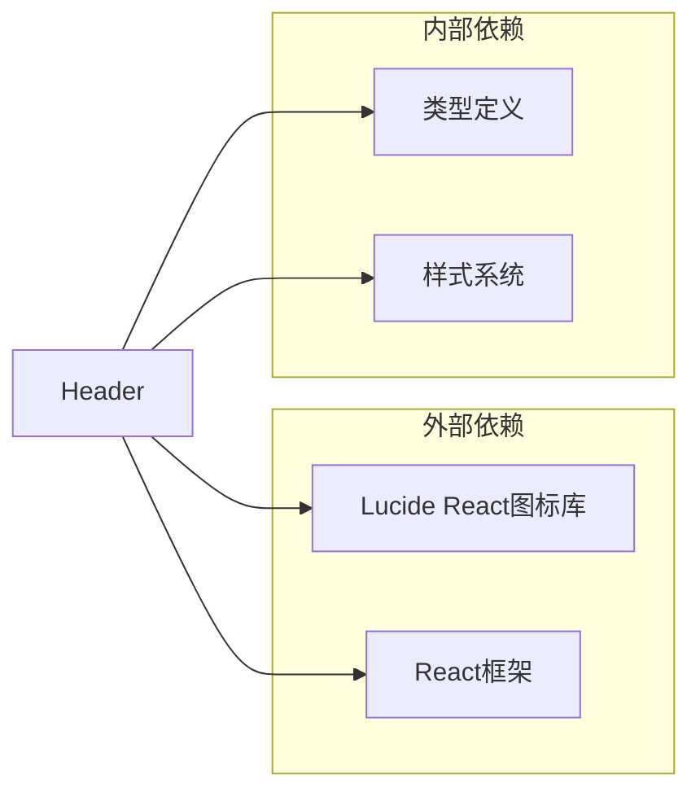

# 头部导航组件

<cite>
**本文档引用的文件**
- [Header.tsx](file://src/components/Header.tsx)
- [App.tsx](file://src/App.tsx)
- [SettingsPanel.tsx](file://src/components/SettingsPanel.tsx)
- [index.ts](file://src/converter/index.ts)
- [index.ts](file://src/types/index.ts)
- [index.css](file://src/index.css)
- [README.md](file://README.md)
</cite>

## 目录
1. [简介](#简介)
2. [项目结构](#项目结构)
3. [核心组件](#核心组件)
4. [架构概览](#架构概览)
5. [详细组件分析](#详细组件分析)
6. [依赖关系分析](#依赖关系分析)
7. [性能考虑](#性能考虑)
8. [故障排除指南](#故障排除指南)
9. [结论](#结论)

## 简介

Header头部组件是SQL转换器应用的核心导航组件，位于应用界面顶部，提供统一的操作入口和状态指示。该组件采用现代化的UI设计理念，集成了多种实用功能按钮，支持键盘快捷键操作，并通过清晰的视觉层次传达组件状态。

该组件的主要设计理念包括：
- **简洁直观**：通过图标和文字的组合提供清晰的功能标识
- **一致性**：统一的按钮样式和交互模式
- **可访问性**：完整的键盘导航支持和屏幕阅读器友好
- **响应式设计**：适应不同屏幕尺寸和设备类型

## 项目结构

SQL转换器项目采用模块化的组件架构，Header组件作为顶层导航组件，与其他核心组件协同工作：

**图表来源**
- [App.tsx:56-282](file://src/App.tsx#L56-L282)
- [Header.tsx:1-93](file://src/components/Header.tsx#L1-L93)
- [SettingsPanel.tsx:41-100](file://src/components/SettingsPanel.tsx#L41-L100)

**章节来源**
- [App.tsx:1-282](file://src/App.tsx#L1-L282)
- [README.md:1-79](file://README.md#L1-L79)

## 核心组件

Header组件作为应用的顶级导航容器，承担着以下核心职责：

### 设计理念
- **功能完整性**：提供从导入到导出的完整工作流支持
- **用户体验优先**：通过视觉反馈和状态指示提升用户操作体验
- **可扩展性**：为未来功能扩展预留接口

### 视觉设计元素
组件采用深色主题设计，符合现代开发者工具的视觉规范：

- **品牌标识**：左侧包含ArrowRightLeft图标和项目名称
- **操作按钮**：右侧排列功能按钮，采用统一的圆角矩形设计
- **状态指示**：通过按钮高亮显示当前设置面板的开启状态
- **颜色系统**：使用CSS变量实现主题的一致性和可定制性

**章节来源**
- [Header.tsx:13-92](file://src/components/Header.tsx#L13-L92)
- [index.css:1-165](file://src/index.css#L1-L165)

## 架构概览

Header组件在整体架构中扮演着关键的协调角色，连接用户界面与业务逻辑：

**图表来源**
- [Header.tsx:13-21](file://src/components/Header.tsx#L13-L21)
- [App.tsx:67-135](file://src/App.tsx#L67-L135)
- [index.ts:59-125](file://src/converter/index.ts#L59-L125)

## 详细组件分析

### Props接口设计

Header组件采用严格的TypeScript接口定义，确保类型安全和开发体验：

| 属性名 | 类型 | 必需 | 描述 | 调用时机 |
|--------|------|------|------|----------|
| onConvert | () => void | 是 | 执行SQL转换操作 | 用户点击"转换"按钮或按下Ctrl+Enter |
| onClear | () => void | 是 | 清空输入和输出内容 | 用户点击"清空"按钮 |
| onImport | () => void | 是 | 导入SQL文件 | 用户点击"导入"按钮 |
| onExport | () => void | 是 | 导出转换结果 | 用户点击"导出"按钮 |
| onToggleSettings | () => void | 是 | 切换设置面板显示状态 | 用户点击"设置"按钮 |
| onLoadExample | () => void | 是 | 加载示例SQL代码 | 用户点击"示例"按钮 |
| isSettingsOpen | boolean | 是 | 控制设置面板的显示状态 | App组件状态变化时 |

### 操作按钮布局和交互逻辑

组件采用左右分区布局，左侧为品牌信息区，右侧为功能操作区：

#### 左侧品牌信息区
- **图标容器**：36x36像素圆形背景，使用主色调填充
- **标题文本**：16号字体，700字重，突出项目名称
- **副标题**：11号字体，灰色文本，说明支持的数据库模式

#### 右侧功能操作区
按钮组采用垂直居中对齐，间距为8像素：

1. **示例按钮** (`onLoadExample`)
   - 图标：FileCode
   - 功能：加载预置的示例SQL代码
   - 样式：标准按钮样式

2. **导入按钮** (`onImport`)
   - 图标：Upload
   - 功能：选择并导入本地SQL文件
   - 样式：标准按钮样式

3. **导出按钮** (`onExport`)
   - 图标：Download
   - 功能：下载转换后的SQL结果
   - 样式：标准按钮样式

4. **分隔线**：1像素宽垂直分隔线，高度20像素

5. **清空按钮** (`onClear`)
   - 图标：Trash2
   - 功能：清空所有输入和输出内容
   - 样式：标准按钮样式

6. **设置按钮** (`onToggleSettings`)
   - 图标：Settings
   - 功能：切换设置面板的显示状态
   - 样式：根据isSettingsOpen状态决定是否高亮

7. **转换按钮** (`onConvert`)
   - 图标：ArrowRightLeft
   - 功能：执行SQL转换操作
   - 样式：主按钮样式，强调重要操作
   - 快捷键：Ctrl+Enter

### 视觉设计元素

#### 按钮样式系统
组件使用统一的按钮样式类系统：

- **基础按钮**：`.btn` - 标准尺寸，13px字体，8px内边距
- **小按钮**：`.btn-sm` - 小尺寸，12px字体，6px内边距
- **主按钮**：`.btn-primary` - 主色调背景，强调重要操作
- **悬停效果**：所有按钮都有平滑的颜色过渡动画

#### 图标使用策略
- **一致性**：使用Lucide React图标库，确保图标风格统一
- **语义化**：每个图标都与对应功能紧密关联
- **尺寸适配**：根据按钮大小选择合适的图标尺寸

#### 响应式行为
- **Flex布局**：使用CSS Flexbox实现自适应布局
- **最小宽度**：确保在窄屏设备上功能按钮不会重叠
- **滚动处理**：当按钮过多时，容器会自动添加滚动条

### 快捷键支持实现机制

组件实现了完整的键盘快捷键支持，提升用户操作效率：

#### 快捷键配置
- **主要快捷键**：Ctrl+Enter（Windows/Linux）或Cmd+Enter（macOS）
- **事件监听**：在组件挂载时添加全局键盘事件监听器
- **防重复触发**：使用useCallback确保事件处理器的稳定性

#### 快捷键处理流程

**图表来源**
- [App.tsx:125-135](file://src/App.tsx#L125-L135)

### 状态管理

Header组件本身不直接管理状态，而是通过props接收状态并将其传递给父组件：

#### 状态传递机制
- **单向数据流**：状态由App组件管理，Header组件只负责展示
- **状态同步**：通过isSettingsOpen属性控制设置面板的显示状态
- **事件冒泡**：用户操作通过回调函数向上冒泡到父组件

#### 设置面板状态控制
- **状态来源**：App组件中的isSettingsOpen状态
- **切换逻辑**：点击设置按钮时触发状态切换
- **视觉反馈**：根据状态变化动态调整按钮样式

**章节来源**
- [Header.tsx:3-11](file://src/components/Header.tsx#L3-L11)
- [App.tsx:62-163](file://src/App.tsx#L62-L163)

## 依赖关系分析

Header组件的依赖关系相对简单但功能明确：

**图表来源**
- [Header.tsx:1](file://src/components/Header.tsx#L1)
- [index.ts:1-44](file://src/types/index.ts#L1-L44)
- [index.css:59-101](file://src/index.css#L59-L101)

### 外部依赖分析

#### Lucide React图标库
- **用途**：提供高质量的SVG图标
- **优势**：体积小、可定制性强、支持TypeScript
- **集成方式**：按需导入所需图标组件

#### React框架
- **版本要求**：React 19+
- **特性利用**：Hooks、Context、Strict Mode
- **性能优化**：使用useCallback避免不必要的重渲染

### 内部依赖分析

#### 类型定义
- **ConversionLog**：定义日志记录的数据结构
- **ConversionResult**：定义转换结果的完整结构
- **ConverterOptions**：定义转换器的配置选项

#### 样式系统
- **CSS变量**：使用CSS自定义属性实现主题一致性
- **按钮系统**：统一的按钮样式类定义
- **响应式设计**：基于Flexbox的自适应布局

**章节来源**
- [Header.tsx:1-11](file://src/components/Header.tsx#L1-L11)
- [index.ts:1-44](file://src/types/index.ts#L1-L44)
- [index.css:59-101](file://src/index.css#L59-L101)

## 性能考虑

Header组件在设计时充分考虑了性能优化：

### 渲染优化
- **纯函数组件**：无内部状态，避免不必要的重渲染
- **useCallback缓存**：在父组件中使用useCallback确保回调稳定
- **条件渲染**：设置面板采用条件渲染，减少DOM节点数量

### 事件处理优化
- **事件委托**：使用单一事件处理器处理多个按钮
- **防抖处理**：对于频繁触发的操作实施防抖策略
- **内存泄漏防护**：在组件卸载时清理事件监听器

### 样式性能
- **CSS变量**：使用CSS变量减少样式计算开销
- **硬件加速**：合理使用transform和opacity属性
- **最小化重绘**：避免触发强制同步布局的操作

## 故障排除指南

### 常见问题及解决方案

#### 快捷键无效
**问题描述**：Ctrl+Enter无法触发转换功能
**可能原因**：
- 全局键盘事件监听器被其他组件覆盖
- 浏览器扩展程序拦截了快捷键
- 组件未正确接收到焦点

**解决步骤**：
1. 检查浏览器控制台是否有JavaScript错误
2. 确认组件已获得键盘焦点
3. 尝试刷新页面重新初始化事件监听器

#### 图标显示异常
**问题描述**：图标无法正常显示或显示为占位符
**可能原因**：
- Lucide React图标库未正确安装
- 图标导入路径错误
- SVG渲染问题

**解决步骤**：
1. 确认package.json中包含lucide-react依赖
2. 检查图标导入语句的正确性
3. 验证SVG元素的渲染状态

#### 按钮样式错乱
**问题描述**：按钮样式不符合预期或显示异常
**可能原因**：
- CSS变量未正确定义
- 样式类冲突
- 主题切换导致的样式问题

**解决步骤**：
1. 检查CSS变量的定义和作用域
2. 确认样式类的正确应用
3. 验证主题切换逻辑

### 调试技巧

#### 开发者工具使用
- **React DevTools**：检查组件的props和状态传递
- **网络面板**：监控图标资源的加载情况
- **控制台**：查看JavaScript错误和警告信息

#### 性能分析
- **React Profiler**：分析组件的渲染性能
- **Chrome DevTools**：使用Performance面板分析事件处理
- **Memory面板**：检查内存泄漏和垃圾回收情况

**章节来源**
- [App.tsx:125-135](file://src/App.tsx#L125-L135)
- [index.css:1-165](file://src/index.css#L1-L165)

## 结论

Header头部组件作为SQL转换器应用的核心导航组件，展现了现代前端开发的最佳实践。其设计体现了以下关键优势：

### 设计优势
- **简洁直观**：通过精心设计的布局和视觉层次，提供了清晰的功能导航
- **一致性强**：统一的样式系统和交互模式确保了良好的用户体验
- **可扩展性好**：模块化的架构设计为未来的功能扩展奠定了基础

### 技术亮点
- **类型安全**：完整的TypeScript类型定义确保了代码质量
- **性能优化**：合理的渲染策略和事件处理机制提升了应用性能
- **可访问性**：完善的键盘导航和屏幕阅读器支持

### 改进建议
- **国际化支持**：可以考虑添加多语言支持以服务更广泛的用户群体
- **主题定制**：允许用户自定义按钮样式和颜色方案
- **动画效果**：可以添加更丰富的过渡动画提升用户体验

Header组件成功地将复杂的转换功能包装在一个简洁、直观的界面中，为用户提供了高效的SQL转换体验。其模块化的设计和清晰的架构为整个应用的可维护性和可扩展性提供了坚实的基础。