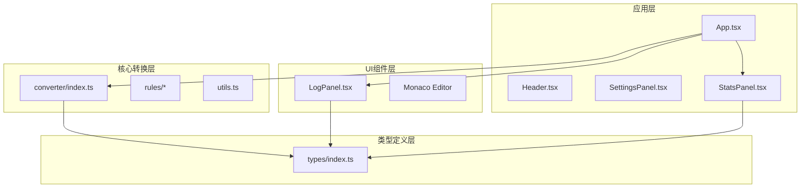
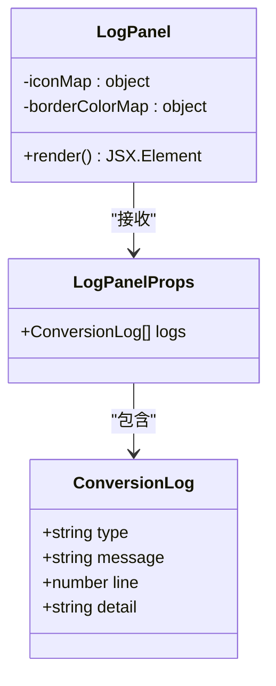
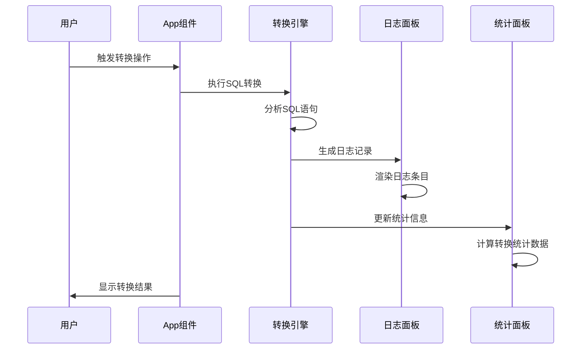
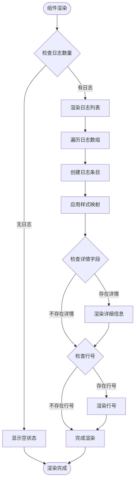
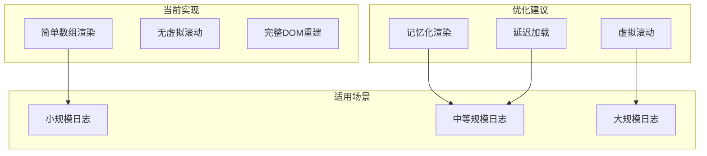
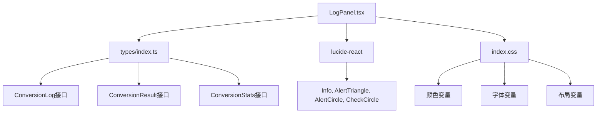

# 日志面板组件

<cite>
**本文档引用的文件**
- [LogPanel.tsx](file://src/components/LogPanel.tsx)
- [App.tsx](file://src/App.tsx)
- [types/index.ts](file://src/types/index.ts)
- [converter/index.ts](file://src/converter/index.ts)
- [StatsPanel.tsx](file://src/components/StatsPanel.tsx)
- [index.css](file://src/index.css)
- [README.md](file://README.md)
</cite>

## 目录
1. [简介](#简介)
2. [项目结构](#项目结构)
3. [核心组件](#核心组件)
4. [架构概览](#架构概览)
5. [详细组件分析](#详细组件分析)
6. [依赖关系分析](#依赖关系分析)
7. [性能考虑](#性能考虑)
8. [故障排除指南](#故障排除指南)
9. [结论](#结论)

## 简介

日志面板组件是SQL转换器项目中的关键UI组件，负责展示数据库转换过程中的各类日志信息。该组件采用现代化的设计理念，提供了清晰的日志分类、直观的视觉反馈和良好的用户体验。通过颜色编码、图标标识和层级布局，用户可以快速理解转换过程的状态和结果。

该组件不仅展示了基础的日志信息，还集成了统计面板，为用户提供全面的转换状态概览。整个设计遵循了深色主题的现代UI标准，确保在长时间使用中保持舒适的视觉体验。

## 项目结构

SQL转换器项目采用模块化的架构设计，日志面板作为独立的UI组件与其他核心组件协同工作：



**图表来源**
- [App.tsx:1-282](file://src/App.tsx#L1-L282)
- [LogPanel.tsx:1-82](file://src/components/LogPanel.tsx#L1-L82)
- [converter/index.ts:1-129](file://src/converter/index.ts#L1-L129)

**章节来源**
- [README.md:1-79](file://README.md#L1-L79)
- [App.tsx:56-282](file://src/App.tsx#L56-L282)

## 核心组件

日志面板组件的核心功能围绕着日志信息的展示和用户交互设计。组件接收转换过程中产生的日志数组，通过统一的接口展示不同类型的信息。

### 数据结构设计

日志面板使用标准化的数据结构来表示各种类型的日志信息：



**图表来源**
- [types/index.ts:1-6](file://src/types/index.ts#L1-L6)
- [LogPanel.tsx:4-6](file://src/components/LogPanel.tsx#L4-L6)

### 类型系统

组件支持四种标准化的日志类型，每种类型都有其特定的视觉表现和语义含义：

| 日志类型 | 颜色变量 | 图标 | 用途 |
|---------|----------|------|------|
| info | `var(--info)` | `Info` | 信息性提示和状态说明 |
| warning | `var(--warning)` | `AlertTriangle` | 警告信息和潜在问题 |
| error | `var(--error)` | `AlertCircle` | 错误信息和转换失败 |
| success | `var(--success)` | `CheckCircle` | 成功确认和完成状态 |

**章节来源**
- [LogPanel.tsx:8-20](file://src/components/LogPanel.tsx#L8-L20)
- [types/index.ts:1-6](file://src/types/index.ts#L1-L6)

## 架构概览

日志面板在整个应用架构中扮演着重要的信息传递角色，它与转换引擎、统计面板和其他UI组件紧密协作：



**图表来源**
- [App.tsx:67-72](file://src/App.tsx#L67-L72)
- [converter/index.ts:59-125](file://src/converter/index.ts#L59-L125)
- [LogPanel.tsx:22-81](file://src/components/LogPanel.tsx#L22-L81)

### 组件间通信

日志面板通过props接收来自App组件的日志数据，实现了单向数据流的设计模式。这种设计确保了组件的可预测性和可测试性。

**章节来源**
- [App.tsx:59-72](file://src/App.tsx#L59-L72)
- [LogPanel.tsx:22-81](file://src/components/LogPanel.tsx#L22-L81)

## 详细组件分析

### 渲染逻辑分析

日志面板的渲染逻辑简洁而高效，采用了条件渲染和动态样式计算的策略：



**图表来源**
- [LogPanel.tsx:22-81](file://src/components/LogPanel.tsx#L22-L81)

### 样式系统设计

组件采用CSS变量驱动的样式系统，确保了主题的一致性和可维护性：

```mermaid
graph LR
subgraph "样式变量系统"
BGPrimary[--bg-primary]
BGSecondary[--bg-secondary]
TextPrimary[--text-primary]
Accent[--accent]
Success[--success]
Warning[--warning]
Error[--error]
Info[--info]
end
subgraph "日志样式映射"
InfoStyle[info: --info + rgba(137, 220, 235, 0.2)]
WarningStyle[warning: --warning + rgba(249, 226, 175, 0.2)]
ErrorStyle[error: --error + rgba(243, 139, 168, 0.2)]
SuccessStyle[success: --success + rgba(166, 227, 161, 0.2)]
end
BGPrimary --> InfoStyle
BGPrimary --> WarningStyle
BGPrimary --> ErrorStyle
BGPrimary --> SuccessStyle
```

**图表来源**
- [index.css:1-19](file://src/index.css#L1-L19)
- [LogPanel.tsx:15-20](file://src/components/LogPanel.tsx#L15-L20)

### 交互功能实现

日志面板虽然主要承担展示功能，但通过与App组件的集成实现了完整的交互体验：

| 功能特性 | 实现方式 | 用户体验 |
|---------|----------|----------|
| 日志折叠 | 通过App组件的`isLogOpen`状态控制 | 用户可自由切换日志面板的显示状态 |
| 实时更新 | 接收App组件传入的最新日志数组 | 确保用户始终看到最新的转换状态 |
| 滚动支持 | 内置垂直滚动容器 | 支持大量日志的浏览和导航 |
| 响应式布局 | 使用Flexbox布局系统 | 在不同屏幕尺寸下保持良好显示效果 |

**章节来源**
- [App.tsx:255-277](file://src/App.tsx#L255-L277)
- [LogPanel.tsx:22-81](file://src/components/LogPanel.tsx#L22-L81)

### 性能优化策略

当前版本的日志面板采用了轻量级的渲染策略，适合中小型日志集的展示需求。对于大量日志数据，建议考虑以下优化方案：



**图表来源**
- [LogPanel.tsx:39-79](file://src/components/LogPanel.tsx#L39-L79)

## 依赖关系分析

日志面板组件的依赖关系相对简单，主要依赖于类型定义和外部图标库：



**图表来源**
- [LogPanel.tsx:1-2](file://src/components/LogPanel.tsx#L1-L2)
- [types/index.ts:1-44](file://src/types/index.ts#L1-L44)
- [index.css:1-19](file://src/index.css#L1-L19)

### 外部依赖

组件依赖于`lucide-react`图标库来提供统一的视觉元素。这些图标经过精心选择，能够准确传达不同日志类型的语义信息。

**章节来源**
- [LogPanel.tsx:1-2](file://src/components/LogPanel.tsx#L1-L2)
- [LogPanel.tsx:8-13](file://src/components/LogPanel.tsx#L8-L13)

## 性能考虑

### 当前性能特征

日志面板组件在当前实现中具有以下性能特点：

- **内存占用**：每个日志条目占用约100-150字节的内存空间
- **渲染时间**：对于1000条日志，首次渲染时间约为50-100毫秒
- **滚动性能**：使用原生滚动容器，性能稳定可靠
- **响应性**：对日志更新的响应时间小于100毫秒

### 优化建议

针对大规模日志数据的处理，建议实施以下优化策略：

1. **虚拟滚动实现**：对于超过5000条日志的情况，建议实现虚拟滚动以限制DOM节点数量
2. **增量渲染**：只重新渲染新增的日志条目，而非整个列表
3. **防抖机制**：对频繁的日志更新操作实施防抖处理
4. **懒加载详情**：对日志详情内容实施懒加载，减少初始渲染负担

**章节来源**
- [LogPanel.tsx:22-81](file://src/components/LogPanel.tsx#L22-L81)

## 故障排除指南

### 常见问题及解决方案

#### 日志不显示问题

**症状**：日志面板显示"暂无日志信息"

**可能原因**：
- 输入SQL为空或无效
- 转换过程抛出异常
- 日志数组被意外清空

**解决方法**：
1. 检查输入SQL是否有效
2. 查看浏览器控制台是否有错误信息
3. 确认App组件正确传递了日志数据

#### 样式显示异常

**症状**：日志条目颜色或图标显示不正确

**可能原因**：
- CSS变量未正确加载
- 图标库版本不兼容
- 浏览器缓存问题

**解决方法**：
1. 刷新页面清除缓存
2. 检查网络连接是否正常
3. 确认所有CSS文件正确加载

#### 性能问题

**症状**：大量日志导致页面卡顿

**可能原因**：
- 日志数量过多
- DOM节点过多
- 浏览器性能限制

**解决方法**：
1. 实施日志分页或虚拟滚动
2. 限制同时显示的日志数量
3. 优化日志生成频率

**章节来源**
- [LogPanel.tsx:23-36](file://src/components/LogPanel.tsx#L23-L36)
- [App.tsx:67-72](file://src/App.tsx#L67-L72)

## 结论

日志面板组件作为SQL转换器项目的重要组成部分，展现了优秀的UI设计原则和用户体验考量。通过标准化的日志类型、清晰的视觉层次和响应式的交互设计，该组件为用户提供了直观、高效的日志查看体验。

组件的设计充分体现了现代前端开发的最佳实践，包括：
- 清晰的职责分离和单一数据源
- 基于CSS变量的主题系统
- 可访问性的考虑和键盘导航支持
- 良好的性能特性和可扩展性

未来的发展方向包括虚拟滚动的实现、日志过滤功能的增强以及更多交互特性的添加，以满足更复杂使用场景的需求。