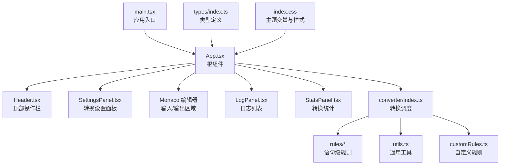
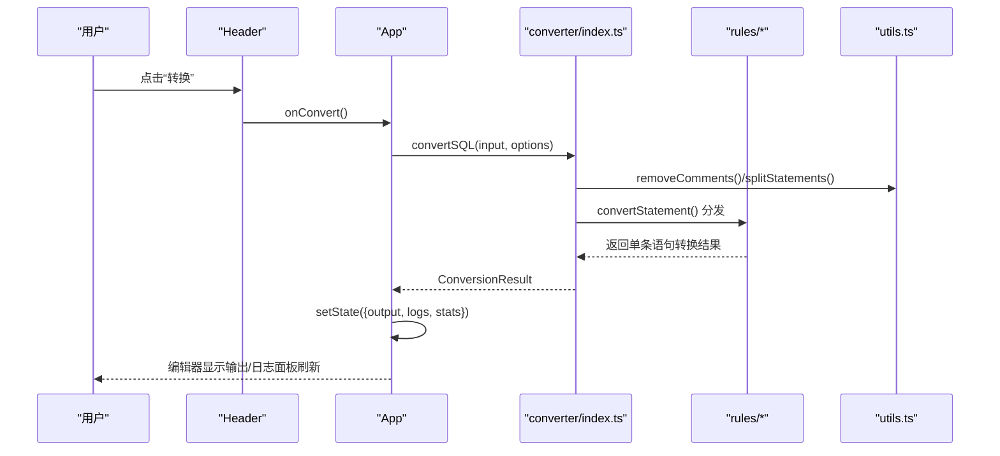
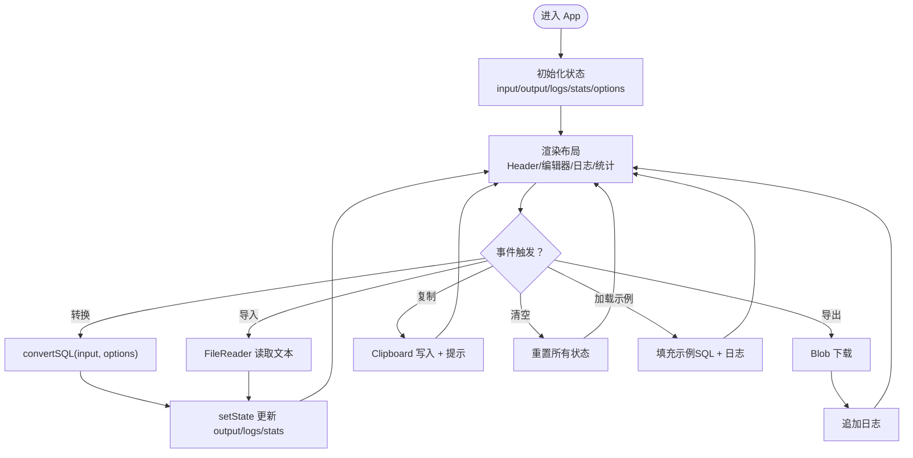
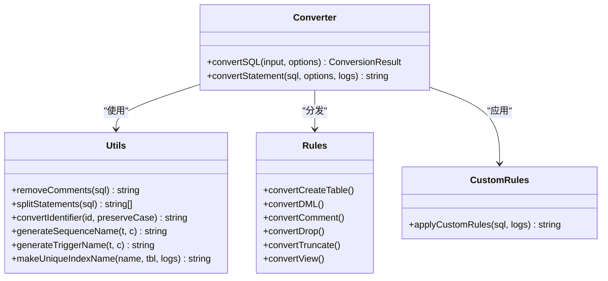
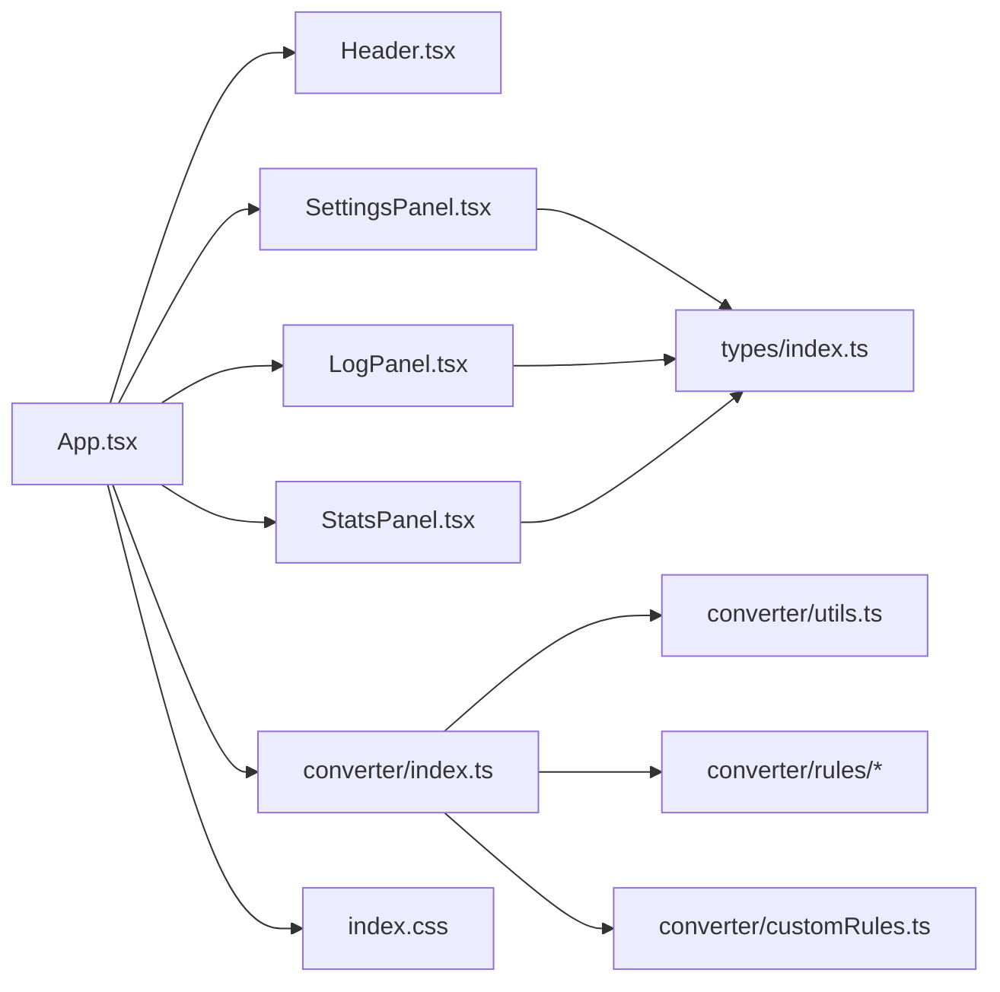

# 组件设计模式

<cite>
**本文引用的文件**   
- [src/App.tsx](file://src/App.tsx)
- [src/main.tsx](file://src/main.tsx)
- [src/components/Header.tsx](file://src/components/Header.tsx)
- [src/components/SettingsPanel.tsx](file://src/components/SettingsPanel.tsx)
- [src/components/LogPanel.tsx](file://src/components/LogPanel.tsx)
- [src/components/StatsPanel.tsx](file://src/components/StatsPanel.tsx)
- [src/converter/index.ts](file://src/converter/index.ts)
- [src/converter/utils.ts](file://src/converter/utils.ts)
- [src/converter/customRules.ts](file://src/converter/customRules.ts)
- [src/converter/rules/createTable.ts](file://src/converter/rules/createTable.ts)
- [src/converter/rules/dataTypes.ts](file://src/converter/rules/dataTypes.ts)
- [src/converter/rules/dml.ts](file://src/converter/rules/dml.ts)
- [src/converter/rules/comments.ts](file://src/converter/rules/comments.ts)
- [src/types/index.ts](file://src/types/index.ts)
- [src/index.css](file://src/index.css)
- [README.md](file://README.md)
</cite>

## 目录
1. [简介](#简介)
2. [项目结构](#项目结构)
3. [核心组件](#核心组件)
4. [架构总览](#架构总览)
5. [组件详解](#组件详解)
6. [依赖关系分析](#依赖关系分析)
7. [性能与优化](#性能与优化)
8. [故障排查指南](#故障排查指南)
9. [结论](#结论)
10. [附录](#附录)

## 简介
本文件面向SQL转换器的React前端组件，系统化阐述组件架构模式、状态管理、组件通信、响应式布局与主题系统、可访问性支持、组件复用与性能优化策略，并提供使用示例与最佳实践。项目采用函数式组件与Hooks模式，通过顶层App集中管理状态与事件，向子组件传递props与回调，实现清晰的单向数据流与高内聚低耦合。

## 项目结构
项目采用按功能域划分的目录组织方式：
- src/components：UI组件层（Header、SettingsPanel、LogPanel、StatsPanel）
- src/converter：转换器逻辑层（规则拆分、工具函数、自定义规则）
- src/types：类型定义层（转换结果、统计、选项）
- src/index.css：主题变量与通用样式
- src/main.tsx、src/App.tsx：入口与根组件

图表来源
- [src/main.tsx:1-11](file://src/main.tsx#L1-L11)
- [src/App.tsx:56-282](file://src/App.tsx#L56-L282)
- [src/converter/index.ts:1-129](file://src/converter/index.ts#L1-L129)
- [src/index.css:1-165](file://src/index.css#L1-L165)

章节来源
- [src/main.tsx:1-11](file://src/main.tsx#L1-L11)
- [src/App.tsx:56-282](file://src/App.tsx#L56-L282)
- [src/index.css:1-165](file://src/index.css#L1-L165)

## 核心组件
- App：集中状态与事件处理，协调各子组件；负责快捷键、文件导入导出、复制、示例加载、转换执行与结果展示。
- Header：提供“加载示例/导入/导出/清空/设置/转换”等操作按钮，接收回调并控制设置面板开关。
- SettingsPanel：基于选项对象渲染一组可切换的布尔开关，通过onChange回调更新父组件状态。
- LogPanel：展示转换过程中的日志列表，支持不同级别图标与边框色区分。
- StatsPanel：展示转换统计指标，如总语句数、已转换、警告、错误、类型/自增/注释转换次数。

章节来源
- [src/App.tsx:56-282](file://src/App.tsx#L56-L282)
- [src/components/Header.tsx:1-93](file://src/components/Header.tsx#L1-L93)
- [src/components/SettingsPanel.tsx:1-100](file://src/components/SettingsPanel.tsx#L1-L100)
- [src/components/LogPanel.tsx:1-82](file://src/components/LogPanel.tsx#L1-L82)
- [src/components/StatsPanel.tsx:1-42](file://src/components/StatsPanel.tsx#L1-L42)

## 架构总览
整体采用“函数式组件 + Hooks + 单向数据流”的架构模式：
- 状态集中在App中（输入SQL、输出SQL、日志、统计、选项、面板开关等）
- 事件通过props向下传递，子组件通过回调向上反馈
- 转换逻辑在converter模块中解耦，App仅负责调用与结果回填

图表来源
- [src/App.tsx:67-72](file://src/App.tsx#L67-L72)
- [src/converter/index.ts:59-125](file://src/converter/index.ts#L59-L125)
- [src/converter/utils.ts:52-72](file://src/converter/utils.ts#L52-L72)

## 组件详解

### App 组件（职责与状态管理）
- 状态管理
  - 输入/输出SQL、日志数组、统计对象、转换选项、面板开关、复制状态
  - 使用useState集中管理，确保单一事实源
- 事件处理
  - 转换：调用convertSQL，合并结果到状态
  - 清空：重置输入、输出、日志、统计
  - 导入：触发隐藏文件输入，读取文本后填充输入并记录日志
  - 导出：将输出写入Blob并触发下载，记录日志
  - 复制：Clipboard API写入，短暂提示
  - 加载示例：填充示例SQL并记录日志
  - 快捷键：Ctrl/Cmd+Enter触发转换
- 组件协调
  - Header通过回调驱动App行为
  - SettingsPanel根据isSettingsOpen条件渲染
  - LogPanel与StatsPanel在右侧区域按需展开/折叠

图表来源
- [src/App.tsx:56-282](file://src/App.tsx#L56-L282)

章节来源
- [src/App.tsx:56-282](file://src/App.tsx#L56-L282)

### Header 组件（功能定位与交互）
- 功能定位：顶部操作区，承载“示例/导入/导出/清空/设置/转换”等关键动作
- Props接口：onConvert、onClear、onImport、onExport、onToggleSettings、onLoadExample、isSettingsOpen
- 交互逻辑：按钮点击触发回调；设置按钮根据isSettingsOpen高亮；提供快捷提示（如Ctrl+Enter）

章节来源
- [src/components/Header.tsx:1-93](file://src/components/Header.tsx#L1-L93)

### SettingsPanel 组件（设置项与双向绑定）
- 功能定位：弹出式设置面板，提供多项转换选项的开关
- Props接口：options（只读）、onChange（写回）
- 设计要点：内部Checkbox组件封装，toggle(key)对options做浅拷贝更新；绝对定位在右上角，带阴影与层级
- 选项说明：IDENTITY/SEQUENCE/触发器/注释/引擎字符集/大小写保留等

章节来源
- [src/components/SettingsPanel.tsx:1-100](file://src/components/SettingsPanel.tsx#L1-L100)
- [src/types/index.ts:25-43](file://src/types/index.ts#L25-L43)

### LogPanel 组件（日志展示与可读性）
- 功能定位：展示转换过程中的日志列表，支持info/warning/error/success四类
- Props接口：logs[]
- 设计要点：图标与边框色映射；支持detail与line字段；空态友好提示；使用CSS变量统一配色

章节来源
- [src/components/LogPanel.tsx:1-82](file://src/components/LogPanel.tsx#L1-L82)
- [src/types/index.ts:1-6](file://src/types/index.ts#L1-L6)

### StatsPanel 组件（统计指标）
- 功能定位：底部统计区，展示总语句、已转换、警告、错误、类型/自增/注释转换次数
- Props接口：stats
- 设计要点：使用CSS变量控制颜色；数字使用等宽字体增强可读性

章节来源
- [src/components/StatsPanel.tsx:1-42](file://src/components/StatsPanel.tsx#L1-L42)
- [src/types/index.ts:15-23](file://src/types/index.ts#L15-L23)

### 转换器模块（规则与工具）
- 调度入口：convertSQL(input, options)负责清理注释、拆分语句、逐条转换、统计与聚合
- 规则分发：convertStatement根据语句首词与特征匹配到具体规则（建表、索引/变更、分区、DML、注释、存储过程/序列等）
- 工具函数：标识符转换、字符串字面量保护/还原、注释移除、语句拆分、命名规范（序列/触发器/索引名）等
- 自定义规则：applyCustomRules遍历自定义规则，按match条件匹配并transform

图表来源
- [src/converter/index.ts:15-54](file://src/converter/index.ts#L15-L54)
- [src/converter/index.ts:59-125](file://src/converter/index.ts#L59-L125)
- [src/converter/utils.ts:8-115](file://src/converter/utils.ts#L8-L115)
- [src/converter/customRules.ts:170-185](file://src/converter/customRules.ts#L170-L185)

章节来源
- [src/converter/index.ts:1-129](file://src/converter/index.ts#L1-L129)
- [src/converter/utils.ts:1-115](file://src/converter/utils.ts#L1-L115)
- [src/converter/customRules.ts:1-186](file://src/converter/customRules.ts#L1-L186)
- [src/converter/rules/createTable.ts:116-380](file://src/converter/rules/createTable.ts#L116-L380)
- [src/converter/rules/dataTypes.ts:61-106](file://src/converter/rules/dataTypes.ts#L61-L106)
- [src/converter/rules/dml.ts:7-163](file://src/converter/rules/dml.ts#L7-L163)
- [src/converter/rules/comments.ts:7-53](file://src/converter/rules/comments.ts#L7-L53)

## 依赖关系分析
- 组件依赖
  - App依赖Header、SettingsPanel、LogPanel、StatsPanel、Monaco编辑器、converter
  - SettingsPanel依赖types中的ConverterOptions
  - LogPanel/StatsPanel依赖types中的ConversionLog/ConversionStats
- 转换器依赖
  - converter/index.ts依赖utils与各rules
  - rules依赖utils与types
- 样式与主题
  - index.css提供CSS变量与通用样式，组件通过var(--xxx)引用

图表来源
- [src/App.tsx:3-9](file://src/App.tsx#L3-L9)
- [src/components/SettingsPanel.tsx:1](file://src/components/SettingsPanel.tsx#L1)
- [src/components/LogPanel.tsx:1-2](file://src/components/LogPanel.tsx#L1-L2)
- [src/components/StatsPanel.tsx:1](file://src/components/StatsPanel.tsx#L1)
- [src/converter/index.ts:1-10](file://src/converter/index.ts#L1-L10)
- [src/index.css:1-19](file://src/index.css#L1-L19)

章节来源
- [src/App.tsx:3-9](file://src/App.tsx#L3-L9)
- [src/index.css:1-165](file://src/index.css#L1-L165)

## 性能与优化
- 状态最小化与不可变更新
  - 使用useState拆分细粒度状态，避免不必要的重渲染
  - SettingsPanel通过浅拷贝更新选项，减少深层对象变更
- 回调稳定化
  - 使用useCallback包裹事件处理器，降低子组件重渲染概率
- 渲染范围控制
  - Monaco编辑器开启automaticLayout与只读属性，减少无效重排
  - 日志面板与统计面板按需渲染（isLogOpen/isSettingsOpen）
- 计算与IO分离
  - 转换逻辑在独立模块中，App仅负责调度与结果回填
- 可选优化建议
  - 对超长SQL分片处理或虚拟滚动（当前实现未涉及）
  - 对高频日志与统计计算进行节流/防抖（当前实现未涉及）

## 故障排查指南
- 常见问题
  - 导出为空：检查输出是否为空，App会在导出前给出警告日志
  - 导入无内容：确认文件选择器事件与FileReader读取流程
  - 转换异常：查看ConversionResult中的错误日志与统计
  - 快捷键无效：确认浏览器焦点在页面且未被其他元素拦截
- 定位方法
  - 在App中追加日志数组，观察类型与消息
  - 使用LogPanel查看详细信息与行号
  - 检查StatsPanel统计项，快速判断类型/自增/注释转换数量
- 建议
  - 对复杂语句拆分测试，逐步定位规则分支
  - 使用自定义规则进行边界修复

章节来源
- [src/App.tsx:98-111](file://src/App.tsx#L98-L111)
- [src/App.tsx:126-135](file://src/App.tsx#L126-L135)
- [src/converter/index.ts:97-107](file://src/converter/index.ts#L97-L107)

## 结论
本项目以函数式组件为核心，通过App集中状态与事件，配合清晰的props与回调约定，实现了高内聚、低耦合的组件体系。转换器模块按语句类型分发规则，结合工具函数与自定义规则，具备良好的扩展性。配合主题系统与响应式布局，满足生产环境的可用性与可维护性需求。

## 附录

### 组件Props与事件接口一览
- Header
  - onConvert(): void
  - onClear(): void
  - onImport(): void
  - onExport(): void
  - onToggleSettings(): void
  - onLoadExample(): void
  - isSettingsOpen: boolean
- SettingsPanel
  - options: ConverterOptions
  - onChange(opts: ConverterOptions): void
- LogPanel
  - logs: ConversionLog[]
- StatsPanel
  - stats: ConversionStats

章节来源
- [src/components/Header.tsx:3-11](file://src/components/Header.tsx#L3-L11)
- [src/components/SettingsPanel.tsx:3-6](file://src/components/SettingsPanel.tsx#L3-L6)
- [src/components/LogPanel.tsx:4-6](file://src/components/LogPanel.tsx#L4-L6)
- [src/components/StatsPanel.tsx:3-5](file://src/components/StatsPanel.tsx#L3-L5)
- [src/types/index.ts:1-23](file://src/types/index.ts#L1-L23)

### 主题系统与可访问性
- 主题系统
  - CSS变量集中定义于:root，组件通过var(--xxx)引用
  - 按功能区定义背景、文字、强调色、边框与圆角
- 可访问性
  - 按钮具备title提示
  - 文字与背景对比度符合基础要求
  - 代码字体使用等宽字体，提升可读性

章节来源
- [src/index.css:1-19](file://src/index.css#L1-L19)
- [src/index.css:59-101](file://src/index.css#L59-L101)
- [src/index.css:103-130](file://src/index.css#L103-L130)

### 使用示例与最佳实践
- 使用示例
  - 在Header中绑定回调，触发App的转换/导入/导出/清空/加载示例
  - 在SettingsPanel中切换选项，实时影响转换结果
  - 在Monaco编辑器中编写SQL，自动获得语法高亮与自动布局
- 最佳实践
  - 将状态与逻辑解耦，保持组件纯函数特性
  - 使用useCallback稳定回调，减少子组件重渲染
  - 通过日志与统计双通道反馈转换质量
  - 对自定义规则进行单元化测试与版本化管理

章节来源
- [src/App.tsx:155-163](file://src/App.tsx#L155-L163)
- [src/components/SettingsPanel.tsx:41-99](file://src/components/SettingsPanel.tsx#L41-L99)
- [src/converter/customRules.ts:137-165](file://src/converter/customRules.ts#L137-L165)