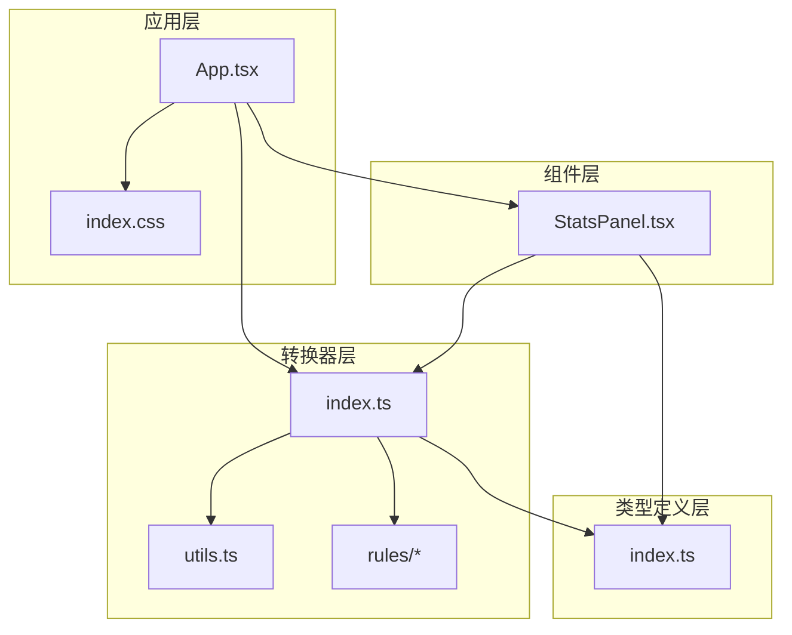
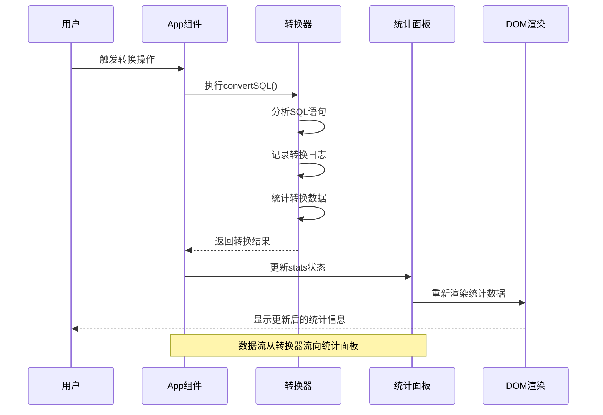
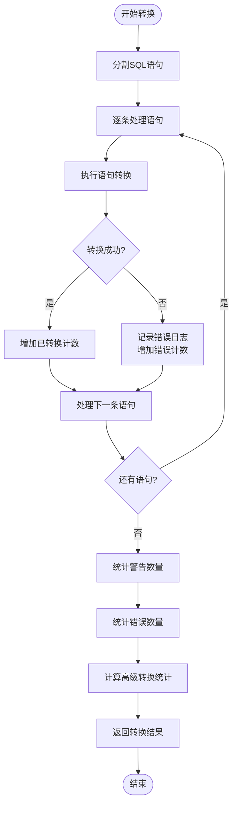
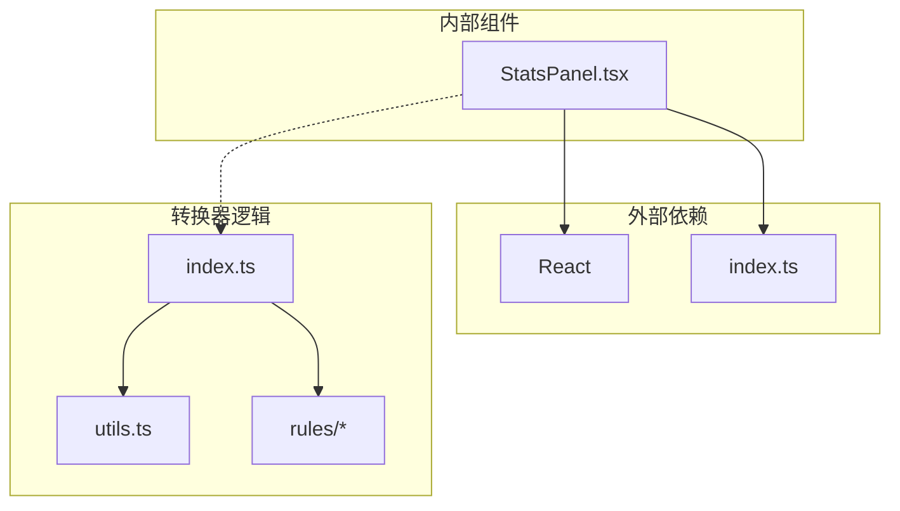
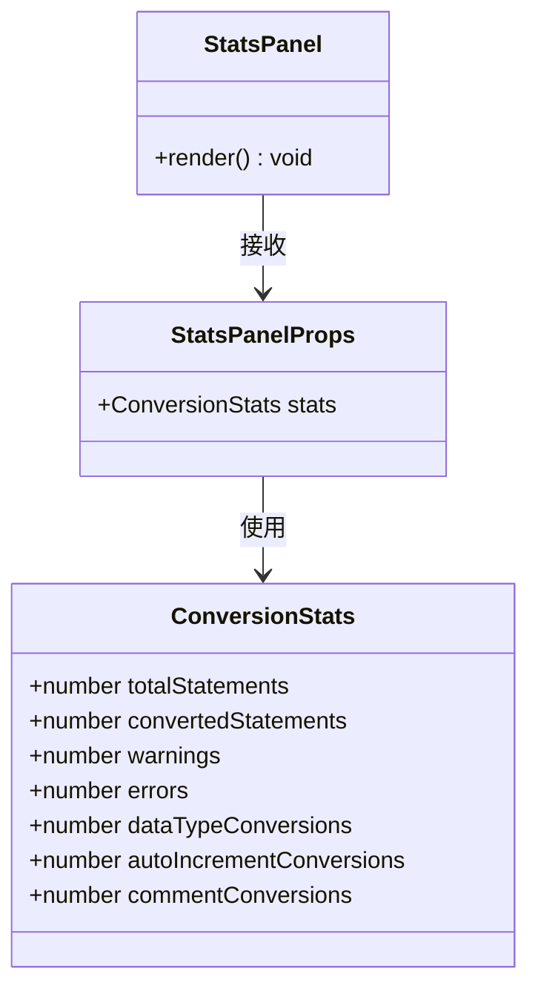

# 统计面板组件

<cite>
**本文档引用的文件**
- [StatsPanel.tsx](file://src/components/StatsPanel.tsx)
- [index.ts](file://src/converter/index.ts)
- [index.ts](file://src/types/index.ts)
- [App.tsx](file://src/App.tsx)
- [index.css](file://src/index.css)
- [utils.ts](file://src/converter/utils.ts)
- [dataTypes.ts](file://src/converter/rules/dataTypes.ts)
- [createTable.ts](file://src/converter/rules/createTable.ts)
- [comments.ts](file://src/converter/rules/comments.ts)
- [customRules.ts](file://src/converter/customRules.ts)
</cite>

## 目录
1. [简介](#简介)
2. [项目结构](#项目结构)
3. [核心组件](#核心组件)
4. [架构概览](#架构概览)
5. [详细组件分析](#详细组件分析)
6. [依赖关系分析](#依赖关系分析)
7. [性能考量](#性能考量)
8. [故障排除指南](#故障排除指南)
9. [结论](#结论)
10. [附录](#附录)

## 简介
统计面板组件是SQL转换器应用中的关键可视化组件，负责实时展示转换过程中的各项统计数据。该组件采用简洁直观的设计理念，通过颜色编码和数值格式化来呈现转换状态，帮助用户快速了解转换进度和质量。

组件的核心功能包括：
- 实时统计总语句数、转换语句数、警告数量、错误数量
- 统计数据类型转换次数、自增转换次数和注释转换次数
- 提供响应式布局适配不同屏幕尺寸
- 支持数据刷新和重置机制

## 项目结构
统计面板组件位于src/components目录下，与转换器核心逻辑分离，体现了清晰的模块化设计原则。

**图表来源**
- [StatsPanel.tsx:1-42](file://src/components/StatsPanel.tsx#L1-L42)
- [index.ts:1-129](file://src/converter/index.ts#L1-L129)
- [index.ts:15-23](file://src/types/index.ts#L15-L23)

**章节来源**
- [StatsPanel.tsx:1-42](file://src/components/StatsPanel.tsx#L1-L42)
- [index.ts:1-129](file://src/converter/index.ts#L1-L129)

## 核心组件
统计面板组件采用React函数式组件设计，接收ConversionStats类型的props并渲染相应的统计数据。

### 组件属性定义
组件通过StatsPanelProps接口定义输入属性：
- stats: ConversionStats - 包含完整的转换统计数据对象

### 数据结构设计
ConversionStats接口定义了七种核心统计数据：
- totalStatements: 总语句数
- convertedStatements: 已转换语句数  
- warnings: 警告数量
- errors: 错误数量
- dataTypeConversions: 数据类型转换次数
- autoIncrementConversions: 自增转换次数
- commentConversions: 注释转换次数

### 视觉设计规范
组件采用CSS变量系统实现主题化设计：
- 使用var(--text-secondary)、var(--success)、var(--warning)、var(--error)等颜色变量
- 数值采用等宽字体显示，便于对齐
- 响应式布局支持不同屏幕尺寸

**章节来源**
- [StatsPanel.tsx:3-16](file://src/components/StatsPanel.tsx#L3-L16)
- [index.ts:15-23](file://src/types/index.ts#L15-L23)

## 架构概览
统计面板组件在整个应用架构中扮演着数据可视化和状态反馈的关键角色。

**图表来源**
- [App.tsx:67-72](file://src/App.tsx#L67-L72)
- [index.ts:59-125](file://src/converter/index.ts#L59-L125)
- [StatsPanel.tsx:7-41](file://src/components/StatsPanel.tsx#L7-L41)

### 数据流架构
统计面板的数据流遵循单向数据流原则：
1. 转换器计算统计数据并返回给App组件
2. App组件管理全局状态并传递给StatsPanel
3. StatsPanel基于props渲染统计数据
4. 用户交互触发状态更新，形成完整的数据循环

**章节来源**
- [App.tsx:67-72](file://src/App.tsx#L67-L72)
- [index.ts:59-125](file://src/converter/index.ts#L59-L125)

## 详细组件分析

### 统计数据含义与计算方式

#### 基础统计指标
组件展示的七种统计数据都有明确的业务含义：

1. **总语句数 (totalStatements)**: 输入SQL中语句的总数
2. **已转换 (convertedStatements)**: 成功转换的语句数量
3. **警告 (warnings)**: 转换过程中产生的警告信息数量
4. **错误 (errors)**: 转换失败的语句数量

#### 高级转换统计
这些统计反映了具体的转换行为：

1. **类型转换 (dataTypeConversions)**: 数据类型转换的次数统计
2. **自增转换 (autoIncrementConversions)**: 自增列转换的次数统计
3. **注释转换 (commentConversions)**: 注释处理转换的次数统计

### 统计计算逻辑

#### 转换器统计实现
转换器在convertSQL函数中实现了完整的统计逻辑：

**图表来源**
- [index.ts:86-107](file://src/converter/index.ts#L86-L107)
- [index.ts:109-117](file://src/converter/index.ts#L109-L117)

#### 高级转换统计算法
高级转换统计通过扫描日志消息来实现：

1. **数据类型转换统计**: 检查日志消息中是否包含"数据类型"关键词
2. **自增转换统计**: 检查日志消息中是否包含"AUTO_INCREMENT"或"SEQUENCE"关键词
3. **注释转换统计**: 检查日志消息中是否包含"COMMENT"关键词

**章节来源**
- [index.ts:86-125](file://src/converter/index.ts#L86-L125)

### 图表展示逻辑

#### 数据格式化策略
组件采用统一的数据格式化策略：
- 数值显示采用等宽字体，确保多列数据对齐
- 使用CSS变量控制颜色，实现主题一致性
- 标签文本使用浅色强调，数值使用对应状态颜色

#### 颜色编码系统
颜色编码系统基于语义化设计：
- **总语句**: var(--text-secondary) - 中性灰色
- **已转换**: var(--success) - 成功绿色
- **警告**: var(--warning) - 警告黄色
- **错误**: var(--error) - 错误红色
- **类型转换**: var(--accent) - 强调蓝色
- **自增转换**: var(--info) - 信息青色
- **注释转换**: var(--text-secondary) - 中性灰色

### 交互功能

#### 数据刷新机制
统计面板通过React的props驱动更新：
- App组件调用convertSQL后更新stats状态
- StatsPanel基于新的props自动重新渲染
- 无需手动刷新，实现响应式更新

#### 重置机制
应用提供了完整的重置功能：
- 清空输入和输出内容
- 重置统计面板为初始状态
- 清空转换日志

**章节来源**
- [App.tsx:74-79](file://src/App.tsx#L74-L79)
- [StatsPanel.tsx:7-41](file://src/components/StatsPanel.tsx#L7-L41)

### 响应式设计

#### 布局适配策略
统计面板采用flex布局实现响应式设计：
- 使用flex-shrink: 0确保面板不会被压缩
- gap属性控制元素间距
- 在小屏幕设备上自动调整布局

#### 屏幕尺寸适配
组件在不同屏幕尺寸下的表现：
- **桌面端**: 宽面板显示完整统计数据
- **平板端**: 自适应调整间距和字体大小
- **移动端**: 保持核心统计信息的可读性

**章节来源**
- [StatsPanel.tsx:18-30](file://src/components/StatsPanel.tsx#L18-L30)

## 依赖关系分析

### 组件依赖图
统计面板组件的依赖关系相对简单，体现了关注点分离的设计原则。

**图表来源**
- [StatsPanel.tsx:1](file://src/components/StatsPanel.tsx#L1)
- [index.ts:1](file://src/converter/index.ts#L1)

### 类型依赖关系
组件通过TypeScript接口实现强类型约束：

**图表来源**
- [index.ts:15-23](file://src/types/index.ts#L15-L23)
- [StatsPanel.tsx:3-5](file://src/components/StatsPanel.tsx#L3-L5)

**章节来源**
- [index.ts:15-23](file://src/types/index.ts#L15-L23)
- [StatsPanel.tsx:1-5](file://src/components/StatsPanel.tsx#L1-L5)

## 性能考量

### 渲染性能优化
统计面板组件具有良好的性能特征：
- 纯函数组件，无状态副作用
- 单次渲染完成，避免重复计算
- 使用CSS变量减少样式计算开销

### 内存使用优化
组件内存占用极低：
- 仅存储必要的统计数据
- 无事件监听器绑定
- 无定时器或异步操作

### 计算复杂度
统计面板的计算复杂度为O(n)，其中n为统计数据项数量（固定为7项）。

## 故障排除指南

### 常见问题诊断

#### 统计数据异常
如果发现统计数据异常，检查以下方面：
1. **转换器状态**: 确认convertSQL函数正确执行
2. **日志记录**: 验证日志系统正常工作
3. **统计逻辑**: 检查高级转换统计的关键词匹配

#### 视觉显示问题
如果统计面板显示异常：
1. **CSS变量**: 确认CSS变量定义正确
2. **颜色对比度**: 检查颜色变量值是否合理
3. **字体渲染**: 验证等宽字体可用性

### 调试建议
1. 在App组件中添加console.log输出转换结果
2. 检查stats对象的完整性和正确性
3. 验证颜色变量在不同主题下的表现

**章节来源**
- [index.ts:109-117](file://src/converter/index.ts#L109-L117)

## 结论
统计面板组件通过简洁而有效的设计，为SQL转换器提供了直观的数据可视化解决方案。组件采用模块化架构，职责单一且易于维护。其基于语义化的颜色编码系统和响应式布局设计，确保了良好的用户体验。

组件的核心优势包括：
- **清晰的信息架构**: 七种统计数据层次分明
- **直观的视觉设计**: 颜色编码系统易于理解
- **可靠的性能表现**: 低资源消耗的渲染机制
- **良好的可维护性**: 简洁的代码结构和明确的职责分工

## 附录

### 使用指南

#### 基本使用步骤
1. 在App组件中调用convertSQL函数
2. 将返回的stats对象传递给StatsPanel组件
3. 组件自动渲染统计数据
4. 用户可通过界面操作触发数据刷新

#### 数据分析建议
1. **关注错误率**: 错误数量过高可能影响转换质量
2. **监控类型转换**: 数据类型转换次数反映兼容性问题
3. **评估自增转换**: 自增转换统计帮助识别主键迁移情况
4. **跟踪注释处理**: 注释转换统计显示文档迁移效果

#### 最佳实践
1. **及时刷新**: 转换完成后立即刷新统计面板
2. **关注警告**: 警告信息通常指示潜在问题
3. **对比分析**: 对比转换前后的统计数据变化
4. **记录结果**: 保存转换统计结果用于后续分析

**章节来源**
- [App.tsx:67-72](file://src/App.tsx#L67-L72)
- [index.ts:59-125](file://src/converter/index.ts#L59-L125)