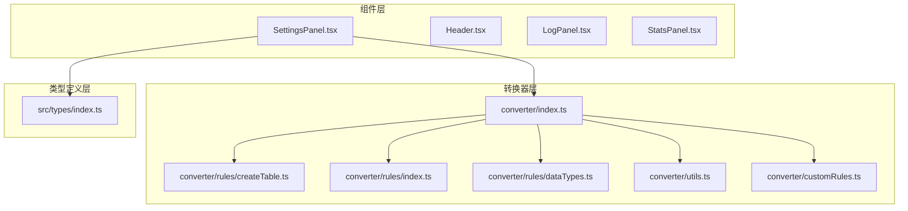
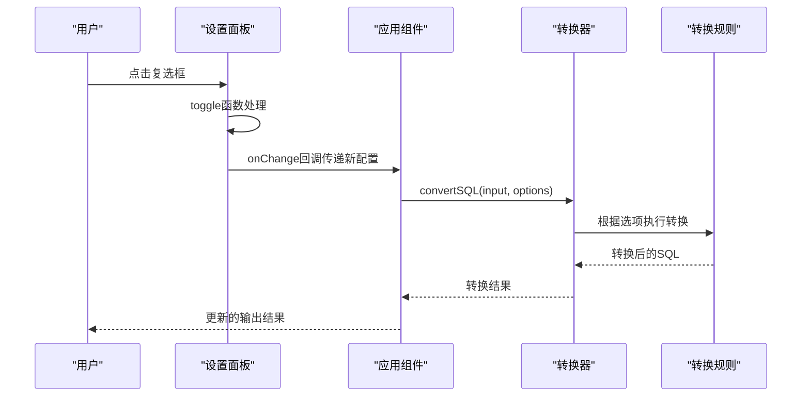
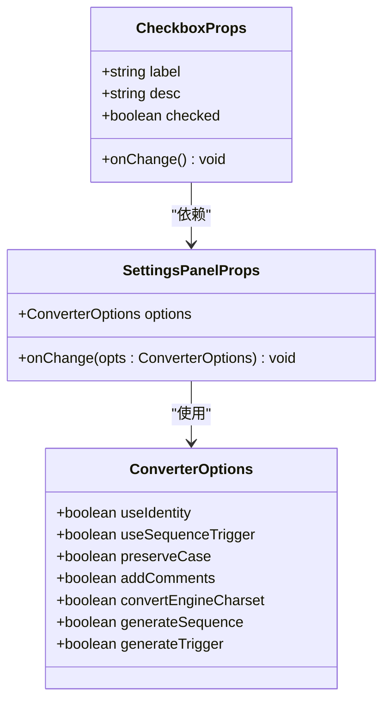
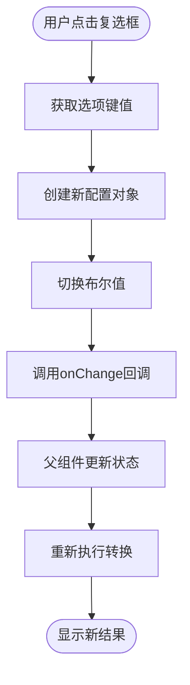
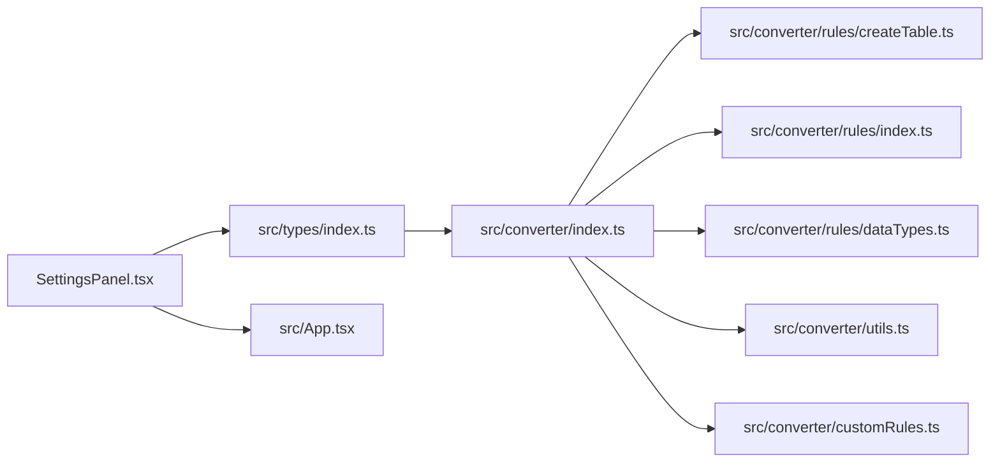

# 设置面板组件

<cite>
**本文档引用的文件**
- [SettingsPanel.tsx](file://src/components/SettingsPanel.tsx)
- [App.tsx](file://src/App.tsx)
- [types/index.ts](file://src/types/index.ts)
- [converter/index.ts](file://src/converter/index.ts)
- [converter/rules/createTable.ts](file://src/converter/rules/createTable.ts)
- [converter/rules/index.ts](file://src/converter/rules/index.ts)
- [converter/rules/dataTypes.ts](file://src/converter/rules/dataTypes.ts)
- [converter/utils.ts](file://src/converter/utils.ts)
- [converter/customRules.ts](file://src/converter/customRules.ts)
</cite>

## 目录
1. [简介](#简介)
2. [项目结构](#项目结构)
3. [核心组件](#核心组件)
4. [架构概览](#架构概览)
5. [详细组件分析](#详细组件分析)
6. [依赖关系分析](#依赖关系分析)
7. [性能考量](#性能考量)
8. [故障排除指南](#故障排除指南)
9. [结论](#结论)
10. [附录](#附录)

## 简介

设置面板组件是SQL转换器应用中的关键配置界面，负责管理各种转换选项和行为控制。该组件采用React函数式组件设计，提供了直观的图形化界面来配置MySQL到Oracle的SQL转换过程。

设置面板的核心价值在于其能够实时影响转换结果，通过简单的勾选操作即可改变整个转换流程的行为。这种设计使得用户可以在不修改代码的情况下灵活调整转换策略，满足不同数据库迁移场景的需求。

## 项目结构

设置面板位于组件目录中，与应用的主要逻辑紧密集成：

**图表来源**
- [SettingsPanel.tsx:1-100](file://src/components/SettingsPanel.tsx#L1-L100)
- [converter/index.ts:1-129](file://src/converter/index.ts#L1-L129)

**章节来源**
- [SettingsPanel.tsx:1-100](file://src/components/SettingsPanel.tsx#L1-L100)
- [App.tsx:1-282](file://src/App.tsx#L1-L282)

## 核心组件

设置面板组件采用简洁而高效的设计模式，主要包含以下核心特性：

### 组件架构设计

设置面板采用受控组件模式，通过props传递options配置对象和onChange回调函数。组件内部维护一个toggle函数来处理选项切换，并将其转换为新的配置对象传递给父组件。

### 选项配置系统

组件提供7个核心转换选项，每个选项都针对特定的转换需求：

1. **IDENTITY替代SEQUENCE**: 处理MySQL自增列的Oracle兼容性
2. **SEQUENCE+NEXTVAL生成**: 为AUTO_INCREMENT列创建序列和默认值
3. **更新触发器生成**: 处理ON UPDATE CURRENT_TIMESTAMP
4. **注释转换**: 将COMMENT转换为COMMENT ON TABLE/COLUMN
5. **引擎字符集移除**: 移除MySQL特有的表选项
6. **保留原始大小写**: 使用双引号保留标识符的原始大小写

**章节来源**
- [SettingsPanel.tsx:25-33](file://src/components/SettingsPanel.tsx#L25-L33)
- [types/index.ts:25-43](file://src/types/index.ts#L25-L43)

## 架构概览

设置面板在整个应用架构中扮演着配置中心的角色，连接用户界面与转换逻辑：

**图表来源**
- [SettingsPanel.tsx:41-44](file://src/components/SettingsPanel.tsx#L41-L44)
- [App.tsx:67-72](file://src/App.tsx#L67-L72)
- [converter/index.ts:59-125](file://src/converter/index.ts#L59-L125)

## 详细组件分析

### 组件接口设计

设置面板的props接口设计简洁明了，遵循React最佳实践：

**图表来源**
- [SettingsPanel.tsx:3-6](file://src/components/SettingsPanel.tsx#L3-L6)
- [types/index.ts:25-33](file://src/types/index.ts#L25-L33)

### 实时预览机制

设置面板实现了真正的实时预览功能，通过以下机制确保用户操作立即反映在转换结果中：

1. **状态同步**: 设置面板直接接收应用组件的状态作为props
2. **即时回调**: 每次选项变更都会触发onChange回调
3. **重新计算**: 应用组件收到新配置后立即重新执行转换

### 交互逻辑实现

组件的交互逻辑通过toggle函数实现，该函数采用不可变更新模式：

**图表来源**
- [SettingsPanel.tsx:41-44](file://src/components/SettingsPanel.tsx#L41-L44)

**章节来源**
- [SettingsPanel.tsx:41-44](file://src/components/SettingsPanel.tsx#L41-L44)
- [App.tsx:165-167](file://src/App.tsx#L165-L167)

### 转换选项详解

#### IDENTITY替代SEQUENCE (useIdentity)
- **作用**: 将MySQL的AUTO_INCREMENT转换为Oracle的IDENTITY列
- **影响**: 简化自增列实现，减少额外的序列和触发器依赖
- **适用场景**: Oracle 12c及以上版本，追求简洁的自增列实现

#### SEQUENCE+NEXTVAL生成 (useSequenceTrigger)
- **作用**: 为AUTO_INCREMENT列创建对应的SEQUENCE和DEFAULT值
- **影响**: 生成完整的序列定义和触发器代码
- **适用场景**: 需要精确控制自增行为或兼容旧版Oracle

#### 更新触发器生成 (generateTrigger)
- **作用**: 为ON UPDATE CURRENT_TIMESTAMP列生成触发器
- **影响**: 自动创建BEFORE UPDATE触发器处理时间戳更新
- **适用场景**: 需要保持MySQL的时间戳行为一致性

#### 注释转换 (addComments)
- **作用**: 将MySQL的COMMENT语法转换为Oracle的COMMENT ON语法
- **影响**: 生成表级和列级注释定义
- **适用场景**: 需要保留数据库元数据信息

#### 引擎字符集移除 (convertEngineCharset)
- **作用**: 移除MySQL特有的表选项如ENGINE、CHARSET等
- **影响**: 简化SQL语法，提高跨数据库兼容性
- **适用场景**: 纯SQL迁移，不需要存储引擎特定配置

#### 保留原始大小写 (preserveCase)
- **作用**: 使用双引号包裹标识符以保留原始大小写
- **影响**: 避免Oracle默认的大写转换
- **适用场景**: 需要保持原有标识符命名约定

**章节来源**
- [SettingsPanel.tsx:60-95](file://src/components/SettingsPanel.tsx#L60-L95)
- [converter/rules/createTable.ts:208-238](file://src/converter/rules/createTable.ts#L208-L238)

## 依赖关系分析

设置面板的依赖关系相对简单，主要依赖于类型定义和应用状态管理：

**图表来源**
- [SettingsPanel.tsx:1](file://src/components/SettingsPanel.tsx#L1)
- [types/index.ts:1](file://src/types/index.ts#L1)

### 组件耦合度分析

设置面板具有较低的内部耦合度，主要体现在：

1. **单一职责**: 专注于配置管理，不包含业务逻辑
2. **清晰接口**: 明确的props和回调约定
3. **无副作用**: 不直接操作DOM或全局状态

### 外部依赖关系

组件对外部依赖主要体现在：

1. **类型系统**: 严格依赖ConverterOptions接口定义
2. **状态管理**: 依赖应用组件提供的状态和回调
3. **转换逻辑**: 间接依赖转换器的各种规则

**章节来源**
- [SettingsPanel.tsx:1-100](file://src/components/SettingsPanel.tsx#L1-L100)
- [converter/index.ts:1-129](file://src/converter/index.ts#L1-L129)

## 性能考量

设置面板在性能方面表现出色，主要体现在：

### 渲染优化

1. **轻量级组件**: 仅包含必要的UI元素，渲染开销极小
2. **不可变更新**: 使用不可变模式避免不必要的重渲染
3. **受控组件**: 减少本地状态管理复杂度

### 内存效率

1. **最小状态**: 仅维护当前配置状态
2. **无缓存**: 避免复杂的缓存机制增加复杂度
3. **及时释放**: 组件卸载时不会产生内存泄漏

### 交互响应性

1. **即时反馈**: 用户操作几乎无延迟
2. **流畅动画**: 使用CSS过渡效果提升用户体验
3. **键盘支持**: 支持键盘快捷键操作

## 故障排除指南

### 常见问题及解决方案

#### 设置变更不生效
- **原因**: 父组件状态未正确更新
- **解决**: 检查onChange回调的实现和状态传递

#### 转换结果异常
- **原因**: 某些选项组合导致冲突
- **解决**: 逐步禁用可疑选项，定位问题选项

#### 性能问题
- **原因**: 大量设置变更触发频繁重渲染
- **解决**: 合理组织设置变更，避免连续多次更新

### 调试技巧

1. **检查状态流**: 确认设置变更正确传递到转换器
2. **验证类型**: 确保ConverterOptions接口定义完整
3. **监控性能**: 使用浏览器开发者工具分析渲染性能

**章节来源**
- [App.tsx:67-72](file://src/App.tsx#L67-L72)
- [converter/index.ts:59-125](file://src/converter/index.ts#L59-L125)

## 结论

设置面板组件展现了优秀的软件设计原则：简洁、可维护、高性能。通过精心设计的接口和清晰的职责分离，该组件成功地将复杂的转换配置抽象为直观的图形界面。

组件的核心优势在于其实时预览能力和灵活的配置选项，使得用户能够在不编写代码的情况下精确控制转换过程。同时，严格的类型系统和清晰的依赖关系确保了代码的可维护性和扩展性。

对于未来的改进方向，可以考虑添加配置导入导出功能、预设配置模板以及更详细的帮助信息，进一步提升用户体验。

## 附录

### 使用指南

#### 基本使用步骤
1. 在设置面板中勾选所需的转换选项
2. 查看输出区域的实时预览结果
3. 根据需要调整选项组合
4. 导出最终的转换结果

#### 配置建议

**首次使用建议**:
- 启用"转换表注释"以保留元数据信息
- 启用"移除 ENGINE/CHARSET"简化SQL语法
- 根据数据库版本选择合适的自增列方案

**高级用户建议**:
- 结合具体业务需求调整IDENTITY和SEQUENCE策略
- 使用保留原始大小写选项处理命名约定
- 配合自定义规则实现特殊转换需求

### 配置选项对照表

| 选项名称 | 默认值 | 功能描述 | 影响范围 |
|---------|--------|----------|----------|
| useIdentity | false | IDENTITY替代SEQUENCE | 自增列转换 |
| useSequenceTrigger | true | SEQUENCE+NEXTVAL生成 | 自增列转换 |
| preserveCase | false | 保留原始大小写 | 标识符转换 |
| addComments | true | 注释转换 | 元数据保留 |
| convertEngineCharset | true | 引擎字符集移除 | 表定义简化 |
| generateSequence | true | 序列生成 | 自增列实现 |
| generateTrigger | true | 更新触发器生成 | 时间戳处理 |