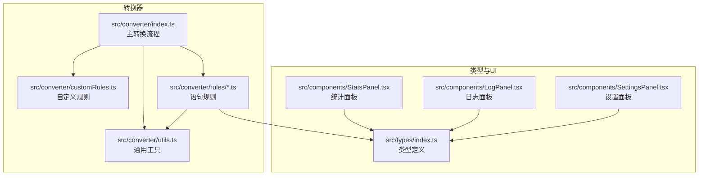
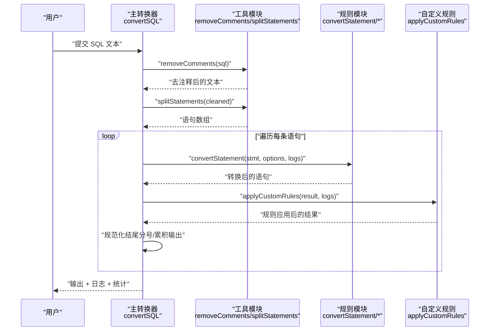
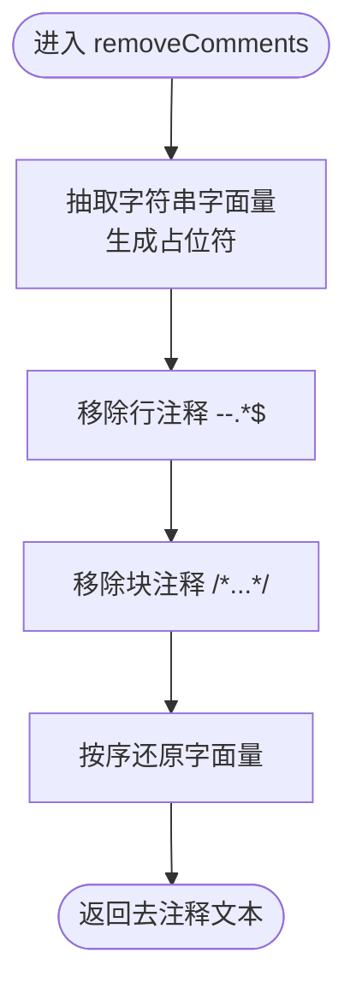
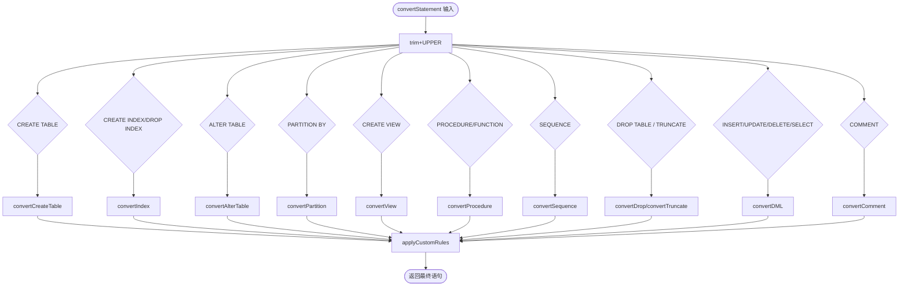
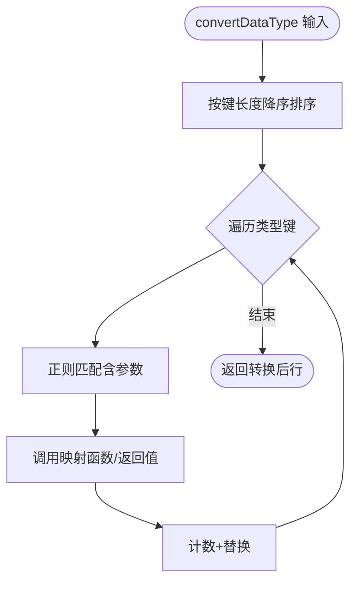
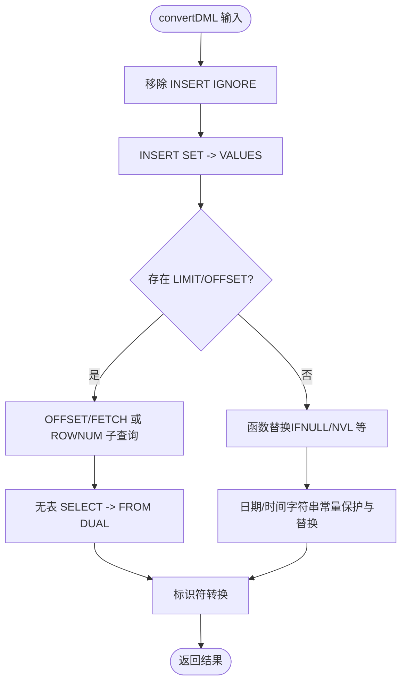
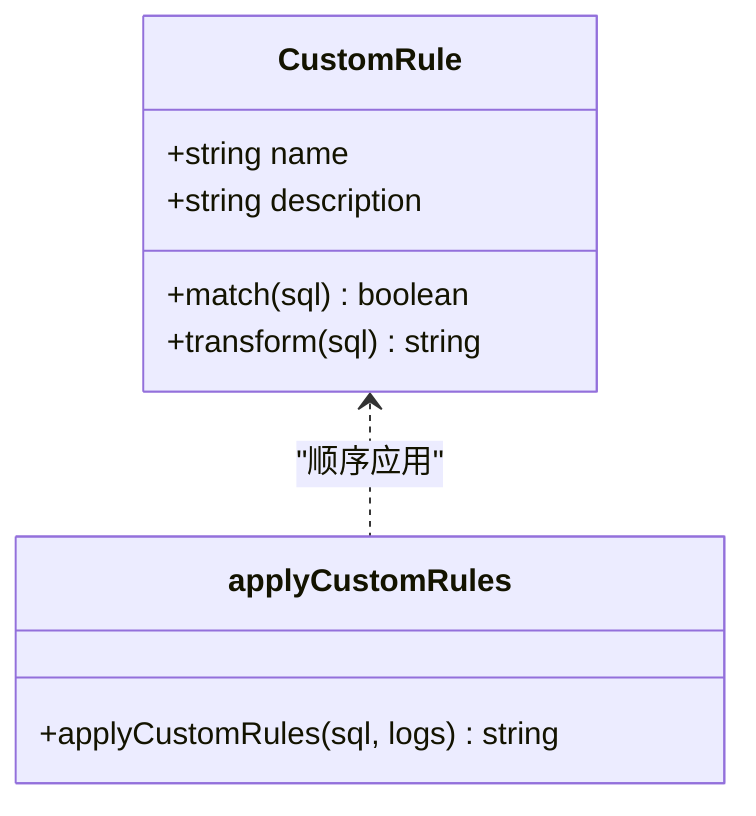
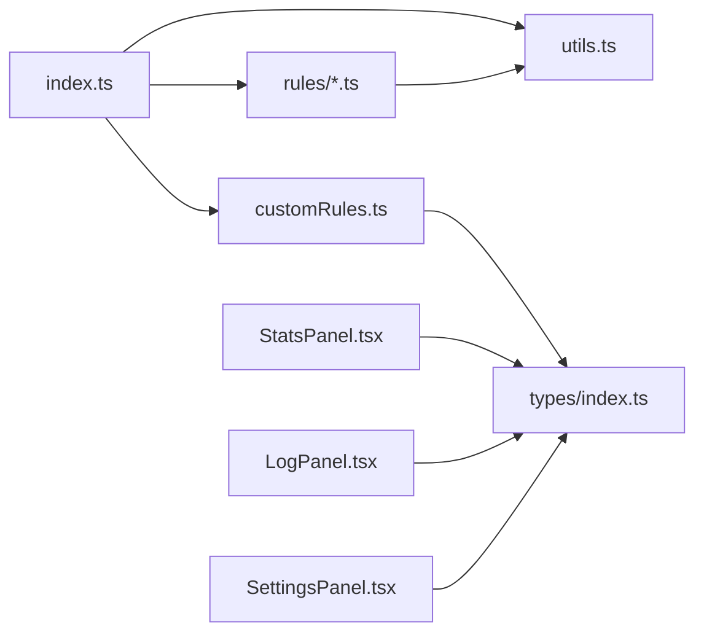

# 性能优化设计

<cite>
**本文引用的文件**
- [README.md](file://README.md)
- [src/converter/index.ts](file://src/converter/index.ts)
- [src/converter/utils.ts](file://src/converter/utils.ts)
- [src/converter/customRules.ts](file://src/converter/customRules.ts)
- [src/converter/rules/index.ts](file://src/converter/rules/index.ts)
- [src/converter/rules/comments.ts](file://src/converter/rules/comments.ts)
- [src/converter/rules/dataTypes.ts](file://src/converter/rules/dataTypes.ts)
- [src/converter/rules/dml.ts](file://src/converter/rules/dml.ts)
- [src/converter/rules/createTable.ts](file://src/converter/rules/createTable.ts)
- [src/converter/rules/partition.ts](file://src/converter/rules/partition.ts)
- [src/converter/rules/others.ts](file://src/converter/rules/others.ts)
- [src/types/index.ts](file://src/types/index.ts)
- [src/components/StatsPanel.tsx](file://src/components/StatsPanel.tsx)
- [src/components/LogPanel.tsx](file://src/components/LogPanel.tsx)
- [src/components/SettingsPanel.tsx](file://src/components/SettingsPanel.tsx)
- [package.json](file://package.json)
</cite>

## 目录
1. [简介](#简介)
2. [项目结构](#项目结构)
3. [核心组件](#核心组件)
4. [架构概览](#架构概览)
5. [详细组件分析](#详细组件分析)
6. [依赖分析](#依赖分析)
7. [性能考量](#性能考量)
8. [故障排查指南](#故障排查指南)
9. [结论](#结论)
10. [附录](#附录)

## 简介
本项目是一个面向 OceanBase MySQL 模式向 Oracle 模式迁移的 SQL 转换工具，提供多语句拆分、数据类型映射、注释处理、DML 语法适配、自定义规则扩展等能力。针对大数据量处理，系统在以下方面具备明确的性能优化设计与实现基础：
- 内存使用优化：通过“占位符 + 字面量还原”的策略避免在正则替换过程中反复复制大字符串；语句拆分与注释移除采用惰性处理，减少中间对象数量。
- 字符串处理效率：在注释移除与语句拆分中，先保护字符串字面量，再进行模式匹配与替换，确保复杂 SQL 的正确性与性能。
- 并发处理能力：当前主流程为同步执行，但整体模块化设计便于后续引入 Web Worker 或流式处理以支持更大规模数据。
- 缓存与重复计算避免：通过统计日志聚合与规则应用的短路机制，降低重复工作；可扩展地在规则层引入“语句指纹 + 结果缓存”。
- 性能监控与基准测试：内置统计面板与日志面板，提供关键指标采集入口；建议结合浏览器性能分析器与基准测试脚本进行量化评估。
- 可扩展性设计：规则模块按语句类型解耦，便于按需扩展与优化；配置项支持在不同场景下权衡性能与功能。

## 项目结构
项目采用前端单页应用架构，核心转换逻辑集中在 src/converter 目录，按语句类型划分规则模块，类型定义与 UI 组件分别位于 types 与 components 目录。

图表来源
- [src/converter/index.ts:1-129](file://src/converter/index.ts#L1-L129)
- [src/converter/utils.ts:1-115](file://src/converter/utils.ts#L1-L115)
- [src/converter/customRules.ts:1-186](file://src/converter/customRules.ts#L1-L186)
- [src/converter/rules/index.ts:1-135](file://src/converter/rules/index.ts#L1-L135)
- [src/types/index.ts:1-44](file://src/types/index.ts#L1-L44)
- [src/components/StatsPanel.tsx:1-42](file://src/components/StatsPanel.tsx#L1-L42)
- [src/components/LogPanel.tsx:1-82](file://src/components/LogPanel.tsx#L1-L82)
- [src/components/SettingsPanel.tsx:1-100](file://src/components/SettingsPanel.tsx#L1-L100)

章节来源
- [README.md:1-79](file://README.md#L1-L79)
- [package.json:1-36](file://package.json#L1-L36)

## 核心组件
- 主转换器：负责输入清理、语句拆分、逐条路由转换、日志与统计收集。
- 工具模块：提供标识符转换、字符串字面量保护/还原、注释移除、语句拆分、命名生成等通用能力。
- 规则模块：按语句类型拆分，包含 DDL（建表、索引、分区）、DML（插入/更新/删除/查询）、注释与视图、数据类型映射、存储过程/序列等。
- 自定义规则：提供可插拔的规则接口与示例，支持按表/列的条件匹配与变换。
- UI 组件：统计面板、日志面板、设置面板，用于展示转换状态与性能相关指标。

章节来源
- [src/converter/index.ts:1-129](file://src/converter/index.ts#L1-L129)
- [src/converter/utils.ts:1-115](file://src/converter/utils.ts#L1-L115)
- [src/converter/customRules.ts:1-186](file://src/converter/customRules.ts#L1-L186)
- [src/converter/rules/index.ts:1-135](file://src/converter/rules/index.ts#L1-L135)
- [src/converter/rules/dml.ts:1-163](file://src/converter/rules/dml.ts#L1-L163)
- [src/converter/rules/createTable.ts:1-380](file://src/converter/rules/createTable.ts#L1-L380)
- [src/converter/rules/dataTypes.ts:1-106](file://src/converter/rules/dataTypes.ts#L1-L106)
- [src/converter/rules/partition.ts:1-38](file://src/converter/rules/partition.ts#L1-L38)
- [src/converter/rules/comments.ts:1-53](file://src/converter/rules/comments.ts#L1-L53)
- [src/converter/rules/others.ts:1-49](file://src/converter/rules/others.ts#L1-L49)
- [src/types/index.ts:1-44](file://src/types/index.ts#L1-L44)
- [src/components/StatsPanel.tsx:1-42](file://src/components/StatsPanel.tsx#L1-L42)
- [src/components/LogPanel.tsx:1-82](file://src/components/LogPanel.tsx#L1-L82)
- [src/components/SettingsPanel.tsx:1-100](file://src/components/SettingsPanel.tsx#L1-L100)

## 架构概览
主流程从输入 SQL 开始，依次执行注释移除、语句拆分、逐条转换、自定义规则应用与结果拼接，并统计日志与指标。

图表来源
- [src/converter/index.ts:59-125](file://src/converter/index.ts#L59-L125)
- [src/converter/utils.ts:52-72](file://src/converter/utils.ts#L52-L72)
- [src/converter/customRules.ts:170-185](file://src/converter/customRules.ts#L170-L185)

## 详细组件分析

### 注释移除与语句拆分（性能关键路径）
- 设计要点
  - 字面量保护：先抽取字符串字面量，用占位符替换，再进行注释与分号处理，最后还原字面量，避免误伤字符串内部内容。
  - 正则选择：行注释与块注释分别使用单次替换，复杂度近似 O(n)；语句拆分同样基于占位符保护，避免在字符串内部误切分。
  - 时间复杂度：整体为 O(n)，空间复杂度受字面量数量影响，但通过占位符显著降低字符串复制次数。
- 优化建议
  - 对超长 SQL 文件，可考虑分片处理与流式拼接，减少峰值内存占用。
  - 在规则应用前统一执行注释移除与拆分，避免重复处理。

图表来源
- [src/converter/utils.ts:52-60](file://src/converter/utils.ts#L52-L60)
- [src/converter/utils.ts:33-47](file://src/converter/utils.ts#L33-L47)

章节来源
- [src/converter/utils.ts:52-72](file://src/converter/utils.ts#L52-L72)

### 语句路由与逐条转换（可扩展性与性能）
- 设计要点
  - 通过语句首关键字与正则组合快速分流至对应规则函数，避免全量扫描。
  - 对未知语句类型，降级为标识符转换，保证稳定性。
  - 统一规范化输出（补加分号、trim），减少下游处理成本。
- 性能考量
  - 路由判断为 O(k)（k 为规则数量），实际开销极低。
  - 可在高频规则（如 DML、数据类型）上进一步细化正则，减少回溯。

图表来源
- [src/converter/index.ts:15-54](file://src/converter/index.ts#L15-L54)
- [src/converter/customRules.ts:170-185](file://src/converter/customRules.ts#L170-L185)

章节来源
- [src/converter/index.ts:15-54](file://src/converter/index.ts#L15-L54)

### 数据类型映射（复杂度与可扩展性）
- 设计要点
  - 使用有序键匹配（按长度降序）优先匹配带参类型，减少歧义。
  - 通过回调函数支持动态参数映射（如 DECIMAL/MYSQL 的精度/范围）。
- 复杂度分析
  - 单行映射为 O(m)（m 为类型键数量），整体 O(n*m)（n 为语句行数）。
- 优化建议
  - 可引入“类型指纹 + 结果缓存”，对重复类型映射进行去重与复用。
  - 对高频类型（如 NUMBER、VARCHAR2）可预编译正则以减少构造成本。

图表来源
- [src/converter/rules/dataTypes.ts:61-86](file://src/converter/rules/dataTypes.ts#L61-L86)

章节来源
- [src/converter/rules/dataTypes.ts:1-106](file://src/converter/rules/dataTypes.ts#L1-L106)

### DML 语句转换（LIMIT/OFFSET/函数替换）
- 设计要点
  - LIMIT/OFFSET：根据是否存在 OFFSET 选择 OFFSET/FETCH 或 ROWNUM 子查询方案，并发出提示日志。
  - 函数替换：IFNULL/NOW/SUBSTRING 等函数映射为 Oracle 等价形式；日期时间字符串常量保护已有 TO_DATE/TO_TIMESTAMP 调用，避免二次替换。
  - 无表 SELECT：自动补全 FROM DUAL。
- 性能考量
  - 正则替换为 O(n) 级别；复杂度主要受语句长度与函数调用数量影响。
  - 建议在规则层增加“指纹缓存”以避免重复替换。

图表来源
- [src/converter/rules/dml.ts:7-162](file://src/converter/rules/dml.ts#L7-L162)

章节来源
- [src/converter/rules/dml.ts:1-163](file://src/converter/rules/dml.ts#L1-L163)

### 自定义规则（可扩展与性能权衡）
- 设计要点
  - 规则接口：match 判定 + transform 转换，支持按表/列条件精确匹配。
  - 示例：INSERT NULL 替换、批量空字符串替换等。
  - 应用策略：按顺序尝试匹配并应用，命中即记录日志。
- 性能考量
  - 当前为线性遍历规则集，复杂度 O(r)（r 为规则数量）。
  - 建议引入“规则指纹 + 条件编译”与“按表/列维度的规则索引”，减少无效匹配。

图表来源
- [src/converter/customRules.ts:7-185](file://src/converter/customRules.ts#L7-L185)

章节来源
- [src/converter/customRules.ts:1-186](file://src/converter/customRules.ts#L1-L186)

### 设置与统计（性能可观测性）
- 设置面板：提供开关项（IDENTITY、SEQUENCE+TRIGGER、保留大小写、注释转换、移除 ENGINE/CHARSET 等），可在不同场景下权衡功能与性能。
- 统计面板：展示总语句、已转换、警告、错误、类型转换、自增转换、注释转换等指标，便于定位性能瓶颈。
- 日志面板：提供消息与详情字段，辅助定位耗时语句与异常。

章节来源
- [src/components/SettingsPanel.tsx:1-100](file://src/components/SettingsPanel.tsx#L1-L100)
- [src/components/StatsPanel.tsx:1-42](file://src/components/StatsPanel.tsx#L1-L42)
- [src/components/LogPanel.tsx:1-82](file://src/components/LogPanel.tsx#L1-L82)
- [src/types/index.ts:15-23](file://src/types/index.ts#L15-L23)

## 依赖分析
- 模块内聚与耦合
  - 主转换器依赖工具模块与各规则模块；规则模块之间低耦合，仅共享工具函数。
  - 自定义规则与主流程松耦合，通过接口注入，便于扩展。
- 外部依赖
  - React 生态与 Monaco Editor 提供 UI 与编辑体验，对核心转换性能影响有限。
- 可能的循环依赖
  - 当前结构未发现循环依赖，模块间均为单向依赖。

图表来源
- [src/converter/index.ts:1-129](file://src/converter/index.ts#L1-L129)
- [src/converter/utils.ts:1-115](file://src/converter/utils.ts#L1-L115)
- [src/converter/customRules.ts:1-186](file://src/converter/customRules.ts#L1-L186)
- [src/converter/rules/index.ts:1-135](file://src/converter/rules/index.ts#L1-L135)
- [src/types/index.ts:1-44](file://src/types/index.ts#L1-L44)
- [src/components/StatsPanel.tsx:1-42](file://src/components/StatsPanel.tsx#L1-L42)
- [src/components/LogPanel.tsx:1-82](file://src/components/LogPanel.tsx#L1-L82)
- [src/components/SettingsPanel.tsx:1-100](file://src/components/SettingsPanel.tsx#L1-L100)

## 性能考量

### 内存使用优化
- 字面量保护策略有效避免在正则替换过程中产生大量中间字符串副本，降低 GC 压力。
- 语句拆分与注释移除均采用“占位符 + 还原”的模式，适合处理超长 SQL。
- 建议
  - 对超大文件采用分片读取与流式拼接，控制峰值内存。
  - 在规则应用阶段避免不必要的字符串拼接，尽量就地替换。

章节来源
- [src/converter/utils.ts:33-47](file://src/converter/utils.ts#L33-L47)
- [src/converter/utils.ts:65-72](file://src/converter/utils.ts#L65-L72)

### 字符串处理效率提升
- 正则选择与顺序
  - 行注释与块注释分别处理，减少回溯。
  - 数据类型映射按键长度降序匹配，优先命中带参类型，减少歧义。
- 建议
  - 对高频正则进行预编译与缓存。
  - 在 DML 函数替换中，先保护已存在的 TO_DATE/TO_TIMESTAMP 调用，避免二次替换带来的额外匹配。

章节来源
- [src/converter/utils.ts:52-60](file://src/converter/utils.ts#L52-L60)
- [src/converter/rules/dataTypes.ts:66-76](file://src/converter/rules/dataTypes.ts#L66-L76)
- [src/converter/rules/dml.ts:124-152](file://src/converter/rules/dml.ts#L124-L152)

### 并发处理能力
- 当前主流程为同步执行，适合中小规模 SQL 文件。
- 可扩展方向
  - 引入 Web Worker：将注释移除、语句拆分、逐条转换与自定义规则应用拆分到 Worker，主线程仅负责调度与汇总。
  - 流式处理：对超大文件采用分片与背压策略，边读边写，降低内存峰值。
  - 并行规则：对互不冲突的规则集进行并行应用（需确保线程安全与一致性）。

章节来源
- [src/converter/index.ts:59-125](file://src/converter/index.ts#L59-L125)

### 缓存机制与重复计算避免
- 现状
  - 统计日志在转换完成后聚合计数，避免重复扫描。
  - 自定义规则按顺序应用，命中即停止后续匹配（短路）。
- 建议
  - 引入“语句指纹 + 结果缓存”：对相同语句或等价语句（经标准化）缓存转换结果。
  - 规则层引入“条件编译”：对 match 条件进行预处理与索引，减少无效匹配。
  - 数据类型映射引入“类型指纹 + 映射缓存”。

章节来源
- [src/converter/index.ts:113-117](file://src/converter/index.ts#L113-L117)
- [src/converter/customRules.ts:170-185](file://src/converter/customRules.ts#L170-L185)
- [src/converter/rules/dataTypes.ts:61-86](file://src/converter/rules/dataTypes.ts#L61-L86)

### 性能监控与基准测试
- 指标采集
  - 统计面板：总语句、已转换、警告、错误、类型转换、自增转换、注释转换。
  - 日志面板：错误详情与行号，辅助定位耗时语句。
- 基准测试建议
  - 构造不同规模与复杂度的 SQL 文件（含注释、字符串、函数、LIMIT 等）。
  - 使用浏览器性能分析器记录主线程与 Worker 的 CPU/内存占用。
  - 对比开启/关闭特定选项（如保留大小写、生成序列/触发器）对性能的影响。

章节来源
- [src/components/StatsPanel.tsx:7-16](file://src/components/StatsPanel.tsx#L7-L16)
- [src/components/LogPanel.tsx:22-79](file://src/components/LogPanel.tsx#L22-L79)
- [src/types/index.ts:15-23](file://src/types/index.ts#L15-L23)

### 可扩展性设计考虑
- 大规模 SQL 文件处理的瓶颈
  - 正则回溯：复杂 SQL 的正则可能引发回溯风暴，应限制正则复杂度或采用更稳健的解析策略。
  - 字符串复制：频繁的字符串拼接与替换会产生大量中间对象，应采用占位符策略与就地替换。
  - 规则匹配：规则数量增长导致匹配开销上升，应引入索引与短路策略。
- 解决方案
  - 模块化与并行化：将规则与转换步骤拆分为可并行单元。
  - 缓存与去重：对重复语句与类型映射进行缓存。
  - 分片与流式：对超大文件采用分片与流式处理，控制内存峰值。

章节来源
- [src/converter/index.ts:59-125](file://src/converter/index.ts#L59-L125)
- [src/converter/utils.ts:52-72](file://src/converter/utils.ts#L52-L72)
- [src/converter/customRules.ts:170-185](file://src/converter/customRules.ts#L170-L185)

### 性能调优最佳实践
- 配置参数优化
  - 保留大小写：启用会增加双引号包裹与大小写处理，对性能略有影响，建议仅在必要时开启。
  - 生成序列/触发器：开启会增加额外 DDL 与日志，对转换时间有明显影响，建议在需要时启用。
  - 转换注释与移除 ENGINE/CHARSET：对性能影响较小，建议保持默认。
  - 使用 IDENTITY：在 Oracle 12c+ 场景下可简化自增列，减少序列/触发器开销。
- 使用建议
  - 对超大文件先进行注释移除与语句拆分的分片处理，再并行转换。
  - 在规则层引入“指纹 + 缓存”，减少重复计算。
  - 使用统计面板与日志面板持续监控转换质量与性能。

章节来源
- [src/types/index.ts:25-43](file://src/types/index.ts#L25-L43)
- [src/components/SettingsPanel.tsx:41-96](file://src/components/SettingsPanel.tsx#L41-L96)

## 故障排查指南
- 常见问题
  - 语句拆分异常：检查是否存在未闭合括号或字符串内分号，确认占位符还原是否正确。
  - 注释移除不彻底：确认字符串字面量保护是否生效，避免误删注释。
  - 自定义规则未生效：检查 match 条件是否过于宽泛或过于严格，必要时调整正则。
  - 性能异常：关注统计面板中的错误与警告数量，结合日志面板定位耗时语句。
- 排查步骤
  - 启用最小化配置，逐步开启选项以定位性能瓶颈。
  - 使用浏览器性能分析器观察主线程与 Worker 的 CPU/内存曲线。
  - 对超大文件进行分片测试，验证内存峰值与吞吐量。

章节来源
- [src/converter/index.ts:97-107](file://src/converter/index.ts#L97-L107)
- [src/converter/utils.ts:52-60](file://src/converter/utils.ts#L52-L60)
- [src/converter/customRules.ts:170-185](file://src/converter/customRules.ts#L170-L185)
- [src/components/StatsPanel.tsx:7-16](file://src/components/StatsPanel.tsx#L7-L16)
- [src/components/LogPanel.tsx:22-79](file://src/components/LogPanel.tsx#L22-L79)

## 结论
本项目在注释移除、语句拆分与规则转换等方面已具备良好的性能基础：通过“占位符 + 字面量还原”策略降低字符串复制成本，采用模块化与路由分流提升可维护性与扩展性。为进一步提升大数据量处理能力，建议引入分片与流式处理、Web Worker 并行化、规则与类型映射缓存、以及更精细的正则与解析策略。同时，结合统计面板与日志面板持续监控关键指标，形成闭环的性能优化体系。

## 附录
- 相关文件清单
  - 转换器主流程：[src/converter/index.ts](file://src/converter/index.ts)
  - 工具函数：[src/converter/utils.ts](file://src/converter/utils.ts)
  - 自定义规则：[src/converter/customRules.ts](file://src/converter/customRules.ts)
  - 规则模块：[src/converter/rules/index.ts](file://src/converter/rules/index.ts)、[src/converter/rules/dml.ts](file://src/converter/rules/dml.ts)、[src/converter/rules/createTable.ts](file://src/converter/rules/createTable.ts)、[src/converter/rules/dataTypes.ts](file://src/converter/rules/dataTypes.ts)、[src/converter/rules/partition.ts](file://src/converter/rules/partition.ts)、[src/converter/rules/comments.ts](file://src/converter/rules/comments.ts)、[src/converter/rules/others.ts](file://src/converter/rules/others.ts)
  - 类型定义：[src/types/index.ts](file://src/types/index.ts)
  - UI 组件：[src/components/StatsPanel.tsx](file://src/components/StatsPanel.tsx)、[src/components/LogPanel.tsx](file://src/components/LogPanel.tsx)、[src/components/SettingsPanel.tsx](file://src/components/SettingsPanel.tsx)
  - 项目说明：[README.md](file://README.md)
  - 依赖声明：[package.json](file://package.json)