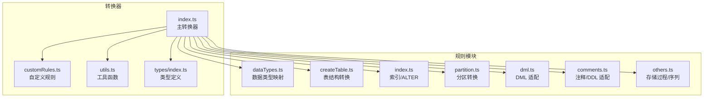
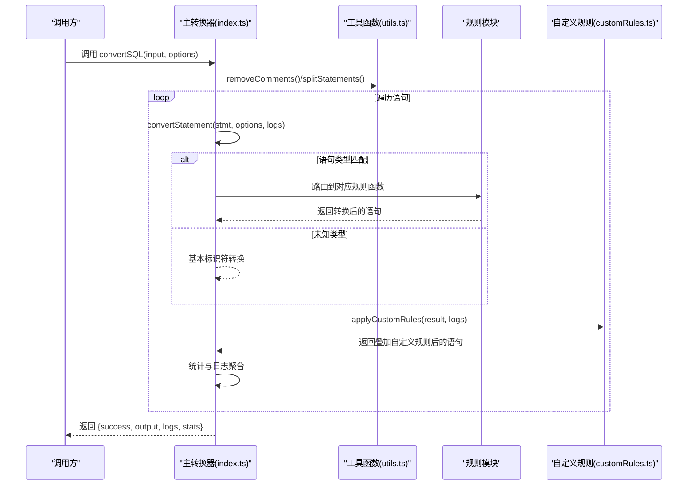
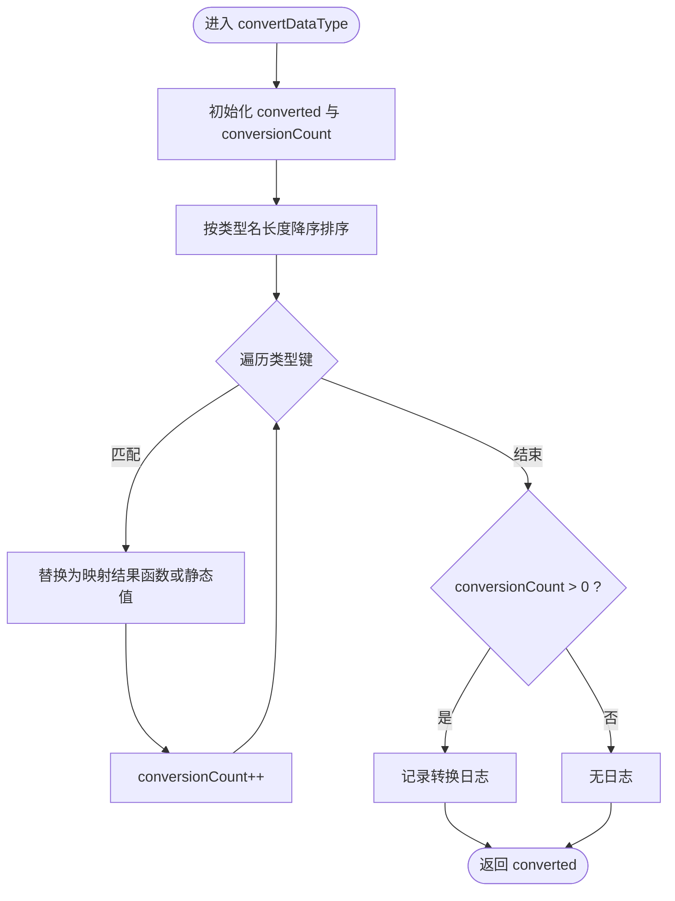
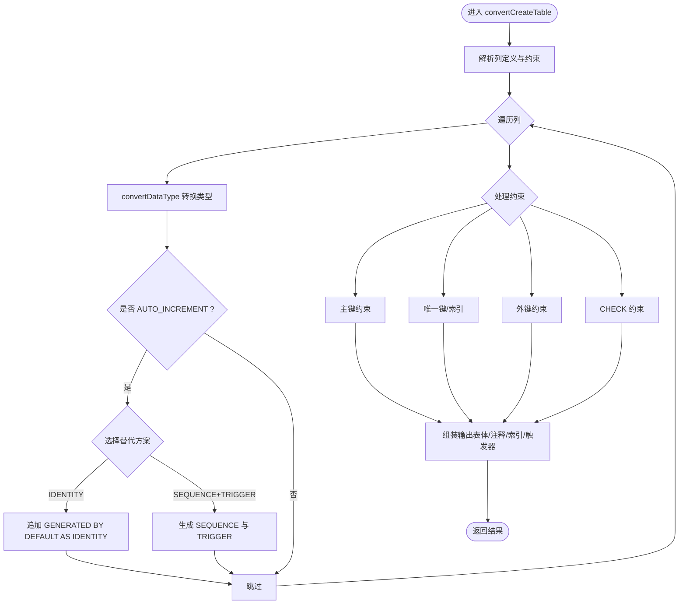
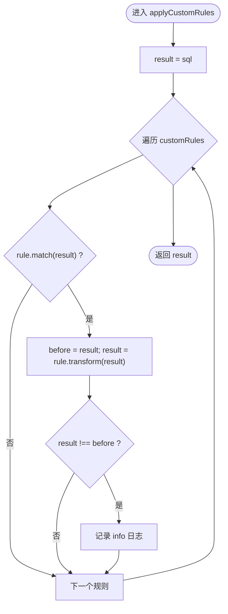
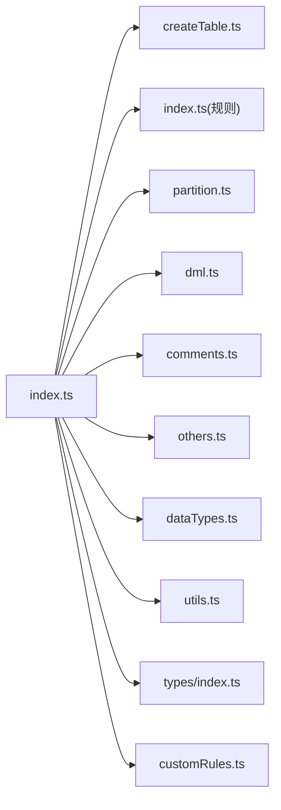

# 规则引擎架构

<cite>
**本文引用的文件**
- [src/converter/index.ts](file://src/converter/index.ts)
- [src/converter/customRules.ts](file://src/converter/customRules.ts)
- [src/converter/rules/index.ts](file://src/converter/rules/index.ts)
- [src/converter/rules/createTable.ts](file://src/converter/rules/createTable.ts)
- [src/converter/rules/dataTypes.ts](file://src/converter/rules/dataTypes.ts)
- [src/converter/rules/dml.ts](file://src/converter/rules/dml.ts)
- [src/converter/rules/partition.ts](file://src/converter/rules/partition.ts)
- [src/converter/rules/comments.ts](file://src/converter/rules/comments.ts)
- [src/converter/rules/others.ts](file://src/converter/rules/others.ts)
- [src/converter/utils.ts](file://src/converter/utils.ts)
- [src/types/index.ts](file://src/types/index.ts)
- [README.md](file://README.md)
</cite>

## 目录
1. [简介](#简介)
2. [项目结构](#项目结构)
3. [核心组件](#核心组件)
4. [架构总览](#架构总览)
5. [详细组件分析](#详细组件分析)
6. [依赖关系分析](#依赖关系分析)
7. [性能考量](#性能考量)
8. [故障排查指南](#故障排查指南)
9. [结论](#结论)
10. [附录](#附录)

## 简介
本文件系统性阐述 SQL 转换器的规则引擎架构，重点覆盖以下方面：
- 规则模块化组织：按功能域划分规则文件，统一入口路由。
- 规则加载机制：通过主转换器集中导入各规则模块。
- 规则执行流程：语句类型识别、规则链式执行、自定义规则叠加。
- 内置规则分类与组织：数据类型规则、表结构规则、DML 规则、索引/分区/注释/存储对象等。
- 自定义规则应用机制：applyCustomRules 的实现原理与规则优先级处理。
- 上下文传递机制：options 参数与 logs 数组的作用与影响。
- 扩展性设计：新增规则的添加方式与最佳实践。
- 规则开发与调试：测试方法与常见问题解决方案。

## 项目结构
规则引擎位于 src/converter 目录下，采用“按功能域分模块 + 统一入口”的组织方式：
- 规则模块：dataTypes、createTable、index、partition、dml、comments、others
- 自定义规则：customRules
- 工具函数：utils
- 类型定义：types
- 主转换器：index

图表来源
- [src/converter/index.ts:1-129](file://src/converter/index.ts#L1-L129)
- [src/converter/customRules.ts:1-186](file://src/converter/customRules.ts#L1-L186)
- [src/converter/rules/index.ts:1-135](file://src/converter/rules/index.ts#L1-L135)
- [src/converter/rules/createTable.ts:1-380](file://src/converter/rules/createTable.ts#L1-L380)
- [src/converter/rules/dataTypes.ts:1-106](file://src/converter/rules/dataTypes.ts#L1-L106)
- [src/converter/rules/dml.ts:1-163](file://src/converter/rules/dml.ts#L1-L163)
- [src/converter/rules/partition.ts:1-38](file://src/converter/rules/partition.ts#L1-L38)
- [src/converter/rules/comments.ts:1-53](file://src/converter/rules/comments.ts#L1-L53)
- [src/converter/rules/others.ts:1-49](file://src/converter/rules/others.ts#L1-L49)
- [src/converter/utils.ts:1-115](file://src/converter/utils.ts#L1-L115)
- [src/types/index.ts:1-44](file://src/types/index.ts#L1-L44)

章节来源
- [src/converter/index.ts:1-129](file://src/converter/index.ts#L1-L129)
- [README.md:1-79](file://README.md#L1-L79)

## 核心组件
- 主转换器（index.ts）
  - 负责语句拆分、类型识别、路由到具体规则、错误捕获与统计、最终输出拼接。
  - 关键职责：convertSQL、convertStatement、日志与统计收集。
- 规则模块
  - dataTypes：数据类型映射与 ENUM 约束提取。
  - createTable：表结构解析、列定义转换、约束与注释处理、自增列替代方案（IDENTITY/SEQUENCE+TRIGGER）。
  - index：索引/ALTER TABLE 转换。
  - partition：分区语法适配。
  - dml：DML 语法适配（LIMIT、函数替换、字符串常量 TO_DATE/TO_TIMESTAMP）。
  - comments：注释/DDL 适配（DROP/TRUNCATE/VIEW）。
  - others：存储过程/函数、序列语法适配。
- 自定义规则（customRules.ts）
  - 定义 CustomRule 接口，提供规则匹配与转换函数。
  - 提供 nullReplacementRule 工厂函数与示例规则。
  - applyCustomRules 顺序遍历规则列表，对匹配项执行 transform 并记录日志。
- 工具函数（utils.ts）
  - 标识符转换、字符串字面量保护/还原、注释移除、语句拆分、命名生成、唯一索引名生成。
- 类型定义（types/index.ts）
  - ConversionLog、ConversionResult、ConversionStats、ConverterOptions 与默认值。

章节来源
- [src/converter/index.ts:1-129](file://src/converter/index.ts#L1-L129)
- [src/converter/customRules.ts:1-186](file://src/converter/customRules.ts#L1-L186)
- [src/converter/rules/dataTypes.ts:1-106](file://src/converter/rules/dataTypes.ts#L1-L106)
- [src/converter/rules/createTable.ts:1-380](file://src/converter/rules/createTable.ts#L1-L380)
- [src/converter/rules/index.ts:1-135](file://src/converter/rules/index.ts#L1-L135)
- [src/converter/rules/partition.ts:1-38](file://src/converter/rules/partition.ts#L1-L38)
- [src/converter/rules/dml.ts:1-163](file://src/converter/rules/dml.ts#L1-L163)
- [src/converter/rules/comments.ts:1-53](file://src/converter/rules/comments.ts#L1-L53)
- [src/converter/rules/others.ts:1-49](file://src/converter/rules/others.ts#L1-L49)
- [src/converter/utils.ts:1-115](file://src/converter/utils.ts#L1-L115)
- [src/types/index.ts:1-44](file://src/types/index.ts#L1-L44)

## 架构总览
规则引擎采用“主控制器 + 规则模块 + 自定义规则 + 工具函数”的分层架构：
- 控制层：主转换器负责整体流程控制与上下文传递。
- 规则层：按领域划分的规则模块，每个模块专注特定语法转换。
- 扩展层：自定义规则提供用户扩展能力，遵循统一接口。
- 支撑层：工具函数提供通用能力（字符串保护、标识符转换、命名生成等）。

图表来源
- [src/converter/index.ts:59-125](file://src/converter/index.ts#L59-L125)
- [src/converter/customRules.ts:170-185](file://src/converter/customRules.ts#L170-L185)
- [src/converter/utils.ts:52-72](file://src/converter/utils.ts#L52-L72)

## 详细组件分析

### 主转换器（convertSQL/convertStatement）
- convertSQL
  - 输入清理：移除注释、按分号拆分语句。
  - 逐条转换：调用 convertStatement，异常捕获并记录错误日志。
  - 输出拼接：规范化每条语句结尾分号，汇总统计与日志。
- convertStatement
  - 语句类型识别：CREATE TABLE、CREATE INDEX/DROP INDEX、ALTER TABLE、CREATE PARTITION、CREATE VIEW、CREATE PROCEDURE/FUNCTION、DROP TABLE、TRUNCATE、DML、COMMENT 等。
  - 路由到对应规则函数；未知类型仅进行基本标识符转换并记录 warning。
  - 最终调用 applyCustomRules 进行自定义规则叠加。

章节来源
- [src/converter/index.ts:15-54](file://src/converter/index.ts#L15-L54)
- [src/converter/index.ts:59-125](file://src/converter/index.ts#L59-L125)

### 规则模块组织与职责

#### 数据类型规则（dataTypes.ts）
- 设计理念：通过映射表统一管理 MySQL 到 Oracle 的数据类型转换，支持带参类型与回调函数动态生成。
- 关键点：
  - 类型匹配优先级：按类型名长度降序，确保长类型优先匹配（如 DECIMAL 先于 DEC）。
  - ENUM 约束提取：将 ENUM 转换为 VARCHAR2 并生成 CHECK 约束。
  - 日志记录：转换次数统计用于统计与审计。

图表来源
- [src/converter/rules/dataTypes.ts:61-86](file://src/converter/rules/dataTypes.ts#L61-L86)

章节来源
- [src/converter/rules/dataTypes.ts:1-106](file://src/converter/rules/dataTypes.ts#L1-L106)

#### 表结构规则（createTable.ts）
- 设计理念：解析列定义与约束，分别处理数据类型、自增列替代、默认值、注释、约束与索引生成。
- 关键点：
  - 列解析：支持嵌套括号与字符串内逗号的智能拆分。
  - 自增列替代：支持 IDENTITY 与 SEQUENCE+TRIGGER 两种策略，结合 options 控制。
  - 约束转换：主键、唯一键、索引、外键、CHECK 约束的转换与生成。
  - 表注释：根据 options.addComments 决定是否生成 COMMENT ON TABLE。
  - 触发器生成：ON UPDATE CURRENT_TIMESTAMP 场景生成更新触发器。
  - 临时表：TEMPORARY -> GLOBAL TEMPORARY TABLE。

图表来源
- [src/converter/rules/createTable.ts:116-379](file://src/converter/rules/createTable.ts#L116-L379)

章节来源
- [src/converter/rules/createTable.ts:1-380](file://src/converter/rules/createTable.ts#L1-L380)

#### 索引/ALTER 规则（index.ts）
- 设计理念：统一处理 CREATE/DROP INDEX 与 ALTER TABLE 的列与约束变更。
- 关键点：
  - CREATE/DROP INDEX：标准化索引名，生成唯一索引名前缀。
  - ALTER TABLE：ADD/DROP COLUMN、CHANGE（拆分为 RENAME + MODIFY）、MODIFY、DROP PRIMARY KEY/FOREIGN KEY/INDEX 等。
  - 数据类型转换：在 ADD/MODIFY 场景调用 convertDataType。
  - 注释处理：根据 options.addComments 生成 COMMENT ON COLUMN。

章节来源
- [src/converter/rules/index.ts:1-135](file://src/converter/rules/index.ts#L1-L135)

#### 分区规则（partition.ts）
- 设计理念：针对 RANGE/LIST 分区语法差异进行适配。
- 关键点：
  - LIST 分区 VALUES IN -> VALUES。
  - RANGE 表达式中 TO_DAYS 调整为直接日期。
  - LESS THAN MAXVALUE -> LESS THAN (MAXVALUE)。
  - 标识符转换。

章节来源
- [src/converter/rules/partition.ts:1-38](file://src/converter/rules/partition.ts#L1-L38)

#### DML 规则（dml.ts）
- 设计理念：适配 DML 语法差异，包括 LIMIT、函数替换、字符串常量 TO_DATE/TO_TIMESTAMP。
- 关键点：
  - INSERT IGNORE -> INSERT（移除 IGNORE）。
  - INSERT SET -> 标准 INSERT VALUES。
  - UPDATE/DELETE LIMIT -> 警告提示（ROWNUM 实现）。
  - SELECT LIMIT -> OFFSET FETCH（12c+）或 ROWNUM 子查询（简单场景）。
  - SELECT 1 -> SELECT 1 FROM DUAL。
  - 多表 UPDATE/DELETE -> 警告提示（需子查询）。
  - 函数替换：IFNULL->NVL、UUID->SYS_GUID、NOW->SYSDATE、SUBSTRING->SUBSTR、TRUNCATE->TRUNC、DATE_FORMAT/STR_TO_DATE->TO_CHAR/TO_DATE。
  - 字符串常量保护：先保护已有的 TO_DATE/TO_TIMESTAMP 调用，避免二次替换。
  - 标识符转换。

章节来源
- [src/converter/rules/dml.ts:1-163](file://src/converter/rules/dml.ts#L1-L163)

#### 注释/DDL 适配（comments.ts）
- 设计理念：处理 COMMENT、DROP TABLE、TRUNCATE TABLE、CREATE VIEW 等场景。
- 关键点：
  - COMMENT：保持原样（MySQL 无独立 COMMENT ON 语法）。
  - DROP TABLE IF EXISTS：过滤并记录信息。
  - DROP TEMPORARY TABLE：移除 TEMPORARY。
  - TRUNCATE：补全 TABLE 关键字。
  - VIEW：标识符转换。

章节来源
- [src/converter/rules/comments.ts:1-53](file://src/converter/rules/comments.ts#L1-L53)

#### 存储过程/序列（others.ts）
- 设计理念：对复杂语法进行简化适配，给出警告提示。
- 关键点：
  - 存储过程/函数：添加 OR REPLACE、RETURNS->RETURN、类型与标识符替换。
  - 序列：标识符转换。

章节来源
- [src/converter/rules/others.ts:1-49](file://src/converter/rules/others.ts#L1-L49)

### 自定义规则（customRules.ts）
- 设计理念：通过统一接口定义规则，顺序匹配并执行 transform，最后记录日志。
- 关键点：
  - CustomRule 接口：name、description、match、transform。
  - nullReplacementRule 工厂：生成 INSERT 语句中指定表/列的 NULL 替换规则。
  - applyCustomRules：顺序遍历 customRules，对匹配项执行 transform，若结果变化则记录日志。
  - 规则优先级：按 customRules 列表顺序执行，先匹配先执行；可通过调整列表顺序控制优先级。

图表来源
- [src/converter/customRules.ts:170-185](file://src/converter/customRules.ts#L170-L185)

章节来源
- [src/converter/customRules.ts:1-186](file://src/converter/customRules.ts#L1-L186)

### 工具函数（utils.ts）
- 设计理念：提供通用能力，支撑规则模块的实现。
- 关键点：
  - 标识符转换：convertIdentifier，支持保留大小写与去引号。
  - 字符串字面量保护：extractStringLiterals/restoreStringLiterals，避免正则误伤。
  - 注释移除：removeComments，先保护字符串，再移除行注释与块注释。
  - 语句拆分：splitStatements，忽略字符串内部分号。
  - 命名生成：generateSequenceName/generateTriggerName。
  - 唯一索引名：makeUniqueIndexName，确保 schema 唯一。

章节来源
- [src/converter/utils.ts:1-115](file://src/converter/utils.ts#L1-L115)

### 类型定义（types/index.ts）
- 设计理念：统一定义日志、结果、统计与转换选项，提供默认值。
- 关键点：
  - ConversionLog：type、message、line、detail。
  - ConversionResult：success、output、logs、stats。
  - ConversionStats：统计字段（语句总数、转换数、警告数、错误数、数据类型转换数、自增转换数、注释转换数）。
  - ConverterOptions：useIdentity、useSequenceTrigger、preserveCase、addComments、convertEngineCharset、generateSequence、generateTrigger。
  - DEFAULT_OPTIONS：默认选项。

章节来源
- [src/types/index.ts:1-44](file://src/types/index.ts#L1-L44)

## 依赖关系分析
- 主转换器依赖各规则模块与工具函数，形成清晰的单向依赖。
- 自定义规则作为扩展层，被主转换器在语句转换完成后调用。
- 规则模块之间低耦合，仅通过工具函数与类型定义间接交互。

图表来源
- [src/converter/index.ts:1-129](file://src/converter/index.ts#L1-L129)
- [src/converter/customRules.ts:1-186](file://src/converter/customRules.ts#L1-L186)
- [src/converter/rules/index.ts:1-135](file://src/converter/rules/index.ts#L1-L135)
- [src/converter/rules/createTable.ts:1-380](file://src/converter/rules/createTable.ts#L1-L380)
- [src/converter/rules/dataTypes.ts:1-106](file://src/converter/rules/dataTypes.ts#L1-L106)
- [src/converter/rules/dml.ts:1-163](file://src/converter/rules/dml.ts#L1-L163)
- [src/converter/rules/partition.ts:1-38](file://src/converter/rules/partition.ts#L1-L38)
- [src/converter/rules/comments.ts:1-53](file://src/converter/rules/comments.ts#L1-L53)
- [src/converter/rules/others.ts:1-49](file://src/converter/rules/others.ts#L1-L49)
- [src/converter/utils.ts:1-115](file://src/converter/utils.ts#L1-L115)
- [src/types/index.ts:1-44](file://src/types/index.ts#L1-L44)

章节来源
- [src/converter/index.ts:1-129](file://src/converter/index.ts#L1-L129)

## 性能考量
- 正则匹配与替换：规则模块广泛使用正则，建议：
  - 优先匹配长类型名，减少回溯（已在 dataTypes.ts 实现）。
  - 对复杂语句（如 CREATE TABLE）采用分段解析与保护字面量策略（已在 utils.ts 实现）。
- 字符串保护与还原：在多次替换前保护字面量，避免重复匹配与错误替换。
- 自定义规则顺序：将高频匹配规则置于前列，减少不必要的 transform 执行。
- 统计与日志：合理使用 logs 记录关键转换点，便于定位性能瓶颈。

## 故障排查指南
- 语句类型未识别
  - 现象：仅进行基本标识符转换并记录 warning。
  - 排查：确认语句是否符合预期前缀（如 CREATE TABLE、ALTER TABLE 等）。
  - 参考路径：[src/converter/index.ts:41-48](file://src/converter/index.ts#L41-L48)
- 数据类型未转换
  - 现象：logs 中无数据类型转换记录。
  - 排查：确认类型名是否在映射表中，注意大小写与参数形式。
  - 参考路径：[src/converter/rules/dataTypes.ts:61-86](file://src/converter/rules/dataTypes.ts#L61-L86)
- 自增列替代未生效
  - 现象：期望 IDENTITY/SEQUENCE+TRIGGER 未出现。
  - 排查：检查 options.useIdentity/useSequenceTrigger/generateSequence/generateTrigger 是否启用。
  - 参考路径：[src/converter/rules/createTable.ts:208-238](file://src/converter/rules/createTable.ts#L208-L238)
- DML LIMIT 未正确转换
  - 现象：UPDATE/DELETE/SELECT LIMIT 未转换或产生警告。
  - 排查：确认 LIMIT 语法与 WHERE 条件组合，必要时手动改为 ROWNUM 或 OFFSET FETCH。
  - 参考路径：[src/converter/rules/dml.ts:39-90](file://src/converter/rules/dml.ts#L39-L90)
- 自定义规则未生效
  - 现象：applyCustomRules 未执行或未记录日志。
  - 排查：确认规则 match 返回 true，transform 产生结果变化；检查 customRules 列表顺序。
  - 参考路径：[src/converter/customRules.ts:170-185](file://src/converter/customRules.ts#L170-L185)
- 注释与统计异常
  - 现象：日志统计不准确。
  - 排查：确认 convertSQL 中统计逻辑与 logs 字段填充。
  - 参考路径：[src/converter/index.ts:109-117](file://src/converter/index.ts#L109-L117)

章节来源
- [src/converter/index.ts:41-48](file://src/converter/index.ts#L41-L48)
- [src/converter/rules/dataTypes.ts:61-86](file://src/converter/rules/dataTypes.ts#L61-L86)
- [src/converter/rules/createTable.ts:208-238](file://src/converter/rules/createTable.ts#L208-L238)
- [src/converter/rules/dml.ts:39-90](file://src/converter/rules/dml.ts#L39-L90)
- [src/converter/customRules.ts:170-185](file://src/converter/customRules.ts#L170-L185)
- [src/converter/index.ts:109-117](file://src/converter/index.ts#L109-L117)

## 结论
本规则引擎通过模块化设计实现了 MySQL 到 Oracle 的多领域语法适配，具备良好的扩展性与可维护性。内置规则覆盖数据类型、表结构、索引/ALTER、分区、DML、注释与存储对象等场景；自定义规则提供灵活扩展能力。建议在实际使用中：
- 明确 options 与 logs 的作用边界，合理配置转换策略。
- 新增规则时遵循 CustomRule 接口，优先实现 match 与 transform 的高内聚与低耦合。
- 通过日志与统计快速定位问题，优化自定义规则的匹配顺序与执行成本。

## 附录

### 规则优先级与执行顺序
- 内置规则：按 convertStatement 的路由顺序执行，先匹配先执行。
- 自定义规则：按 customRules 列表顺序执行，先匹配先执行。
- 建议：将高频/精确匹配的规则置于前列，减少后续规则的计算开销。

章节来源
- [src/converter/index.ts:15-54](file://src/converter/index.ts#L15-L54)
- [src/converter/customRules.ts:170-185](file://src/converter/customRules.ts#L170-L185)

### 新增规则的最佳实践
- 接口实现：遵循 CustomRule 接口，提供明确的 name 与 description。
- 匹配策略：match 应尽量精确，避免宽泛匹配导致误触发。
- 转换逻辑：transform 应幂等且可逆，必要时记录日志以便审计。
- 性能优化：优先短路匹配，避免复杂正则在大量语句上反复执行。
- 测试验证：编写单元测试覆盖典型与边界场景，确保规则稳定。

章节来源
- [src/converter/customRules.ts:7-14](file://src/converter/customRules.ts#L7-L14)
- [src/converter/customRules.ts:170-185](file://src/converter/customRules.ts#L170-L185)