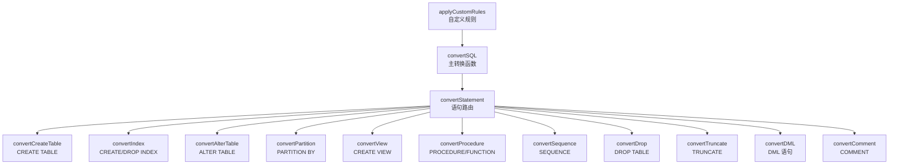
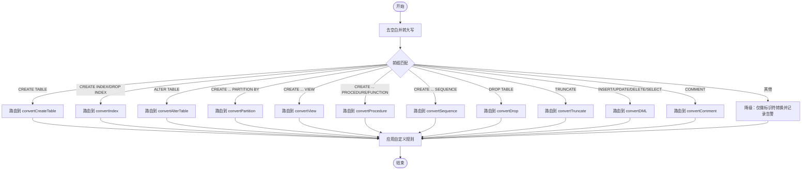
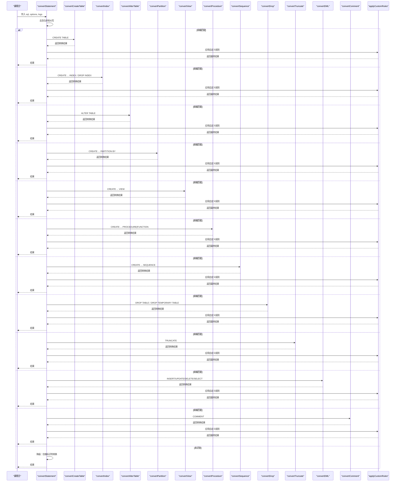
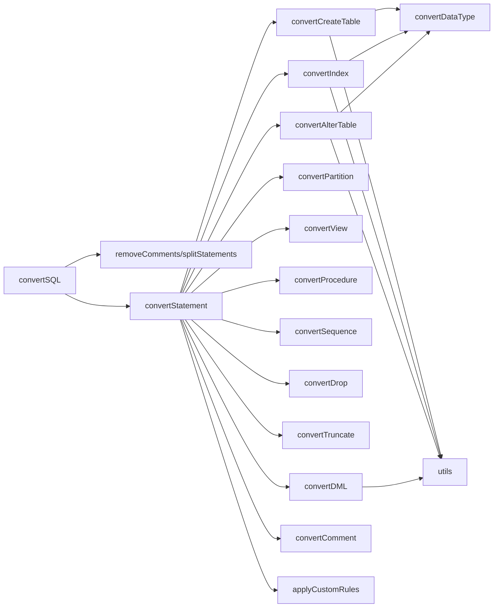

# 语句路由机制

<cite>
**本文档引用的文件**
- [src/converter/index.ts](file://src/converter/index.ts)
- [src/converter/utils.ts](file://src/converter/utils.ts)
- [src/converter/customRules.ts](file://src/converter/customRules.ts)
- [src/converter/rules/createTable.ts](file://src/converter/rules/createTable.ts)
- [src/converter/rules/index.ts](file://src/converter/rules/index.ts)
- [src/converter/rules/dml.ts](file://src/converter/rules/dml.ts)
- [src/converter/rules/dataTypes.ts](file://src/converter/rules/dataTypes.ts)
- [src/converter/rules/partition.ts](file://src/converter/rules/partition.ts)
- [src/converter/rules/others.ts](file://src/converter/rules/others.ts)
- [src/converter/rules/comments.ts](file://src/converter/rules/comments.ts)
- [src/types/index.ts](file://src/types/index.ts)
</cite>

## 目录
1. [简介](#简介)
2. [项目结构](#项目结构)
3. [核心组件](#核心组件)
4. [架构总览](#架构总览)
5. [详细组件分析](#详细组件分析)
6. [依赖关系分析](#依赖关系分析)
7. [性能考量](#性能考量)
8. [故障排查指南](#故障排查指南)
9. [结论](#结论)

## 简介
本文档聚焦于 SQL 转换器的“语句路由机制”，系统性阐述 convertStatement 函数如何对不同类型的 SQL 语句进行识别与路由，包括：
- 语句类型识别算法与正则表达式匹配策略
- 路由决策逻辑与优先级
- 各类 SQL 语句的识别规则（如 CREATE TABLE、ALTER TABLE、DML、索引定义等）
- 语句前缀匹配与关键词检测的实现方式
- 路由失败时的降级处理机制（基本标识符转换）
- 具体的路由流程示例与边界情况处理

## 项目结构
该项目采用“规则驱动 + 工具函数 + 类型定义”的模块化设计：
- 路由入口位于 converter/index.ts，负责将输入 SQL 拆分为语句并按类型路由到对应转换器
- 规则目录 rules 下包含各类语句的专用转换器（如 createTable、index、dml、partition、others、comments）
- utils.ts 提供通用工具函数（如标识符转换、注释清理、字符串保护/还原等）
- types/index.ts 定义转换日志、结果与选项类型
- customRules.ts 提供可扩展的自定义规则应用机制

图表来源
- [src/converter/index.ts:59-125](file://src/converter/index.ts#L59-L125)
- [src/converter/index.ts:15-54](file://src/converter/index.ts#L15-L54)
- [src/converter/customRules.ts:167-185](file://src/converter/customRules.ts#L167-L185)

章节来源
- [src/converter/index.ts:15-54](file://src/converter/index.ts#L15-L54)
- [src/converter/index.ts:59-125](file://src/converter/index.ts#L59-L125)
- [src/converter/customRules.ts:167-185](file://src/converter/customRules.ts#L167-L185)

## 核心组件
- convertStatement：语句路由核心，依据前缀与关键词匹配选择具体转换器
- convertSQL：主入口，负责注释清理、语句拆分、逐条路由与错误收集
- applyCustomRules：在每条语句转换后应用用户自定义规则
- convertIdentifier：统一的标识符转换（反引号→双引号或大写）

章节来源
- [src/converter/index.ts:15-54](file://src/converter/index.ts#L15-L54)
- [src/converter/index.ts:59-125](file://src/converter/index.ts#L59-L125)
- [src/converter/utils.ts:8-21](file://src/converter/utils.ts#L8-L21)
- [src/converter/customRules.ts:167-185](file://src/converter/customRules.ts#L167-L185)

## 架构总览
路由机制遵循“前缀优先 + 关键词兜底”的策略：
- 首先通过语句首部大写后的前缀进行快速判定（如 CREATE TABLE、ALTER TABLE 等）
- 对于 CREATE 语句，进一步结合关键词检测（如 INDEX、VIEW、PROCEDURE、SEQUENCE、PARTITION BY）进行细分
- DML 语句通过首关键字（INSERT/UPDATE/DELETE/SELECT）识别
- 无法识别的语句进入降级分支，执行基本标识符转换并记录告警

图表来源
- [src/converter/index.ts:15-54](file://src/converter/index.ts#L15-L54)
- [src/converter/customRules.ts:167-185](file://src/converter/customRules.ts#L167-L185)

## 详细组件分析

### convertStatement：语句路由核心
- 输入：单条 SQL、转换选项、日志数组
- 处理步骤：
  1) 去除首尾空白并转为大写，便于前缀匹配
  2) 严格前缀匹配优先级：
     - CREATE TABLE
     - CREATE ... INDEX 或 DROP INDEX
     - ALTER TABLE
     - CREATE ... PARTITION BY
     - CREATE ... VIEW
     - CREATE ... PROCEDURE|FUNCTION
     - CREATE ... SEQUENCE
     - DROP TABLE / DROP TEMPORARY TABLE
     - TRUNCATE
     - INSERT/UPDATE/DELETE/SELECT
     - COMMENT
  3) 若以上均不满足，则进入降级分支：
     - 记录 warning 日志
     - 对反引号标识符执行基本转换（去反引号并大写，或保留双引号）
  4) 最终应用自定义规则 applyCustomRules

图表来源
- [src/converter/index.ts:15-54](file://src/converter/index.ts#L15-L54)
- [src/converter/customRules.ts:167-185](file://src/converter/customRules.ts#L167-L185)

章节来源
- [src/converter/index.ts:15-54](file://src/converter/index.ts#L15-L54)

### 语句类型识别规则与匹配策略
- 前缀匹配（严格）：
  - 以“CREATE TABLE”开头：直接路由到建表转换器
  - 以“ALTER TABLE”开头：路由到 ALTER TABLE 转换器
  - 以“DROP TABLE”或“DROP TEMPORARY TABLE”开头：路由到 DROP 转换器
  - 以“TRUNCATE”开头：路由到 TRUNCATE 转换器
  - 以“INSERT/UPDATE/DELETE/SELECT”开头：路由到 DML 转换器
  - 以“COMMENT”开头：路由到 COMMENT 转换器
- 关键词检测（在“CREATE”语句中）：
  - 包含“INDEX”或“DROP INDEX”：路由到索引转换器
  - 包含“PARTITION BY”：路由到分区转换器
  - 包含“VIEW”：路由到视图转换器
  - 包含“PROCEDURE|FUNCTION”：路由到过程/函数转换器
  - 包含“SEQUENCE”：路由到序列转换器

章节来源
- [src/converter/index.ts:19-41](file://src/converter/index.ts#L19-L41)

### 降级处理机制：基本标识符转换
当无法识别语句类型时，convertStatement 会：
- 记录 warning 日志，提示“未识别语句类型，仅进行基本标识符转换”
- 对反引号包裹的标识符执行基本转换：去反引号并转为大写；若 preserveCase 为真且包含小写字母，则用双引号包裹保留大小写

章节来源
- [src/converter/index.ts:41-48](file://src/converter/index.ts#L41-L48)
- [src/converter/utils.ts:8-21](file://src/converter/utils.ts#L8-L21)

### 各类语句的路由与转换要点
- CREATE TABLE
  - 通过头部与括号体解析，拆分列定义与约束
  - 数据类型转换、自增列替代方案（IDENTITY/SEQUENCE+TRIGGER）、默认值与时区函数替换、注释转换等
- ALTER TABLE
  - 支持 ADD/DROP/CHANGE/MODIFY 等动作，自动处理注释、COLLATE/CHARACTER SET、AFTER 等不兼容项
- 索引定义
  - CREATE/DROP INDEX 的解析与唯一性处理，移除 USING BTREE/HASH
- 分区表
  - PARTITION BY RANGE/LIST 的语法适配，TO_DAYS 等函数替换
- 视图/过程/函数/序列
  - 视图与序列：主要进行标识符转换
  - 过程/函数：进行部分语法与类型替换并给出警告
- DROP/TRUNCATE
  - 过滤 IF EXISTS、移除 TEMPORARY、补全 TABLE 关键字
- DML
  - INSERT IGNORE 移除、INSERT SET 转换、LIMIT/OFFSET/FETCH 适配、函数替换、日期字符串转换、标识符转换
- 注释
  - COMMENT 语句保持原样（MySQL 无独立 COMMENT ON 语法）

章节来源
- [src/converter/rules/createTable.ts:116-379](file://src/converter/rules/createTable.ts#L116-L379)
- [src/converter/rules/index.ts:46-134](file://src/converter/rules/index.ts#L46-L134)
- [src/converter/rules/index.ts:8-41](file://src/converter/rules/index.ts#L8-L41)
- [src/converter/rules/partition.ts:7-37](file://src/converter/rules/partition.ts#L7-L37)
- [src/converter/rules/others.ts:7-48](file://src/converter/rules/others.ts#L7-L48)
- [src/converter/rules/comments.ts:16-52](file://src/converter/rules/comments.ts#L16-L52)
- [src/converter/rules/dml.ts:7-162](file://src/converter/rules/dml.ts#L7-162)

### 正则表达式匹配策略
- 前缀匹配使用字符串方法（startsWith），确保精确匹配
- 关键词检测使用正则表达式（如 INDEX、VIEW、PROCEDURE|FUNCTION、PARTITION BY 等），并配合大小写不敏感标志
- DML 中使用多种正则进行函数替换与日期字符串转换，采用“保护-替换-还原”模式避免重复替换
- 自定义规则中使用转义正则（escapeRegExp）确保表名/列名安全匹配

章节来源
- [src/converter/index.ts:19-41](file://src/converter/index.ts#L19-L41)
- [src/converter/rules/dml.ts:115-152](file://src/converter/rules/dml.ts#L115-L152)
- [src/converter/customRules.ts:17-19](file://src/converter/customRules.ts#L17-L19)
- [src/converter/customRules.ts:31-57](file://src/converter/customRules.ts#L31-L57)

### 数据类型映射与转换
- convertDataType 通过类型映射表进行数据类型替换，优先匹配带参数的类型（如 DECIMAL/MEDIUMTEXT 等）
- ENUM 类型通过提取检查约束的方式生成兼容 Oracle 的约束表达式

章节来源
- [src/converter/rules/dataTypes.ts:61-86](file://src/converter/rules/dataTypes.ts#L61-L86)
- [src/converter/rules/dataTypes.ts:91-105](file://src/converter/rules/dataTypes.ts#L91-L105)

### 自定义规则机制
- applyCustomRules 在每条语句转换后依次尝试匹配并应用规则
- 自定义规则接口包含 name/description/match/transform 四要素
- 提供示例规则：空字符串替换、NULL 值替换等

章节来源
- [src/converter/customRules.ts:7-14](file://src/converter/customRules.ts#L7-L14)
- [src/converter/customRules.ts:167-185](file://src/converter/customRules.ts#L167-L185)
- [src/converter/customRules.ts:137-165](file://src/converter/customRules.ts#L137-L165)

## 依赖关系分析
- convertSQL 依赖：
  - removeComments/splitStatements：预处理与语句拆分
  - convertStatement：逐条路由
  - applyCustomRules：后处理
- convertStatement 依赖：
  - 各规则转换器（createTable、index、alterTable、partition、dml、others、comments）
  - convertIdentifier：统一标识符转换
- 规则转换器之间：
  - createTable 内部依赖 dataTypes 与 utils（generateSequenceName、makeUniqueIndexName 等）
  - index/alterTable 依赖 dataTypes 与 utils
  - dml 依赖 utils（convertIdentifier）

图表来源
- [src/converter/index.ts:59-125](file://src/converter/index.ts#L59-L125)
- [src/converter/index.ts:15-54](file://src/converter/index.ts#L15-L54)
- [src/converter/rules/createTable.ts:116-379](file://src/converter/rules/createTable.ts#L116-L379)
- [src/converter/rules/index.ts:46-134](file://src/converter/rules/index.ts#L46-L134)
- [src/converter/rules/dml.ts:7-162](file://src/converter/rules/dml.ts#L7-162)
- [src/converter/customRules.ts:167-185](file://src/converter/customRules.ts#L167-L185)

章节来源
- [src/converter/index.ts:59-125](file://src/converter/index.ts#L59-L125)
- [src/converter/index.ts:15-54](file://src/converter/index.ts#L15-L54)

## 性能考量
- 前缀匹配为 O(1) 判定，整体路由开销极低
- 正则匹配集中在 convertStatement 与 DML 转换器中，建议：
  - 控制正则复杂度，避免回溯
  - 对高频语句（如 DML）尽量减少不必要的全局替换
- applyCustomRules 顺序遍历规则列表，规则数量应合理控制
- splitStatements 与 removeComments 会对输入进行两轮扫描，建议在 UI 层限制单次输入长度

[本节为通用性能建议，无需特定文件来源]

## 故障排查指南
- 语句未被识别
  - 检查首部空白与大小写是否影响前缀匹配
  - 确认是否属于“CREATE ... PARTITION BY/VIEW/PROCEDURE/SEQUENCE”等分支
  - 查看日志中“未识别语句类型”的 warning
- 路由成功但转换异常
  - 查看错误日志，定位 convertStatement 循环中的异常捕获
  - 检查 applyCustomRules 是否触发了意外替换
- 标识符大小写问题
  - 检查 options.preserveCase 设置
  - 确认 convertIdentifier 的行为是否符合预期
- 自定义规则冲突
  - 逐条禁用规则定位冲突项
  - 确保 escapeRegExp 正确转义特殊字符

章节来源
- [src/converter/index.ts:86-107](file://src/converter/index.ts#L86-L107)
- [src/converter/utils.ts:8-21](file://src/converter/utils.ts#L8-L21)
- [src/converter/customRules.ts:167-185](file://src/converter/customRules.ts#L167-L185)

## 结论
本路由机制以“前缀优先 + 关键词兜底”的策略实现了高可靠、可扩展的语句分类与转换。通过规则化的转换器与统一的标识符处理，既能覆盖主流 DDL/DML 场景，又能在未知语句时提供安全的降级处理。配合自定义规则机制，可进一步满足特定业务需求。