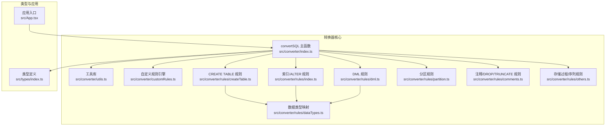
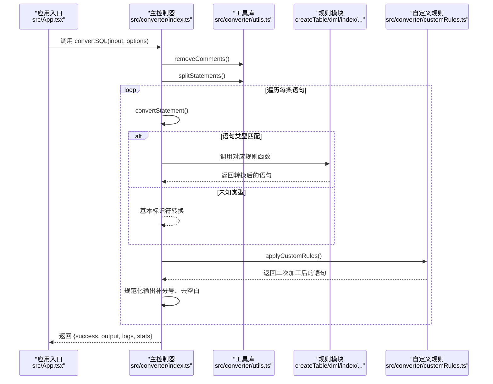
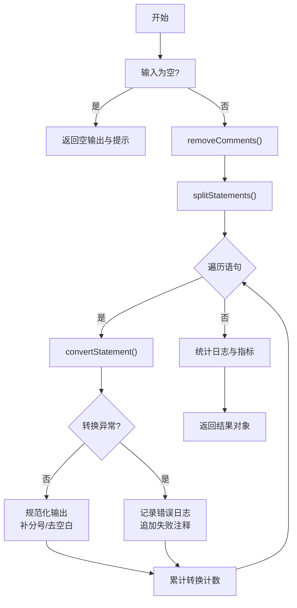
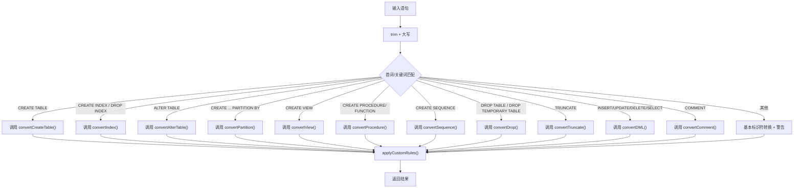
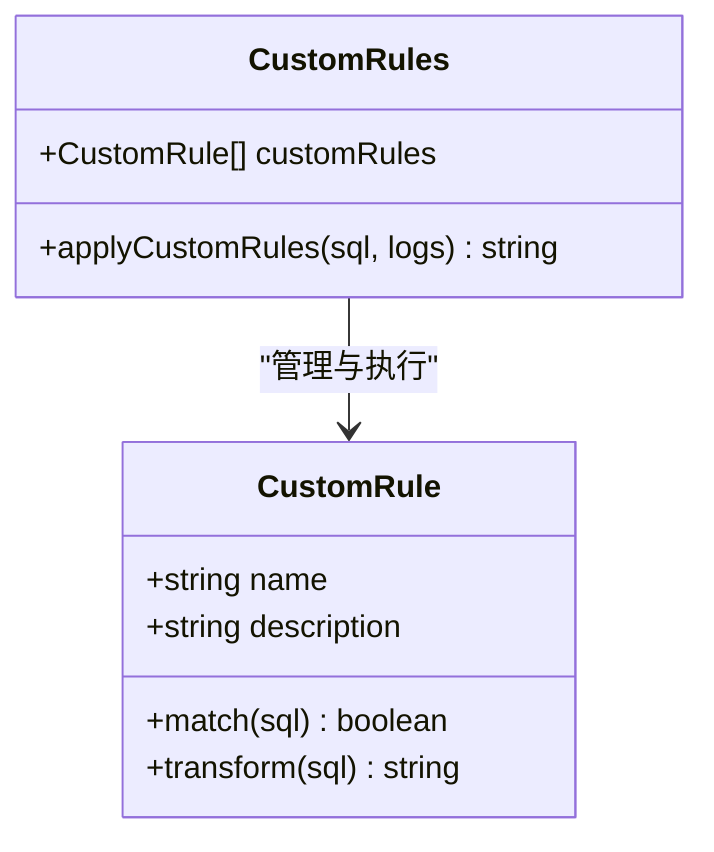
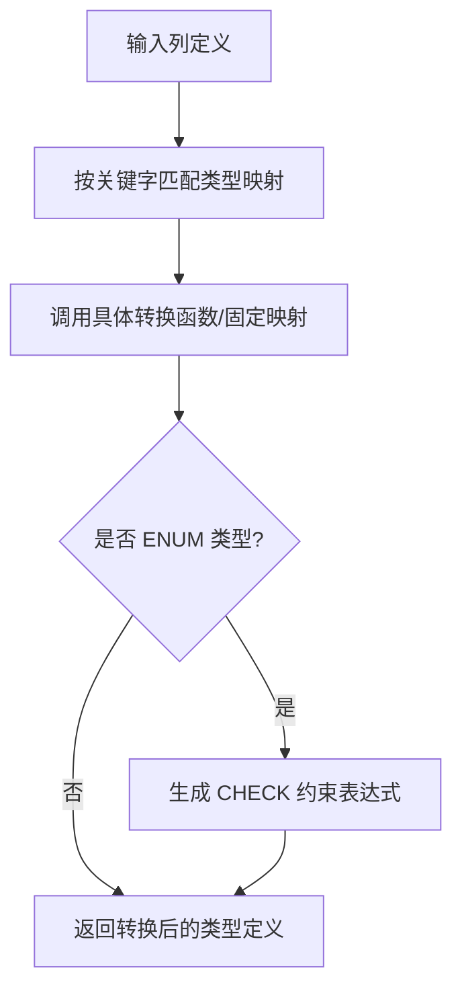
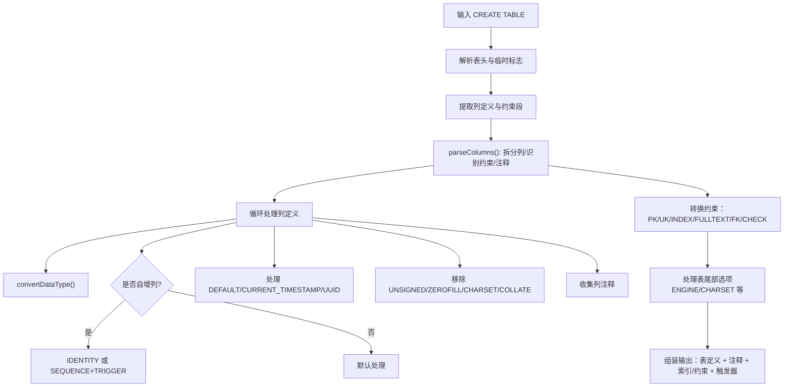
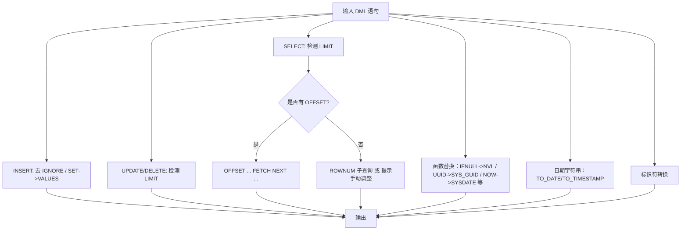
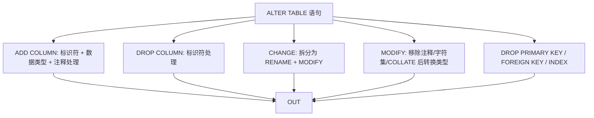
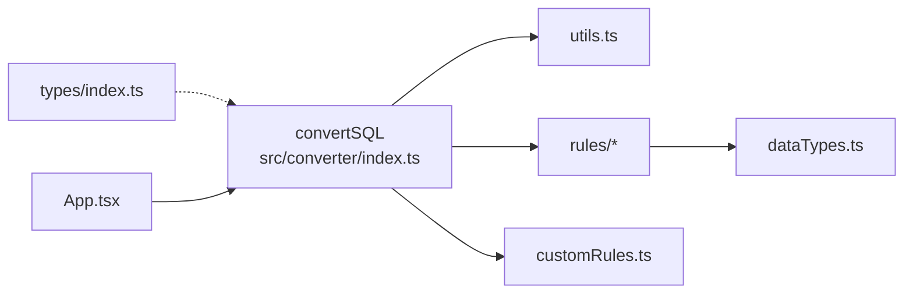

# 转换器架构设计

<cite>
**本文引用的文件**
- [src/converter/index.ts](file://src/converter/index.ts)
- [src/converter/utils.ts](file://src/converter/utils.ts)
- [src/converter/customRules.ts](file://src/converter/customRules.ts)
- [src/converter/rules/createTable.ts](file://src/converter/rules/createTable.ts)
- [src/converter/rules/dml.ts](file://src/converter/rules/dml.ts)
- [src/converter/rules/index.ts](file://src/converter/rules/index.ts)
- [src/converter/rules/dataTypes.ts](file://src/converter/rules/dataTypes.ts)
- [src/converter/rules/partition.ts](file://src/converter/rules/partition.ts)
- [src/converter/rules/comments.ts](file://src/converter/rules/comments.ts)
- [src/converter/rules/others.ts](file://src/converter/rules/others.ts)
- [src/types/index.ts](file://src/types/index.ts)
- [src/App.tsx](file://src/App.tsx)
</cite>

## 目录
1. [简介](#简介)
2. [项目结构](#项目结构)
3. [核心组件](#核心组件)
4. [架构总览](#架构总览)
5. [详细组件分析](#详细组件分析)
6. [依赖关系分析](#依赖关系分析)
7. [性能考量](#性能考量)
8. [故障排查指南](#故障排查指南)
9. [结论](#结论)
10. [附录](#附录)

## 简介
本文件面向SQL转换器的核心架构，系统性阐述模块化设计、语句路由机制与规则引擎组织方式；详解convertSQL主函数从输入解析到输出生成的完整处理链路；说明语句类型识别策略（CREATE TABLE、DML、索引定义等）；解释规则引擎的加载、匹配与执行流程；总结错误处理与异常恢复策略；并提供性能优化建议与可扩展性设计思路。文末附带使用示例与配置项说明，帮助开发者快速上手与定制。

## 项目结构
转换器采用“主控制器 + 规则子模块 + 工具库”的分层组织方式：
- 主控制器：负责输入预处理、语句拆分、逐条路由与聚合输出
- 规则子模块：按语句类型划分（CREATE TABLE、DML、索引、分区、注释、存储过程/序列等）
- 工具库：通用标识符转换、字符串保护/还原、注释清理、语句拆分、命名规范等
- 类型定义：统一的日志、统计、选项与结果结构
- 应用入口：React前端集成转换器，提供交互界面与示例

**图表来源**
- [src/converter/index.ts:59-125](file://src/converter/index.ts#L59-L125)
- [src/converter/utils.ts:1-115](file://src/converter/utils.ts#L1-L115)
- [src/converter/customRules.ts:170-185](file://src/converter/customRules.ts#L170-L185)
- [src/converter/rules/createTable.ts:116-379](file://src/converter/rules/createTable.ts#L116-L379)
- [src/converter/rules/dml.ts:7-162](file://src/converter/rules/dml.ts#L7-L162)
- [src/converter/rules/index.ts:8-134](file://src/converter/rules/index.ts#L8-L134)
- [src/converter/rules/partition.ts:7-37](file://src/converter/rules/partition.ts#L7-L37)
- [src/converter/rules/comments.ts:7-52](file://src/converter/rules/comments.ts#L7-L52)
- [src/converter/rules/others.ts:7-48](file://src/converter/rules/others.ts#L7-L48)
- [src/converter/rules/dataTypes.ts:61-86](file://src/converter/rules/dataTypes.ts#L61-L86)
- [src/types/index.ts:1-44](file://src/types/index.ts#L1-L44)
- [src/App.tsx:67-72](file://src/App.tsx#L67-L72)

**章节来源**
- [src/converter/index.ts:1-129](file://src/converter/index.ts#L1-L129)
- [src/converter/utils.ts:1-115](file://src/converter/utils.ts#L1-L115)
- [src/converter/customRules.ts:1-186](file://src/converter/customRules.ts#L1-L186)
- [src/converter/rules/createTable.ts:1-380](file://src/converter/rules/createTable.ts#L1-L380)
- [src/converter/rules/dml.ts:1-163](file://src/converter/rules/dml.ts#L1-L163)
- [src/converter/rules/index.ts:1-135](file://src/converter/rules/index.ts#L1-L135)
- [src/converter/rules/dataTypes.ts:1-106](file://src/converter/rules/dataTypes.ts#L1-L106)
- [src/converter/rules/partition.ts:1-38](file://src/converter/rules/partition.ts#L1-L38)
- [src/converter/rules/comments.ts:1-53](file://src/converter/rules/comments.ts#L1-L53)
- [src/converter/rules/others.ts:1-49](file://src/converter/rules/others.ts#L1-L49)
- [src/types/index.ts:1-44](file://src/types/index.ts#L1-L44)
- [src/App.tsx:1-282](file://src/App.tsx#L1-L282)

## 核心组件
- 主控制器 convertSQL：负责输入校验、注释清理、语句拆分、逐条路由、异常捕获与统计汇总
- 语句路由 convertStatement：基于首词/正则模式识别语句类型，分派至对应规则模块
- 规则模块：按功能域拆分，职责单一、边界清晰
- 工具库：提供标识符转换、字符串保护/还原、注释清理、语句拆分、命名规范等通用能力
- 自定义规则引擎：通过规则接口与匹配函数实现可插拔的二次加工
- 类型系统：统一定义日志、统计、选项与结果结构，便于扩展与跨模块协作

**章节来源**
- [src/converter/index.ts:15-54](file://src/converter/index.ts#L15-L54)
- [src/converter/index.ts:59-125](file://src/converter/index.ts#L59-L125)
- [src/converter/utils.ts:8-21](file://src/converter/utils.ts#L8-L21)
- [src/converter/customRules.ts:7-14](file://src/converter/customRules.ts#L7-L14)

## 架构总览
转换器采用“主函数驱动 + 规则路由 + 可插拔规则”的架构模式：
- 输入预处理：移除注释、按分号拆分语句，保护字符串常量避免误拆
- 逐条路由：根据语句前缀与关键词识别类型，调用对应规则模块
- 规则执行：各模块完成类型转换、语法适配、注释与约束处理
- 自定义规则：在每条语句转换后统一应用用户自定义规则
- 结果聚合：规范化输出（补充分号、去空白）、统计日志与指标

**图表来源**
- [src/App.tsx:67-72](file://src/App.tsx#L67-L72)
- [src/converter/index.ts:59-125](file://src/converter/index.ts#L59-L125)
- [src/converter/utils.ts:52-72](file://src/converter/utils.ts#L52-L72)
- [src/converter/customRules.ts:170-185](file://src/converter/customRules.ts#L170-L185)

## 详细组件分析

### 主控制器：convertSQL 工作流
- 输入校验与空值处理：若输入为空，直接返回提示信息
- 注释清理与语句拆分：先保护字符串常量，再移除行注释与块注释，最后按分号拆分
- 逐条转换：调用 convertStatement 进行类型识别与路由，捕获异常并记录日志
- 输出规范化：对非空语句补充分号，拼接成最终输出
- 统计与日志：统计警告/错误数量、类型转换次数、注释转换次数等

**图表来源**
- [src/converter/index.ts:59-125](file://src/converter/index.ts#L59-L125)

**章节来源**
- [src/converter/index.ts:59-125](file://src/converter/index.ts#L59-L125)

### 语句路由机制：convertStatement
- 识别策略：基于语句首词与关键词（如 CREATE TABLE、CREATE INDEX、ALTER TABLE、INSERT/UPDATE/DELETE/SELECT、COMMENT 等）进行分支判断
- 路由目标：将语句分派给对应规则模块（如 createTable、dml、index、partition、comments、others）
- 未知类型：仅进行基本标识符转换并记录警告
- 自定义规则：在每条语句转换后统一应用用户自定义规则

**图表来源**
- [src/converter/index.ts:15-54](file://src/converter/index.ts#L15-L54)
- [src/converter/customRules.ts:170-185](file://src/converter/customRules.ts#L170-L185)

**章节来源**
- [src/converter/index.ts:15-54](file://src/converter/index.ts#L15-L54)

### 规则引擎：组织结构与执行
- 规则接口：定义 name、description、match、transform 四要素，支持按语句内容动态匹配与转换
- 内置规则：内置若干常用规则（如空值替换），可通过工厂函数便捷生成
- 执行流程：遍历规则列表，对每条规则调用 match 判断是否适用，若适用则执行 transform 并记录日志
- 可扩展性：用户可在规则列表中添加新规则，无需修改核心逻辑

**图表来源**
- [src/converter/customRules.ts:7-14](file://src/converter/customRules.ts#L7-L14)
- [src/converter/customRules.ts:170-185](file://src/converter/customRules.ts#L170-L185)

**章节来源**
- [src/converter/customRules.ts:1-186](file://src/converter/customRules.ts#L1-L186)

### 数据类型转换：映射与约束处理
- 映射表：提供 MySQL 到 Oracle 的数据类型映射，支持带参与无参形式
- 转换策略：按长度降序匹配类型关键字，优先匹配带参数的类型，避免误匹配
- 约束处理：针对 ENUM 等类型生成 CHECK 约束，确保数据完整性
- 统计与日志：记录类型转换次数，便于统计分析

**图表来源**
- [src/converter/rules/dataTypes.ts:61-86](file://src/converter/rules/dataTypes.ts#L61-L86)
- [src/converter/rules/dataTypes.ts:91-105](file://src/converter/rules/dataTypes.ts#L91-L105)

**章节来源**
- [src/converter/rules/dataTypes.ts:1-106](file://src/converter/rules/dataTypes.ts#L1-L106)

### CREATE TABLE 规则：列定义、约束与注释
- 列解析：按逗号拆分列定义，忽略括号与字符串内的分隔符，识别约束与注释
- 约束转换：主键、唯一键、普通索引、全文索引、外键、检查约束分别处理
- 自增列处理：支持 IDENTITY 或 SEQUENCE+TRIGGER 两种方案
- 临时表：转换为 Oracle GLOBAL TEMPORARY TABLE
- 注释：表级与列级注释转换为 Oracle COMMENT ON 语法
- 触发器：为 ON UPDATE CURRENT_TIMESTAMP 自动生成触发器

**图表来源**
- [src/converter/rules/createTable.ts:116-379](file://src/converter/rules/createTable.ts#L116-L379)

**章节来源**
- [src/converter/rules/createTable.ts:1-380](file://src/converter/rules/createTable.ts#L1-L380)

### DML 规则：INSERT/UPDATE/DELETE/SELECT 适配
- INSERT：移除 IGNORE、SET 语法转换为 VALUES、多行 VALUES 兼容性提示
- UPDATE/DELETE：LIMIT 限制转换为 ROWNUM 或 OFFSET/FETCH（视情况而定）
- SELECT：LIMIT 转换为 OFFSET/FETCH 或 ROWNUM 子查询；无 FROM 的 SELECT 补充 FROM DUAL
- 函数替换：IFNULL/NOW/SUBSTRING/TRUNCATE/DATE_FORMAT/STR_TO_DATE 等函数映射
- 日期字符串：自动识别并转换为 TO_DATE/TO_TIMESTAMP，保护已有的函数调用避免重复替换
- 标识符：统一转换为 Oracle 格式

**图表来源**
- [src/converter/rules/dml.ts:7-162](file://src/converter/rules/dml.ts#L7-L162)

**章节来源**
- [src/converter/rules/dml.ts:1-163](file://src/converter/rules/dml.ts#L1-L163)

### 索引与 ALTER TABLE 规则
- 索引：CREATE/DROP INDEX 语法适配，移除 USING 子句，统一索引名唯一性
- ALTER TABLE：ADD/DROP/CHANGE/MODIFY 等子句转换，注释与字符集/COLLATE 处理，约束删除适配

**图表来源**
- [src/converter/rules/index.ts:46-134](file://src/converter/rules/index.ts#L46-L134)

**章节来源**
- [src/converter/rules/index.ts:1-135](file://src/converter/rules/index.ts#L1-L135)

### 分区表规则
- LIST 分区：VALUES IN -> VALUES
- RANGE 分区：TO_DAYS 适配、MAXVALUE 加括号、函数表达式兼容
- 标识符：统一转换为 Oracle 格式

**章节来源**
- [src/converter/rules/partition.ts:1-38](file://src/converter/rules/partition.ts#L1-L38)

### 注释、DROP/TRUNCATE、视图与存储过程/序列
- 注释：保持原样（MySQL 无独立 COMMENT ON 语法）
- DROP：过滤 IF EXISTS、移除 TEMPORARY
- TRUNCATE：补全 TABLE 关键字
- 视图：标识符转换
- 存储过程/函数：添加 OR REPLACE、RETURNS->RETURN，其余复杂语法提示手动处理
- 序列：标识符转换

**章节来源**
- [src/converter/rules/comments.ts:1-53](file://src/converter/rules/comments.ts#L1-L53)
- [src/converter/rules/others.ts:1-49](file://src/converter/rules/others.ts#L1-L49)

### 工具库：通用能力
- 标识符转换：移除反引号、大小写处理、保留大小写用双引号
- 字符串保护：提取/还原字符串常量，避免误操作
- 注释清理：行注释与块注释移除
- 语句拆分：保护字符串后按分号拆分
- 命名规范：序列/触发器/索引名生成与唯一性处理

**章节来源**
- [src/converter/utils.ts:1-115](file://src/converter/utils.ts#L1-L115)

## 依赖关系分析
- 主控制器依赖工具库与各规则模块；规则模块之间低耦合，仅共享工具库
- 自定义规则引擎与主控制器松耦合，通过统一接口接入
- 类型系统贯穿全局，确保日志、统计、选项与结果的一致性

**图表来源**
- [src/converter/index.ts:1-129](file://src/converter/index.ts#L1-L129)
- [src/converter/utils.ts:1-115](file://src/converter/utils.ts#L1-L115)
- [src/converter/customRules.ts:1-186](file://src/converter/customRules.ts#L1-L186)
- [src/converter/rules/dataTypes.ts:1-106](file://src/converter/rules/dataTypes.ts#L1-L106)
- [src/types/index.ts:1-44](file://src/types/index.ts#L1-L44)
- [src/App.tsx:67-72](file://src/App.tsx#L67-L72)

**章节来源**
- [src/converter/index.ts:1-129](file://src/converter/index.ts#L1-L129)
- [src/converter/utils.ts:1-115](file://src/converter/utils.ts#L1-L115)
- [src/converter/customRules.ts:1-186](file://src/converter/customRules.ts#L1-L186)
- [src/converter/rules/dataTypes.ts:1-106](file://src/converter/rules/dataTypes.ts#L1-L106)
- [src/types/index.ts:1-44](file://src/types/index.ts#L1-L44)
- [src/App.tsx:1-282](file://src/App.tsx#L1-L282)

## 性能考量
- 正则匹配与字符串替换：在大量语句场景下，建议减少不必要的全局替换，优先局部匹配
- 字符串保护/还原：在拆分与转换前保护字符串，避免重复扫描
- 规则匹配顺序：按长度降序匹配类型关键字，减少误匹配与回溯
- 统计与日志：仅在必要时记录详细日志，避免高频 I/O 影响性能
- 可扩展性：通过规则接口与工厂函数降低新增规则的成本，避免修改核心路径

[本节为通用指导，无需列出章节来源]

## 故障排查指南
- 输入为空：convertSQL 会直接返回提示信息，确认输入是否正确
- 语句拆分异常：检查是否存在未闭合的字符串或注释，工具库已提供保护机制
- 未知语句类型：convertStatement 会记录警告并进行基本标识符转换，确认是否属于已支持类型
- 转换异常：convertSQL 捕获异常并记录错误日志，同时在输出中追加失败注释，便于定位问题
- 统计与日志：通过 logs 与 stats 字段查看转换详情，定位问题类型（如数据类型转换、自增列转换、注释转换）

**章节来源**
- [src/converter/index.ts:71-107](file://src/converter/index.ts#L71-L107)
- [src/converter/index.ts:113-117](file://src/converter/index.ts#L113-L117)

## 结论
该转换器以模块化与规则引擎为核心，实现了从输入解析到输出生成的完整链路。通过语句路由与规则拆分，既保证了可维护性，又提供了良好的可扩展性。工具库统一了标识符与字符串处理，自定义规则引擎允许用户灵活扩展。结合完善的错误处理与统计体系，能够满足生产环境下的迁移与转换需求。

[本节为总结性内容，无需列出章节来源]

## 附录

### 使用示例与配置选项
- 基本使用：在应用中调用 convertSQL(input, options)，获取输出与日志
- 配置选项：useIdentity、useSequenceTrigger、preserveCase、addComments、convertEngineCharset、generateSequence、generateTrigger
- 默认选项：DEFAULT_OPTIONS 提供推荐的迁移配置

**章节来源**
- [src/App.tsx:67-72](file://src/App.tsx#L67-L72)
- [src/types/index.ts:25-43](file://src/types/index.ts#L25-L43)
- [src/types/index.ts:35-43](file://src/types/index.ts#L35-L43)