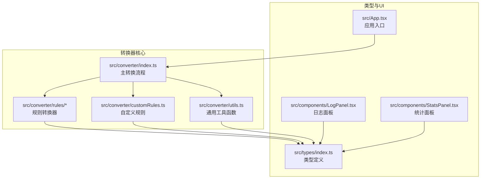
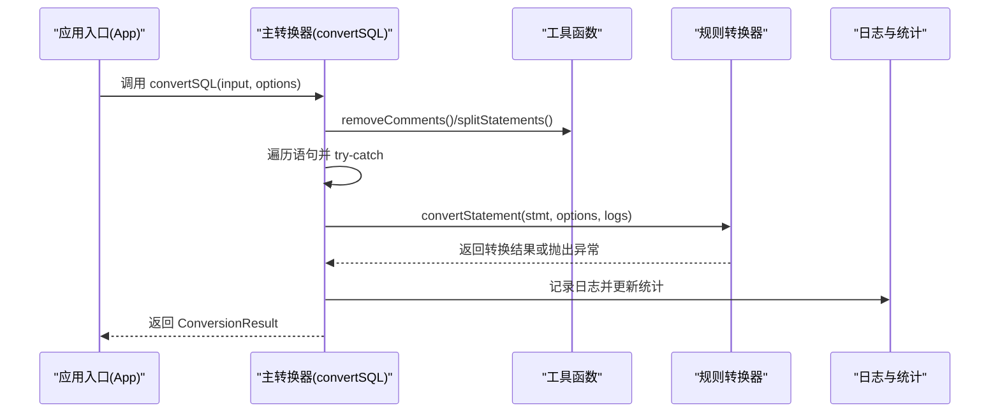
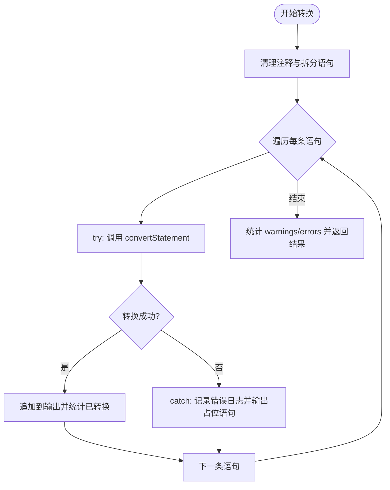
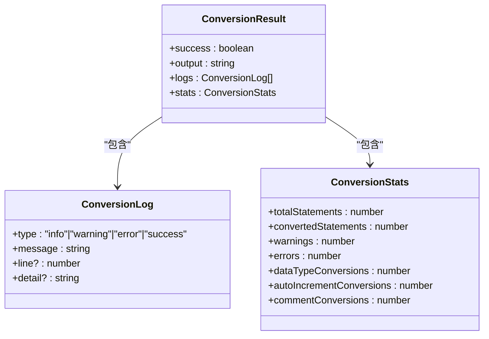
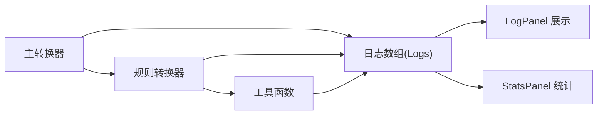
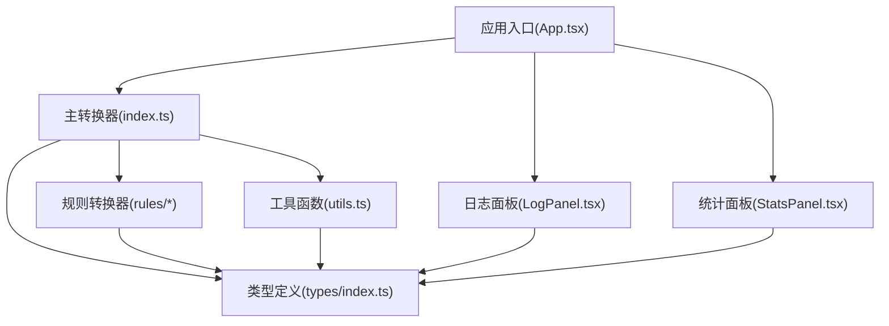

# 错误处理机制

<cite>
**本文档引用的文件**
- [src/converter/index.ts](file://src/converter/index.ts)
- [src/types/index.ts](file://src/types/index.ts)
- [src/converter/utils.ts](file://src/converter/utils.ts)
- [src/converter/rules/createTable.ts](file://src/converter/rules/createTable.ts)
- [src/converter/rules/dataTypes.ts](file://src/converter/rules/dataTypes.ts)
- [src/converter/rules/dml.ts](file://src/converter/rules/dml.ts)
- [src/converter/rules/others.ts](file://src/converter/rules/others.ts)
- [src/converter/customRules.ts](file://src/converter/customRules.ts)
- [src/components/LogPanel.tsx](file://src/components/LogPanel.tsx)
- [src/components/StatsPanel.tsx](file://src/components/StatsPanel.tsx)
- [src/App.tsx](file://src/App.tsx)
</cite>

## 目录
1. [简介](#简介)
2. [项目结构](#项目结构)
3. [核心组件](#核心组件)
4. [架构概览](#架构概览)
5. [详细组件分析](#详细组件分析)
6. [依赖关系分析](#依赖关系分析)
7. [性能考量](#性能考量)
8. [故障排除指南](#故障排除指南)
9. [结论](#结论)

## 简介
本文件聚焦于SQL转换器的错误处理机制，系统性阐述转换过程中的异常捕获、错误分类与恢复策略，以及日志记录与统计信息收集的设计。通过对主转换流程、规则转换器、工具函数与UI组件的综合分析，帮助开发者与使用者理解如何在复杂SQL迁移场景中实现稳健的错误处理与可观测性。

## 项目结构
项目采用前后端分离的前端架构，核心转换逻辑位于src/converter目录，类型定义位于src/types，UI组件位于src/components，入口应用位于src/App.tsx。

图表来源
- [src/converter/index.ts:1-129](file://src/converter/index.ts#L1-L129)
- [src/converter/utils.ts:1-115](file://src/converter/utils.ts#L1-L115)
- [src/converter/rules/createTable.ts:1-380](file://src/converter/rules/createTable.ts#L1-L380)
- [src/converter/customRules.ts:1-186](file://src/converter/customRules.ts#L1-L186)
- [src/types/index.ts:1-44](file://src/types/index.ts#L1-L44)
- [src/components/LogPanel.tsx:1-82](file://src/components/LogPanel.tsx#L1-L82)
- [src/components/StatsPanel.tsx:1-42](file://src/components/StatsPanel.tsx#L1-L42)
- [src/App.tsx:1-282](file://src/App.tsx#L1-L282)

章节来源
- [src/converter/index.ts:1-129](file://src/converter/index.ts#L1-L129)
- [src/types/index.ts:1-44](file://src/types/index.ts#L1-L44)
- [src/App.tsx:1-282](file://src/App.tsx#L1-L282)

## 核心组件
- 主转换器：负责语句拆分、路由到具体规则转换器、异常捕获与统计汇总。
- 规则转换器：针对不同SQL类型的专用转换逻辑，包含大量边界条件与兼容性处理。
- 工具函数：提供标识符转换、字符串保护/还原、注释清理、语句拆分等基础能力。
- 日志与统计：统一的日志接口与统计面板，支持错误分类与指标聚合。
- 自定义规则：允许用户扩展转换逻辑，同时通过日志记录应用情况。

章节来源
- [src/converter/index.ts:59-125](file://src/converter/index.ts#L59-L125)
- [src/converter/rules/createTable.ts:116-379](file://src/converter/rules/createTable.ts#L116-L379)
- [src/converter/rules/dataTypes.ts:61-86](file://src/converter/rules/dataTypes.ts#L61-L86)
- [src/converter/rules/dml.ts:7-162](file://src/converter/rules/dml.ts#L7-L162)
- [src/converter/customRules.ts:170-185](file://src/converter/customRules.ts#L170-L185)
- [src/types/index.ts:1-44](file://src/types/index.ts#L1-L44)

## 架构概览
转换流程采用“主转换器 + 规则转换器 + 工具函数”的分层设计。主转换器负责整体控制流与异常捕获；规则转换器专注特定语法域；工具函数提供通用能力；UI层负责展示日志与统计。

图表来源
- [src/converter/index.ts:59-125](file://src/converter/index.ts#L59-L125)
- [src/converter/utils.ts:52-72](file://src/converter/utils.ts#L52-L72)
- [src/converter/rules/createTable.ts:116-379](file://src/converter/rules/createTable.ts#L116-L379)
- [src/App.tsx:67-72](file://src/App.tsx#L67-L72)

## 详细组件分析

### 主转换器与异常捕获
主转换器在转换循环中对每个语句执行try-catch，确保单条语句的异常不会中断整体流程。捕获到的错误会被封装为日志并计入统计，同时输出一条带注释的失败占位语句，保证输出的完整性与可读性。

- 异常捕获位置：转换循环内部，覆盖convertStatement调用。
- 错误日志字段：type为error，message包含失败原因，detail包含原始语句片段。
- 统计更新：errors计数器递增，warnings计数器由最终过滤统计得出。
- 输出策略：即使失败也输出占位注释，便于后续人工修正。

图表来源
- [src/converter/index.ts:86-125](file://src/converter/index.ts#L86-L125)

章节来源
- [src/converter/index.ts:86-125](file://src/converter/index.ts#L86-L125)

### 规则转换器的错误分类与处理
规则转换器在各自领域内进行错误分类与处理，主要体现在以下方面：
- 语法解析失败：当无法解析语句头或括号不匹配时，记录warning并回退到原始语句。
- 功能不支持：对于Oracle不支持的语法（如ON UPDATE CURRENT_TIMESTAMP），记录warning并移除或生成替代方案。
- 数据类型转换：记录转换次数与类型映射结果，便于统计。
- 标识符转换：统一转换为Oracle风格，必要时保留大小写。

图表来源
- [src/types/index.ts:1-44](file://src/types/index.ts#L1-L44)

章节来源
- [src/converter/rules/createTable.ts:116-379](file://src/converter/rules/createTable.ts#L116-L379)
- [src/converter/rules/dataTypes.ts:61-86](file://src/converter/rules/dataTypes.ts#L61-L86)
- [src/converter/rules/dml.ts:7-162](file://src/converter/rules/dml.ts#L7-L162)
- [src/converter/rules/others.ts:7-48](file://src/converter/rules/others.ts#L7-L48)
- [src/types/index.ts:1-44](file://src/types/index.ts#L1-L44)

### 日志记录系统设计
日志接口定义了四种级别：info、warning、error、success。UI层根据级别选择图标与颜色，支持显示详细信息与行号。日志字段包括：
- type：日志级别
- message：简要描述
- detail：上下文详情（如原始语句片段）
- line：行号（可选）

图表来源
- [src/types/index.ts:1-6](file://src/types/index.ts#L1-L6)
- [src/components/LogPanel.tsx:22-81](file://src/components/LogPanel.tsx#L22-L81)
- [src/components/StatsPanel.tsx:7-41](file://src/components/StatsPanel.tsx#L7-L41)

章节来源
- [src/types/index.ts:1-6](file://src/types/index.ts#L1-L6)
- [src/components/LogPanel.tsx:1-82](file://src/components/LogPanel.tsx#L1-L82)
- [src/components/StatsPanel.tsx:1-42](file://src/components/StatsPanel.tsx#L1-L42)

### 错误恢复与回退策略
- 单条语句失败：通过try-catch隔离，记录错误并输出占位注释，保证整体流程继续。
- 未知语句类型：记录warning并进行基本标识符转换，避免完全跳过。
- 不支持功能：记录warning并移除或生成替代方案（如触发器），尽量保留业务意图。
- 数据类型不匹配：通过数据类型映射表进行转换，并记录转换次数。

章节来源
- [src/converter/index.ts:41-53](file://src/converter/index.ts#L41-L53)
- [src/converter/rules/createTable.ts:190-196](file://src/converter/rules/createTable.ts#L190-L196)
- [src/converter/rules/dataTypes.ts:78-83](file://src/converter/rules/dataTypes.ts#L78-L83)

### 统计信息收集机制
统计对象包含以下字段：
- totalStatements：总语句数（来自拆分后的数组长度）
- convertedStatements：成功转换的语句数
- warnings：warning级别的日志数量
- errors：error级别的日志数量
- dataTypeConversions：数据类型转换次数（通过日志消息关键词统计）
- autoIncrementConversions：自增/序列转换次数
- commentConversions：注释转换次数

统计更新逻辑：
- errors/warnings：通过最终过滤日志数组得到
- dataTypeConversions/autoIncrementConversions/commentConversions：通过遍历日志消息中的关键词累加

章节来源
- [src/types/index.ts:15-23](file://src/types/index.ts#L15-L23)
- [src/converter/index.ts:109-117](file://src/converter/index.ts#L109-L117)

### 自定义规则的错误处理
自定义规则通过applyCustomRules逐一匹配并应用，若规则匹配且发生变更，则记录info级别日志。该机制不影响主转换流程的异常捕获，但会扩展转换范围。

章节来源
- [src/converter/customRules.ts:170-185](file://src/converter/customRules.ts#L170-L185)

## 依赖关系分析
主转换器依赖规则转换器与工具函数，规则转换器依赖工具函数与类型定义，UI层依赖类型定义与组件。

图表来源
- [src/converter/index.ts:1-10](file://src/converter/index.ts#L1-L10)
- [src/converter/utils.ts:1-115](file://src/converter/utils.ts#L1-L115)
- [src/converter/rules/createTable.ts:1-4](file://src/converter/rules/createTable.ts#L1-L4)
- [src/types/index.ts:1-44](file://src/types/index.ts#L1-L44)
- [src/components/LogPanel.tsx:1-2](file://src/components/LogPanel.tsx#L1-L2)
- [src/components/StatsPanel.tsx:1-2](file://src/components/StatsPanel.tsx#L1-L2)
- [src/App.tsx:1-10](file://src/App.tsx#L1-L10)

章节来源
- [src/converter/index.ts:1-10](file://src/converter/index.ts#L1-L10)
- [src/converter/utils.ts:1-115](file://src/converter/utils.ts#L1-L115)
- [src/converter/rules/createTable.ts:1-4](file://src/converter/rules/createTable.ts#L1-L4)
- [src/types/index.ts:1-44](file://src/types/index.ts#L1-L44)
- [src/components/LogPanel.tsx:1-2](file://src/components/LogPanel.tsx#L1-L2)
- [src/components/StatsPanel.tsx:1-2](file://src/components/StatsPanel.tsx#L1-L2)
- [src/App.tsx:1-10](file://src/App.tsx#L1-L10)

## 性能考量
- 语句拆分与注释清理：使用字符串保护/还原技术避免误改，提高准确性。
- 数据类型转换：按类型名长度降序匹配，减少重复替换。
- 日志与统计：在主转换器中一次性遍历统计，避免多次扫描。
- UI渲染：日志与统计面板按需渲染，减少不必要的重绘。

[本节为一般性指导，无需列出具体文件来源]

## 故障排除指南

### 常见错误类型与处理建议
- 语法错误
  - 现象：转换失败并输出占位注释。
  - 处理：查看日志中的原始语句片段，确认语法是否符合预期。
  - 参考路径：[src/converter/index.ts:97-106](file://src/converter/index.ts#L97-L106)
- 未知语句类型
  - 现象：记录warning并进行基本标识符转换。
  - 处理：确认语句是否属于支持范围，或添加自定义规则。
  - 参考路径：[src/converter/index.ts:41-48](file://src/converter/index.ts#L41-L48)
- 数据类型不匹配
  - 现象：记录数据类型转换次数与映射结果。
  - 处理：核对映射表与目标数据库支持情况，必要时调整规则。
  - 参考路径：[src/converter/rules/dataTypes.ts:78-83](file://src/converter/rules/dataTypes.ts#L78-L83)
- 不支持的功能（如ON UPDATE CURRENT_TIMESTAMP）
  - 现象：记录warning并生成触发器或移除相关语法。
  - 处理：根据需求开启/关闭触发器生成，或手动补充。
  - 参考路径：[src/converter/rules/createTable.ts:173-196](file://src/converter/rules/createTable.ts#L173-L196)

### 错误消息解读与问题定位技巧
- 查看日志级别：info用于信息提示，warning用于潜在风险，error用于失败事件。
- 关注detail字段：包含原始语句片段，有助于快速定位问题。
- 结合统计面板：观察errors与warnings数量，评估整体转换质量。
- 使用自定义规则：针对特定表/列的转换需求，添加规则并查看应用日志。

章节来源
- [src/converter/index.ts:97-106](file://src/converter/index.ts#L97-L106)
- [src/converter/rules/createTable.ts:173-196](file://src/converter/rules/createTable.ts#L173-L196)
- [src/converter/rules/dataTypes.ts:78-83](file://src/converter/rules/dataTypes.ts#L78-L83)
- [src/components/LogPanel.tsx:22-81](file://src/components/LogPanel.tsx#L22-L81)
- [src/components/StatsPanel.tsx:7-41](file://src/components/StatsPanel.tsx#L7-L41)

## 结论
本项目通过“主转换器 + 规则转换器 + 工具函数”的分层架构实现了稳健的错误处理机制。主转换器负责整体控制与异常捕获，规则转换器在各自领域内进行精细化处理，工具函数提供通用能力，UI层提供可观测性。通过统一的日志接口与统计面板，用户能够清晰地了解转换过程中的各类问题并采取相应措施。自定义规则进一步增强了系统的可扩展性，满足复杂迁移场景的需求。