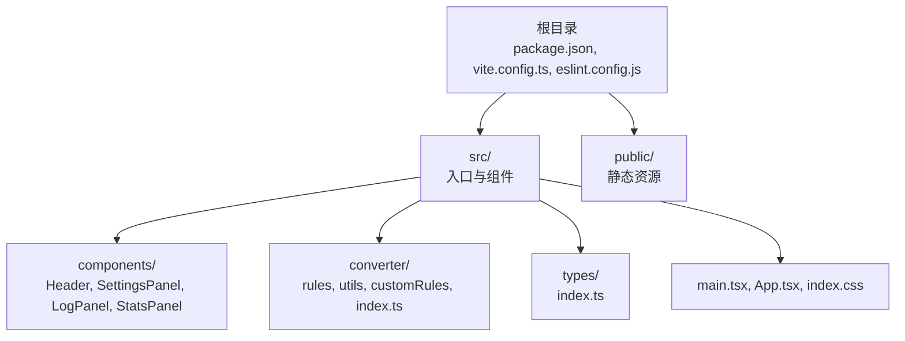
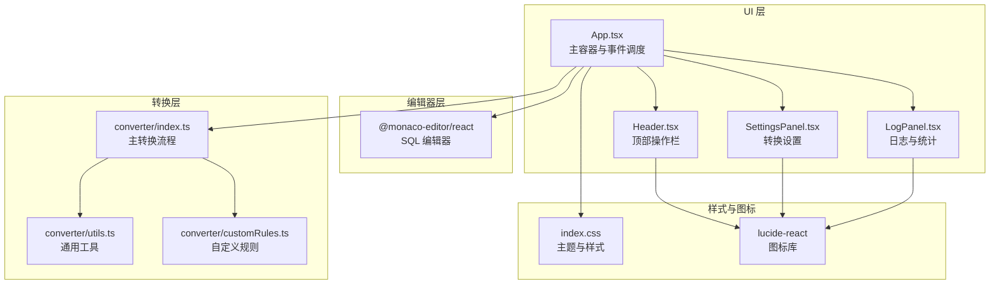
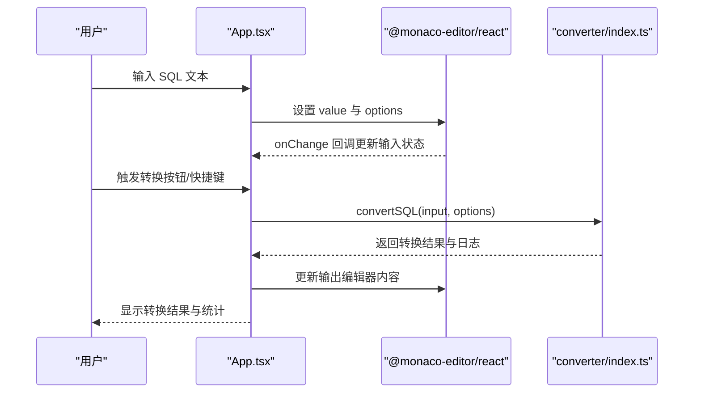
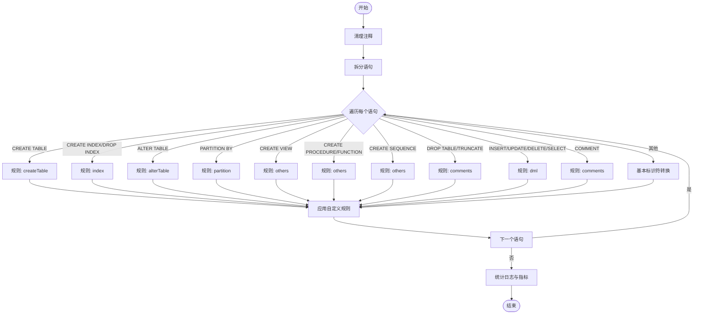
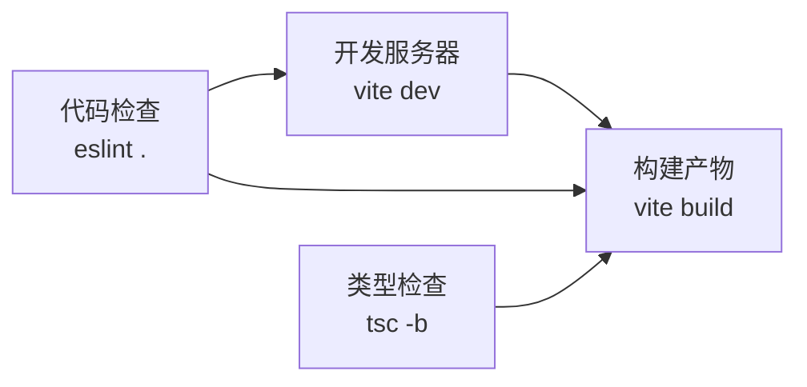
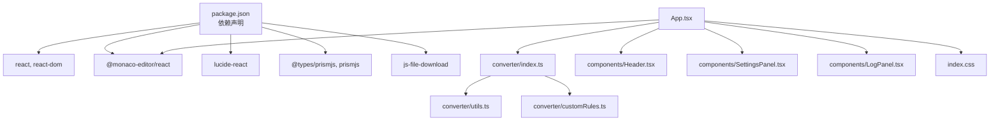

# 集成模式

<cite>
**本文引用的文件**
- [package.json](file://package.json)
- [vite.config.ts](file://vite.config.ts)
- [eslint.config.js](file://eslint.config.js)
- [index.html](file://index.html)
- [src/main.tsx](file://src/main.tsx)
- [src/App.tsx](file://src/App.tsx)
- [src/index.css](file://src/index.css)
- [src/components/Header.tsx](file://src/components/Header.tsx)
- [src/components/SettingsPanel.tsx](file://src/components/SettingsPanel.tsx)
- [src/components/LogPanel.tsx](file://src/components/LogPanel.tsx)
- [src/converter/index.ts](file://src/converter/index.ts)
- [src/converter/utils.ts](file://src/converter/utils.ts)
- [src/converter/customRules.ts](file://src/converter/customRules.ts)
- [src/types/index.ts](file://src/types/index.ts)
- [README.md](file://README.md)
</cite>

## 目录
1. [简介](#简介)
2. [项目结构](#项目结构)
3. [核心组件](#核心组件)
4. [架构总览](#架构总览)
5. [详细组件分析](#详细组件分析)
6. [依赖关系分析](#依赖关系分析)
7. [性能考量](#性能考量)
8. [故障排查指南](#故障排查指南)
9. [结论](#结论)
10. [附录](#附录)

## 简介
本项目是一个基于前端技术栈的 SQL 转换器，专注于将 MySQL 语法转换为 Oracle 语法，特别适用于 OceanBase MySQL 模式向 Oracle 模式的迁移与适配场景。系统采用 React 19 + TypeScript + Vite + Monaco Editor 技术栈，提供直观的编辑器界面、可配置的转换选项、详细的转换日志与统计信息，帮助用户高效完成数据库迁移任务。

## 项目结构
项目采用典型的 React + Vite 前端工程结构，核心目录组织如下：
- src/components：可复用 UI 组件（头部、设置面板、日志面板、统计面板）
- src/converter：转换器核心逻辑，包含规则引擎、工具函数和自定义规则
- src/types：TypeScript 类型定义
- public：静态资源（图标、字体等）
- 根目录：构建配置、脚本和配置文件

图表来源
- [package.json:1-36](file://package.json#L1-L36)
- [vite.config.ts:1-9](file://vite.config.ts#L1-L9)
- [src/main.tsx:1-11](file://src/main.tsx#L1-L11)
- [src/App.tsx:1-282](file://src/App.tsx#L1-L282)

章节来源
- [README.md:1-12](file://README.md#L1-L12)
- [package.json:1-36](file://package.json#L1-L36)
- [vite.config.ts:1-9](file://vite.config.ts#L1-L9)

## 核心组件
本节概述系统的关键组件及其职责：
- 编辑器组件：基于 Monaco Editor 的输入/输出编辑器，提供 SQL 语法高亮与基础编辑能力
- 转换器引擎：解析 SQL 语句，按类型路由到不同规则处理器，执行转换并收集日志与统计
- UI 控制层：负责事件绑定、文件导入导出、快捷键处理、设置面板切换与日志面板显示
- 图标与样式：使用 lucide-react 提供图标，通过 CSS 变量统一主题风格

章节来源
- [src/App.tsx:1-282](file://src/App.tsx#L1-L282)
- [src/converter/index.ts:1-129](file://src/converter/index.ts#L1-L129)
- [src/components/Header.tsx:1-93](file://src/components/Header.tsx#L1-L93)
- [src/components/SettingsPanel.tsx:1-100](file://src/components/SettingsPanel.tsx#L1-L100)
- [src/components/LogPanel.tsx:1-82](file://src/components/LogPanel.tsx#L1-L82)
- [src/index.css:1-165](file://src/index.css#L1-L165)

## 架构总览
系统采用“UI 控制层 + 转换器引擎 + 规则模块”的分层架构，编辑器作为输入输出载体，转换器负责业务逻辑处理，组件负责用户交互与展示。

图表来源
- [src/App.tsx:1-282](file://src/App.tsx#L1-L282)
- [src/converter/index.ts:1-129](file://src/converter/index.ts#L1-L129)
- [src/converter/utils.ts:1-115](file://src/converter/utils.ts#L1-L115)
- [src/converter/customRules.ts:1-186](file://src/converter/customRules.ts#L1-L186)
- [src/components/Header.tsx:1-93](file://src/components/Header.tsx#L1-L93)
- [src/components/SettingsPanel.tsx:1-100](file://src/components/SettingsPanel.tsx#L1-L100)
- [src/components/LogPanel.tsx:1-82](file://src/components/LogPanel.tsx#L1-L82)
- [src/index.css:1-165](file://src/index.css#L1-L165)

## 详细组件分析

### Monaco Editor 集成
Monaco Editor 作为核心编辑器组件，分别用于输入与输出区域，提供 SQL 语法高亮与基础编辑体验。编辑器配置包括：
- 语言模式：SQL
- 主题：深色主题
- 行号：开启
- 字体：使用 CSS 变量定义的等宽字体
- 缩进与换行：Tab 宽度为 2，自动换行开启
- 输入编辑器：可编辑；输出编辑器：只读
- 自适应布局：随容器尺寸变化自动重绘

图表来源
- [src/App.tsx:190-251](file://src/App.tsx#L190-L251)
- [src/converter/index.ts:59-125](file://src/converter/index.ts#L59-L125)

章节来源
- [src/App.tsx:190-251](file://src/App.tsx#L190-L251)

### 转换器引擎与规则系统
转换器采用“语句类型识别 + 规则路由 + 自定义规则”的设计：
- 语句拆分：按分号拆分，忽略字符串内部的分号
- 注释清理：先保护字符串，再移除行注释与块注释
- 类型识别：根据语句前缀与关键字判断类型（DDL/DML/索引/分区/视图/过程/序列等）
- 规则处理：每类语句由专门规则处理器执行转换
- 自定义规则：提供可扩展的规则接口，支持按表/列匹配与转换

图表来源
- [src/converter/index.ts:15-54](file://src/converter/index.ts#L15-L54)
- [src/converter/index.ts:59-125](file://src/converter/index.ts#L59-L125)
- [src/converter/utils.ts:52-72](file://src/converter/utils.ts#L52-L72)
- [src/converter/customRules.ts:170-185](file://src/converter/customRules.ts#L170-L185)

章节来源
- [src/converter/index.ts:1-129](file://src/converter/index.ts#L1-L129)
- [src/converter/utils.ts:1-115](file://src/converter/utils.ts#L1-L115)
- [src/converter/customRules.ts:1-186](file://src/converter/customRules.ts#L1-L186)

### 第三方库集成策略
- 图标库 lucide-react：用于 UI 操作按钮与状态指示，统一使用 CSS 变量颜色
- 文件操作 API：使用原生 File API 实现文件导入，使用 Blob + a 标签实现导出
- 语法高亮：Monaco Editor 内置 SQL 语法高亮，无需额外 prismjs 集成
- 类型声明：@types/prismjs 与 @types/react 等类型包确保开发体验

章节来源
- [package.json:12-34](file://package.json#L12-L34)
- [src/App.tsx:81-111](file://src/App.tsx#L81-L111)
- [src/components/Header.tsx:1-93](file://src/components/Header.tsx#L1-L93)
- [src/components/LogPanel.tsx:1-82](file://src/components/LogPanel.tsx#L1-L82)

### 构建工具集成
- Vite 配置：启用 React 插件，设置相对路径 base，适配静态部署
- TypeScript：分别配置应用与 Node 工具链，确保类型安全
- ESLint：推荐规则集，结合 TypeScript ESLint 与 React Hooks/Refresh 插件，统一代码质量

图表来源
- [vite.config.ts:1-9](file://vite.config.ts#L1-L9)
- [eslint.config.js:1-27](file://eslint.config.js#L1-L27)
- [package.json:6-11](file://package.json#L6-L11)

章节来源
- [vite.config.ts:1-9](file://vite.config.ts#L1-L9)
- [eslint.config.js:1-27](file://eslint.config.js#L1-L27)
- [package.json:6-11](file://package.json#L6-L11)

### 浏览器兼容性与性能优化
- 浏览器兼容性：项目面向现代浏览器，使用 React 19、TypeScript 与 Vite，无需 polyfill
- 性能优化：
  - Monaco Editor 采用最小化配置，关闭缩略图与滚动越界，提升渲染性能
  - 使用 CSS 变量与等宽字体，减少重排与重绘
  - 仅在需要时更新状态，避免不必要的重渲染
  - 语句拆分与转换采用流式处理，降低内存占用

章节来源
- [src/App.tsx:195-205](file://src/App.tsx#L195-L205)
- [src/App.tsx:239-250](file://src/App.tsx#L239-L250)
- [src/index.css:1-165](file://src/index.css#L1-L165)

### 部署架构与环境配置
- 静态资源：Vite 构建后输出静态资源，通过相对路径 base 适配子目录部署
- 环境变量：当前项目未使用环境变量，部署时可直接将 dist 目录托管至静态服务器
- 生产优化：建议在生产环境启用缓存控制、Gzip 压缩与 CDN 加速

章节来源
- [vite.config.ts:6](file://vite.config.ts#L6)
- [index.html:1-14](file://index.html#L1-L14)

### 安全考虑与跨域处理
- CORS 与跨域：项目为纯前端应用，不涉及服务端请求，无需 CORS 配置
- 安全建议：
  - 本地文件导入仅在浏览器端处理，注意文件大小限制与内存占用
  - 导出文件时确保内容正确性，避免敏感信息泄露
  - 使用 HTTPS 提供静态资源，防止中间人攻击

章节来源
- [src/App.tsx:81-111](file://src/App.tsx#L81-L111)

### 集成测试与调试技巧
- 单元测试：可在转换器规则模块中增加测试用例，验证语句拆分、注释清理与规则转换
- 集成测试：通过模拟用户操作（导入、转换、导出）验证整体流程
- 调试技巧：
  - 使用浏览器开发者工具检查 Monaco Editor 的 DOM 结构与事件回调
  - 在转换器中添加日志记录，定位异常语句与错误堆栈
  - 利用 React DevTools 检查组件状态与 props 变更

章节来源
- [src/converter/index.ts:97-107](file://src/converter/index.ts#L97-L107)
- [src/App.tsx:126-135](file://src/App.tsx#L126-L135)

## 依赖关系分析
项目依赖关系围绕“UI 控制层 + 转换器引擎 + 第三方库”展开，Monaco Editor 与 lucide-react 作为 UI 基础设施，转换器依赖工具函数与自定义规则。

图表来源
- [package.json:12-34](file://package.json#L12-L34)
- [src/App.tsx:1-282](file://src/App.tsx#L1-L282)
- [src/converter/index.ts:1-129](file://src/converter/index.ts#L1-L129)
- [src/converter/utils.ts:1-115](file://src/converter/utils.ts#L1-L115)
- [src/converter/customRules.ts:1-186](file://src/converter/customRules.ts#L1-L186)
- [src/components/Header.tsx:1-93](file://src/components/Header.tsx#L1-L93)
- [src/components/SettingsPanel.tsx:1-100](file://src/components/SettingsPanel.tsx#L1-L100)
- [src/components/LogPanel.tsx:1-82](file://src/components/LogPanel.tsx#L1-L82)
- [src/index.css:1-165](file://src/index.css#L1-L165)

章节来源
- [package.json:12-34](file://package.json#L12-L34)

## 性能考量
- 编辑器性能：关闭缩略图与滚动越界，合理设置字体与 Tab 宽度，避免大文本频繁重绘
- 转换性能：对长文本采用流式处理，避免一次性处理过多语句；自定义规则应尽量避免复杂正则
- 内存管理：及时释放 Blob URL，避免内存泄漏；在大量日志场景下定期清理旧日志

## 故障排查指南
- 编辑器无响应：检查 Monaco Editor 的 options 配置与容器尺寸，确认自动布局启用
- 转换结果异常：查看日志面板中的错误与警告，定位具体语句；必要时在转换器中添加断点
- 导入/导出失败：确认文件类型与大小限制，检查浏览器安全策略与下载权限
- 样式异常：检查 CSS 变量是否正确加载，确认字体资源可用

章节来源
- [src/App.tsx:126-135](file://src/App.tsx#L126-L135)
- [src/converter/index.ts:97-107](file://src/converter/index.ts#L97-L107)

## 结论
本项目通过清晰的分层架构与模块化设计，实现了从 SQL 输入到 Oracle 兼容输出的完整转换流程。Monaco Editor 提供了良好的编辑体验，lucide-react 与自定义规则增强了可扩展性。配合 Vite 与 TypeScript 的现代化构建体系，项目具备良好的开发体验与可维护性。建议在后续迭代中完善测试覆盖与性能监控，进一步提升用户体验。

## 附录
- 术语说明：Monaco Editor 是微软开源的 Web 编辑器，提供 VS Code 同款体验；Oracle 模式指兼容 Oracle 数据库语法的模式
- 最佳实践：保持规则模块的单一职责，避免在自定义规则中引入副作用；对复杂语句优先拆分为多个小规则