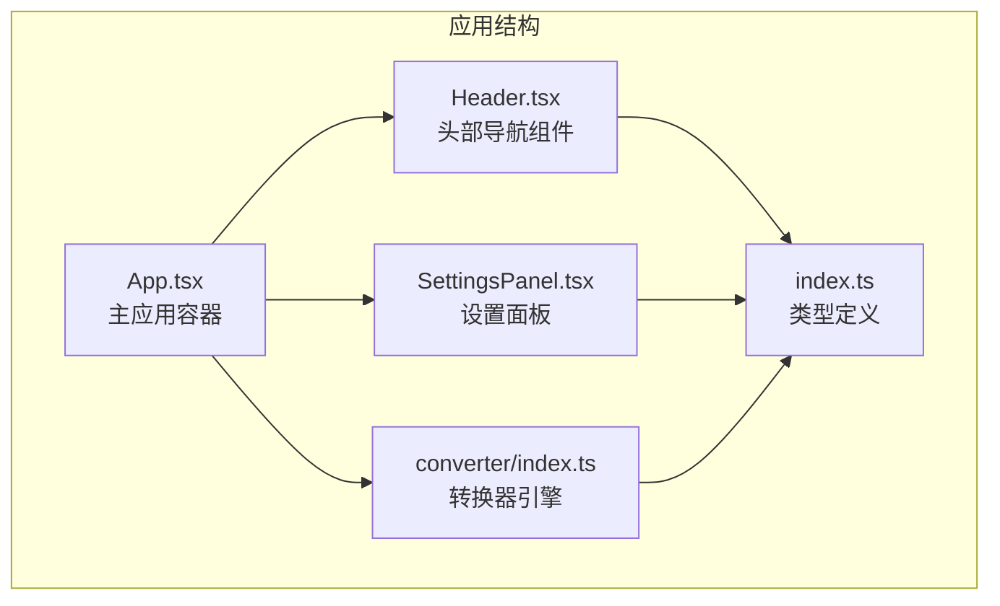
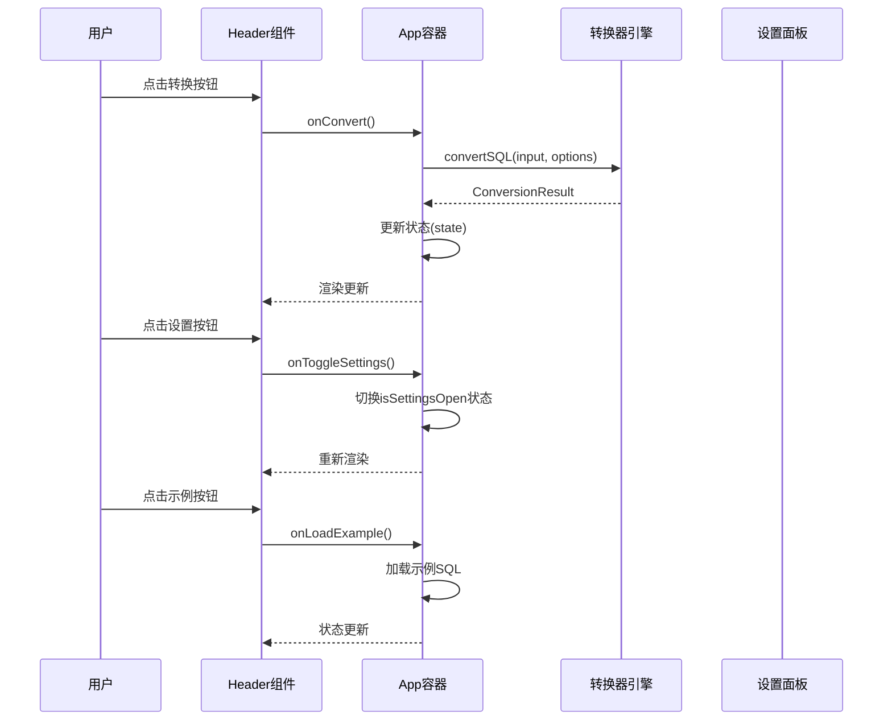
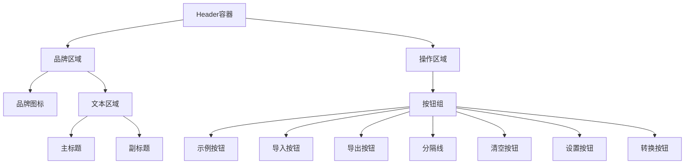
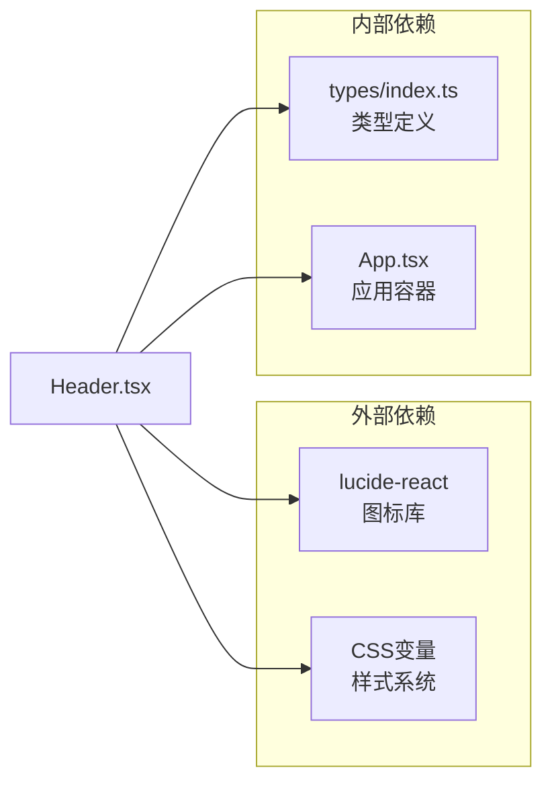

# 头部导航组件

<cite>
**本文档引用的文件**
- [Header.tsx](file://src/components/Header.tsx)
- [App.tsx](file://src/App.tsx)
- [index.css](file://src/index.css)
- [index.ts](file://src/types/index.ts)
- [SettingsPanel.tsx](file://src/components/SettingsPanel.tsx)
- [converter/index.ts](file://src/converter/index.ts)
</cite>

## 目录
1. [简介](#简介)
2. [项目结构](#项目结构)
3. [核心组件](#核心组件)
4. [架构概览](#架构概览)
5. [详细组件分析](#详细组件分析)
6. [依赖关系分析](#依赖关系分析)
7. [性能考虑](#性能考虑)
8. [故障排除指南](#故障排除指南)
9. [结论](#结论)

## 简介

Header头部导航组件是SQL语法转换器应用的核心界面组件，负责提供用户与转换器交互的主要入口点。该组件采用现代化的设计理念，结合了响应式布局、语义化图标和直观的用户交互模式，为用户提供从MySQL到Oracle的SQL语法转换体验。

组件整体设计遵循Material Design原则，通过精心设计的颜色系统、间距规范和交互反馈机制，确保用户能够高效地完成SQL转换任务。组件支持键盘快捷键操作，提供完整的导入导出功能，并集成了设置面板控制。

## 项目结构

Header组件位于src/components目录下，作为应用的顶层UI组件之一，与其他核心组件协同工作形成完整的转换器应用架构。

**图表来源**
- [App.tsx:155-163](file://src/App.tsx#L155-L163)
- [Header.tsx:13-21](file://src/components/Header.tsx#L13-L21)

**章节来源**
- [Header.tsx:1-93](file://src/components/Header.tsx#L1-L93)
- [App.tsx:155-163](file://src/App.tsx#L155-L163)

## 核心组件

Header组件是一个纯函数式组件，接收多个回调函数作为props，用于处理用户交互事件。组件内部实现了完整的UI渲染逻辑，包括品牌标识、标题文本、副标题说明和功能按钮组。

### Props接口定义

组件的HeaderProps接口定义了所有必需的回调函数和状态属性：

| 属性名 | 类型 | 必需 | 描述 |
|--------|------|------|------|
| onConvert | () => void | 是 | 执行SQL转换的回调函数 |
| onClear | () => void | 是 | 清空输入输出内容的回调函数 |
| onImport | () => void | 是 | 导入SQL文件的回调函数 |
| onExport | () => void | 是 | 导出转换结果的回调函数 |
| onToggleSettings | () => void | 是 | 切换设置面板显示状态的回调函数 |
| onLoadExample | () => void | 是 | 加载示例SQL的回调函数 |
| isSettingsOpen | boolean | 是 | 设置面板当前显示状态 |

### 设计理念

组件采用"功能明确、层次清晰"的设计原则：
- **品牌一致性**：使用统一的品牌色彩系统，确保视觉连贯性
- **用户体验优先**：提供直观的操作流程和即时的反馈机制
- **可访问性**：支持键盘快捷键操作，提升无障碍使用体验
- **响应式设计**：适配不同屏幕尺寸和设备类型

**章节来源**
- [Header.tsx:3-11](file://src/components/Header.tsx#L3-L11)
- [Header.tsx:13-21](file://src/components/Header.tsx#L13-L21)

## 架构概览

Header组件在整个应用架构中扮演着关键角色，作为用户界面的入口点协调各个子系统的交互。

**图表来源**
- [App.tsx:67-72](file://src/App.tsx#L67-L72)
- [App.tsx:120-123](file://src/App.tsx#L120-L123)
- [App.tsx:155-163](file://src/App.tsx#L155-L163)

**章节来源**
- [App.tsx:56-135](file://src/App.tsx#L56-L135)

## 详细组件分析

### 布局结构

Header组件采用Flexbox布局，实现了响应式的两栏结构。左侧区域包含品牌标识和标题信息，右侧区域包含功能按钮组。

**图表来源**
- [Header.tsx:22-91](file://src/components/Header.tsx#L22-L91)

### 样式设计

组件使用CSS变量系统实现主题化设计，支持深色模式和品牌色彩定制。

#### 颜色系统

| 变量名 | 颜色值 | 用途 |
|--------|--------|------|
| --bg-primary | #1e1e2e | 主背景色 |
| --bg-secondary | #252535 | 次级背景色 |
| --accent | #89b4fa | 品牌强调色 |
| --success | #a6e3a1 | 成功状态色 |
| --error | #f38ba8 | 错误状态色 |
| --text-primary | #cdd6f4 | 主要文字色 |
| --text-muted | #6c7086 | 柔和文字色 |

#### 按钮样式

组件使用统一的按钮样式系统，支持多种状态和尺寸：

- **基础按钮**：.btn - 标准尺寸，灰色主题
- **小按钮**：.btn-sm - 12px字体，紧凑布局  
- **主要按钮**：.btn-primary - 品牌色主题
- **悬停效果**：统一的过渡动画和颜色变化

**章节来源**
- [Header.tsx:24-32](file://src/components/Header.tsx#L24-L32)
- [Header.tsx:59-88](file://src/components/Header.tsx#L59-L88)
- [index.css:59-101](file://src/index.css#L59-L101)

### 交互功能

#### 转换按钮
- **功能**：执行SQL语法转换
- **快捷键**：Ctrl+Enter
- **样式**：主要按钮样式，加粗字体
- **状态**：根据设置面板状态动态切换样式

#### 清空按钮
- **功能**：清除输入输出内容和日志
- **图标**：垃圾桶图标
- **行为**：重置所有状态到初始值

#### 导入按钮
- **功能**：从本地文件导入SQL内容
- **图标**：上传图标
- **行为**：触发隐藏的文件选择对话框

#### 导出按钮
- **功能**：将转换结果保存为SQL文件
- **图标**：下载图标
- **行为**：创建Blob对象并触发浏览器下载

#### 设置按钮
- **功能**：切换设置面板显示状态
- **图标**：齿轮图标
- **状态**：根据isSettingsOpen状态高亮显示

#### 示例按钮
- **功能**：加载预设的示例SQL
- **图标**：代码文件图标
- **行为**：填充示例SQL内容到输入区域

**章节来源**
- [Header.tsx:60-88](file://src/components/Header.tsx#L60-L88)
- [App.tsx:74-123](file://src/App.tsx#L74-L123)

## 依赖关系分析

Header组件与应用其他模块存在紧密的依赖关系，形成了清晰的单向数据流。

**图表来源**
- [Header.tsx:1](file://src/components/Header.tsx#L1)
- [index.ts:1](file://src/types/index.ts#L1)

### 组件耦合度

- **低耦合**：Header组件通过props接收所有必要的回调函数，避免直接依赖具体实现
- **高内聚**：组件专注于UI渲染和用户交互，不包含业务逻辑
- **单向数据流**：数据流向从App容器流向Header，保持状态管理的集中性

**章节来源**
- [Header.tsx:13-21](file://src/components/Header.tsx#L13-L21)
- [App.tsx:155-163](file://src/App.tsx#L155-L163)

## 性能考虑

### 渲染优化

- **纯函数组件**：使用React.memo优化，避免不必要的重新渲染
- **事件绑定**：在App容器中使用useCallback缓存回调函数
- **条件渲染**：设置面板采用条件渲染，减少DOM节点数量

### 内存管理

- **样式内联**：使用内联样式避免CSS类名冲突
- **图标按需加载**：使用lucide-react的Tree Shaking特性
- **状态最小化**：仅传递必要的状态和回调函数

## 故障排除指南

### 常见问题

#### 设置按钮样式异常
**症状**：设置按钮始终处于高亮状态或无法正常切换
**解决方案**：检查isSettingsOpen状态传递是否正确，确认onToggleSettings回调函数实现

#### 导出功能失效
**症状**：点击导出按钮无反应或报错
**解决方案**：验证输出内容是否为空，检查Blob对象创建和下载链接生成逻辑

#### 导入功能异常
**症状**：文件选择对话框无法弹出或文件读取失败
**解决方案**：确认fileInputRef引用是否正确，检查FileReader API兼容性和权限设置

### 调试建议

1. **开发者工具**：使用React DevTools检查组件props传递
2. **控制台日志**：在回调函数中添加console.log进行调试
3. **状态检查**：验证组件状态是否按预期更新

**章节来源**
- [App.tsx:98-111](file://src/App.tsx#L98-L111)
- [App.tsx:81-96](file://src/App.tsx#L81-L96)

## 结论

Header头部导航组件作为SQL语法转换器应用的核心界面组件，展现了现代前端开发的最佳实践。组件通过清晰的架构设计、完善的类型系统和优雅的UI实现，为用户提供了流畅的SQL转换体验。

组件的主要优势包括：
- **模块化设计**：职责单一，易于维护和测试
- **类型安全**：完整的TypeScript类型定义
- **用户体验**：直观的交互设计和及时的反馈机制
- **可扩展性**：良好的接口设计支持功能扩展

通过合理的依赖管理和状态控制，Header组件成功地将复杂的业务逻辑与简洁的UI设计分离，为构建高质量的Web应用提供了优秀的参考范例。