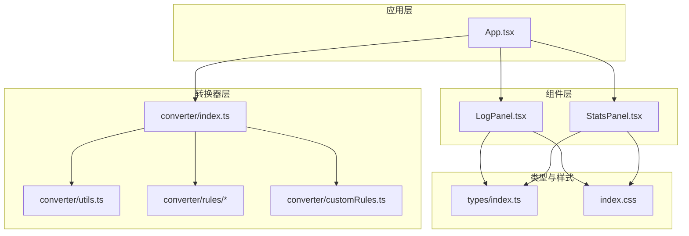
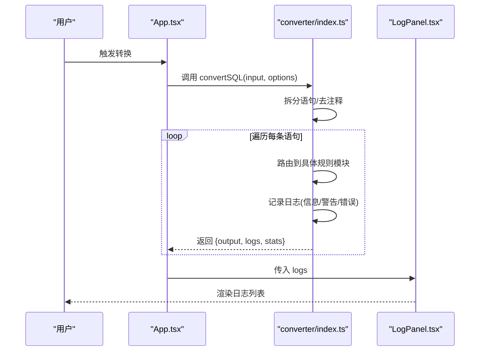
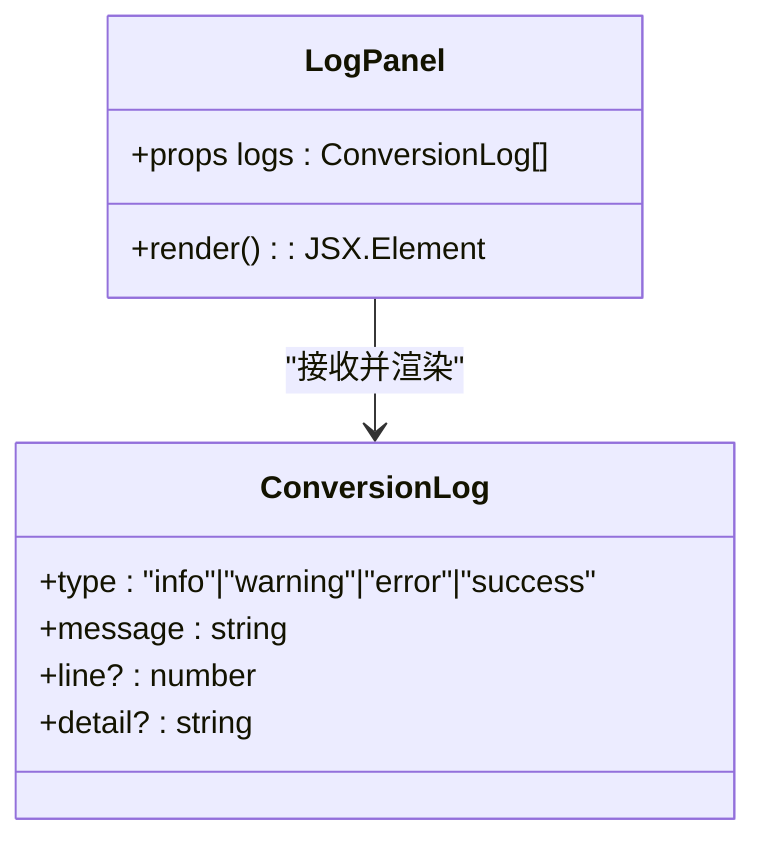
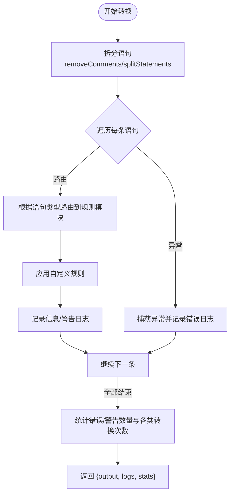
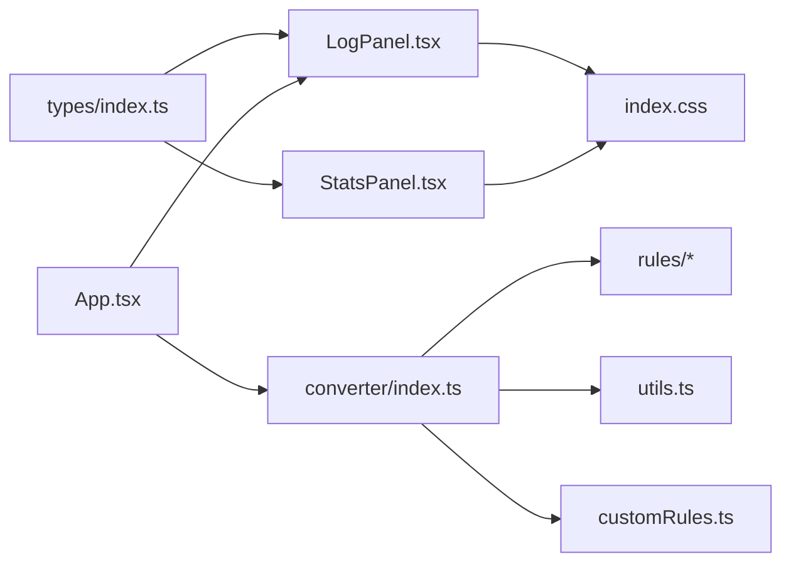

# 日志面板组件

<cite>
**本文引用的文件**
- [LogPanel.tsx](file://src/components/LogPanel.tsx)
- [App.tsx](file://src/App.tsx)
- [index.ts](file://src/converter/index.ts)
- [types/index.ts](file://src/types/index.ts)
- [utils.ts](file://src/converter/utils.ts)
- [customRules.ts](file://src/converter/customRules.ts)
- [StatsPanel.tsx](file://src/components/StatsPanel.tsx)
- [index.css](file://src/index.css)
- [createTable.ts](file://src/converter/rules/createTable.ts)
- [dataTypes.ts](file://src/converter/rules/dataTypes.ts)
</cite>

## 目录
1. [简介](#简介)
2. [项目结构](#项目结构)
3. [核心组件](#核心组件)
4. [架构概览](#架构概览)
5. [详细组件分析](#详细组件分析)
6. [依赖关系分析](#依赖关系分析)
7. [性能考量](#性能考量)
8. [故障排查指南](#故障排查指南)
9. [结论](#结论)
10. [附录](#附录)

## 简介
本文件为 LogPanel 日志面板组件的详细技术文档。LogPanel 负责在 SQL 转换过程中收集、分类与可视化展示各类日志信息，包括信息、警告、错误与成功提示，并提供行号与详情等辅助信息。本文将从设计目标、显示机制、日志分类与组织、收集/存储/展示流程、交互能力（过滤、搜索、详情查看）、使用示例、性能优化与可访问性等方面进行全面阐述。

## 项目结构
LogPanel 位于组件层，与应用主界面、转换器、类型定义及样式系统紧密协作：
- 组件层：LogPanel.tsx
- 应用层：App.tsx（负责触发转换、接收日志并控制面板开关）
- 转换器层：converter/index.ts（统一调度各规则模块，产出日志与统计）
- 类型定义：types/index.ts（ConversionLog/ConversionResult/ConversionStats/ConverterOptions）
- 规则与工具：rules/* 与 utils.ts（具体转换逻辑与通用工具）
- 样式层：index.css（主题变量与组件样式）

图表来源
- [App.tsx:137-281](file://src/App.tsx#L137-L281)
- [LogPanel.tsx:22-81](file://src/components/LogPanel.tsx#L22-L81)
- [index.ts:59-125](file://src/converter/index.ts#L59-L125)
- [types/index.ts:1-44](file://src/types/index.ts#L1-L44)
- [index.css:1-165](file://src/index.css#L1-L165)

章节来源
- [App.tsx:137-281](file://src/App.tsx#L137-L281)
- [LogPanel.tsx:22-81](file://src/components/LogPanel.tsx#L22-L81)
- [index.ts:59-125](file://src/converter/index.ts#L59-L125)
- [types/index.ts:1-44](file://src/types/index.ts#L1-L44)
- [index.css:1-165](file://src/index.css#L1-L165)

## 核心组件
- LogPanel：接收日志数组，按类型渲染图标、边框色、消息与详情，支持行号显示。
- App：调用转换器，接收日志并传入 LogPanel；控制日志面板的展开/收起。
- 转换器：统一拆分语句、路由到不同规则模块、捕获异常并记录日志，统计错误/警告数量。
- 类型系统：定义 ConversionLog、ConversionResult、ConversionStats、ConverterOptions。
- 样式系统：通过 CSS 变量统一主题色，LogPanel 使用变量色实现类型区分。

章节来源
- [LogPanel.tsx:22-81](file://src/components/LogPanel.tsx#L22-L81)
- [App.tsx:56-135](file://src/App.tsx#L56-L135)
- [index.ts:59-125](file://src/converter/index.ts#L59-L125)
- [types/index.ts:1-44](file://src/types/index.ts#L1-L44)
- [index.css:1-19](file://src/index.css#L1-L19)

## 架构概览
LogPanel 的工作流围绕“日志收集—日志展示”展开：
- 日志收集：转换器在每个语句转换前后记录信息、警告、错误；自定义规则应用后也记录日志。
- 日志存储：日志数组作为 props 传入 LogPanel。
- 日志展示：LogPanel 根据日志类型选择图标与边框色，渲染消息与详情，支持行号显示。

图表来源
- [App.tsx:67-72](file://src/App.tsx#L67-L72)
- [index.ts:59-125](file://src/converter/index.ts#L59-L125)
- [LogPanel.tsx:22-81](file://src/components/LogPanel.tsx#L22-L81)

## 详细组件分析

### LogPanel 组件
- 设计目标
  - 清晰区分日志类型（信息、警告、错误、成功）。
  - 提供可读性强的消息与可选详情，便于定位问题。
  - 支持行号显示，便于快速定位源语句。
- 显示机制
  - 图标映射：根据类型选择 Info/AlertTriangle/AlertCircle/CheckCircle。
  - 边框色映射：使用 RGBA 半透明色实现类型区分且不遮挡内容。
  - 文本样式：消息使用主色，详情使用次级色，Monospace 字体用于代码片段。
  - 空状态：当日志为空时显示“暂无日志信息”。
- 交互与扩展
  - 当前版本未内置过滤/搜索功能，可通过外部状态管理扩展。
  - 行号与详情字段由上游转换器提供，LogPanel 仅渲染。

图表来源
- [LogPanel.tsx:4-6](file://src/components/LogPanel.tsx#L4-L6)
- [types/index.ts:1-6](file://src/types/index.ts#L1-L6)

章节来源
- [LogPanel.tsx:8-20](file://src/components/LogPanel.tsx#L8-L20)
- [LogPanel.tsx:22-81](file://src/components/LogPanel.tsx#L22-L81)
- [types/index.ts:1-6](file://src/types/index.ts#L1-L6)

### 日志分类与组织
- 分类体系
  - 信息：用于提示性信息（如数据类型转换数量、临时表转换、注释转换等）。
  - 警告：用于可恢复的问题（如未识别语句、FULLTEXT 索引降级、ON UPDATE CURRENT_TIMESTAMP 缺失触发器等）。
  - 错误：用于转换失败（捕获异常并记录错误日志）。
  - 成功：用于操作完成提示（如导入/导出成功）。
- 组织方式
  - 按时间顺序追加至日志数组。
  - 统计面板汇总错误/警告数量与各类转换次数。
- 视觉标识
  - 图标与边框色来自 CSS 变量，确保一致的主题风格。

章节来源
- [index.ts:109-117](file://src/converter/index.ts#L109-L117)
- [createTable.ts:119-121](file://src/converter/rules/createTable.ts#L119-L121)
- [createTable.ts:161-195](file://src/converter/rules/createTable.ts#L161-L195)
- [createTable.ts:296-304](file://src/converter/rules/createTable.ts#L296-L304)
- [dataTypes.ts:78-83](file://src/converter/rules/dataTypes.ts#L78-L83)
- [customRules.ts:177-181](file://src/converter/customRules.ts#L177-L181)
- [index.css:1-19](file://src/index.css#L1-L19)

### 日志收集、存储与展示机制
- 收集
  - 转换器在拆分语句、路由到规则模块、应用自定义规则、异常捕获等环节记录日志。
  - 规则模块在解析/转换过程中遇到特殊情况（如临时表、默认值、注释）记录信息/警告。
- 存储
  - 日志数组作为 ConversionResult 的一部分返回，App 接收后传递给 LogPanel。
- 展示
  - LogPanel 逐条渲染，支持详情与行号字段。

图表来源
- [utils.ts:52-72](file://src/converter/utils.ts#L52-L72)
- [index.ts:15-54](file://src/converter/index.ts#L15-L54)
- [index.ts:86-107](file://src/converter/index.ts#L86-L107)
- [customRules.ts:170-185](file://src/converter/customRules.ts#L170-L185)

章节来源
- [utils.ts:52-72](file://src/converter/utils.ts#L52-L72)
- [index.ts:15-54](file://src/converter/index.ts#L15-L54)
- [index.ts:86-107](file://src/converter/index.ts#L86-L107)
- [customRules.ts:170-185](file://src/converter/customRules.ts#L170-L185)

### 交互功能
- 当前实现
  - 日志面板展开/收起：App 控制，LogPanel 作为面板右侧区域展示。
  - 行号显示：若日志包含 line 字段，则显示“行号: X”。
  - 详情查看：若日志包含 detail 字段，则以 Monospace 字体显示。
- 可扩展建议
  - 过滤：按类型（信息/警告/错误/成功）过滤。
  - 搜索：在消息或详情中搜索关键字。
  - 导出：将日志导出为文本文件。
  - 清空：一键清空日志列表。
  - 自动滚动：新日志到达时自动滚动到底部。

章节来源
- [App.tsx:224-231](file://src/App.tsx#L224-L231)
- [LogPanel.tsx:71-76](file://src/components/LogPanel.tsx#L71-L76)

### 使用示例
- 集成日志系统
  - 在应用层调用转换器，接收 logs 并传入 LogPanel。
  - 控制日志面板的可见性与标题栏统计。
- 自定义日志格式
  - 在规则模块中按需 push 日志，使用统一的类型与消息格式。
  - 通过 detail 字段提供上下文片段，通过 line 字段提供行号。
- 处理大量日志数据的性能优化
  - 使用虚拟滚动（例如 react-window 或 react-virtualized）仅渲染可视区域。
  - 合理分页或分组展示，避免一次性渲染过多节点。
  - 对详情内容进行懒加载或折叠显示。
  - 限制日志最大条数，超出时截断或归档旧日志。

章节来源
- [App.tsx:67-72](file://src/App.tsx#L67-L72)
- [createTable.ts:161-195](file://src/converter/rules/createTable.ts#L161-L195)
- [dataTypes.ts:78-83](file://src/converter/rules/dataTypes.ts#L78-L83)

### 样式设计与可访问性
- 样式设计
  - 使用 CSS 变量统一主题色，LogPanel 的图标、边框色、文本色均来自变量。
  - Monospace 字体用于详情，提升代码片段可读性。
  - 详情区域采用预换行与断词策略，避免长行溢出。
- 可访问性
  - 使用语义化标签与清晰的颜色对比度。
  - 为按钮提供标题与键盘快捷键支持（如 Ctrl/Cmd + Enter 触发转换）。
  - 为日志项提供最小点击面积，避免误触。
  - 为屏幕阅读器友好的文本结构（当前实现以纯文本为主，可增加 aria-label）。

章节来源
- [index.css:1-19](file://src/index.css#L1-L19)
- [LogPanel.tsx:55-70](file://src/components/LogPanel.tsx#L55-L70)
- [App.tsx:125-135](file://src/App.tsx#L125-L135)

## 依赖关系分析
- 组件耦合
  - LogPanel 仅依赖 ConversionLog 类型与 CSS 变量，低耦合高内聚。
  - App 与转换器之间通过 ConversionResult 传递日志，职责清晰。
- 外部依赖
  - 图标库 lucide-react 提供图标资源。
  - Monaco Editor 用于输入/输出编辑区（与日志面板同属应用层）。
- 潜在循环依赖
  - 未发现循环依赖，类型定义独立于实现。

图表来源
- [types/index.ts:1-44](file://src/types/index.ts#L1-L44)
- [LogPanel.tsx:1-2](file://src/components/LogPanel.tsx#L1-L2)
- [StatsPanel.tsx:1-1](file://src/components/StatsPanel.tsx#L1-L1)
- [App.tsx:5-7](file://src/App.tsx#L5-L7)
- [index.ts:1-10](file://src/converter/index.ts#L1-L10)
- [index.css:1-19](file://src/index.css#L1-L19)

章节来源
- [types/index.ts:1-44](file://src/types/index.ts#L1-L44)
- [LogPanel.tsx:1-2](file://src/components/LogPanel.tsx#L1-L2)
- [StatsPanel.tsx:1-1](file://src/components/StatsPanel.tsx#L1-L1)
- [App.tsx:5-7](file://src/App.tsx#L5-L7)
- [index.ts:1-10](file://src/converter/index.ts#L1-L10)
- [index.css:1-19](file://src/index.css#L1-L19)

## 性能考量
- 渲染性能
  - LogPanel 采用简单列表渲染，复杂度 O(n)。对于大量日志，建议引入虚拟列表。
- 内存占用
  - 日志数组持续增长，建议设置上限并在 App 层进行截断或归档。
- I/O 与计算
  - 转换器在拆分语句、去注释、路由规则时进行字符串处理，注意避免重复计算。
- 可见性与交互
  - 日志面板默认关闭或可折叠，减少初始渲染压力。

[本节为通用性能建议，无需特定文件来源]

## 故障排查指南
- 日志为空
  - 检查输入是否为空；空输入会返回“输入为空”的信息日志。
- 未显示详情
  - 确认上游是否为日志对象提供了 detail 字段。
- 行号未显示
  - 确认上游是否为日志对象提供了 line 字段。
- 错误日志未出现
  - 检查转换器是否在异常分支正确记录错误日志。
- 样式异常
  - 检查 CSS 变量是否正确注入，边框色与图标颜色是否可用。

章节来源
- [index.ts:71-78](file://src/converter/index.ts#L71-L78)
- [LogPanel.tsx:57-76](file://src/components/LogPanel.tsx#L57-L76)
- [index.ts:97-106](file://src/converter/index.ts#L97-L106)
- [index.css:1-19](file://src/index.css#L1-L19)

## 结论
LogPanel 以简洁的结构实现了日志的分类展示与辅助信息呈现，配合 App 的面板控制与转换器的日志收集，形成完整的日志反馈闭环。通过 CSS 变量统一风格，组件具备良好的可维护性与可扩展性。未来可在交互层面增强过滤、搜索与导出能力，并在大规模日志场景下引入虚拟滚动与分页策略，进一步提升用户体验与性能表现。

[本节为总结性内容，无需特定文件来源]

## 附录
- 关键流程图与类图已在前述章节中给出，读者可据此理解组件间的数据流与职责边界。
- 如需扩展功能（过滤/搜索/导出），建议在 App 层维护过滤状态，并将过滤后的日志数组传递给 LogPanel。

[本节为补充说明，无需特定文件来源]