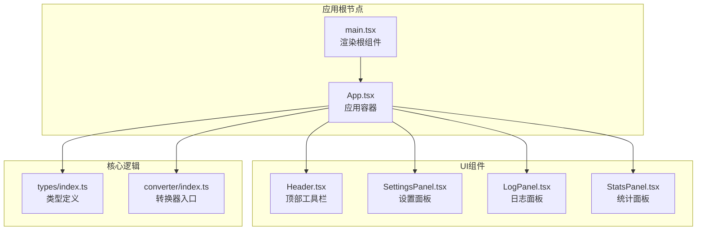
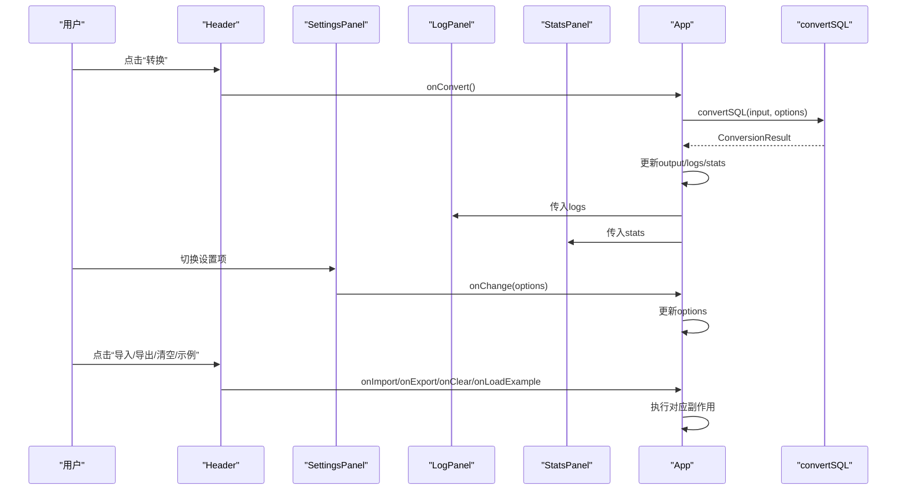
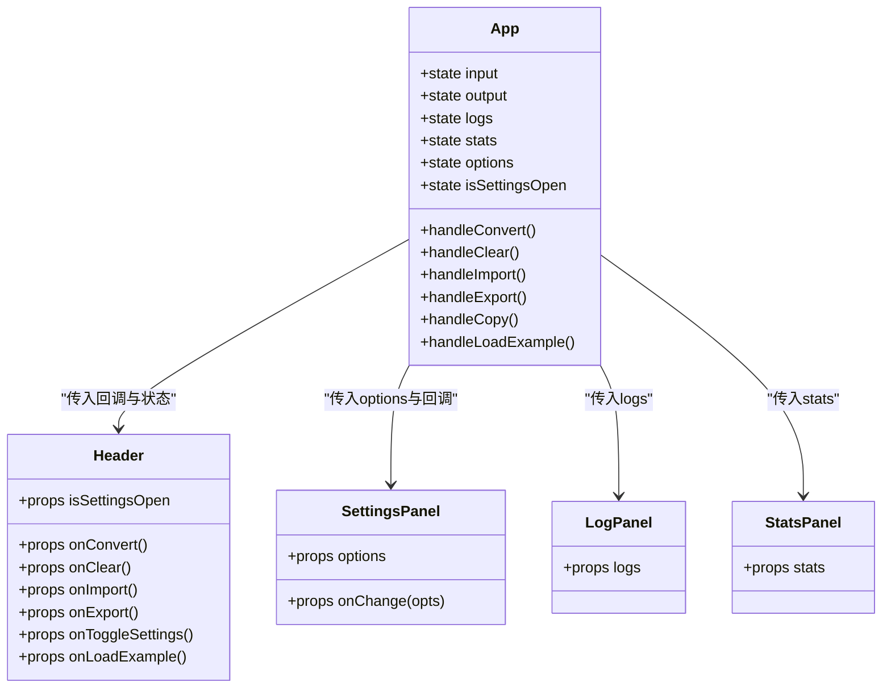

# 用户界面组件

<cite>
**本文引用的文件**
- [src/components/Header.tsx](file://src/components/Header.tsx)
- [src/components/SettingsPanel.tsx](file://src/components/SettingsPanel.tsx)
- [src/components/LogPanel.tsx](file://src/components/LogPanel.tsx)
- [src/components/StatsPanel.tsx](file://src/components/StatsPanel.tsx)
- [src/App.tsx](file://src/App.tsx)
- [src/types/index.ts](file://src/types/index.ts)
- [src/converter/index.ts](file://src/converter/index.ts)
- [src/index.css](file://src/index.css)
- [src/main.tsx](file://src/main.tsx)
</cite>

## 目录
1. [简介](#简介)
2. [项目结构](#项目结构)
3. [核心组件](#核心组件)
4. [架构总览](#架构总览)
5. [组件详细分析](#组件详细分析)
6. [依赖关系分析](#依赖关系分析)
7. [性能考量](#性能考量)
8. [故障排查指南](#故障排查指南)
9. [结论](#结论)
10. [附录](#附录)

## 简介
本文件面向SQL转换器的UI组件系统，聚焦四个核心React组件：Header、SettingsPanel、LogPanel与StatsPanel。文档从设计理念、功能特性、交互模式、状态管理、事件处理、类型接口、使用示例与定制化选项等维度进行全面阐述，并提供可操作的集成指南与故障排查建议，帮助开发者快速理解并扩展该UI体系。

## 项目结构
UI组件位于src/components目录下，配合App主容器、类型定义与转换器逻辑共同构成完整的前端应用。整体采用“容器-展示”分层：App负责状态与业务流程编排，各组件专注于UI呈现与交互。

图表来源
- [src/main.tsx:1-11](file://src/main.tsx#L1-L11)
- [src/App.tsx:1-282](file://src/App.tsx#L1-L282)
- [src/components/Header.tsx:1-93](file://src/components/Header.tsx#L1-L93)
- [src/components/SettingsPanel.tsx:1-100](file://src/components/SettingsPanel.tsx#L1-L100)
- [src/components/LogPanel.tsx:1-82](file://src/components/LogPanel.tsx#L1-L82)
- [src/components/StatsPanel.tsx:1-42](file://src/components/StatsPanel.tsx#L1-L42)
- [src/types/index.ts:1-44](file://src/types/index.ts#L1-L44)
- [src/converter/index.ts:1-129](file://src/converter/index.ts#L1-L129)

章节来源
- [src/main.tsx:1-11](file://src/main.tsx#L1-L11)
- [src/App.tsx:1-282](file://src/App.tsx#L1-L282)

## 核心组件
本节概述四个组件的职责边界与协作方式：
- Header：提供操作按钮、快捷键支持与导航提示，驱动转换、导入、导出、清空、示例加载与设置面板开关。
- SettingsPanel：集中管理转换选项，支持实时切换并回传至父容器，实现“所见即所得”的配置体验。
- LogPanel：按类型分类展示转换过程中的日志，支持详细信息与行号展示，便于问题定位。
- StatsPanel：汇总转换统计信息，直观呈现关键指标，辅助性能与质量评估。

章节来源
- [src/components/Header.tsx:1-93](file://src/components/Header.tsx#L1-L93)
- [src/components/SettingsPanel.tsx:1-100](file://src/components/SettingsPanel.tsx#L1-L100)
- [src/components/LogPanel.tsx:1-82](file://src/components/LogPanel.tsx#L1-L82)
- [src/components/StatsPanel.tsx:1-42](file://src/components/StatsPanel.tsx#L1-L42)

## 架构总览
下图展示了组件间的数据流与控制流：App作为状态中心，通过回调事件与props向下传递，完成从用户交互到转换执行再到结果反馈的闭环。

图表来源
- [src/App.tsx:67-135](file://src/App.tsx#L67-L135)
- [src/components/Header.tsx:13-92](file://src/components/Header.tsx#L13-L92)
- [src/components/SettingsPanel.tsx:41-99](file://src/components/SettingsPanel.tsx#L41-L99)
- [src/components/LogPanel.tsx:22-81](file://src/components/LogPanel.tsx#L22-L81)
- [src/components/StatsPanel.tsx:7-41](file://src/components/StatsPanel.tsx#L7-L41)
- [src/converter/index.ts:59-125](file://src/converter/index.ts#L59-L125)

## 组件详细分析

### Header 组件
- 设计理念
  - 顶部工具栏采用简洁布局，左侧品牌区突出产品定位，右侧操作区提供高频动作入口。
  - 通过按钮样式与图标结合，提升可读性与一致性。
- 功能特性
  - 操作按钮：加载示例、导入SQL文件、导出结果、清空、打开设置、开始转换。
  - 快捷键支持：支持 Ctrl/Cmd + Enter 触发转换。
  - 导航提示：按钮均带有title属性，增强可用性。
- 交互模式
  - 按钮点击事件通过props回调向上冒泡，由父容器App统一处理。
  - 设置按钮根据isSettingsOpen状态高亮，直观反映当前面板开合状态。
- Props接口
  - onConvert: 开始转换
  - onClear: 清空输入与输出
  - onImport: 触发文件选择
  - onExport: 导出结果为SQL文件
  - onToggleSettings: 切换设置面板开合
  - onLoadExample: 加载示例SQL
  - isSettingsOpen: 当前设置面板是否打开
- 事件处理与状态管理
  - Header不持有内部状态，完全受控于App。
  - 快捷键绑定在App中统一处理，Header仅负责展示与提示。
- 使用示例
  - 在App中将回调函数与状态布尔值传入Header，即可实现完整交互链路。
- 定制化选项
  - 可通过CSS变量调整颜色与尺寸，或替换图标库以适配品牌风格。

章节来源
- [src/components/Header.tsx:3-11](file://src/components/Header.tsx#L3-L11)
- [src/components/Header.tsx:13-92](file://src/components/Header.tsx#L13-L92)
- [src/App.tsx:125-135](file://src/App.tsx#L125-L135)

### SettingsPanel 组件
- 设计理念
  - 将复杂的转换选项抽象为一组可复选的开关项，提供简明的说明与默认行为。
  - 采用内联样式的可控面板，避免引入额外的UI框架依赖。
- 功能特性
  - 选项覆盖：IDENTITY替代SEQUENCE、生成SEQUENCE+NEXTVAL、生成更新触发器、转换表注释、移除ENGINE/CHARSET、保留原始大小写。
  - 实时预览：每次切换立即回传至父容器，无需额外确认。
- 交互模式
  - 内部Checkbox子组件封装了label、图标与说明文本，统一交互体验。
  - 通过onChange回调将变更合并到options对象并上抛。
- Props接口
  - options: 当前转换选项对象
  - onChange: 处理选项变更的回调
- 事件处理与状态管理
  - SettingsPanel内部维护切换逻辑，不直接修改外部状态，确保单向数据流。
  - App侧接收变更后更新全局options，影响后续转换结果。
- 使用示例
  - 在App中将DEFAULT_OPTIONS作为初始值，通过setOptions接收变更并传入组件。
- 定制化选项
  - 可新增或删除选项条目，需同步更新types中的ConverterOptions与DEFAULT_OPTIONS。

章节来源
- [src/components/SettingsPanel.tsx:3-6](file://src/components/SettingsPanel.tsx#L3-L6)
- [src/components/SettingsPanel.tsx:15-39](file://src/components/SettingsPanel.tsx#L15-L39)
- [src/components/SettingsPanel.tsx:41-99](file://src/components/SettingsPanel.tsx#L41-L99)
- [src/types/index.ts:25-43](file://src/types/index.ts#L25-L43)

### LogPanel 组件
- 设计理念
  - 以“类型-图标-消息-详情-行号”的结构化卡片展示日志，便于快速识别问题类型与上下文。
  - 通过边框色与背景色区分不同类型，提升可读性。
- 功能特性
  - 分类样式：info/warning/error/success四类图标与边框色映射。
  - 详细信息：支持展示detail字段的详细内容，适合技术细节与上下文。
  - 行号展示：对涉及具体行号的日志显示行号，便于定位。
- 交互模式
  - 作为纯展示组件，不产生用户交互，仅消费logs数组。
- Props接口
  - logs: 日志数组，每条包含type/message/line/detail
- 事件处理与状态管理
  - 不持有内部状态，完全受控于App。
- 使用示例
  - 在App中将convertSQL返回的logs传入LogPanel，即可自动渲染。
- 定制化选项
  - 可扩展更多日志类型与映射，或增加筛选/排序能力。

章节来源
- [src/components/LogPanel.tsx:4-6](file://src/components/LogPanel.tsx#L4-L6)
- [src/components/LogPanel.tsx:8-20](file://src/components/LogPanel.tsx#L8-L20)
- [src/components/LogPanel.tsx:22-81](file://src/components/LogPanel.tsx#L22-L81)
- [src/types/index.ts:1-6](file://src/types/index.ts#L1-L6)

### StatsPanel 组件
- 设计理念
  - 以紧凑的水平布局展示关键统计指标，强调可读性与对比度。
  - 通过不同颜色区分指标类型，形成视觉层次。
- 功能特性
  - 指标覆盖：总语句数、已转换语句数、警告数、错误数、数据类型转换数、自增转换数、注释转换数。
  - 数字格式：使用等宽数字字体，便于快速比较数值大小。
- 交互模式
  - 展示型组件，无交互。
- Props接口
  - stats: ConversionStats对象
- 事件处理与状态管理
  - 不持有内部状态，完全受控于App。
- 使用示例
  - 在App中将convertSQL返回的stats传入StatsPanel，即可自动渲染。
- 定制化选项
  - 可新增指标项，需同步更新类型定义与计算逻辑。

章节来源
- [src/components/StatsPanel.tsx:3-5](file://src/components/StatsPanel.tsx#L3-L5)
- [src/components/StatsPanel.tsx:7-41](file://src/components/StatsPanel.tsx#L7-L41)
- [src/types/index.ts:15-23](file://src/types/index.ts#L15-L23)

## 依赖关系分析
- 组件耦合
  - Header与App：Header仅通过回调与布尔值与App交互，耦合度低。
  - SettingsPanel与App：双向数据流，SettingsPanel只负责变更回传，App负责状态更新。
  - LogPanel与StatsPanel：均消费来自App的状态，彼此独立。
- 外部依赖
  - 图标库：lucide-react，用于按钮与状态图标。
  - 编辑器：@monaco-editor/react，提供代码编辑与高亮。
  - 类型系统：src/types/index.ts定义了日志、统计与选项的完整类型。
- 接口契约
  - Header的回调签名与App的处理函数严格匹配。
  - SettingsPanel的onChange签名与App的setOptions一致。
  - LogPanel与StatsPanel的props均为只读数组/对象，符合纯展示组件原则。

图表来源
- [src/App.tsx:56-167](file://src/App.tsx#L56-L167)
- [src/components/Header.tsx:13-21](file://src/components/Header.tsx#L13-L21)
- [src/components/SettingsPanel.tsx:41-44](file://src/components/SettingsPanel.tsx#L41-L44)
- [src/components/LogPanel.tsx:22-23](file://src/components/LogPanel.tsx#L22-L23)
- [src/components/StatsPanel.tsx:7-8](file://src/components/StatsPanel.tsx#L7-L8)

## 性能考量
- 渲染优化
  - Header与LogPanel、StatsPanel均为轻量展示组件，避免不必要的重渲染。
  - App通过useCallback缓存回调，减少子组件重复渲染。
- 数据规模
  - 日志与统计数组在大量转换场景下可能增长，建议在UI层面做虚拟滚动或分页展示（当前版本未实现）。
- 计算复杂度
  - 转换主流程在convertSQL中执行，组件层尽量保持纯函数式渲染，避免在渲染阶段进行重型计算。
- 资源占用
  - Monaco编辑器在大文件场景下内存占用较高，可通过限制文件大小或分段处理缓解。

## 故障排查指南
- 无法导出结果
  - 现象：点击导出按钮后无响应或无日志提示。
  - 排查：检查输出是否为空，App会记录“输出为空，无法导出”的警告日志。
  - 处置：先执行转换，再尝试导出。
- 快捷键无效
  - 现象：按下 Ctrl/Cmd + Enter 无反应。
  - 排查：确认键盘事件监听是否生效，以及焦点是否在页面上。
  - 处置：重新聚焦页面或刷新浏览器。
- 设置项未生效
  - 现象：切换设置后转换结果未变化。
  - 排查：确认SettingsPanel的onChange是否正确回传至App，App是否更新options。
  - 处置：检查组件props传递与回调调用链。
- 日志未显示
  - 现象：转换完成后日志面板空白。
  - 排查：确认App是否将logs传入LogPanel，面板是否处于展开状态。
  - 处置：展开日志面板或将日志数组打印到控制台调试。

章节来源
- [src/App.tsx:98-111](file://src/App.tsx#L98-L111)
- [src/App.tsx:125-135](file://src/App.tsx#L125-L135)
- [src/App.tsx:165-167](file://src/App.tsx#L165-L167)
- [src/components/LogPanel.tsx:23-35](file://src/components/LogPanel.tsx#L23-L35)

## 结论
本UI组件体系以清晰的职责划分与受控数据流为核心，Header提供高效操作入口，SettingsPanel实现灵活配置，LogPanel与StatsPanel分别承担过程与结果的可视化反馈。通过类型系统与回调契约，组件间耦合度低、扩展性强，适合进一步迭代与定制。

## 附录

### 类型接口定义
- ConversionLog：日志条目，包含类型、消息、可选行号与详细信息。
- ConversionStats：转换统计，包含各类计数指标。
- ConverterOptions：转换选项，涵盖多种转换策略与兼容性设置。
- DEFAULT_OPTIONS：默认选项集合，作为初始状态。

章节来源
- [src/types/index.ts:1-44](file://src/types/index.ts#L1-L44)

### 转换流程与数据流
- App收集用户输入与设置，调用convertSQL执行转换，得到输出、日志与统计。
- App将结果分发给LogPanel与StatsPanel进行展示。
- Header与SettingsPanel通过回调与状态控制整体交互。

章节来源
- [src/App.tsx:67-72](file://src/App.tsx#L67-L72)
- [src/converter/index.ts:59-125](file://src/converter/index.ts#L59-L125)

### 集成指南
- 引入组件
  - 在App中引入Header、SettingsPanel、LogPanel、StatsPanel。
  - 将状态与回调通过props传入各组件。
- 自定义样式
  - 通过CSS变量调整主题色与尺寸，确保与整体设计一致。
- 新增设置项
  - 在types中扩展ConverterOptions与DEFAULT_OPTIONS。
  - 在SettingsPanel中添加新的Checkbox项并绑定onChange。
- 新增日志类型
  - 在types中扩展ConversionLog的type枚举。
  - 在LogPanel中添加对应图标与边框色映射。
- 新增统计指标
  - 在types中扩展ConversionStats。
  - 在StatsPanel中添加新指标项并更新渲染逻辑。

章节来源
- [src/types/index.ts:25-43](file://src/types/index.ts#L25-L43)
- [src/components/SettingsPanel.tsx:41-99](file://src/components/SettingsPanel.tsx#L41-L99)
- [src/components/LogPanel.tsx:8-20](file://src/components/LogPanel.tsx#L8-L20)
- [src/components/StatsPanel.tsx:7-16](file://src/components/StatsPanel.tsx#L7-L16)