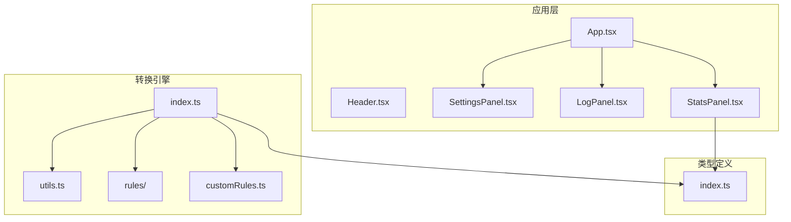
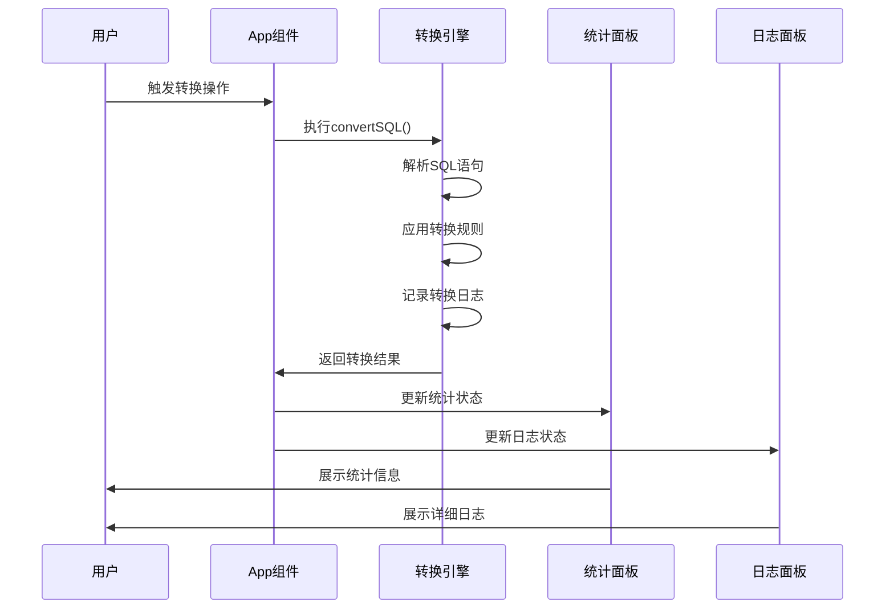
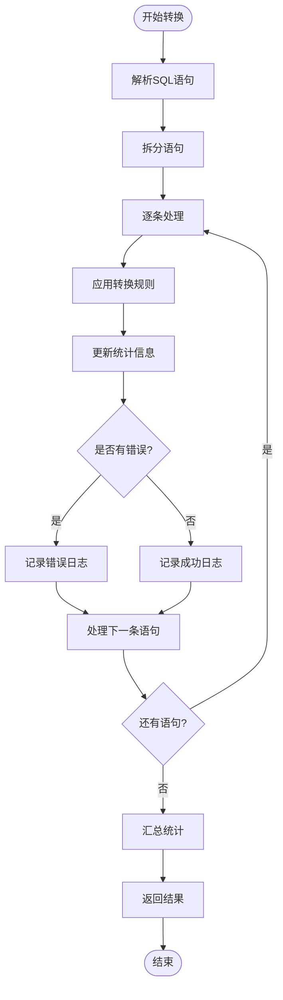
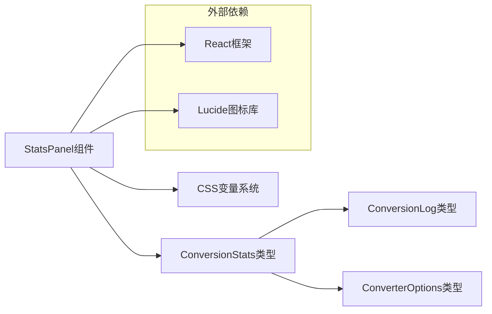

# 统计面板组件

<cite>
**本文档引用的文件**
- [StatsPanel.tsx](file://src/components/StatsPanel.tsx)
- [index.ts](file://src/converter/index.ts)
- [index.ts](file://src/types/index.ts)
- [App.tsx](file://src/App.tsx)
- [README.md](file://README.md)
- [utils.ts](file://src/converter/utils.ts)
- [LogPanel.tsx](file://src/components/LogPanel.tsx)
- [SettingsPanel.tsx](file://src/components/SettingsPanel.tsx)
- [dataTypes.ts](file://src/converter/rules/dataTypes.ts)
- [customRules.ts](file://src/converter/customRules.ts)
</cite>

## 目录
1. [简介](#简介)
2. [项目结构](#项目结构)
3. [核心组件](#核心组件)
4. [架构概览](#架构概览)
5. [详细组件分析](#详细组件分析)
6. [依赖关系分析](#依赖关系分析)
7. [性能考量](#性能考量)
8. [故障排除指南](#故障排除指南)
9. [结论](#结论)
10. [附录](#附录)

## 简介

StatsPanel统计面板组件是SQL转换器应用中的关键可视化组件，专门用于展示MySQL到Oracle语法转换过程中的各项统计指标。该组件采用现代化的前端技术栈构建，提供了直观的统计数据展示界面，帮助用户实时了解转换过程的状态和质量。

该项目专注于OceanBase MySQL模式向OceanBase Oracle模式的迁移与适配场景，采用React 19 + TypeScript + Vite + Monaco Editor的技术架构，实现了转换逻辑与UI交互的清晰分离，便于维护与扩展。

## 项目结构

项目采用模块化的文件组织方式，核心组件位于`src/components/`目录下，转换逻辑位于`src/converter/`目录中，类型定义位于`src/types/`目录中。



**图表来源**
- [App.tsx:1-282](file://src/App.tsx#L1-L282)
- [StatsPanel.tsx:1-42](file://src/components/StatsPanel.tsx#L1-L42)
- [index.ts:1-129](file://src/converter/index.ts#L1-L129)

**章节来源**
- [README.md:1-12](file://README.md#L1-L12)
- [App.tsx:137-281](file://src/App.tsx#L137-L281)

## 核心组件

StatsPanel组件作为统计信息的可视化展示层，承担着以下核心职责：

### 组件架构设计

组件采用简洁的响应式布局设计，通过CSS变量实现主题一致性，支持多种颜色方案来区分不同类型的统计指标。

### 数据展示策略

组件内部维护了一个包含7个核心指标的统计项数组，每个指标都配置了相应的颜色方案和标签：

- 总语句数：统计输入SQL中解析出的语句总数
- 已转换：成功转换的语句数量
- 警告：转换过程中产生的警告数量
- 错误：转换失败的数量
- 类型转换：数据类型转换的次数
- 自增转换：自增列转换的次数
- 注释转换：注释转换的次数

**章节来源**
- [StatsPanel.tsx:7-16](file://src/components/StatsPanel.tsx#L7-L16)
- [StatsPanel.tsx:18-40](file://src/components/StatsPanel.tsx#L18-L40)

## 架构概览

StatsPanel组件在整个应用架构中扮演着重要的数据可视化角色，与转换引擎和应用状态管理紧密协作。



**图表来源**
- [App.tsx:67-72](file://src/App.tsx#L67-L72)
- [index.ts:59-125](file://src/converter/index.ts#L59-L125)

### 组件间协作关系

StatsPanel组件通过props接收来自App组件的统计状态，在转换操作完成后实时更新显示内容。组件设计遵循单一职责原则，专注于数据展示而非业务逻辑处理。

**章节来源**
- [App.tsx:275](file://src/App.tsx#L275)
- [StatsPanel.tsx:3-5](file://src/components/StatsPanel.tsx#L3-L5)

## 详细组件分析

### 统计指标收集机制

统计信息的收集贯穿整个转换流程，从SQL语句解析到最终结果返回，每个环节都会产生相应的统计数据。

#### 转换统计信息的生成

转换引擎在执行转换过程中，会维护一个完整的统计对象，包含以下关键指标：



**图表来源**
- [index.ts:59-125](file://src/converter/index.ts#L59-L125)

#### 统计指标的计算方法

统计指标的计算采用增量更新的方式，确保数据的准确性和实时性：

1. **总语句数**：通过语句拆分函数获取的语句数组长度
2. **已转换语句数**：成功转换并输出的语句数量
3. **警告数量**：日志中类型为warning的条目数量
4. **错误数量**：日志中类型为error的条目数量
5. **类型转换次数**：通过检查日志消息中包含"数据类型"关键词的次数
6. **自增转换次数**：通过检查日志消息中包含"AUTO_INCREMENT"或"SEQUENCE"关键词的次数
7. **注释转换次数**：通过检查日志消息中包含"COMMENT"关键词的次数

**章节来源**
- [index.ts:61-69](file://src/converter/index.ts#L61-L69)
- [index.ts:113-117](file://src/converter/index.ts#L113-L117)

### 数据可视化实现

StatsPanel组件采用简洁而高效的可视化设计方案，通过CSS变量实现主题一致性和动态样式调整。

#### 视觉设计特点

组件使用统一的间距和字体规范，确保在不同屏幕尺寸下的良好显示效果：

- **布局**：采用flex布局，支持水平排列和自动换行
- **间距**：固定16px的元素间距，确保视觉平衡
- **字体**：12px的基础字号，700的字重，使用等宽数字格式
- **颜色**：通过CSS变量实现主题色系，支持不同状态的颜色区分

#### 实时更新机制

组件通过React的props传递实现数据的实时更新，当App组件中的统计状态发生变化时，组件会自动重新渲染以反映最新的统计信息。

**章节来源**
- [StatsPanel.tsx:18-40](file://src/components/StatsPanel.tsx#L18-L40)

### 性能监控功能

虽然StatsPanel组件本身不直接执行性能监控，但它展示了转换过程中的关键性能指标，为用户提供了转换效率的直观反馈。

#### 性能指标展示

组件展示的统计信息间接反映了转换过程的性能特征：

- **转换速度**：通过"总语句数"和"已转换语句数"的比例反映转换效率
- **资源消耗**：通过错误率和警告率反映转换过程的稳定性
- **处理质量**：通过不同类型转换的统计数量反映转换准确性

#### 大数据量处理优化

对于大量SQL语句的处理，组件通过以下方式优化用户体验：

- **增量更新**：只更新变化的统计项，减少不必要的重渲染
- **响应式布局**：适应不同数量级的统计信息显示
- **颜色编码**：通过不同的颜色快速识别统计状态

**章节来源**
- [StatsPanel.tsx:7-16](file://src/components/StatsPanel.tsx#L7-L16)

### 数据可视化功能

StatsPanel组件提供了基础的数值展示功能，虽然不是复杂的数据可视化图表，但通过合理的颜色编码和布局设计实现了有效的信息传达。

#### 图表展示能力

组件目前支持以下展示形式：

- **数值显示**：以大字体显示具体的统计数值
- **颜色编码**：不同状态使用不同的颜色标识
- **标签说明**：每个数值都有明确的标签说明
- **等宽数字**：使用等宽字体确保数值对齐

#### 趋势分析支持

虽然组件本身不提供趋势图表，但通过持续的统计更新，用户可以观察到转换过程中的趋势变化：

- **错误趋势**：观察错误数量的变化趋势
- **转换效率**：通过转换率的变化评估转换效率
- **类型转换分布**：通过不同类型转换数量的对比分析

**章节来源**
- [StatsPanel.tsx:31-38](file://src/components/StatsPanel.tsx#L31-L38)

## 依赖关系分析

StatsPanel组件的依赖关系相对简单，主要依赖于类型定义和应用状态管理。



**图表来源**
- [StatsPanel.tsx:1](file://src/components/StatsPanel.tsx#L1)
- [index.ts:15-23](file://src/types/index.ts#L15-L23)

### 组件耦合度分析

StatsPanel组件具有较低的耦合度，主要体现在：

- **单一职责**：专注于统计信息展示，不涉及业务逻辑
- **接口清晰**：通过props接收数据，避免直接访问应用状态
- **类型安全**：使用TypeScript接口确保数据结构的正确性
- **主题独立**：通过CSS变量实现主题解耦

**章节来源**
- [StatsPanel.tsx:3-5](file://src/components/StatsPanel.tsx#L3-L5)
- [index.ts:15-23](file://src/types/index.ts#L15-L23)

## 性能考量

StatsPanel组件在设计时充分考虑了性能优化，采用了多项措施确保在大数据量场景下的流畅运行。

### 渲染性能优化

组件采用以下策略优化渲染性能：

- **最小化重渲染**：只有当统计状态发生变化时才重新渲染
- **高效布局**：使用flex布局减少布局计算开销
- **CSS变量**：通过CSS变量实现样式切换，避免JavaScript DOM操作
- **等宽字体**：使用等宽数字确保布局稳定，减少重排

### 内存使用优化

组件的内存使用量与统计项数量成正比，通过以下方式控制内存占用：

- **固定数量的统计项**：始终维护7个固定的统计项
- **轻量级数据结构**：使用简单的对象数组存储统计信息
- **无状态设计**：组件本身不维护额外的状态数据

### 大数据量处理

对于包含大量统计信息的场景，组件通过以下方式保持性能：

- **虚拟滚动**：虽然当前版本不适用，但设计上预留了扩展空间
- **增量更新**：只更新变化的部分，避免全量重绘
- **响应式设计**：适应不同数量级的数据显示需求

## 故障排除指南

在使用StatsPanel组件时，可能会遇到以下常见问题及其解决方案：

### 统计信息不更新

**问题描述**：点击转换按钮后，统计面板没有更新显示新的统计数据。

**可能原因**：
1. App组件没有正确调用转换函数
2. 转换结果中的stats对象为空或未正确传递
3. Props传递过程中出现数据丢失

**解决方案**：
1. 检查App组件中的handleConvert函数是否正确调用convertSQL
2. 确认转换结果的stats字段是否正确填充
3. 验证Props传递链路的完整性

**章节来源**
- [App.tsx:67-72](file://src/App.tsx#L67-L72)

### 统计数值显示异常

**问题描述**：统计面板显示的数值与预期不符。

**可能原因**：
1. 统计计算逻辑错误
2. 日志消息格式变化导致统计解析失败
3. 数据类型转换错误

**解决方案**：
1. 检查转换引擎中的统计计算逻辑
2. 验证日志消息格式的一致性
3. 确认数据类型转换的正确性

**章节来源**
- [index.ts:113-117](file://src/converter/index.ts#L113-L117)

### 样式显示问题

**问题描述**：统计面板的样式显示不符合预期。

**可能原因**：
1. CSS变量未正确配置
2. 主题切换时样式未更新
3. 响应式布局适配问题

**解决方案**：
1. 检查CSS变量的定义和作用域
2. 确认主题切换时的样式更新机制
3. 验证不同屏幕尺寸下的布局适配

## 结论

StatsPanel统计面板组件作为SQL转换器应用的重要组成部分，通过简洁而高效的实现方式，为用户提供了直观的转换过程可视化体验。组件设计遵循了现代前端开发的最佳实践，具有以下显著特点：

### 设计优势

1. **职责单一**：专注于统计信息展示，避免了功能冗余
2. **性能优化**：采用增量更新和高效布局，确保流畅的用户体验
3. **主题友好**：通过CSS变量实现主题解耦，支持多种视觉风格
4. **类型安全**：使用TypeScript确保数据结构的正确性

### 技术特色

1. **实时更新**：通过React的props机制实现实时数据同步
2. **颜色编码**：通过不同的颜色快速识别统计状态
3. **响应式设计**：适应不同设备和屏幕尺寸
4. **易于扩展**：为未来添加更复杂的可视化功能预留了空间

### 应用价值

StatsPanel组件不仅提供了当前的统计信息展示功能，更重要的是为整个SQL转换器应用建立了良好的用户体验基础。通过直观的统计信息展示，用户可以更好地理解转换过程的质量和效率，为数据库迁移任务的成功完成提供了有力支持。

## 附录

### 组件使用示例

#### 基本使用方式

```typescript
// 在App组件中使用
<StatsPanel stats={stats} />
```

#### 集成统计数据

组件通过props接收统计状态，需要确保传入的数据结构符合ConversionStats接口定义。

#### 自定义统计维度

虽然当前版本支持7个固定的统计维度，但组件设计允许在未来添加新的统计维度，只需：

1. 在类型定义中添加新的属性
2. 在转换引擎中计算新的统计值
3. 在组件中添加对应的显示逻辑

### 性能优化建议

1. **批量更新**：对于频繁更新的场景，考虑使用防抖机制
2. **虚拟化**：对于大量统计项的场景，考虑实现虚拟化列表
3. **缓存策略**：对于重复计算的统计值，考虑实现缓存机制
4. **懒加载**：对于复杂的可视化图表，考虑实现懒加载