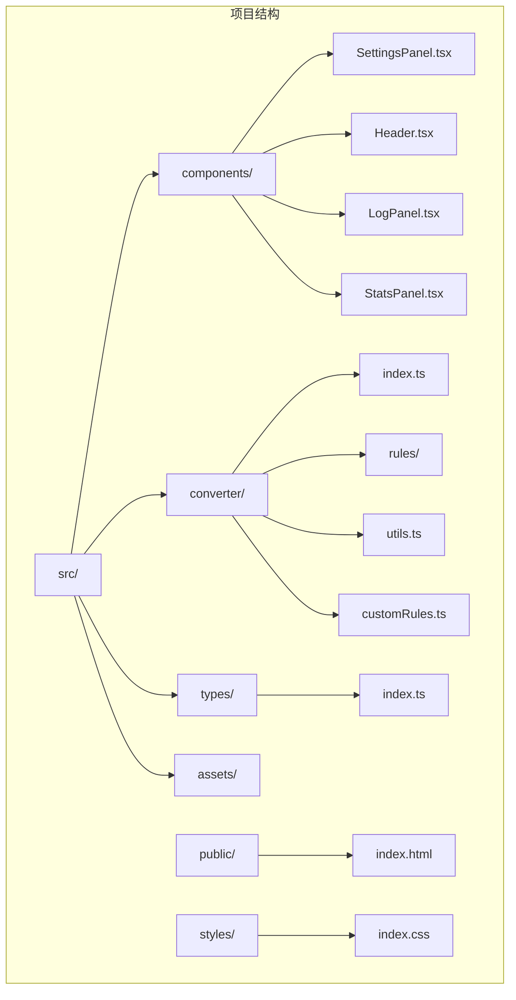
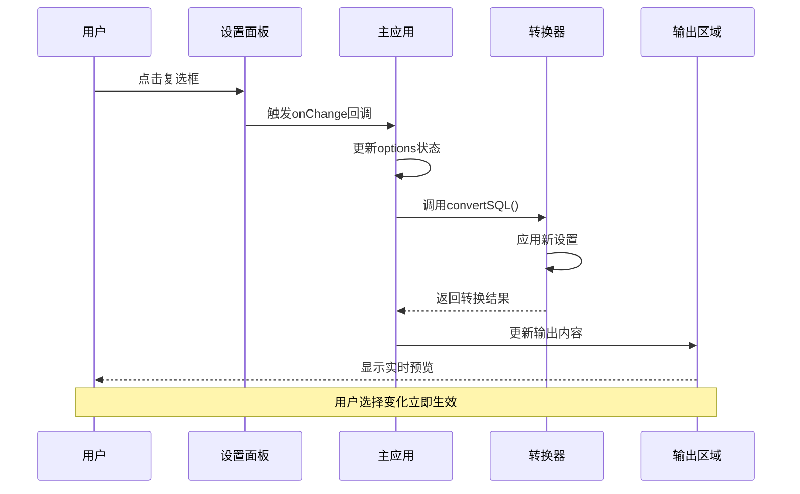
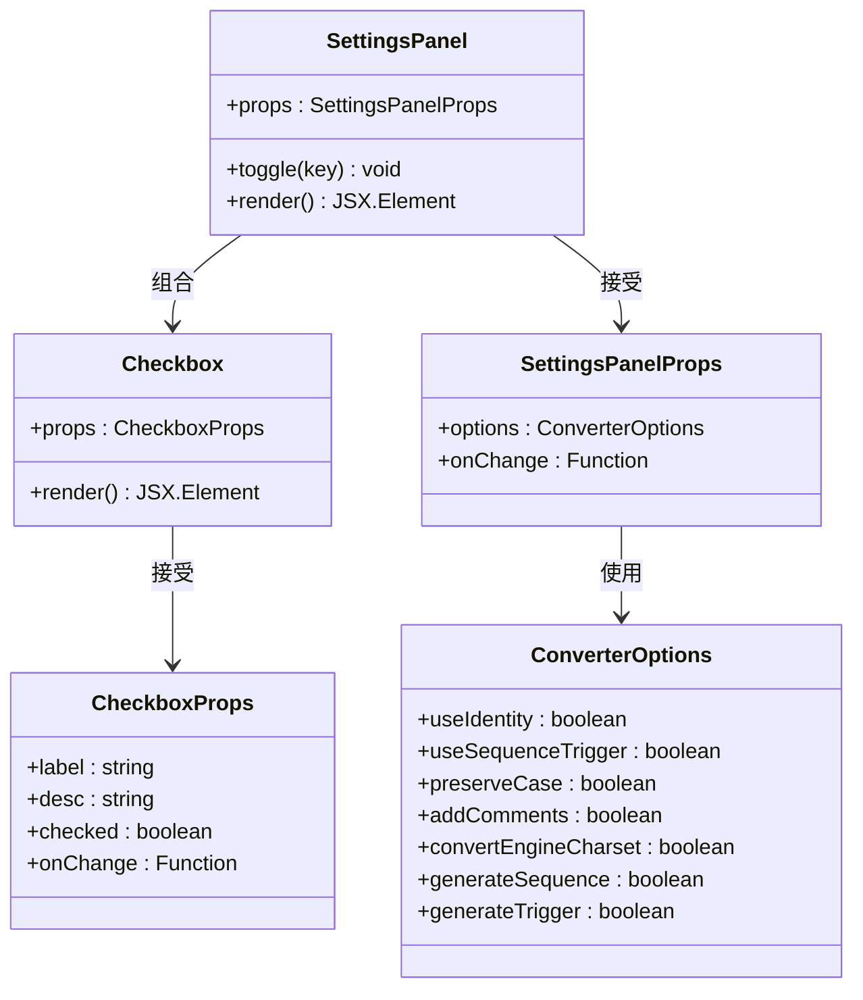
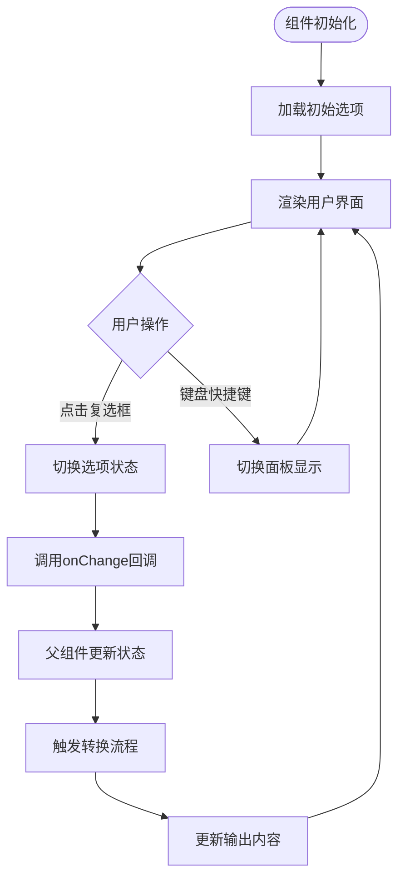
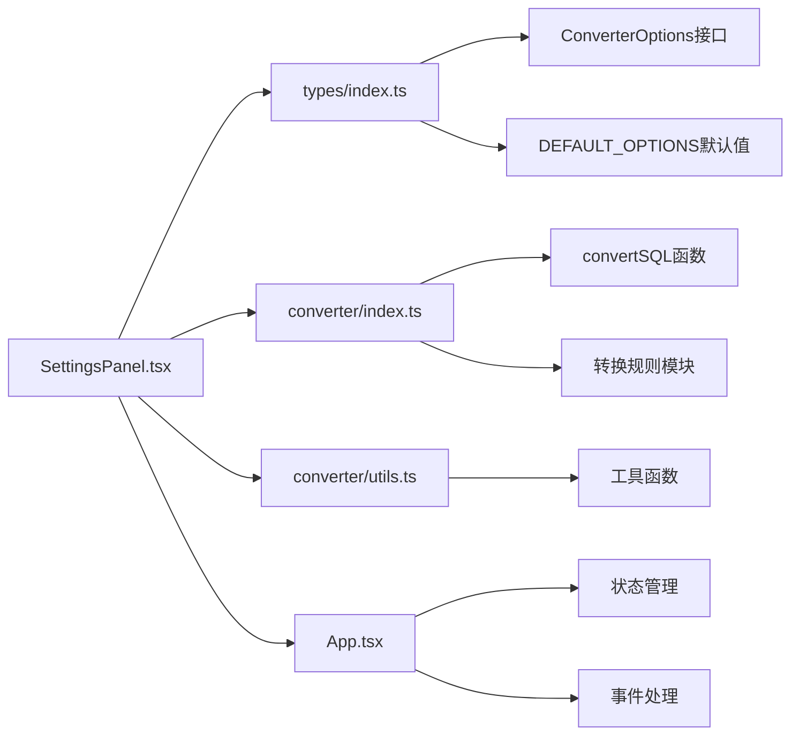

# 设置面板组件

<cite>
**本文档引用的文件**
- [SettingsPanel.tsx](file://src/components/SettingsPanel.tsx)
- [App.tsx](file://src/App.tsx)
- [types/index.ts](file://src/types/index.ts)
- [converter/index.ts](file://src/converter/index.ts)
- [converter/utils.ts](file://src/converter/utils.ts)
- [index.css](file://src/index.css)
- [Header.tsx](file://src/components/Header.tsx)
- [LogPanel.tsx](file://src/components/LogPanel.tsx)
- [StatsPanel.tsx](file://src/components/StatsPanel.tsx)
</cite>

## 目录
1. [简介](#简介)
2. [项目结构](#项目结构)
3. [核心组件](#核心组件)
4. [架构概览](#架构概览)
5. [详细组件分析](#详细组件分析)
6. [依赖关系分析](#依赖关系分析)
7. [性能考虑](#性能考虑)
8. [故障排除指南](#故障排除指南)
9. [结论](#结论)
10. [附录](#附录)

## 简介

设置面板组件是 SQL 语法转换器应用中的关键配置界面，负责管理用户偏好设置并实时影响转换行为。该组件提供了直观的图形化界面，允许用户通过复选框选择不同的转换选项，每个选项都会立即反映到转换过程中。

设置面板的设计目的是为用户提供细粒度的控制能力，使他们能够根据特定的数据库需求定制转换行为。组件采用响应式设计，支持在不同屏幕尺寸下良好显示，并与主应用的其他组件无缝集成。

## 项目结构

设置面板组件位于组件目录中，与其他UI组件共同构成应用程序的用户界面层。整个项目采用模块化的架构设计，将功能按职责分离到不同的模块中。

**图表来源**
- [SettingsPanel.tsx:1-100](file://src/components/SettingsPanel.tsx#L1-L100)
- [App.tsx:1-282](file://src/App.tsx#L1-L282)

**章节来源**
- [SettingsPanel.tsx:1-100](file://src/components/SettingsPanel.tsx#L1-L100)
- [App.tsx:1-282](file://src/App.tsx#L1-L282)

## 核心组件

设置面板组件的核心功能围绕着以下关键特性构建：

### 设计目的
- 提供用户友好的配置界面
- 实时反映用户选择对转换过程的影响
- 支持多种数据库转换场景的灵活配置

### 功能特性
- **即时预览**：用户选择会立即触发转换，实时显示效果
- **完整覆盖**：涵盖所有主要的转换选项
- **直观交互**：清晰的标签和描述说明每个选项的作用
- **响应式布局**：适配不同屏幕尺寸和设备

### 用户交互模式
- **点击切换**：通过复选框快速切换设置
- **悬停反馈**：提供视觉反馈增强用户体验
- **状态指示**：通过边框和颜色区分不同状态

**章节来源**
- [SettingsPanel.tsx:41-99](file://src/components/SettingsPanel.tsx#L41-L99)
- [types/index.ts:25-43](file://src/types/index.ts#L25-L43)

## 架构概览

设置面板组件在整个应用架构中扮演着重要的配置管理角色，它与主应用组件紧密协作，形成完整的转换工作流。

**图表来源**
- [SettingsPanel.tsx:41-44](file://src/components/SettingsPanel.tsx#L41-L44)
- [App.tsx:67-72](file://src/App.tsx#L67-L72)
- [converter/index.ts:59-125](file://src/converter/index.ts#L59-L125)

## 详细组件分析

### 组件结构设计

设置面板采用简洁而高效的组件结构，通过组合模式将多个小的复选框组件组合成完整的设置界面。

**图表来源**
- [SettingsPanel.tsx:3-6](file://src/components/SettingsPanel.tsx#L3-L6)
- [SettingsPanel.tsx:8-13](file://src/components/SettingsPanel.tsx#L8-L13)
- [types/index.ts:25-43](file://src/types/index.ts#L25-L43)

### 配置选项详解

设置面板提供了七个关键的转换配置选项，每个选项都针对特定的数据库转换需求：

#### 1. 使用 IDENTITY 替代 SEQUENCE
- **作用**：在 Oracle 12c+ 环境中使用 IDENTITY 关键字替代传统的 SEQUENCE 方式
- **适用场景**：现代 Oracle 数据库环境
- **技术实现**：通过 `useIdentity` 选项控制转换逻辑

#### 2. 生成 SEQUENCE + NEXTVAL
- **作用**：为 AUTO_INCREMENT 列创建对应的序列并设置默认值
- **适用场景**：需要兼容传统 Oracle 序列机制的环境
- **技术实现**：通过 `useSequenceTrigger` 选项启用

#### 3. 生成更新触发器
- **作用**：为 ON UPDATE CURRENT_TIMESTAMP 属性生成相应的触发器
- **适用场景**：需要维护自动更新时间戳的表结构
- **技术实现**：通过 `generateTrigger` 选项控制

#### 4. 转换表注释
- **作用**：将 MySQL 的 COMMENT 语法转换为 Oracle 的 COMMENT ON 语法
- **适用场景**：需要保留和转换表结构注释
- **技术实现**：通过 `addComments` 选项启用

#### 5. 移除 ENGINE/CHARSET
- **作用**：移除 MySQL 特有的表选项，确保 Oracle 兼容性
- **适用场景**：纯 Oracle 环境部署
- **技术实现**：通过 `convertEngineCharset` 选项控制

#### 6. 保留原始大小写
- **作用**：使用双引号包裹标识符以保留原始大小写
- **适用场景**：需要严格保持标识符大小写的环境
- **技术实现**：通过 `preserveCase` 选项启用

**章节来源**
- [SettingsPanel.tsx:60-95](file://src/components/SettingsPanel.tsx#L60-L95)
- [types/index.ts:25-43](file://src/types/index.ts#L25-L43)

### 状态管理机制

设置面板采用 React 的函数组件模式，通过 props 和回调函数实现状态管理：

**图表来源**
- [SettingsPanel.tsx:41-44](file://src/components/SettingsPanel.tsx#L41-L44)
- [App.tsx:165-167](file://src/App.tsx#L165-L167)

### 实时预览实现机制

设置面板的实时预览功能通过以下机制实现：

1. **状态传递**：设置面板接收当前选项并通过回调函数通知父组件
2. **转换触发**：父组件在选项变化时重新执行转换逻辑
3. **结果更新**：转换结果通过状态管理更新到输出区域

这种设计确保了用户每次修改都能立即看到效果，提供了流畅的用户体验。

**章节来源**
- [SettingsPanel.tsx:41-44](file://src/components/SettingsPanel.tsx#L41-L44)
- [App.tsx:67-72](file://src/App.tsx#L67-L72)

### 样式设计与响应式布局

设置面板采用现代化的CSS变量系统，实现了统一的视觉风格和良好的响应式表现：

#### 设计原则
- **深色主题**：使用深色背景配合高对比度元素
- **一致的间距**：统一的边距和内边距规范
- **可访问性**：充足的色彩对比度和清晰的视觉层次

#### 响应式特性
- **固定定位**：使用绝对定位确保面板在视口中的稳定位置
- **弹性布局**：支持不同屏幕尺寸下的自适应调整
- **触摸友好**：适当的点击区域大小便于移动设备操作

**章节来源**
- [SettingsPanel.tsx:47-56](file://src/components/SettingsPanel.tsx#L47-L56)
- [index.css:1-19](file://src/index.css#L1-L19)

## 依赖关系分析

设置面板组件的依赖关系相对简洁，主要依赖于类型定义和转换逻辑：

**图表来源**
- [SettingsPanel.tsx:1-6](file://src/components/SettingsPanel.tsx#L1-L6)
- [types/index.ts:25-43](file://src/types/index.ts#L25-L43)
- [converter/index.ts:1-129](file://src/converter/index.ts#L1-L129)

### 外部依赖

设置面板组件对外部依赖的管理遵循最小化原则：

- **React**：用于组件开发和状态管理
- **类型定义**：确保类型安全和更好的开发体验
- **CSS变量**：提供统一的主题管理和样式定制

**章节来源**
- [SettingsPanel.tsx:1-6](file://src/components/SettingsPanel.tsx#L1-L6)
- [types/index.ts:1-44](file://src/types/index.ts#L1-L44)

## 性能考虑

设置面板组件在设计时充分考虑了性能优化：

### 渲染优化
- **最小化重渲染**：通过精确的状态更新减少不必要的组件重渲染
- **高效的数据结构**：使用简单的布尔值存储配置选项
- **内存效率**：避免创建不必要的中间对象

### 交互响应性
- **即时反馈**：用户操作后立即得到视觉反馈
- **流畅动画**：使用CSS过渡效果提升用户体验
- **键盘支持**：支持键盘快捷键提高操作效率

## 故障排除指南

### 常见问题及解决方案

#### 设置不生效
**症状**：更改设置后转换结果没有变化
**原因**：状态更新未正确传递到转换逻辑
**解决方法**：检查父组件的状态管理逻辑，确保选项变更正确传递

#### 样式显示异常
**症状**：设置面板样式错乱或显示不正确
**原因**：CSS变量未正确配置或样式冲突
**解决方法**：检查根元素的CSS变量定义，确认样式优先级

#### 性能问题
**症状**：大量设置操作导致界面卡顿
**原因**：频繁的状态更新触发过多的重渲染
**解决方法**：优化状态更新策略，考虑使用防抖机制

**章节来源**
- [SettingsPanel.tsx:41-99](file://src/components/SettingsPanel.tsx#L41-L99)
- [App.tsx:67-72](file://src/App.tsx#L67-L72)

## 结论

设置面板组件作为SQL转换器应用的重要组成部分，成功地实现了用户友好的配置界面和实时的转换预览功能。组件设计简洁高效，通过合理的架构分离和状态管理，为用户提供了灵活且直观的配置体验。

组件的主要优势包括：
- **直观易用**：清晰的选项分类和描述说明
- **实时反馈**：即时的转换结果显示
- **性能优秀**：高效的渲染和状态管理
- **扩展性强**：易于添加新的配置选项

未来可以考虑的功能改进包括：
- 添加设置重置功能
- 实现设置导入导出
- 增强设置验证机制
- 提供设置模板功能

## 附录

### 使用示例

#### 默认配置
设置面板使用预定义的默认配置，确保新用户能够直接使用而无需额外配置。

#### 自定义设置
用户可以通过勾选不同的复选框来自定义转换行为，每个选项都会立即影响转换结果。

#### 事件处理最佳实践
- 使用防抖机制处理频繁的设置变更
- 实现设置验证确保配置的有效性
- 提供设置重置功能恢复到默认状态

**章节来源**
- [types/index.ts:35-43](file://src/types/index.ts#L35-L43)
- [SettingsPanel.tsx:41-99](file://src/components/SettingsPanel.tsx#L41-L99)