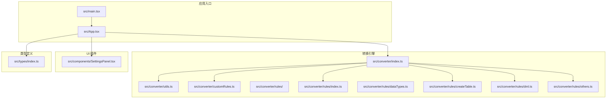
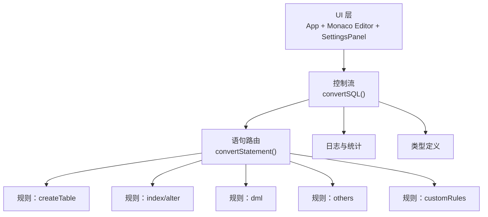
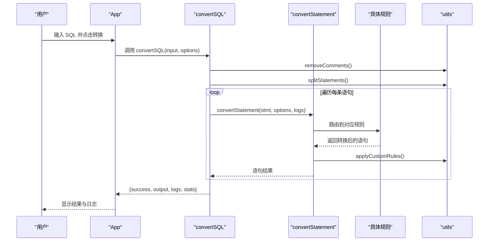
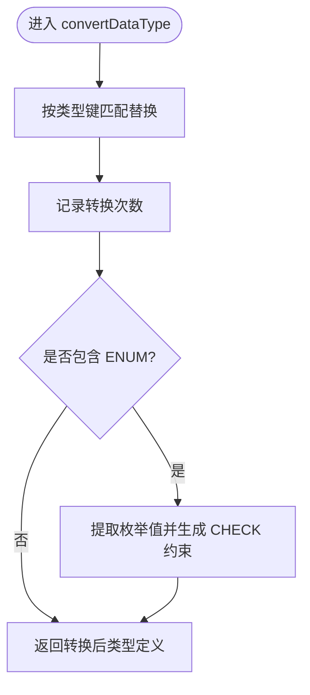
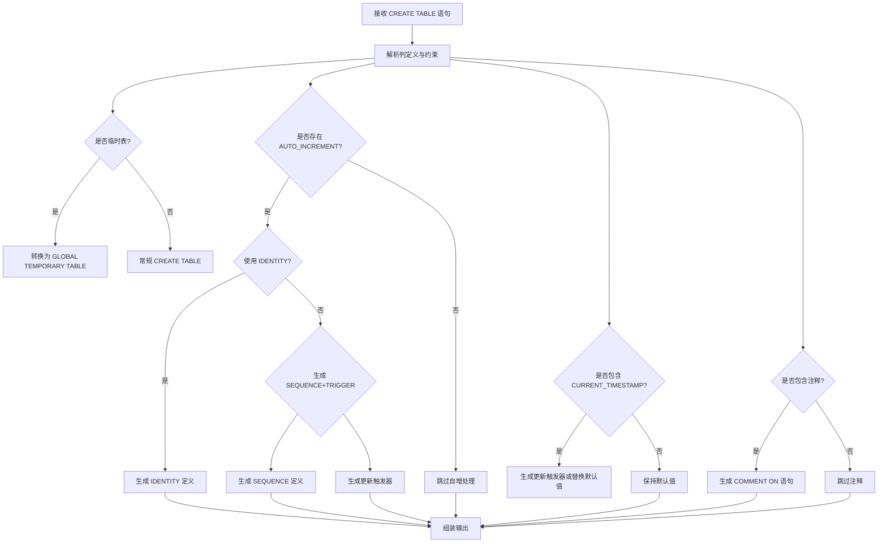
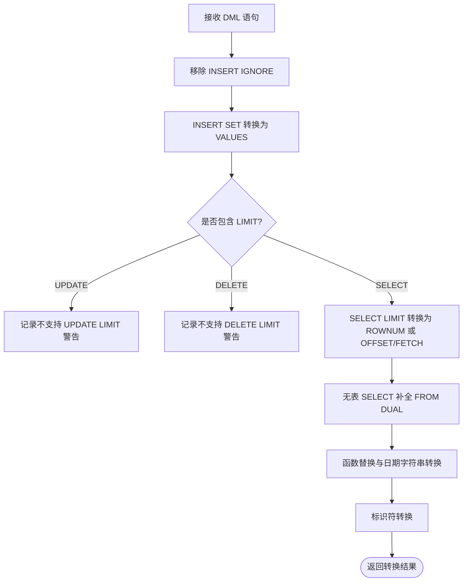
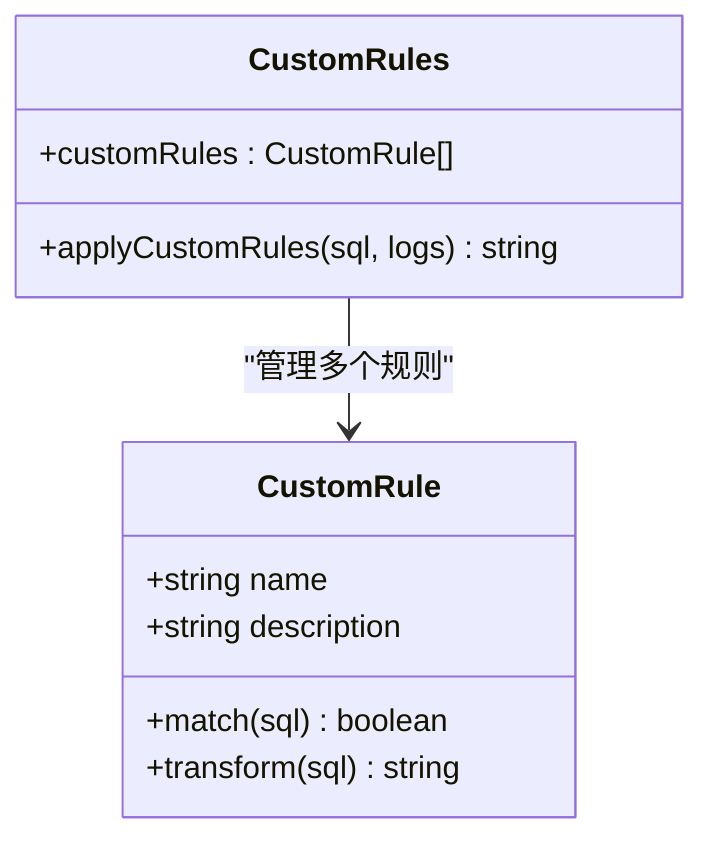
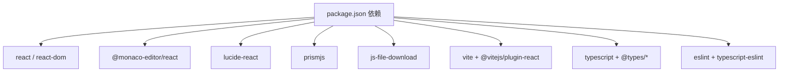

# 项目概述

<cite>
**本文档引用的文件**
- [README.md](file://README.md)
- [package.json](file://package.json)
- [vite.config.ts](file://vite.config.ts)
- [src/main.tsx](file://src/main.tsx)
- [src/App.tsx](file://src/App.tsx)
- [src/types/index.ts](file://src/types/index.ts)
- [src/converter/index.ts](file://src/converter/index.ts)
- [src/converter/utils.ts](file://src/converter/utils.ts)
- [src/converter/customRules.ts](file://src/converter/customRules.ts)
- [src/converter/rules/index.ts](file://src/converter/rules/index.ts)
- [src/converter/rules/dataTypes.ts](file://src/converter/rules/dataTypes.ts)
- [src/converter/rules/createTable.ts](file://src/converter/rules/createTable.ts)
- [src/converter/rules/dml.ts](file://src/converter/rules/dml.ts)
- [src/converter/rules/others.ts](file://src/converter/rules/others.ts)
- [src/components/SettingsPanel.tsx](file://src/components/SettingsPanel.tsx)
</cite>

## 目录
1. [简介](#简介)
2. [项目结构](#项目结构)
3. [核心组件](#核心组件)
4. [架构总览](#架构总览)
5. [详细组件分析](#详细组件分析)
6. [依赖关系分析](#依赖关系分析)
7. [性能考量](#性能考量)
8. [故障排除指南](#故障排除指南)
9. [结论](#结论)
10. [附录](#附录)

## 简介
本项目是一个基于前端技术栈的 SQL 转换器，专注于将 MySQL 语法转换为 Oracle 语法，特别适用于 OceanBase MySQL 模式向 OceanBase Oracle 模式的迁移与适配场景。项目采用现代化前端技术栈，提供直观的编辑器界面、可配置的转换选项、详细的转换日志与统计信息，帮助用户高效完成数据库迁移任务。

- 核心目标：将 MySQL 语法转换为兼容 Oracle 的 SQL，支持常见 DDL/DML 语句及数据类型映射，并提供可扩展的自定义规则机制。
- 主要特性：
  - 多语句拆分与逐条转换
  - 数据类型映射与注释转换
  - 自增列替代方案（IDENTITY 或 SEQUENCE+TRIGGER）
  - DML 语法适配（LIMIT、函数替换等）
  - 可视化设置面板与日志统计
  - 文件导入导出与快捷操作
- 技术架构：React 19 + TypeScript + Vite + Monaco Editor，UI 交互与转换逻辑清晰分离，便于维护与扩展。

## 项目结构
项目采用按功能模块划分的目录组织方式，核心代码集中在 src 目录下，converter 子目录负责 SQL 转换逻辑，components 子目录提供 UI 组件，types 定义类型规范。

**图表来源**
- [src/main.tsx:1-11](file://src/main.tsx#L1-L11)
- [src/App.tsx:1-282](file://src/App.tsx#L1-L282)
- [src/converter/index.ts:1-129](file://src/converter/index.ts#L1-L129)
- [src/converter/utils.ts:1-115](file://src/converter/utils.ts#L1-L115)
- [src/converter/customRules.ts:1-186](file://src/converter/customRules.ts#L1-L186)
- [src/converter/rules/index.ts:1-135](file://src/converter/rules/index.ts#L1-L135)
- [src/converter/rules/dataTypes.ts:1-106](file://src/converter/rules/dataTypes.ts#L1-L106)
- [src/converter/rules/createTable.ts:1-380](file://src/converter/rules/createTable.ts#L1-L380)
- [src/converter/rules/dml.ts:1-163](file://src/converter/rules/dml.ts#L1-L163)
- [src/converter/rules/others.ts:1-49](file://src/converter/rules/others.ts#L1-L49)
- [src/components/SettingsPanel.tsx:1-100](file://src/components/SettingsPanel.tsx#L1-L100)
- [src/types/index.ts:1-44](file://src/types/index.ts#L1-L44)

**章节来源**
- [src/main.tsx:1-11](file://src/main.tsx#L1-L11)
- [src/App.tsx:1-282](file://src/App.tsx#L1-L282)
- [vite.config.ts:1-9](file://vite.config.ts#L1-L9)

## 核心组件
- 应用入口与主界面
  - 入口文件负责挂载 React 应用，主界面提供输入/输出编辑区、设置面板、日志与统计面板。
  - 支持文件导入、导出、示例加载、快捷键转换等操作。
- 转换引擎
  - 主转换函数负责语句拆分、注释清理、语句路由与错误处理，并汇总日志与统计信息。
  - 工具函数提供标识符转换、字符串字面量保护/还原、注释移除、语句分割、命名生成等基础能力。
  - 自定义规则机制允许用户添加针对特定表/列的转换逻辑。
- 规则模块
  - CREATE TABLE：解析列定义、约束、注释，处理自增列、时间戳默认值、表选项移除、生成序列与触发器等。
  - 索引与 ALTER：处理索引创建/删除、ALTER TABLE 列变更、约束处理等。
  - 数据类型：提供 MySQL 到 Oracle 的数据类型映射与 ENUM 约束提取。
  - DML：处理 INSERT/UPDATE/DELETE/SELECT，包括 IGNORE 移除、LIMIT 适配、函数替换、日期字符串转换等。
  - 其他：存储过程/函数的简化转换与序列标识符转换。
- 设置面板
  - 提供转换选项开关，如使用 IDENTITY、生成 SEQUENCE+TRIGGER、保留大小写、转换注释、移除 ENGINE/CHARSET 等。

**章节来源**
- [src/App.tsx:56-282](file://src/App.tsx#L56-L282)
- [src/converter/index.ts:59-129](file://src/converter/index.ts#L59-L129)
- [src/converter/utils.ts:5-115](file://src/converter/utils.ts#L5-L115)
- [src/converter/customRules.ts:137-186](file://src/converter/customRules.ts#L137-L186)
- [src/components/SettingsPanel.tsx:41-100](file://src/components/SettingsPanel.tsx#L41-L100)

## 架构总览
项目采用“UI 层 + 转换引擎 + 规则模块”的分层架构。UI 层通过 Monaco Editor 提供 SQL 编辑体验；转换引擎统一调度各规则模块；规则模块按语句类型细分处理；工具模块提供通用能力；类型模块确保数据结构一致性。

**图表来源**
- [src/App.tsx:67-72](file://src/App.tsx#L67-L72)
- [src/converter/index.ts:15-54](file://src/converter/index.ts#L15-L54)
- [src/converter/index.ts:59-129](file://src/converter/index.ts#L59-L129)
- [src/types/index.ts:1-44](file://src/types/index.ts#L1-L44)

## 详细组件分析

### 转换流程与控制流
转换流程从主函数开始，执行注释清理、语句拆分、逐条转换、错误捕获与统计汇总，最终输出标准化的 Oracle SQL。

**图表来源**
- [src/App.tsx:67-72](file://src/App.tsx#L67-L72)
- [src/converter/index.ts:59-129](file://src/converter/index.ts#L59-L129)
- [src/converter/utils.ts:52-72](file://src/converter/utils.ts#L52-L72)
- [src/converter/customRules.ts:170-185](file://src/converter/customRules.ts#L170-L185)

**章节来源**
- [src/converter/index.ts:59-129](file://src/converter/index.ts#L59-L129)

### 数据类型转换与枚举处理
数据类型映射表覆盖整数、浮点、字符串、二进制、日期时间、布尔与 JSON 等类型，支持带参数类型与默认值处理。枚举类型转换为 VARCHAR2 并生成 CHECK 约束。

**图表来源**
- [src/converter/rules/dataTypes.ts:61-86](file://src/converter/rules/dataTypes.ts#L61-L86)
- [src/converter/rules/dataTypes.ts:91-105](file://src/converter/rules/dataTypes.ts#L91-L105)

**章节来源**
- [src/converter/rules/dataTypes.ts:1-106](file://src/converter/rules/dataTypes.ts#L1-L106)

### CREATE TABLE 转换与自增列策略
CREATE TABLE 转换包含列解析、约束处理、注释提取、时间戳默认值替换、自增列策略选择（IDENTITY 或 SEQUENCE+TRIGGER）、触发器生成与表注释转换等。

**图表来源**
- [src/converter/rules/createTable.ts:116-380](file://src/converter/rules/createTable.ts#L116-L380)

**章节来源**
- [src/converter/rules/createTable.ts:1-380](file://src/converter/rules/createTable.ts#L1-L380)

### DML 语句适配与函数替换
DML 转换处理 INSERT IGNORE 移除、INSERT SET 语法转换、LIMIT 适配（ROWNUM 或 OFFSET/FETCH）、SELECT 无表语句补全、函数替换（IFNULL→NVL、UUID→SYS_GUID、NOW→SYSDATE 等）以及日期字符串常量转换。

**图表来源**
- [src/converter/rules/dml.ts:7-163](file://src/converter/rules/dml.ts#L7-L163)

**章节来源**
- [src/converter/rules/dml.ts:1-163](file://src/converter/rules/dml.ts#L1-L163)

### 自定义规则机制
自定义规则提供可插拔的转换扩展点，支持基于表/列匹配的 INSERT NULL 替换规则与通用规则模板，便于针对业务场景定制转换逻辑。

**图表来源**
- [src/converter/customRules.ts:7-186](file://src/converter/customRules.ts#L7-L186)

**章节来源**
- [src/converter/customRules.ts:1-186](file://src/converter/customRules.ts#L1-L186)

### 设置面板与用户交互
设置面板提供转换选项的可视化配置，涵盖 IDENTITY/SEQUENCE 选择、触发器生成、注释转换、引擎字符集移除、大小写保留等，便于用户根据目标数据库特性灵活调整。

**章节来源**
- [src/components/SettingsPanel.tsx:41-100](file://src/components/SettingsPanel.tsx#L41-L100)

## 依赖关系分析
项目依赖以 React 19、Monaco Editor、Lucide React 图标库、PrismJS 语法高亮为核心，构建工具链采用 Vite 与 React 插件，类型检查与 ESLint 提供开发体验保障。

**图表来源**
- [package.json:12-34](file://package.json#L12-L34)

**章节来源**
- [package.json:1-36](file://package.json#L1-36)
- [vite.config.ts:1-9](file://vite.config.ts#L1-L9)

## 性能考量
- 语句拆分与注释清理：通过字符串字面量保护机制避免误替换，提升解析准确性与性能稳定性。
- 规则匹配顺序：数据类型映射按键长度降序匹配，减少重复替换与回溯。
- 自定义规则：按需匹配与变换，避免对不相关语句的处理开销。
- UI 渲染：Monaco Editor 按需渲染与自动布局优化，减少不必要的重绘。

## 故障排除指南
- 输入为空：返回提示信息并清空输出，确保不会产生异常。
- 未知语句类型：仅进行基本标识符转换并记录警告，避免抛错中断流程。
- 语法错误：捕获异常并记录错误日志，同时保留原始语句上下文以便定位问题。
- 不支持特性：对 LIMIT、多表 UPDATE/DELETE、ON UPDATE CURRENT_TIMESTAMP 等特性给出明确警告，建议手动调整。
- 文件导入导出：检查文件读取与 Blob 下载权限，确认输出非空后再导出。

**章节来源**
- [src/converter/index.ts:71-107](file://src/converter/index.ts#L71-L107)
- [src/App.tsx:81-111](file://src/App.tsx#L81-L111)

## 结论
本项目以简洁高效的架构实现了 MySQL 到 Oracle 的 SQL 转换，覆盖常见 DDL/DML 场景并提供灵活的自定义规则扩展。通过可视化设置面板与详尽的日志统计，用户能够快速完成迁移任务并在 OceanBase Oracle 模式中稳定运行。未来可在存储过程/函数的完整转换、复杂索引与分区语法支持等方面持续增强。

## 附录
- 技术栈概览
  - 前端框架：React 19
  - 语言：TypeScript
  - 构建工具：Vite
  - 编辑器：Monaco Editor
  - 图标：Lucide React
  - 语法高亮：PrismJS
  - 文件下载：js-file-download
- 项目背景与动机
  - 面向数据库迁移与适配需求，特别是 OceanBase MySQL 模式向 Oracle 模式的转换场景。
  - 提供即用型工具，降低迁移成本与风险。
- 预期使用场景
  - 数据库迁移项目
  - 开发测试环境适配
  - 自动化脚本辅助